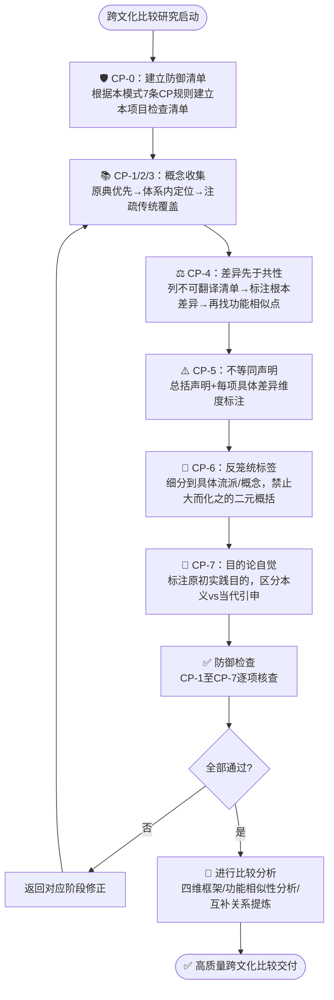

> **来源**: 从 `retro-20260713-cross-cultural-fp` 项目（跨文化第一性原理比较研究v2.0）提炼，基于道家/儒家/墨家/佛教因明学四家16个核心概念的系统整理实践，引用权威注本8个，古文原文35+章/篇。

# 跨文化比较反向格义防御七步法（Cross-Cultural Reverse Hermeneutics Defense）

## 模式类型

方法论模式（研究知识/跨文化比较/概念分析/质量防御）

## 成熟度

L1 单次验证（validation_count=1）：
1. 首次验证：跨文化第一性原理比较研究（道家/儒家/墨家/佛教因明学 vs 西方第一性原理）

## 适用场景

- 跨文化/跨文明的哲学思想、方法论、思维方式比较研究
- 将古代思想概念与现代概念/框架进行对应分析
- 不同语言传统之间的概念互译和比较
- 古代思想（兵法、禅、道家、儒家等）的现代商业/管理/创新诠释
- AI对齐、跨文化价值观等需要处理不同文化传统概念体系的研究

**不适用于**：同一文化传统内部不同学派比较、纯文献校勘研究、个人随意思考笔记（防御成本过高）。

## 问题背景

### 反向格义与语义漂移的本质区别

现有 [cross-domain-semantic-drift.md](cross-domain-semantic-drift.md) 处理的是**同一术语在不同领域的含义差异**——如"第一性原理"在哲学/物理/商业中的不同含义，问题在整合阶段才暴露。

**反向格义（Reverse Hermeneutics）** 是更隐蔽的深层偏差：

| 维度 | 跨领域语义漂移 | 跨文化反向格义 |
|------|--------------|---------------|
| 偏差方向 | 横向（领域A↔领域B） | 单向（熟悉框架→陌生传统） |
| 发生时机 | 整合阶段才暴露 | 概念收集阶段就已发生 |
| 偏差特征 | 同一词不同含义 | 框架先行，证据选择带偏 |
| 典型错误 | "这个词在这里是什么意思？" | "X就是中国的Y" |
| 防御时机 | Spec阶段概念扫描 | **开始收集概念之前** |
| 防御复杂度 | 术语表即可解决 | 需要七级系统性防御 |

### 为什么"先找共同点"是危险的

常识认为比较研究的核心是"找相似性"，但反常识的真相是：**先明确"什么不能等同"比"能等同什么"更基础**。原因：

1. **确认偏误天然有利**：一旦你预设"X像Y"，大脑会自动寻找支持证据，忽略矛盾证据
2. **差异一旦被抹平就难恢复**：如果一开始就用Y的框架来理解X，X中那些"Y框架装不下"的部分会被潜意识过滤掉
3. **"不可翻译"的东西最有价值**：一个传统中那些无法被另一个传统框架翻译的概念，恰恰是最可能带来增量洞见的部分
4. **简单等同具有传播优势**："老子是中国的海德格尔"这类说法朗朗上口，一旦形成就很难纠正

### 历史镜鉴：中国哲学的反向格义教训

20世纪初以来，用西方哲学框架（唯物/唯心、本体论/认识论、理性主义/经验主义）来整理中国哲学，一度是主流方法。这种方法虽在学科建立初期有传播价值，但也导致：
- 中国哲学中那些西方框架装不下的部分（如"道"、"诚"、"无为"）被削足适履
- 墨家逻辑被简单等同于亚里士多德逻辑，忽略其独特性
- 佛教因明被当作"古印度逻辑"而忽视其宗教认识论背景
- 形成"中国哲学缺少X"的叙事（缺少本体论、缺少认识论、缺少逻辑），而不是"中国哲学有不同的问题意识"

## CP-1至CP-7：七级防御机制

### CP-1：原典优先于注疏（Original Text Priority）

**规则**：概念整理必须从原典原文出发，而不是从二手解释、现代通俗解读或网络流行说法出发。

**执行标准**：
- 每个核心概念至少引用2-3处原典原文
- 优先选择权威注本（如中华书局版、《大正藏》等）
- 现代解读可以参考，但必须在原典基础上使用
- 原典引文必须标注篇章出处

**反模式**：从"道就是规律"、"格物致知就是科学方法"这类通俗结论出发，回头找原文支持。

### CP-2：体系内定位先于比较（Intra-System Positioning First）

**规则**：每个概念在其自身思想体系中先找到位置、定义、哲学功能，然后再谈与其他传统的比较。

**执行标准**：
- 明确概念在自身体系中回答什么问题
- 明确概念与同一体系中其他概念的关系（如"道"与"德"、"无为"的关系）
- 明确概念的哲学功能定位（本体论/认识论/方法论/修养论/解脱论）
- 在做好"体系内自画像"之前，禁止跨体系对应

**反模式**：看到"格物致知"就想到"科学方法"，而不先搞清楚它在《大学》修身体系中的位置。

### CP-3：注疏传统充分覆盖（Commentary Tradition Coverage）

**规则**：对于有两千年以上注释传统的经典（如《老子》《论语》《墨子》），必须覆盖该传统内部最有代表性的注本，不能只取一家之言。

**执行标准**：
- 标注同一概念在不同注疏传统中的诠释差异（如王弼注《老》vs河上公注《老》）
- 对于有重大分歧的概念（如"格物"），必须列出朱熹、王阳明等不同诠释路径
- 区分"先秦本义"与"后世诠释"
- 选择注本时说明选择理由

**反模式**：引用一家之言就当作"这个概念的意思"，忽略同一传统内部的学派分歧。

### CP-4：差异先于共性（Differences Before Commonalities）

**规则**：先列出根本差异和"不可翻译"清单，再寻找可能的对应关系。

**执行标准**：
- 对每个概念，先写"与X的根本差异"（≥3点），再写"可能的相似性"
- 建立"不可翻译概念清单"，明确哪些概念不应该强行翻译或对应
- 共性必须是"功能相似"而非"实体等同"
- 对应程度标注（完全对应/部分对应/功能相似/仅表面相似/不应对应）

**反模式**：先做对应表格，再附一小段"也有差异"——这是装饰性差异，不是真正的差异先行。

### CP-5：不等同声明强制（Non-Equivalence Declaration Mandatory）

**规则**：所有对应关系都必须附带"不完全等同"的明确说明，标注差异维度。

**执行标准**：
- 禁止"X就是Y"的简单等同表述
- 使用"在A意义上X与Y功能相似，但在B/C/D意义上根本不同"的表述
- 在文档开头放置总括性不等同声明
- 每个概念的比较分析中重复具体的不等同说明

**反模式**："道家的'道'类似于西方的'逻各斯'"——没有限定条件和差异说明。

### CP-6：反对过度简化（Anti-Oversimplification）

**规则**：禁止用"东方A vs 西方B"这类笼统二元标签来概括整个传统。

**执行标准**：
- 禁止"东方直觉/西方理性"、"中国整体思维/西方分析思维"这类二元对立
- 细分到具体流派：不是"中国哲学"，而是"先秦道家"、"宋明理学"、"墨家名辩"、"佛教因明"
- 同一传统内部的差异必须显式标注
- 当一个传统内存在相反倾向时，必须如实呈现

**反模式**："中国哲学重直觉，西方哲学重逻辑"——忽略了墨家、因明的理性传统和西方的神秘主义传统。

### CP-7：目的论自觉（Teleological Awareness）

**规则**：理解每个概念/方法论在其原体系中服务于什么目的（实践目标），而不是用现代目的去反套。

**执行标准**：
- 明确概念服务的实践目的（成德/治国/解脱/求真等）
- 区分"原初实践目的"与"当代引申应用"
- 当代引申应用必须明确标注为"现代诠释"，而非"古已有之"
- 不因为某概念可用于现代目的就把它解释成本来就服务于这个目的

**反模式**：把《孙子兵法》讲成"现代企业竞争战略"而不区分军事目的与商业目的的根本差异。

## 标准执行流程

## 跨文化比较四维框架

通过CP防御后，进行比较分析时使用以下四维框架：

| 维度 | 问题 | 关注点 |
|------|------|--------|
| **概念定义** | 这个概念在自身体系中是什么意思？ | 定义边界、核心内涵、与相邻概念的区分 |
| **核心特征** | 这个概念有哪些本质属性？ | 是否可形式化、是实体还是过程、是描述性还是规范性 |
| **哲学功能定位** | 这个概念在体系中解决什么问题？ | 本体论/认识论/方法论/修养论/解脱论/政治哲学 |
| **应用场景** | 这个概念在什么情境下被使用？ | 为学/为政/修身/辩论/求解脱/科学探究/工程实践 |

## 学派分歧标注清单

以下分歧类型必须显式标注，不能把一家之言当作整个传统的代表：

| 分歧类型 | 示例 |
|---------|------|
| 创始人vs后世诠释者 | 老子（《道德经》）vs 庄子（《庄子》）对"道"的诠释差异 |
| 同一经典的不同注本传统 | 王弼《老子注》（哲学性）vs 河上公《老子章句》（养生/道教） |
| 同一学派内部的路线分歧 | 朱熹"即物穷理" vs 王阳明"致良知"（格物路线） |
| 早期vs晚期发展 | 前期墨家（三表法/政治伦理）vs 后期墨家（墨辩/逻辑/科学） |
| 同一传统的不同传承 | 汉传因明（玄奘系统）vs 藏传因明（法称系统） |
| 开派者vs系统化者 | 古因明（五支作法）vs 陈那新因明（三支作法+因三相） |
| 世俗应用vs宗教维度 | 佛法作为哲学 vs 佛法作为解脱论 |

## 反模式清单

| 反模式 | 典型表述 | CP违规 | 后果 |
|--------|---------|--------|------|
| 简单等同 | "X就是中国的Y" | CP-5 | 概念被扭曲，差异被抹平 |
| 框架先行 | 用西方哲学教科书的目录来整理中国哲学 | CP-1/2 | 削足适履，过滤掉框架装不下的内容 |
| 装饰性差异 | 先大谈相似性，最后一句"当然也有差异" | CP-4 | 差异成为政治正确的摆设，不影响实际结论 |
| 笼统标签 | "东方重直觉，西方重理性" | CP-6 | 忽略各传统内部多样性，制造虚假对立 |
| 时代错置 | 把古代概念解释成现代科学/管理概念 | CP-7 | 混淆本义与引申义，制造"古已有之"神话 |
| 单注本依赖 | 只引用朱熹注就讲《大学》 | CP-3 | 把特定诠释当作唯一正解，忽略学术史脉络 |
| 概念字面翻译 | "理"=principle/"气"=matter | CP-1/5 | 丢失概念的历史文化语境 |

## 与其他模式的关系

- **[cross-domain-semantic-drift.md](cross-domain-semantic-drift.md)**：本模式是跨领域语义漂移在跨文化/跨时代场景下的深化专门化版本。跨领域语义漂移解决"同一术语不同领域含义不同"，反向格义防御解决"用熟悉框架硬套陌生概念导致的系统性偏差"。跨文化项目应先执行本模式，跨领域概念扫描可作为补充。
- **[adversarial-review-protocol.md](adversarial-review-protocol.md)**：本模式可嵌入对抗性审查协议作为跨文化项目的前置防御（类似语义漂移作为阶段0步骤0.0的嵌入方式）。CP检查清单可作为跨文化审查的专项检查项。
- **[credibility-dual-track.md](credibility-dual-track.md)**：权威注本选择可结合可信度双轨制——古注（王弼、朱熹等）和现代学术注本（陈鼓应、孙诒让等）属于不同的可信度层级。
- **[five-layer-progressive-analysis.md](five-layer-progressive-analysis.md)**：跨文化比较中可使用五层递进框架进行深度分析（认识论→方法论→偏差→实践→边界）。

## 关键量化指标

| 指标 | 本项目数据 | 建议阈值 |
|------|-----------|---------|
| 权威注本引用率 | 100%（核心依据均为🟢A级注本） | ≥80% |
| 学派分歧标注率 | 100%（13项重大分歧全部标注） | 100% |
| "不可翻译概念"占比 | 约20-30%（10/16个概念需谨慎对应） | 预期15-35% |
| CP检查通过率 | 96%（仅因明CP-3部分满足，已说明） | ≥90% |
| 简单等同表述数量 | 0（全文无"X就是Y"表述） | 0 |
| 笼统二元标签数量 | 0（全部细分到具体流派） | 0 |

## 局限性与待验证

1. **验证范围**：目前仅在"中国哲学vs西方第一性原理"单一跨文化组合中验证，需要在更多组合中验证（如印度哲学vs西方、伊斯兰哲学vs西方、中国哲学vs印度哲学等）
2. **CP检查完备性**：CP-1至CP-7是否覆盖了所有主要的跨文化比较偏差？目前基于实践经验，可能需要理论比较哲学专家审阅补充
3. **轻量化版本**：对于博客文章、通俗演讲等非学术场景，七级防御可能过重，需要开发轻量化版本（如CP-1/4/5三条核心规则）
4. **注疏选择标准**：CP-3要求覆盖代表性注本，但"代表性"本身有学术争议，需要更具体的注本选择指南
5. **与比较哲学学科的关系**：本模式是从AI辅助知识整理实践中提炼的工程方法论，不是比较哲学的学术方法论。专业比较哲学研究需要更严格的学术规范。

## 适用层级裁剪建议

| 产出物层级 | 必做CP | 可跳过CP | 说明 |
|-----------|--------|---------|------|
| 个人思考笔记 | CP-5（不等同意识） | 其余 | 个人思考不需要完整流程，但要有不等同意识 |
| 内部分享/讨论稿 | CP-1+CP-4+CP-5 | CP-2/3/6/7 | 内部讨论可以简化，但必须原典支撑、差异先于共性 |
| 公开发表/知识档案 | CP-1至CP-7全部 | 无 | 公开产出必须完整走七级防御 |

## Changelog

- **v1.0.0** (2026-07-13): 初始版本，基于跨文化第一性原理比较研究项目首次完整验证，CP-1至CP-7七级防御机制、四维比较框架、学派分歧标注清单、7类反模式

---
*沉淀自跨文化第一性原理比较研究v2.0项目（2026-07-13），道/儒/墨/佛四家16概念系统整理实践*
