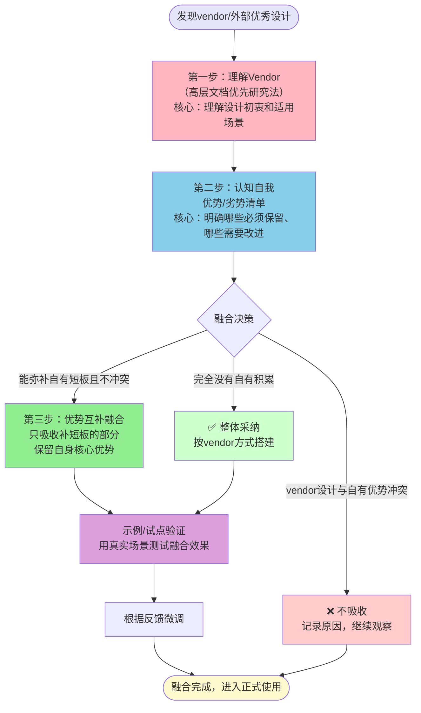

> **来源**：v2.0复盘模板增强任务（2026-07-05）——研究vendor/flexloop中的task-execution-summary skill，将P0-P4优先级、ROI评估等设计成功融合到四文件原子化复盘模板，没有全盘照搬单文件10章结构，保留了自有四文件结构优势
> **验证次数**：1次成功实战验证（v2.0复盘模板创建）

# 跨Vendor知识融合三步法

## 模式类型
方法论模式（外部知识吸收与体系融合）

## 成熟度
L1 模式（1次独立场景成功验证，核心流程明确）

## 与相关模式的关系
| 相关模式 | 关系 | 说明 |
|---------|------|------|
| [vendor-high-level-doc-first-research.md](vendor-high-level-doc-first-research.md) | 前置依赖 | 融合前需要先用"高层文档优先研究法"快速理解vendor设计，三步法的第一步直接使用该模式 |
| [triangular-source-verification.md](../retrospective-knowledge/triangular-source-verification.md) | 互补 | 理解vendor阶段可用三角验证确保理解准确 |
| [dry-run-first.md](../tools-automation/dry-run-first.md) | 后续步骤 | 融合后建议先用dry-run或小范围试点验证效果 |

## 适用场景

| 场景 | 是否适用 | 说明 |
|------|---------|------|
| 吸收vendor子模块的优秀设计/工具/流程 | ✅ 核心场景 | 如从flexloop吸收P0-P4优先级到复盘模板 |
| 借鉴外部开源项目的架构/方法 | ✅ 核心场景 | 学习第三方框架的优秀实践融入自有体系 |
| 两种方案二选一或融合的决策 | ✅ 核心场景 | 决定是"替换"还是"融合"时使用 |
| 已有成熟体系需要增量改进 | ✅ 核心场景 | 自身体系已经过验证，需要补短板而非推翻重来 |
| 从零开始搭建全新体系 | ⚠️ 部分适用 | 没有自有积累时可以更多参考vendor，但仍需理解设计初衷而非盲目复制 |
| 修复单个bug/小功能调整 | ❌ 不适用 | 小改动不需要体系级融合决策 |

## 问题背景

吸收外部知识（vendor子模块、开源项目、第三方框架）时最常见两个反模式：

### 反模式1：宗教式狂热（全盘照搬）
看到vendor或外部项目的设计就觉得"什么都好"，不考虑自身上下文和已有积累，全盘照搬替换自有体系：
- **水土不服**：vendor设计是为其特定上下文服务的，直接搬到自己的项目中经常不适用
- **积累浪费**：抛弃了自己经过多次验证的有效积累，从零开始重新踩坑
- **维护成本**：引入大量当前不需要的复杂度，增加长期维护负担

### 反模式2：NIH综合征（Not Invented Here，盲目排斥）
觉得"不是我们自己做的就不好"，对外部优秀设计视而不见：
- **重复造轮子**：vendor已经解决得很好的问题，自己还要重新摸索一遍
- **进步缓慢**：无法吸收外部先进经验，长期停留在较低水平
- **闭门造车**：缺乏外部输入导致体系僵化

**根本原因**：这两个极端的共同原因是缺少结构化的融合流程——要么完全没有自我认知（全盘照搬），要么完全没有理解vendor（盲目排斥），没有做到"知己知彼"。

---

## 核心原则：三步融合法

### 融合流程总览

### 三步详细说明

| 步骤 | 核心动作 | 关键产出 | 注意事项 |
|------|---------|---------|---------|
| **第一步：理解Vendor** | 用"高层文档优先研究法"，先读AGENTS.md/SKILL.md/README等高层文档，重点理解： 1. 这个设计解决什么问题？ 2. 设计初衷和适用场景是什么？ 3. 有哪些前提假设和权衡？ 4. 哪些是核心设计，哪些是实现细节？ | Vendor设计的核心价值、适用边界、前提假设 | ❌ 不要一上来就读源码/实现细节 ❌ 不要断章取义只看表面形式 ✅ 重点理解"为什么这么设计"而不是"怎么实现的" |
| **第二步：认知自我** | 列出自身现有体系的： 1. **核心优势（必须保留）**：经过多次验证、确实有效的做法，这是我们的立身之本 2. **明显短板（需要改进）**：当前流程中确实存在的问题和痛点 3. **上下文约束**：我们的场景和vendor场景有什么不同 | 优势清单/短板清单/上下文差异 | ❌ 不要妄自菲薄觉得自己什么都不好 ❌ 不要妄自尊大看不到自己的问题 ✅ 诚实列出优缺点，作为吸收筛选标准 |
| **第三步：优势互补融合** | 做筛选决策： ✅ **吸收**：能弥补短板、与自有优势不冲突的设计 ⚠️ **适配**：方向正确但需要调整以适应我们上下文的设计 ❌ **不吸收**：与核心优势冲突、或我们场景不适用的设计 **原则**：只吸收能弥补短板的部分，坚决保留自身核心优势 | 融合后的方案，明确哪些是新增的、哪些是保留的、哪些是放弃的 | ❌ 不要因为"看起来高级"就吸收 ❌ 不要为了100%兼容vendor而修改自有核心优势 ✅ 融合后应该是"1+1>2"，而不是"两边不讨好" |

### 第四步：示例/试点验证（关键补充）
融合完成后不要立即全面推广，先用一个真实任务做试点验证：
1. 选择一个合适的真实任务作为试点
2. 用融合后的方案执行
3. 记录哪些地方好用、哪些地方别扭
4. 根据反馈微调后再正式使用

---

## 实际应用案例

### 案例1：复盘模板v2.0（本模式的起源案例）

**背景**：发现vendor/flexloop中的task-execution-summary skill有很多优秀设计。

**第一步：理解Vendor**
- 用高层文档优先法，仅2次Read理解了vendor设计：
  - 优势：P0-P4五级优先级、ROI评估、五维分析框架、10章标准结构
  - 设计初衷：单文件结构化复盘报告，适合快速生成标准化报告
  - 不足（相对于我们的场景）：单文件结构，洞察萃取深度不够，不支持独立模式沉淀

**第二步：认知自我**
- 我们的核心优势（必须保留）：
  - ✅ 四文件原子化结构：入口导航/完整报告/洞察萃取/行动建议分离，单一职责清晰
  - ✅ 深度洞察萃取：5-Whys根因分析+独立模式文档沉淀+交叉引用成网
  - ✅ 多索引同步：更新多个相关索引保证可发现性
- 我们的短板（需要改进）：
  - ❌ 优先级只有高/中/低三级，颗粒度不够
  - ❌ 没有ROI评估，行动项排序靠主观判断
  - ❌ 分析维度不固定，质量依赖执行者经验

**第三步：优势互补融合**
- ✅ 吸收：P0-P4五级优先级、ROI计算方法、五维分析框架、风险预警矩阵、决策对比表
- ⚠️ 适配：将单文件10章结构映射到我们的四文件结构中，不改变原子化拆分
- ❌ 不吸收：单文件10章结构（与我们四文件原子化优势冲突）、自动生成逻辑（我们是手动深度复盘）

**结果**：创建了v2.0模板，同时具备vendor的P0-P4/ROI/五维分析，又保留了我们四文件结构和深度洞察萃取的优势，并用本任务（创建v2.0模板本身）做了示例验证。

---

## 决策检查清单

在决定是否吸收某个外部设计前，先回答以下问题：

- [ ] 我是否理解了这个设计"为什么"这么做，而不只是"怎么做"？（第一步验证）
- [ ] 我是否明确列出了我们自己的核心优势（必须保留的部分）？（第二步验证）
- [ ] 我是否明确列出了我们当前的短板（需要改进的部分）？（第二步验证）
- [ ] 这个设计是能弥补我们的短板，还是会破坏我们的核心优势？
- [ ] 如果吸收，需要做哪些适配调整以适应我们的上下文？
- [ ] 有没有小范围试点验证的计划，而不是直接全面铺开？

如果以上问题有超过2个回答"否/不清楚"，说明还没准备好融合，应该回到第一步或第二步继续做功课。

---

## 反模式与注意事项

### 绝对禁止的反模式
1. ❌ **宗教式狂热**："vendor做的就是对的，我们之前的都扔了"——全盘照搬是最懒也是风险最高的做法
2. ❌ **NIH综合征**："这不是我们发明的，肯定不适合我们"——盲目排斥会错过很多优秀实践
3. ❌ **形式模仿**：只抄表面形式（如用了P0-P4颜色标记但评分逻辑没变），不理解背后的设计思想
4. ❌ **为了兼容而妥协核心**：为了和vendor100%兼容，修改掉自己已经验证过的核心优势
5. ❌ **不验证直接推广**：融合完就宣布成功，不在真实场景中试点

### 常见陷阱
1. **范围蔓延**：吸收时忍不住"这个也好那个也好"，引入过多当前不需要的复杂度——应该只吸收最迫切需要的部分，其他放P4观察
2. **完美主义**：希望第一次融合就做到完美，迟迟不落地——应该先用一个示例验证，再迭代优化
3. **没有明确"不做什么"**：融合决策中最重要的部分是明确"哪些我们不吸收"，而不是"吸收什么"

---

## 与其他模式的协同

| 协同模式 | 协同方式 |
|---------|---------|
| vendor-high-level-doc-first-research | 第一步理解vendor时直接使用 |
| tool-failure-three-tier-degradation | 研究vendor遇到工具故障时降级使用 |
| immediate-retrospective-sedimentation | 融合试点完成后立即复盘沉淀经验 |
| meta-retrospective-closed-loop | 多次融合后做元复盘，优化融合流程本身 |

---

## 模式演进方向

- **L2验证方向**：下次需要吸收vendor其他skill（如skill-creator、archive-folder、pdf-to-markdown等）时应用本模式，验证流程通用性
- **可沉淀子模式**：第三步的"优势/短板/不吸收"三栏决策表可以独立为轻量级决策工具
- **适配模板**：针对常见的融合场景（如skill融合、流程融合、工具融合）创建适配检查清单
