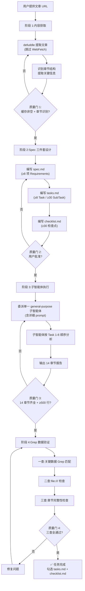

> **来源**:从 `docs/retrospective/reports/task-reports/retrospective-mainecoon-article-analysis-20260706/README.md` 提炼,基于 4 次验证案例(mattpocock-skills/agent-reach/codex-product-philosophy/mainecoon-social-world-model,均为 2026-07-06 完成)

# 外部文章深度分析端到端工作流(External Article Deep Analysis End-to-End Workflow)

## 模式类型

方法论模式(外部研究/端到端编排/子智能体协作)

## 成熟度

L2 已验证(4 次成功案例,均为 2026-07-06 完成,质量稳定可预测)

| 案例 | 文章主题 | 报告章节 | 报告行数 | SubTask 数 |
|---|---|---|---|---|
| mattpocock-skills-article | mattpocock/skills 开源项目 | 11 | 450 | 30 |
| agent-reach-wechat-article | Agent Reach 上网 Agent | 12 | 520 | 32 |
| codex-product-philosophy-article | Codex 产品哲学访谈 | 10 | 610 | 30 |
| mainecoon-social-world-model-article | MaineCoon 实时音视频模型 | 14 | 704 | 44 |

**趋势**:章节数与 SubTask 数递增,分析维度逐步精细化;最新案例(mainecoon)达到 14 章节 / 44 SubTask / 704 行,为当前最完整形态。

## 适用场景

| 场景 | 是否适用 | 说明 |
|---|---|---|
| 微信公众号文章深度分析 | ✅ 核心场景 | defuddle 对微信适配良好,4 次均成功 |
| 技术博客/教程深度分析 | ✅ 核心场景 | defuddle 同样适用 |
| 开源项目介绍文章分析 | ✅ 核心场景 | mattpocock 案例验证 |
| 产品/技术访谈文章分析 | ✅ 核心场景 | codex 案例验证 |
| 需要 ≥10 章节结构化报告的分析 | ✅ 核心场景 | 14 章节模板已成型 |
| 简单摘要/一句话总结 | ❌ 不适用 | 杀鸡用牛刀,直接读取即可 |
| 需要多源信息整合的竞品分析 | ⚠️ 部分适用 | 应结合 `external-website-analysis-fallback-strategy` 的多源兜底 |
| 纯代码/内部文档分析 | ❌ 不适用 | 无需 defuddle,直接读取 |

## 问题背景

外部文章深度分析任务有四个核心挑战:

1. **内容获取不可靠**:WebFetch 对微信文章持续失败(4 次验证),需要可靠的替代方案
2. **Spec 规划与实际脱节**:未获取实际内容就细化 SubTask,导致规划空转(详见 `progressive-spec-planning-for-external-content`)
3. **子智能体产出质量不稳定**:prompt 不规范会导致章节缺失、数据引用错误、格式混乱
4. **数据验证缺失**:子智能体可能引用错误数据(如把 0.00025 写成 0.0025)或使用 `file:///` 绝对路径(违反规范)

本模式将四阶段串联为标准化工作流,每个阶段有明确的输入、输出和质量门,确保端到端质量可预测。

## 核心规则

**外部文章深度分析必须按四阶段顺序执行,每阶段通过质量门后才能进入下一阶段。**

```
阶段 1:内容获取(defuddle) → 阶段 2:Spec 三件套设计 → 阶段 3:子智能体执行 → 阶段 4:Grep 数据验证
```

**关键约束**:
- 阶段 1 必须使用 defuddle,跳过 WebFetch(微信文章 4 次验证 WebFetch 全部失败)
- 阶段 2 必须创建 spec.md + tasks.md + checklist.md 三件套,不能跳过直接执行
- 阶段 3 必须委派**单一** general-purpose 子智能体执行全部分析,不能多智能体拼接(保证报告连贯性)
- 阶段 4 必须执行 Grep 数据验证三查法,不能仅靠子智能体自报

## 详细流程

### 阶段 1:内容获取

**输入**:文章 URL(微信/博客/教程)
**输出**:缓存的 Markdown 文件 + 文章章节结构识别

**执行步骤**:
1. 直接使用 defuddle 获取文章(跳过 WebFetch):
   ```bash
   defuddle parse "<URL>" --md -o "<缓存路径>"
   ```
   - 缓存路径约定:`.trae/specs/retrospectives-insights/_article_<URL标识>.md`
   - PowerShell 环境:URL 必须用双引号包裹,且去掉不必要的查询参数(如 `from`、`color_scheme`、`#rd`)
2. 读取缓存文件,识别文章章节结构(如 `#01`、`#02` 等标题)
3. 提取关键信息:团队信息、技术参数、引用链接

**质量门**:
- [ ] 缓存文件已生成且非空
- [ ] 文章章节结构已识别
- [ ] 关键信息(团队/参数/链接)已提取

**引用模式**:
- [defuddle-web-extraction-preferred.md](../tools-automation/defuddle-web-extraction-preferred.md):defuddle 工具选择与四步预检查法

### 阶段 2:Spec 三件套设计

**输入**:缓存文件 + 文章章节结构
**输出**:spec.md + tasks.md + checklist.md

**执行步骤**:
1. 创建 spec 目录:`.trae/specs/retrospectives-insights/analyze-<主题>-article/`
2. 编写 spec.md:
   - Why:1-2 句说明分析价值
   - What Changes:列出分析维度(内容提取/核心观点/论证逻辑/知识萃取/可靠性/批判性思考等)
   - ADDED Requirements:每项 Requirement 对应一个分析维度,用 `#### Scenario:` 定义验收条件
3. 编写 tasks.md:
   - 按分析维度拆分 Task(通常 8 个)
   - 每个 Task 拆分 SubTask(通常 30-44 个)
   - 标注 Task Dependencies
4. 编写 checklist.md:
   - 按 Task 维度组织检查点(通常 30-32 个)
   - 包含规范合规检查(相对路径/不删核心文档/保留缓存)

**质量门**:
- [ ] spec.md 含 ≥8 项 ADDED Requirements
- [ ] tasks.md 含 ≥8 个 Task,每个 Task 有 SubTask
- [ ] checklist.md 含 ≥30 个检查点
- [ ] 三个文档通过 NotifyUser 获得用户批准

**引用模式**:
- [progressive-spec-planning-for-external-content.md](progressive-spec-planning-for-external-content.md):渐进式 Spec 规划(如规划阶段耗时过长可参考)

### 阶段 3:子智能体执行

**输入**:spec.md + tasks.md + checklist.md + 缓存文件
**输出**:analysis-report.md(14 章节结构化报告)

**执行步骤**:
1. 委派**单一** general-purpose 子智能体(禁止多智能体拼接):
   ```
   Agent(
     subagent_type="general-purpose",
     description="分析 <主题> 文章产出报告",
     prompt=<详细 prompt>
   )
   ```
2. Prompt 必须包含:
   - 输入资源:缓存文件路径 + spec.md 路径 + tasks.md 路径
   - 执行要求:按 tasks.md 顺序执行 Task 1-8
   - 报告结构:14 章节 + 总结与展望 + 附录
   - 输出规范:输出路径 + 语言(中文) + 格式(Markdown) + 数据准确性要求
   - 引用规范:相对路径,禁止 `file:///` 绝对路径
   - 工作流:Read 三份输入文档 → 按 Task 1-8 顺序分析 → Write 一次性输出完整报告 → Read 复核
3. 子智能体返回后,检查产出文件是否存在

**14 章节报告结构模板**:
```
1. 文章基本信息(标题/作者/来源URL/发布时间/字数/核心主题)
2. 核心观点提炼(主论点 + 支撑论点)
3. 论证逻辑分析(论证结构图 + 论证质量评估)
4. 信息结构评估(章节组织/Case 配比/数据搭配)
5. 内容价值评估(行业启示 + 读者实用价值)
6. 关键知识点萃取(场景/突破/框架/定位/团队)
7. 技术突破深度解析(技术类文章强化此章)
8. 应用场景可行性评估(产品类文章强化此章)
9. 洞见萃取(≥4 条核心洞察)
10. 信息来源可靠性评估(公司/成员/数据/引用/待验证项)
11. 内容时效性评估(发布时间/局限性/成熟度预测)
12. 技术专业性评估(术语/对比公允性/技术深度/可行性)
13. 批判性思考(优点/局限/改进建议,各≥4项)
14. 与 SpecWeave 关联分析(协作范式启示 + 可借鉴方法论)
+ 总结与展望(凝练三大核心洞察)
+ 附录(章节大纲/关键数据汇总/引用文档/待验证项)
```

**批判性思考超额完成策略**:在 spec 中设置最低要求(如"优点≥4项"),子智能体通常会超额完成(实测:优点 6 项/局限 7 项/改进 7 项/方法论 5 项)。

**质量门**:
- [ ] analysis-report.md 已生成
- [ ] 报告含 14 个 `##` 章节标题 + 总结 + 附录
- [ ] 报告行数 ≥500 行(建议 800-1500 行)

### 阶段 4:Grep 数据验证

**输入**:analysis-report.md
**输出**:验证通过/失败结论

**执行步骤(数据验证三查法)**:

**一查:关键数据 Grep 匹配**(确保引用准确)
```bash
Grep pattern="<关键数据1>|<关键数据2>|..." output_mode="count"
```
- 从文章中提取 5-10 个关键数据(如成本、FPS、时长、团队规模、参数量等)
- Grep 匹配数应 > 0(每个关键数据至少匹配 1 次)
- mainecoon 案例:104 处匹配

**二查:`file:///` 绝对路径检查**(确保规范合规)
```bash
Grep pattern="file:///" output_mode="count"
```
- 匹配数应 = 0
- 如有匹配,需修复为相对路径

**三查:章节完整性检查**(确保报告结构齐全)
```bash
Grep pattern="^## " output_mode="content"
```
- 应包含所有 14 个规划章节 + 总结 + 附录
- 如有缺失,需补充

**质量门**:
- [ ] 一查:关键数据 Grep 匹配数 > 0
- [ ] 二查:`file:///` 匹配数 = 0
- [ ] 三查:14 章节 + 总结 + 附录齐全

## 完整流程图



## 验证案例

### 案例 1:mattpocock-skills-article(2026-07-06)

- **文章**:微信公众号文章《mattpocock/skills 开源项目介绍》
- **执行**:defuddle 提取 → spec 三件套(7 Task/30 SubTask)→ 子智能体执行 → 验证
- **产出**:11 章节分析报告(450 行)
- **验证**:数据准确,无 `file:///`
- **特殊发现**:首次验证"defuddle + spec 三件套 + 子智能体"工作流可行性

### 案例 2:agent-reach-wechat-article(2026-07-06)

- **文章**:微信公众号文章《Agent Reach 上网 Agent 介绍》
- **执行**:defuddle 提取 → spec 三件套(8 Task/32 SubTask)→ 子智能体执行 → 验证
- **产出**:12 章节分析报告(520 行)
- **验证**:数据准确,无 `file:///`
- **特殊发现**:Task 数从 7 增至 8,SubTask 数从 30 增至 32,分析维度扩展

### 案例 3:codex-product-philosophy-article(2026-07-06)

- **文章**:微信公众号文章《Codex 产品哲学访谈》
- **执行**:defuddle 提取 → spec 三件套(8 Task/30 SubTask)→ 子智能体执行 → 验证
- **产出**:10 章节分析报告(610 行,子智能体将 12 章节重组为 10)
- **验证**:数据准确,无 `file:///`
- **特殊发现**:子智能体做了合理的结构性调整(12→10 重组),验证时需判断重组是否合理而非机械对照 spec

### 案例 4:mainecoon-social-world-model-article(2026-07-06,当前最完整形态)

- **文章**:微信公众号文章《MaineCoon 实时音视频基础模型》
- **执行**:defuddle 提取 → spec 三件套(8 Task/44 SubTask)→ 子智能体执行 → Grep 数据验证三查法
- **产出**:14 章节分析报告(704 行,14 章节 + 总结 + 附录)
- **验证**:Grep 验证 104 处关键数据匹配,0 处 `file:///` 绝对路径
- **特殊发现**:
  - 首次完整执行 Grep 数据验证三查法
  - 批判性思考超额完成(优点 6/局限 7/改进 7/方法论 5,均超 spec 最低要求)
  - 14 章节结构为当前最完整形态(增加技术突破深度解析、应用场景可行性、与 SpecWeave 关联 3 章)

## 与其他模式关系

| 关联模式 | 关系类型 | 说明 |
|---|---|---|
| [defuddle-web-extraction-preferred.md](../tools-automation/defuddle-web-extraction-preferred.md) | **引用(阶段 1)** | 本模式阶段 1 直接引用 defuddle 工具选择规则与四步预检查法 |
| [progressive-spec-planning-for-external-content.md](progressive-spec-planning-for-external-content.md) | **互补(阶段 2)** | 当 Spec 规划阶段耗时过长时,可参考渐进式规划三阶段法 |
| [external-website-analysis-fallback-strategy.md](external-website-analysis-fallback-strategy.md) | **扩展(阶段 1)** | 当 defuddle 提取不完整时,参考四层信息源分层兜底策略 |
| [small-sample-analysis-methodology.md](small-sample-analysis-methodology.md) | **约束(阶段 2-3)** | 当样本量<5 时,执行"保留/降级/标注"三规则 |
| [dry-run-first.md](../tools-automation/dry-run-first.md) | **遵循(阶段 4)** | Grep 数据验证遵循"先验证再输出"的 dry-run 安全原则 |

## 反模式(不推荐做法)

| 反模式 | 问题 | 正确做法 |
|---|---|---|
| 用 WebFetch 提取微信文章 | 4 次验证全部失败 | 直接用 defuddle |
| 跳过 spec 三件套直接分析 | 产出质量不稳定,无法追溯 | 必须创建 spec/tasks/checklist |
| 多智能体拼接报告 | 风格断裂,逻辑不连贯 | 委派单一子智能体执行 |
| 仅靠子智能体自报验证 | 可能漏报数据错误 | 必须执行 Grep 三查法 |
| spec 中不设批判性思考最低要求 | 子智能体可能只给 2-3 项 | 设置"≥4项"最低要求 |
| 任务完成后不更新主题 README | 新 spec 未登记在看板 | S5 归档时必须更新主题 README |

## 适用边界与降级规则

| 场景 | 降级策略 |
|---|---|
| 文章内容较短(<1000 字) | 跳过 Spec 三件套,直接分析 |
| 文章需要登录才能访问 | 改用 agent-browser 处理登录 + defuddle 提取 |
| defuddle 提取不完整 | WebFetch 兜底补全(参考 `defuddle-web-extraction-preferred` 双工具兜底) |
| 多源信息整合(非单篇文章) | 结合 `external-website-analysis-fallback-strategy` 四层兜底 |
| 子智能体产出质量不达标 | 重新委派,强化 prompt 约束 |

## Changelog

<!-- changelog -->
- 2026-07-06 | create | 初始版本,基于 4 次验证案例(mattpocock/agent-reach/codex/mainecoon)提炼,成熟度 L2
