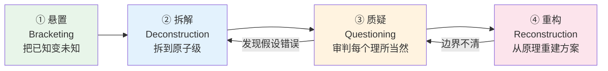

# 第一性原理功能分析法（First-Principles Feature Analysis）

## 模式类型
方法论模式（产品功能定义与重构框架）

## 成熟度
L1 实验性（1次完整验证：手机应用学习模式功能分析）

## 问题场景

定义或重构产品功能时，常见的失败模式：

1. **类比思维陷阱**：竞品做什么我们做什么，"学习模式=勿扰模式+锁机"、"睡眠模式=自动静音"，在现有方案基础上小修小补，无法做出本质差异
2. **功能清单思维**：列出"好的XX功能应该有10个特性"，但不知道为什么需要这些特性、哪些是核心哪些是装饰
3. **常识依赖**："番茄钟25分钟是科学的"、"虚拟奖励能激励用户"、"严格锁机最有效"——行业共识缺乏坚实证据，但无人质疑
4. **表层痛点解决**：用户说"通知太多分心"就做通知屏蔽，没有深入到干扰的深层认知机制
5. **功能蔓延**：不断加功能但核心体验没有突破，"加了总没坏处"的思维导致产品臃肿
6. **伪第一性原理**：嘴上说"回归本质"，实际80%方案和现有产品一样，只是加了"基于认知科学"的修饰词

这些失败的根源是：**功能设计从类比和常识出发，而非从问题本质和基础原理出发。** 类比思维只能产生增量改进，无法产生范式级突破。

## 核心定义

第一性原理功能分析法是一套"悬置→拆解→质疑→重构"四步思维框架，核心隐喻是**"不是在已有房子上装修，而是回到地基重新设计房子"**——不是把现有功能做得更好，而是回到问题本质重新定义应该做什么功能。

| 对比维度 | 类比思维（默认模式） | 第一性原理思维 |
|---------|-------------------|--------------|
| 起点 | 竞品做什么/行业惯例 | 问题本质/基础原理 |
| 推理方向 | 归纳（从多个方案中找共性） | 演绎（从原理推导出必要条件） |
| 核心问题 | "怎样做得更好？" | "为什么需要这个？本质是什么？" |
| 产出 | 增量改进（+10%体验） | 范式重构（可能完全不同的方案） |
| 风险 | 方向性错误（在错误方向上优化） | 过度拆解/唯科学主义（可通过检查清单规避） |

## 解决方案

### 四步法SOP

### 第一步：悬置（Bracketing）——把"已知"变成"未知"

**目标**：将所有先入之见、既有产品形态、行业共识、个人经验全部"括起来"，暂时悬置判断，回到白板状态。

**操作清单**：
1. **建立认知黑名单**：分析完成前，禁止出现"XX功能应该有XX"的表述；对每个常见功能先问"如果没有会怎样"
2. **白板重置仪式**：写下"假设我从未见过任何做这个功能的产品，回到[功能名称]最朴素的含义"
3. **识别强类比锚点**：列出所有下意识的"XX模式=YY"类比，这些是质疑阶段的重点对象
4. **现象学还原**：描述用户的**主观体验**（什么感受/痛点/什么时刻觉得有用），而非描述功能本身

**关键提醒**：悬置不是"否定"现有方案，而是"在分析完成前不预设它们是对的"——是心理姿态，不是判断结论。

### 第二步：拆解（Deconstruction）——拆到原子级，区分"必要"与"伴随"

**目标**：将功能所服务的人类活动/需求层层拆解，到达可用基础学科（心理学/生理学/经济学/物理学）原理解释的层级。

**操作清单**：
1. **多维度同时拆解**：
   - **行为维度**：外显动作序列，从开始到结束的阶段
   - **内在机制维度**：大脑/身体内部的过程（认知过程/生理过程）
   - **环境维度**：设备/环境的物理特性如何与内在机制交互
2. **严格区分必要条件和伴随现象**（必要条件建模法见下文）
3. **建立因果链条**：画出从输入到输出的完整因果链，标注瓶颈和失败点
4. **拆解终点判断**：当可以用基础学科理论解释现象且不需要再问"为什么"时，拆解到位

**关键产出**：活动的内在机制模型、必要条件完整列表、干扰/失败点分类学。

### 第三步：质疑（Questioning）——把每个"理所当然"放到审判台

**目标**：对拆解出的每个要素和行业共识连续追问"为什么"，将隐含假设摆上台面，用证据而非常识检验。**这是四步法中最核心、最有价值的一步。**

**操作清单**：
1. **四种假设挖掘方法**：
   - **反向提问法**："如果这个假设不成立会怎样？反过来说对不对？"
   - **跨域对照法**："这个命题在其他领域成立吗？为什么在这个领域就应该成立？"
   - **历史溯源法**："这个共识从哪来？谁提出的？有证据还是只是行业惯例？"
   - **用户行为对照法**："用户嘴上说想要，但真实行为是怎样的？"（区分宣称偏好vs显示偏好）
2. **五问法**：对关键结论连续追问至少五个"为什么"，直到基础原理或无法回答的假设
3. **证据反向扫描（四档分级体系）**：

   | 等级 | 标记 | 标准 | 设计决策 |
   |------|------|------|---------|
   | 强支持 | 🟢 | 重复实验验证、效应量大、机制清晰、跨情境一致 | 优先采用 |
   | 弱支持 | 🟡 | 部分证据但边界条件不清/效应量小/结果不一致 | 可选使用，标注不确定性 |
   | 无证据 | ⚪ | 只有主观体验/个案支持，"大家都这么说"但没人验证 | 不优先，需要验证 |
   | **反效果** | 🔴 | **有明确证据表明长期有害/有重复研究显示负面效应** | **禁止采用，列入红线** |

   > ⚠️ "反效果"扫描是最容易被忽略但最有价值的环节——它能发现"好心办坏事"的功能（如严格锁机触发心理抗拒、虚拟奖励导致过度合理化效应）。

4. **假设验证方案设计**：对每个根本假设设计可操作、可证伪的验证方案

**四种假设类型**：
- **用户假设**：关于用户是谁/想要什么/如何行为的假设
- **机制假设**：关于活动内在机制的假设
- **效果假设**：关于某个设计会产生什么效果的假设
- **边界假设**：关于功能应该做/不应该做什么的假设

### 第四步：重构（Reconstruction）——从原理出发自下而上重建

**目标**：从经过质疑的第一性原理出发，自下而上重新构建解决方案。

**操作清单**：
1. **最小完备性原则**：核心要素集必须同时满足：
   - **最小**：去掉任何一个要素都会发生本质退化
   - **完备**：满足所有要素后即使没有扩展功能也能有效工作
2. **从必要条件推导要素**：每个核心要素必须直接对应至少一个必要条件或对抗至少一个关键干扰机制
3. **三层边界判定**：
   - **必须做（Must Have）**：缺了就退化的内核要素
   - **可以做（Can Have）**：增强效果但非必须的支撑/扩展要素
   - **不应该做（Should Not Have）**：🔴有证据表明有害的反模式
4. **先定义"不是什么"再定义"是什么"**：清晰划清与相似功能的边界（功能边界对比框架），防止功能蔓延
5. **范式识别**：回答"新定义相对于现有方案的范式转变是什么？"——用清晰的隐喻对比（如"防火墙→温室"）把核心差异讲透

**关键提醒**：重构完成后回头看现有方案，识别哪些合理可以保留、哪些偏离原理应该抛弃——第一性原理分析不是完全推翻重来，而是要知道为什么保留、为什么抛弃。

### 辅助工具箱

#### 反锚定技术（悬置/质疑阶段使用）

| 工具 | 提问方式 |
|------|---------|
| **极端场景测试** | "在空房间里用户还需要这个功能吗？""如果只能保留一个特性留哪个？""哪些特性会变成噩梦？" |
| **非数字化类比** | "智能手机发明前人们怎么解决？""如果这是一个物理工具/真人助手，它应该做什么？" |
| **时间旅行测试** | "50年前的人会觉得奇怪吗？""50年后哪些特性会消失？" |
| **用户"错误使用"分析** | "用户在哪些场景没有按设计意图使用？这些误用指向什么未被满足的需求？" |

#### 必要条件建模法（拆解阶段核心技术）

1. **列出现象**：活动成功/失败时分别是什么样
2. **反向测试**：逐个问"如果完全去掉X，活动还能成功吗？"——排除"有了更好"的增强因素
3. **分组归类**：将"缺了就不行"的条件按维度分组（环境/认知/动机/情绪等）
4. **层级关系**：条件间是并列还是依赖？是否有"条件的条件"？
5. **可视化**：画成金字塔/层级图——底层基础、上层层表现

**检验标准**：必要性（去掉就不行）、充分性（全部满足就能成功）、独立性（无重复）、最小性（无多余）。

#### 功能边界对比框架（重构阶段）

定义"是什么"的同时必须定义"不是什么"：

1. 列出3-6个最易混淆的功能
2. 按多维度对比（本质目的/作用对象/干预层面/核心机制/用户关系）
3. 用"如果只有X特征，那它是A不是B"的判定句式
4. 可画Mermaid判定决策树

## 本案例验证（学习模式分析）

| 维度 | 类比路径（传统做法） | 第一性原理路径 | 结果 |
|------|-------------------|--------------|------|
| 起点 | Forest/番茄ToDo/勿扰模式 | 学习的认知本质（工作记忆/图式建构/DMN/ECN） | 发现Brain Drain等深层机制 |
| 痛点识别 | "通知分心"→屏蔽通知 | 四层追问→5大干扰机制（含brain drain/注意力残留/期待性焦虑） | 通知屏蔽只解决25%问题 |
| 必要条件 | "安静环境+不玩手机" | 14个必要条件金字塔（环境3+认知4+动机4+情绪3） | 发现认知过渡/元认知觉察等被忽视的条件 |
| 技术评估 | "加功能" | 四档证据分级→6个反效果功能 | 识别出虚拟奖励/严格锁机/社交排行的危害 |
| 核心定义 | 通知防火墙 | 认知温室（7内核要素） | C2认知过渡(0-5%实现度)和C7元认知(5-10%)是关键差异化 |
| 功能边界 | "更好的勿扰模式" | 6类功能边界系统区分 | 与勿扰/专注/家长控制/冥想模式本质不同 |

## 反模式

| 反模式 | 表现 | 后果 | 规避方法 |
|--------|------|------|---------|
| **伪第一性原理** | 嘴上说回归本质，实际80%和现有方案一样，只加"基于科学"修饰词 | 增量改进而非范式突破 | 悬置阶段真做白板重置，列类比锚点逐个检验；重构后对比——80%相似则大概率没用第一性原理 |
| **过度拆解** | 拆到神经元放电/量子力学层面，结论对设计无指导意义 | 分析瘫痪，结论无法落地 | 拆解终点是"可以直接指导设计决策"的层级——"学习需要突触可塑性"正确但无用 |
| **唯科学主义** | 找到一个心理学实验就直接套用，忽略实验条件与现实的差异 | 实验室结论在真实场景失效 | 使用证据分级，优先重复验证/效应量大/生态效度高的研究；单研究保持警惕；上线后验证 |
| **假设爆炸** | 挖出几十个假设无法收敛，分析瘫痪 | 永远无法给出结论 | 按"影响大小×不确定性程度"排序，优先验证高影响×高不确定性的核心假设 |
| **完美主义瘫痪** | 追求所有答案都确定才下结论 | 迟迟不能产出 | 区分"已证实结论""有证据的方向""需验证的假设"，清晰标注，不假装确定性不存在 |
| **跳过反效果扫描** | 只评估"什么有效"不评估"什么有害" | 好心办坏事的功能上线 | 四档证据分级必须包含🔴反效果档，每个常见功能强制过一遍 |
| **只定义是什么** | 不做功能边界对比 | 功能蔓延、定位模糊 | 必须同时定义"不是什么"，用对比框架划清边界 |

## 实施检查清单

### 悬置阶段
- [ ] 是否建立了认知黑名单（禁止"应该有XX"表述）？
- [ ] 是否执行了白板重置仪式？
- [ ] 是否列出了所有强类比锚点？
- [ ] 是否从用户主观体验出发而非功能描述？

### 拆解阶段
- [ ] 是否从行为/内在机制/环境三个维度同时拆解？
- [ ] 必要条件是否通过了"完全去掉还能行吗"的反向测试？
- - [ ] 是否建立了因果链条而非特征列表？
- [ ] 拆解终点是否到达基础学科原理层级（而非停留在表面描述）？

### 质疑阶段
- [ ] 是否使用了四种假设挖掘方法？
- [ ] 关键结论是否经过五问法追问？
- [ ] **是否执行了🔴反效果扫描？**（最容易遗漏）
- [ ] 每个核心假设是否有可证伪的验证方案？
- [ ] 证据是否按四档分级（🟢🟡⚪🔴）？

### 重构阶段
- [ ] 核心要素是否满足最小完备性（最小+完备）？
- [ ] 每个核心要素是否对应必要条件或干扰机制？
- [ ] 是否明确区分了Must Have/Can Have/Should Not Have三层边界？
- [ ] 是否定义了功能"不是什么"（边界对比）？
- [ ] 是否识别了范式转变并能用清晰隐喻表达？
- [ ] 回头看现有方案：保留/抛弃的理由是否清晰？

## 适用场景

- ✅ **成熟功能重构**：功能存在很久但体验始终有痛点、"差点意思"但不知道差在哪里（勿扰/睡眠/阅读/健身模式等"模式类"功能）
- ✅ **跨界移植功能本土化**：其他平台/领域成功的功能移植后效果不好
- ✅ **"常识"主导但证据薄弱的功能**：行业"共识"缺乏坚实支撑（如番茄钟25分钟、虚拟奖励、社交排行）
- ✅ **新功能从0到1定义**：要做没人做过的功能或想做出本质差异
- ✅ **产品功能评审/红线制定**：识别反效果功能，建立"不做什么"的清单

- ❌ 小的交互优化/视觉迭代（类比思维更高效）
- ❌ 有明确行业标准和规范的功能（如支付流程）
- ❌ 紧急Bug修复和局部优化（迭代思维更适合）
- ❌ 简单信息收集/书签整理（方法论成本>收益）

## 与其他模式的关系

- [external-article-deep-analysis-methodology.md](external-article-deep-analysis-methodology.md)：同为六步认知法，但聚焦外部文章分析而非功能定义；可互补使用
- [external-article-deep-analysis-workflow.md](external-article-deep-analysis-workflow.md)：端到端执行编排方法论；本模式提供分析阶段的思维框架
- [knowledge-system-five-foundations.md](knowledge-system-five-foundations.md)：同为第一性原理推导的方法论框架，但面向知识系统设计而非产品功能；五根基→五维度检查与本模式四步法有结构相似性
- [small-sample-analysis-methodology.md](small-sample-analysis-methodology.md)：处理样本量不足时的分析降级策略；可在质疑阶段证据不足时参考
- [vendor-product-learning-twelve-step-template.md](vendor-product-learning-twelve-step-template.md)：外部产品学习的系统化模板；其"镜像分析法"可在悬置阶段用于识别类比锚点
