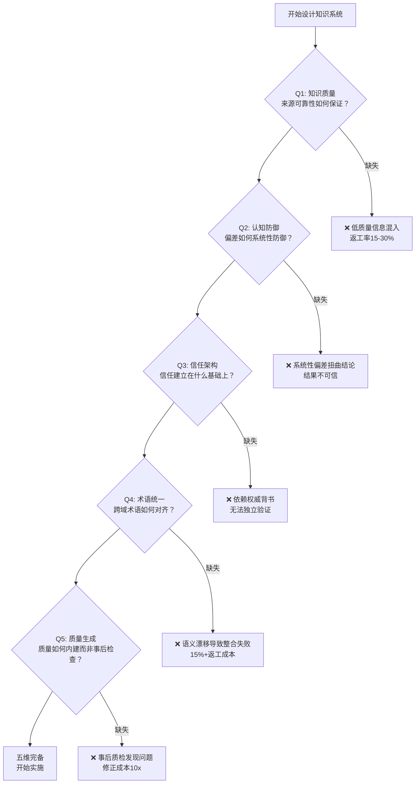

# 知识系统五维根基（Knowledge System Five Foundations）

## 模式类型
方法论模式（知识系统设计框架）

## 成熟度
L1 实验性（1次验证：第一性原理资料搜集项目）

## 问题场景

设计知识系统（研究资料库、知识档案、学习笔记体系、技术文档库等）时，常见的失败模式：

1. **凭直觉搭结构**：参考其他项目的目录结构就开干，遇到一致性问题才发现架构有根本性缺陷
2. **单维度优化**：只关注来源质量（"找最好的资料"），忽视认知偏差、信任机制、术语一致性等维度
3. **框架不完备**：处理了内容质量但没处理术语统一，到整合阶段才发现语义漂移导致大规模返工
4. **维度间缺乏逻辑**：各个设计决策独立做出，没有从统一的根基推导，导致系统内部矛盾
5. **返工成本非线性增长**：缺少任何一维的根基设计，问题在后期爆发时修正成本呈10x以上增长

这些失败的根源是：**知识系统的设计没有从根本问题出发，而是从类比/模仿出发，导致某些根基维度被遗漏。**

## 核心定义

高质量知识系统必须同时回答五个根本性问题，每个问题对应一个基础学科的既定原理，缺少任何一维都会导致系统性缺陷：

| 维度 | 根本问题 | 根基学科 | 核心原理 | 对应洞察 |
|------|---------|---------|---------|---------|
| **知识质量** | 知识的质量最根本上由什么决定？ | 认识论（Epistemology） | 来源可靠性是知识质量的必要条件——不可靠来源的信息无论如何加工都无法产出高质量知识 | 洞察2（来源分级） |
| **认知防御** | 即使来源可靠，人的处理过程会引入什么误差？ | 认知科学（Cognitive Science） | 人类存在系统性认知偏差，且"知道偏差存在"≠"能避免偏差"，必须靠结构/清单强制防御 | 洞察3（偏差清单） |
| **信任架构** | 知识系统的信任应该建立在什么基础上？ | 科学哲学（Philosophy of Science） | 可验证性优于权威性——权威会失效，但可验证的过程可以独立检验、纠错和迭代 | 洞察5（可审计性） |
| **术语统一** | 跨领域整合时为什么会出现"看似一致实则矛盾"？ | 语言学（Linguistics） | 同一术语在不同领域/话语体系中有不同含义（语义漂移），且差异在整合前不可见 | 洞察4（语义漂移） |
| **质量生成** | 质量是如何产生的？ | 系统论（Systems Theory） | 检查只能发现已有缺陷，不能防止缺陷；质量必须内建于流程每个环节 | 洞察1（质量内建） |

## 解决方案

### 五维完备性检查法

设计知识系统时，**必须逐一回答五个根本问题并给出具体机制**，而不是凭直觉或模仿搭建。



### 各维度的设计决策要点

**维度1：知识质量（认识论根基）**
- 必须明确来源分级标准（如一级/二级/三级）
- 必须定义每级来源的验证要求
- 验证资源按帕累托原则分配（80%精力集中在20%低可信度来源）
- → 本项目实现：对抗性审查协议的来源三级分类+可信度四级评分

**维度2：认知防御（认知科学根基）**
- 必须列出需要防御的认知偏差清单（不能仅靠"我会注意的"）
- 必须在关键决策点设置强制检查步骤
- 检查结果需要记录可审计
- → 本项目实现：九种认知偏差检查清单+强制检查点

**维度3：信任架构（科学哲学根基）**
- 必须从"可验证型信任"出发而非"权威型信任"
- 正文标注可信度等级（快速判断），独立验证日志（深入审计）
- 读者可以选择快速获取或深入追溯
- → 本项目实现：可信度评分+验证日志双轨制

**维度4：术语统一（语言学根基）**
- Spec阶段必须执行跨领域概念扫描（列出核心术语→核查各领域定义→标记歧义）
- 必须为术语对齐预留10-20%工作量（不可低估）
- 歧义术语必须显式标注领域和定义引述
- 术语表作为单一事实源
- → 本项目实现：跨领域语义漂移防御模式+四层架构跨领域整合层

**维度5：质量生成（系统论根基）**
- 质量标准必须在内容工作开始前定义（Task 0），而非内容完成后审查
- 规则层最先建立，内容层按规则填充
- 索引层最后做（内容稳定后导航才稳定）
- → 本项目实现：知识档案四层架构（规则层→内容层→整合层→索引层）

### 维度间的依赖关系

五个维度不是平行独立的，而是存在逻辑依赖：

```
Q5（质量生成：流程设计）
 └─> 决定了 Q1（知识质量：标准前置）
      └─> 支撑 Q2（认知防御：清单嵌入流程）
           └─> 支撑 Q3（信任架构：验证过程可审计）
                └─> 需要 Q4（术语统一：跨域一致性可验证）
```

- Q5是元维度：流程设计决定了其他四维度的执行方式
- Q1→Q2→Q3是正向依赖链：来源可靠→偏差防御→可审计信任
- Q4是横切维度：术语统一是跨域知识可验证的前提

## 本案例验证（第一性原理资料搜集项目）

| 验证维度 | 设计决策 | 量化结果 |
|---------|---------|---------|
| 知识质量 | 对抗性审查协议（Task 0先定义标准） | 77.3%一级来源，78.5% A级可信度 |
| 认知防御 | 九种偏差清单+强制检查点 | 主动识别并补充马斯克争议案例（确认偏误防御成功） |
| 信任架构 | 双轨制：正文A/B/C/D标注+12项验证日志 | 知识档案"无需信任作者即可使用" |
| 术语统一 | Spec概念扫描+12术语跨领域定义表 | 术语表占总时间15%（符合10-20%预估），整合阶段无术语相关返工 |
| 质量生成 | 四层架构（规则层最先，索引层最后） | 0返工（同类项目通常15-30%返工率） |

**对比：类比路径的五维缺陷**

如果按类比路径（参考其他知识管理项目结构）执行：

| 维度 | 类比路径的处理 | 后果 |
|------|--------------|------|
| 知识质量 | 依赖已有平台过滤（如"权威网站就是可靠的"） | 低质量信息混入，无统一可信度标注 |
| 认知防御 | 凭经验和自觉避免偏见 | 系统性偏差不受控，结论扭曲 |
| 信任架构 | 依赖作者/平台权威背书 | 无法独立验证，黑箱信任 |
| 术语统一 | 直接使用各领域术语，假定含义一致 | 语义漂移到整合阶段才发现，15%+返工 |
| 质量生成 | "先做完再改" | 大规模返工，次生错误累积 |

## 反模式

| 反模式 | 表现 | 后果 |
|--------|------|------|
| **维度缺失** | 只关注来源质量（维度1），忽视认知偏差和术语统一 | 后期爆发一致性问题，返工成本非线性增长 |
| **顺序颠倒** | 先做内容搜集，最后才制定标准和术语表 | 违反质量内建原则，必然出现回溯性修改 |
| **类比设计** | "X项目是这样做的，我也这样做" | 继承X项目的隐含假设和缺陷，维度不完备 |
| **过度设计单维度** | 把90%精力花在来源分级上，其他维度只花10% | 单维度最优≠系统最优，其他维度成为短板 |
| **维度孤立设计** | 五个维度各自独立做出决策，不考虑依赖关系 | 维度间矛盾（如：高可信度来源但术语歧义导致整合失败） |

## 实施检查清单

- [ ] 是否逐一回答了五个根本问题（质量/防御/信任/术语/生成）？
- [ ] 每个维度是否有明确的、可执行的机制（而非模糊承诺如"我会注意"）？
- [ ] 质量标准（维度5的产出）是否在内容工作开始前完成定义？
- [ ] 认知偏差是否有显性的检查清单而非依赖自觉？
- [ ] 信任建立方式是可验证型还是权威型？
- [ ] Spec阶段是否执行了跨领域概念扫描？
- [ ] 术语对齐是否预留了足够的工作量（10-20%）？
- [ ] 五个维度的设计决策是否逻辑自洽、无内部矛盾？

## 适用场景

- ✅ 系统性知识档案/专题研究资料库设计
- ✅ 技术文档体系/学习笔记体系搭建
- ✅ 跨学科研究项目的知识管理框架设计
- ✅ 需要高可信度的信息整合工作
- ✅ 评估现有知识系统的完备性（诊断缺失维度）
- ❌ 简单的信息收集（如书签整理、新闻聚合）——五维成本>收益
- ❌ 纯个人临时笔记——无需完备的五维设计

## 与其他模式的关系

- [adversarial-review-protocol.md](adversarial-review-protocol.md)：覆盖维度1（知识质量）和维度2（认知防御）的具体实现
- [knowledge-archive-four-layer.md](knowledge-archive-four-layer.md)：覆盖维度5（质量生成）的架构实现
- [credibility-dual-track.md](credibility-dual-track.md)：覆盖维度3（信任架构）的具体实现
- [cross-domain-semantic-drift.md](cross-domain-semantic-drift.md)：覆盖维度4（术语统一）的具体实现
- [methodology-constructive-validation.md](../governance-strategy/methodology-constructive-validation.md)：五维框架的推导过程本身就是构造性验证的案例（用第一原理设计关于第一性原理的知识系统）
- [b2b-product-page-ux-five-dimensions.md](b2b-product-page-ux-five-dimensions.md)：同为五维框架，但面向B2B产品页UX分析而非知识系统设计，维度内容完全不同
