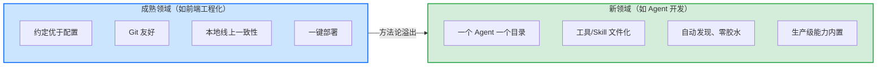

> **提炼自**：[insight-extraction.md#洞察1](../../../reports/competitive-analysis/retrospective-eve-framework-learning-20260704/insight-extraction.md#洞察1) —— Vercel Eve 前端 Agent 框架学习复盘（Vercel 方法论迁移的战略意义）

# 方法论溢出范式（Methodology Overflow Paradigm）

## 模式类型

方法论模式（技术演进判断/学习路径规划/跨领域知识迁移）

## 成熟度

L1 实验性（Vercel Eve 前端方法论迁移案例验证，待更多场景验证）

## 适用场景

需要判断一个新兴技术领域的发展方向、或规划个人如何学习新领域时。典型场景：
- 判断新技术领域将如何演进（判断范式是否已成熟、主流方向为何）
- 规划个人学习路径：如何从已有经验快速迁移到新领域
- 技术选型判断：理解为什么某些公司/框架在新领域能快速占据优势
- 预判新领域竞争格局：谁最可能胜出（往往是最擅长该领域工程化的既有玩家）

## 问题背景

面对一个全新的技术领域时，人们常陷入两种误区：

1. **"从零开始"的误区**：认为新领域是全新范式，需要从零学习、从零建设，忽视了与已有领域的深刻联系。
2. **"全新领域全新规则"的误区**：认为新领域的竞争完全是重新洗牌，忽视了既有领域玩家的工程化优势可以快速迁移。

Vercel 的 Eve 框架揭示了真相：**技术演进不是"全新领域全新范式"，而是"已有领域的成熟方法论向新领域溢出"**。Eve 的核心设计"一个 Agent 就是一个目录"与 Next.js"文件系统即路由"一脉相承，Vercel 将前端工程化 20 年积累的"约定优于配置""Git 友好""本地线上一致性""一键部署"等经验系统性迁移到 Agent 开发领域。

## 核心思想

**技术演进规律是"成熟方法论向新领域溢出"，而非"全新领域全新范式"。** Web 开发从静态页面→动态网站→SPA→SSR→全栈框架，每一次演进都是前一阶段工程经验的沉淀与迁移。新领域（如 Agent 开发）的核心不是发明新东西，而是把已有成熟领域的成功经验复制到新领域。因此：

1. **学习新领域最快的方式**：不是从零开始，而是找到新旧领域的方法论映射关系。
2. **预判新领域赢家**：往往是最擅长既有领域工程化的玩家（它们的方法论可溢出）。
3. **技术演进是连续的**：每一步都是上一阶段经验的沉淀与迁移，而非断裂。

## 关键判断原则

1. **识别"方法论溢出"信号**：新领域出现了与既有领域同构的范式信号（如"一个 Agent 一个目录"↔"文件系统即路由"）。
2. **寻找映射关系**：新领域的概念/设计/工程实践，在旧领域是否有对应物？找到映射即可快速迁移理解。
3. **识别溢出者**：谁最擅长既有领域的工程化？它最可能成为新领域的领先者。
4. **评估学习路径**：学习新领域时，先问"我在既有领域有什么经验可迁移？"而不是从零开始。

## 学习路径规划检查清单

规划学习新领域时对照检查：

- [ ] 是否识别了新旧领域的方法论映射关系？
- [ ] 是否从既有领域经验出发迁移，而非从零开始？
- [ ] 是否预判了哪些玩家最可能获胜（擅长既有领域工程化的）？
- [ ] 是否理解了技术演进的连续性（而非视为断裂）？

## 反模式（不要这么做）

- ❌ **反模式1：从零开始学习**：忽视新领域与既有领域的联系，从零开始，浪费大量时间重复造轮子。
- ❌ **反模式2：低估既有玩家**：认为新领域完全重新洗牌，忽视既有领域玩家工程化优势的快速迁移。
- ❌ **反模式3：忽视方法论迁移**：只关注新领域的新技术点，忽视背后的方法论溢出（惯例、工程化、部署经验）。

## 检验标准

做完之后怎么知道做对了？

- 标准1：能说出新领域与既有领域的方法论映射关系（至少 2 个）
- 标准2：能预判新领域最可能的领先者及其优势来源
- 标准3：学习新领域时，能明确"哪些经验可迁移、哪些需重学"

## 迁移示例

这个模式还能用在什么其他场景？

- **场景1（技术演进判断）**：判断任何新领域（低代码、云原生、AI 编码）如何演进——从既有领域找方法论溢出信号
- **场景2（个人学习路径）**：从后端转 AI、从 Web 转 Agent，先找方法论映射再迁移
- **场景3（跨领域类比）**：餐饮业"从线下到线上"——外卖平台不是发明新餐饮，而是把供应链/运营/品控方法论迁移到线上；公司进入新市场时，把成熟市场的方法论（渠道、SOP、品牌）溢出到新市场

## 与现有模式的关系

| 相关模式 | 关系 | 说明 |
|---------|------|------|
| [reverse-adaptation-innovation.md](../creative-design/reverse-adaptation-innovation.md) | 互补 | 逆向适配关注"从极端/特殊领域向主流领域"迁移，本模式关注"从成熟领域向新领域"迁移，方向不同但同属跨领域迁移思想 |
| [experience-transfer-mapping.md](../retrospective-knowledge/experience-transfer-mapping.md) | 互补 | 该模式关注"萃取模式时如何论证迁移性"（三列迁移映射表），本模式关注"识别技术演进中的方法论溢出"，前者是萃取工具、后者是演进判断 |
| [platform-gap-filling-base-reuse-model.md](platform-gap-filling-base-reuse-model.md) | 互补 | 断层填补+基座复用是"方法论溢出"在产业平台化层面的具体呈现，本模式更抽象地描述技术演进规律 |