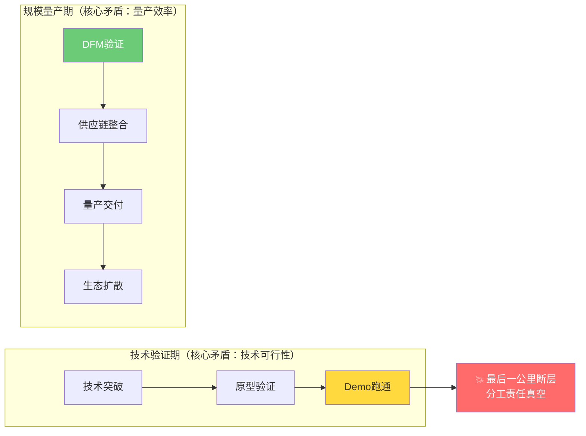
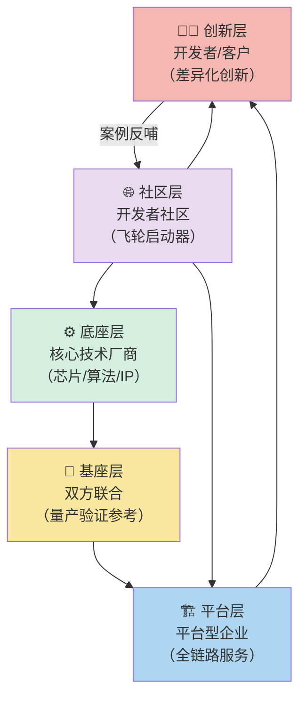
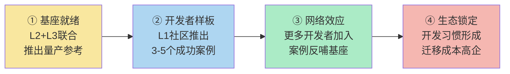

> **来源**：华秋智联与星宸科技战略合作深度分析（2026-07-09文章，七概念洞察2026-07-13完成）——从端边侧AI芯片厂商与数字化智造平台的合作中，提炼出产业平台化的通用五层结构
> **验证领域**：硬件芯片生态（华秋×星宸）、AI大模型应用（模型厂商×LangChain/Dify）、企业SaaS（底层云×SaaS平台）、机器人（本体厂商×ROS）、开源商业化（开源项目×商业化公司）
> **对抗审查**：经过5轮魔鬼代言人攻击验证（怀疑者/硬件工程师/经济学家/历史/时间视角）

# 「断层填补+基座复用」产业平台化模式

## 模式类型
方法论模式（外部研究与产业分析）

## 成熟度
L2 可复用模式（1次产业案例深度分析 + 4个跨领域迁移验证 + 5轮对抗审查）

## 适用场景

| 场景 | 是否适用 | 说明 |
|------|---------|------|
| 芯片/半导体产业生态分析 | ✅ 核心场景 | AI芯片、MCU、处理器厂商生态战略 |
| 云服务/PaaS平台战略分析 | ✅ 核心场景 | 云厂商、AI大模型厂商平台化路径 |
| 硬件创业/开发者生态分析 | ✅ 核心场景 | 开发板、开源硬件、机器人平台 |
| 开源项目商业化路径分析 | ✅ 核心场景 | 开源项目商业化公司战略 |
| B2B平台型企业竞争壁垒评估 | ✅ 核心场景 | 产业互联网、SaaS平台生态 |
| 产业链合作深度判断 | ✅ 核心场景 | 区分表面PR合作与深度协同 |
| ToC消费平台/流量平台 | ❌ 不适用 | ToC平台是网络效应驱动，不是断层填补驱动 |
| 纯技术研究/前沿技术验证期 | ⚠️ 部分适用 | 技术验证期的重点是技术突破，不是量产断层 |

## 问题背景

分析产业平台合作和生态战略时常见的问题：

1. **单点参数对比陷阱**：只对比芯片算力/云性能/功能列表，无法理解平台的真正价值
2. **表面合作误判**：把签约仪式、PR新闻当成深度战略合作，无法判断能否落地
3. **量产阶段认知滞后**：技术验证期只关注技术先进性，忽视量产阶段的核心矛盾变化
4. **生态壁垒低估**：认为"技术好就能赢"，不理解生态黏性一旦形成比参数差距更难超越
5. **平台角色混淆**：分不清底座厂商、平台厂商、开发者各自的定位和边界

**根本原因**：当产业从技术验证期进入规模量产期，核心矛盾从"技术能不能做"转变为"能不能高效、低成本、可复制地量产"。水平分工的产业链在跨环节交接地带天然存在"责任真空"——上下游都不天然对这一段负责，这就是"最后一公里"断层。断层处的机会属于平台型企业，但需要与底座厂商深度协同提供"可复用基座"才能启动飞轮。

---

## 核心概念：最后一公里是分工断层而非技术问题

### 产业阶段转换模型

### 关键认知纠正

| 常识认知 | 反常识洞察 |
|---------|-----------|
| 量产难是因为技术不行/工程师能力不够 | 量产难是水平分工后产业链在交接地带出现了责任真空 |
| "最后一公里"是执行问题，不是战略问题 | "最后一公里"是产业阶段转换的核心矛盾，解决它需要平台级战略投入 |
| 芯片厂商应该自己做量产服务 | 芯片厂商的核心能力在芯片设计，延伸做量产服务既不擅长也不经济 |
| 制造平台应该自己做芯片参考设计 | 制造平台不懂芯片底层，做出来的参考设计有稳定性风险 |
| 开发者应该从零设计所有部分 | 80%是重复通用劳动，开发者应该只聚焦20%的差异化创新 |

---

## 核心框架：五层产业平台架构

真正能启动飞轮的产业平台，不是单点能力的堆砌，而是五层角色各司其职、层层递进的结构：

### 五层角色详细说明

| 层级 | 角色 | 核心职责 | 典型案例（硬件） | 典型案例（AI软件） | 失败表现 |
|------|------|---------|-----------------|-------------------|---------|
| **L1 社区层** | 开发者社区 | 第一推动、案例沉淀、网络效应 | 华秋开源硬件社区 | Hugging Face、GitHub | 没有社区，平台只是工具，没有飞轮 |
| **L2 底座层** | 核心技术厂商 | 提供技术底座（芯片/模型/IP） | 星宸科技（AI SoC） | OpenAI/Anthropic（大模型） | 底座厂商自己做全栈，封闭生态 |
| **L3 基座层** | 双方联合提供 | 经过量产验证的标准参考（核心！） | 量产参考底板 | 开源框架/Agent模板 | 只有开发板没有参考设计，或参考设计没经过量产验证 |
| **L4 平台层** | 平台型企业 | 全链路服务（设计→验证→制造→运营） | 华秋智联（DFM/PCB/PCBA） | LangChain/Dify/云厂商 | 平台只做交易撮合，不提供深度服务 |
| **L5 创新层** | 开发者/客户 | 聚焦差异化创新 | 硬件创业者、方案商 | AI应用开发者、ISV | 开发者需要从零做所有事情，创新门槛高 |

**最关键的洞察**：基座层（L3）是整个模式的核心支点，也是区分"表面合作"与"深度协同"的关键标志。如果合作停留在"开发板上线社区"（L1+L2），没有联合推出经过量产验证的参考基座（L3），飞轮就无法启动。

---

## 基座复用：硬件领域的"框架革命"

### 从通用开发板到量产参考底板的升级

基座层的核心产品形态，在硬件领域叫"参考底板"，在软件领域叫"开源框架"，本质都是同一个东西——**经过生产验证、可直接复用的标准基座**：

| 维度 | 通用开发板 | 量产参考底板 |
|------|-----------|-------------|
| **设计目标** | 评估芯片性能、验证功能 | 直接用于量产，只需修改差异化部分 |
| **DFM验证** | 没有，只是功能验证 | 经过完整可制造性验证 |
| **供应链** | 芯片样片，不保证批量供应 | BOM全部物料配套就绪，供应链锁定 |
| **设计复用** | 原理图仅供参考，不能直接用 | 核心部分（CPU最小系统/电源树/DDR）可直接复用 |
| **改版次数** | 3-5次改版才能量产 | 1-2次改版即可量产 |
| **软件对应物** | 教程Demo、Hello World | 生产级开源框架（Spring/Rails/LangChain） |

### 复用率边界（对抗审查修正）

基座的目标复用率是 **60%-80%**，不是100%：
- ✅ **可复用部分（60%-80%）**：CPU/芯片最小系统、电源树、高速接口走线、核心外设驱动、BOM基础物料——这些是通用重复劳动，最容易出问题、最需要经验
- ❌ **不可复用部分（20%-40%）**：产品差异化接口、结构相关设计、特定功能外设、外观ID——这些是创新者真正应该聚焦的部分

类比软件框架：框架也不是让你100%不用写代码，而是让你不用写底层通用代码。

---

## 飞轮启动路径

平台生态不是建成的，是启动的。飞轮启动需要四个阶段：

### 关键阶段判断信号

| 阶段 | 判断信号 | 华秋×星宸当前状态 |
|------|---------|-----------------|
| ① 基座就绪 | 有联合发布的量产参考底板/参考设计，不是只有开发板 | ⚠️ D1/D2开发板已上线，量产参考底板概念已提出，但尚未看到实际可复用的量产参考设计发布 |
| ② 开发者样板 | 社区有3-5个基于该平台成功量产的开发者案例 | ❌ 暂无公开的量产成功案例 |
| ③ 网络效应 | 每月新增项目数持续增长，社区出现第三方方案商 | ❌ 早期阶段 |
| ④ 生态锁定 | 开发者形成使用习惯，迁移到其他平台成本高 | ❌ 远未到这个阶段 |

**当前判断**：华秋×星宸合作处于阶段①早期——概念清晰、方向正确、产品（开发板）已上线，但关键的"量产参考底板"（L3基座）尚未正式推出，需要后续6-12个月观察落地情况。

---

## 反模式：什么情况下会失败

模式成立有严格的前提条件，以下四种反模式是最常见的失败原因：

### 反模式1：表面握手，没有深度对接
**表现**：签约仪式很隆重，新闻稿写得很漂亮，但没有联合团队、没有联合产品、没有深度技术对接，停留在PR层面
**识别信号**：合作半年后仍然没有除了开发板上线之外的实质性产品
**历史教训**：大量芯片厂商与方案商的"战略合作"都停留在这个阶段

### 反模式2：基座频繁变更，没有稳定性承诺
**表现**：参考设计/框架频繁大改，不兼容旧版本，开发者基于基座做的差异化设计每次升级都要重做
**识别信号**：底座厂商芯片迭代时不考虑向后兼容，平台层参考设计跟着频繁重构
**类比**：如果Spring/LangChain每个大版本都不兼容，没人敢在生产环境用

### 反模式3：平台既做基座又做产品，与开发者争利
**表现**：平台层企业看到某个应用方向赚钱，就自己下场做最终产品，直接与自己的开发者/客户竞争
**识别信号**：平台推出自有品牌的终端产品，与平台上的开发者形成直接竞争
**历史教训**：很多失败的平台都死在这一点——"平台做产品"是生态自杀
**对抗审查补充**：这是平台模式的天然风险，市场竞争是抑制垄断的主要机制，如果某家平台收"过路费"过高或与开发者争利，竞争平台会抢占市场

### 反模式4：只做技术不做生态，没有第一推动
**表现**：技术和产品都很好，但没有社区运营、没有开发者支持、没有样板案例，等着开发者自己来
**识别信号**：文档不全、没有开发者论坛、没有样板项目、技术支持响应慢
**洞察**：生态需要"第一推动"——早期需要平台主动扶持开发者、打造样板案例，飞轮转起来之前不会自动启动

---

## 跨领域迁移验证

本模式不是硬件产业的特例，在多个领域均可验证：

### 领域1：AI大模型应用（软件）
| 层级 | 对应角色 |
|------|---------|
| L1 社区层 | Hugging Face、GitHub、AI开发者社区 |
| L2 底座层 | OpenAI、Anthropic、百度文心、阿里通义（大模型厂商） |
| L3 基座层 | LangChain、Dify、Coze（经过验证的Agent开发框架/模板） |
| L4 平台层 | 云厂商、Agent平台、MCP服务市场 |
| L5 创新层 | AI应用开发者、企业ISV |
| **当前状态** | L2和L4都在试图做L3，但真正中立、经过大量生产验证的L3基座仍在争夺中

### 领域2：企业SaaS
| 层级 | 对应角色 |
|------|---------|
| L1 社区层 | 开发者社区、SaaS生态市场 |
| L2 底座层 | AWS/Azure/阿里云（云基础设施） |
| L3 基座层 | 开源框架（如前端React/Vue、后端Spring Boot）、行业通用SaaS模板 |
| L4 平台层 | 垂直SaaS平台、aPaaS平台 |
| L5 创新层 | 企业IT部门、垂直SaaS创业者 |
| **反模式验证**：平台（如云厂商）做垂直SaaS与客户争利，这是真实发生过的冲突

### 领域3：机器人产业
| 层级 | 对应角色 |
|------|---------|
| L1 社区层 | ROS社区、机器人开发者社区 |
| L2 底座层 | 芯片厂商（NVIDIA Jetson等）、电机/传感器厂商 |
| L3 基座层 | ROS（机器人操作系统）、通用机器人本体参考设计 |
| L4 平台层 | 机器人系统集成商、机器人开发平台 |
| L5 创新层 | 行业机器人方案商、机器人应用开发者 |
| **洞察**：ROS作为L3基座的成熟度是机器人产业能否规模化的关键瓶颈

### 领域4：开源项目商业化
| 层级 | 对应角色 |
|------|---------|
| L1 社区层 | GitHub社区、开源用户群 |
| L2 底座层 | 开源项目核心团队 |
| L3 基座层 | 商业化公司提供的企业版/托管版（生产就绪） |
| L4 平台层 | 商业化公司（提供企业支持、SaaS托管、增值服务） |
| L5 创新层 | 企业用户、二次开发商 |
| **洞察**：很多开源项目商业化失败，就是因为L3基座没有做好——直接从开源代码跳到商业支持，中间没有"生产就绪的企业版"这一层

---

## 数据采信原则（对抗审查修正）

分析产业合作公告时，对单方提供的数据保持审慎：
- ❌ 不直接采信"效率提升X%"、"降低成本Y%"等精确宣传数字
- ✅ 采信结构性信息：合作范围、产品形态、角色分工、合作深度标志（是否有联合产品）
- ✅ 采信行业公开规律：DFM十倍法则、80%重复劳动等行业共识
- ✅ 落地验证信号优先于宣传数字：看实际产品和案例，不看新闻稿怎么写

## 落地观察清单（6个月验证窗口）

要判断"断层填补+基座复用"模式是否真正落地，观察以下指标：

- [ ] 联合推出的"量产参考底板/参考设计"正式发布（不只是开发板）
- [ ] 参考设计的原理图/PCB/BOM可直接复用，有明确的复用率说明
- [ ] 社区出现3个以上基于该平台的真实量产案例（不是Demo）
- [ ] 平台方承诺不做与开发者竞争的终端产品
- [ ] 基座有稳定性承诺（版本兼容、长期供应保障）

---

## 关联模式

| 关联模式 | 关系 |
|---------|------|
| [b2b-ai-last-mile-positioning-framework.md](./b2b-ai-last-mile-positioning-framework.md) | 本模式的上游——最后一公里定位框架解释了"为什么最后一公里重要"，本模式解释了"如何通过五层架构解决最后一公里问题" |
