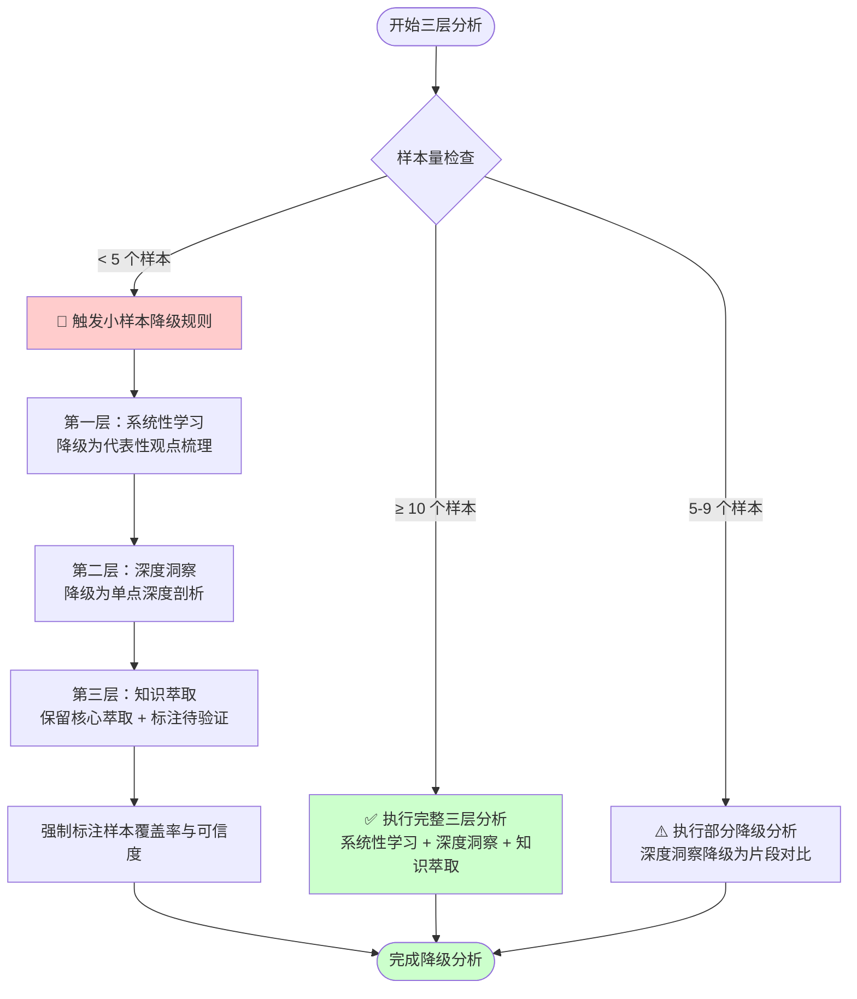

> **来源**：知乎 637007780 系统性学习与知识萃取任务复盘（2026-07-06）——在反爬机制限制下仅获取 3/23 条回答（覆盖率 13%），通过小样本降级策略完成三层分析，揭示了"分析精度 vs 原始内容信度"的根本矛盾
> **验证次数**：1次（知乎 637007780 分析任务实战验证）

# 小样本分析方法论与三层分析框架适用性边界

## 模式类型
方法论模式（外部研究/分析降级/框架适用性）

## 成熟度
L1 首次提炼（1次成功实战验证，待更多场景验证）

## 适用场景

| 场景 | 是否适用 | 说明 |
|------|---------|------|
| 外部网站分析样本获取受限 | ✅ 核心场景 | 反爬/权限/登录墙导致只能获取少量样本 |
| 三层分析框架（系统性学习→深度洞察→知识萃取）应用 | ✅ 核心场景 | 需要判断每层在样本受限时的降级规则 |
| 调研类任务样本量 < 5 | ✅ 核心场景 | 任何需要从少量样本中提取洞察的分析任务 |
| 用户访谈/反馈分析 | ⚠️ 部分适用 | 定性研究中少量样本是常态，但需不同的降级策略 |
| A/B 测试/统计显著性分析 | ❌ 不适用 | 统计分析需要大样本，小样本应直接放弃统计结论 |
| 大样本分析（样本量 ≥ 30） | ❌ 不适用 | 大样本场景无需降级，使用标准分析方法 |

## 样本量前置检查

### 触发条件

**内容获取完成后立即评估样本量**——在进入任何分析层之前，必须先执行样本量前置检查，根据样本量决定后续分析深度和降级规则。这是小样本分析方法论的第一道门控，跳过此步骤会导致在样本严重不足时仍强行执行完整三层框架，产出"高精度但低信度"的误导性结论。

前置检查的执行时机：
1. 外部内容获取完成后（不是规划阶段，而是实际拿到样本后）
2. 进入系统性学习层分析之前
3. 评估样本覆盖率 = 实际获取样本数 / 预期样本总数

### 降级规则表

| 样本量 | 系统性学习层 | 深度洞察层 | 知识萃取层 | 报告标注 |
|---|---|---|---|---|
| ≥ 10 | 全规格执行 | 全规格执行 | 全规格执行 | 无需标注 |
| 5-9 | 全规格执行 | 降级执行（共识标注"初步"） | 全规格执行 | 标注"样本中等" |
| 3-4 | 全规格执行 | 大幅降级（跳过共识/Top N） | 降级（标注"个案为主"） | 显著标注"分析受限" |
| < 3 | 仅信息结构 | 跳过 | 跳过 | 显著标注"样本严重不足" |

### 分析受限警告标准引用块

当样本量 < 10 时，报告开头必须包含以下标准警告块（按实际样本量填充）：

```markdown
> ⚠️ **分析受限警告**
> 本报告基于 N 条回答分析（样本覆盖率 X%），分析结论的统计效力有限。
> - 系统性学习层：[全规格/降级/大幅降级]
> - 深度洞察层：[全规格/降级/跳过]
> - 知识萃取层：[全规格/降级/跳过]
> 建议结合其他信息源交叉验证关键结论。
```

**使用示例**（知乎 637007780 分析，3/23 条回答）：

> ⚠️ **分析受限警告**
> 本报告基于 3 条回答分析（样本覆盖率 13%），分析结论的统计效力有限。
> - 系统性学习层：全规格执行
> - 深度洞察层：大幅降级（跳过共识/Top N）
> - 知识萃取层：降级（标注"个案为主"）
> 建议结合其他信息源交叉验证关键结论。

## 问题背景

在依赖外部信息源的分析任务中，样本获取受限是高频风险：

1. **反爬机制限制**：目标网站的反爬措施导致只能获取少量页面/回答/评论
2. **登录墙限制**：部分内容需登录态可见，未登录态仅能获取少量公开内容
3. **权限限制**：付费墙、地区限制、会员专享等导致样本获取不完整
4. **页面下线**：部分原始内容已删除或下线
5. **动态加载限制**：部分内容通过无限滚动/异步加载，工具无法完整获取

遇到这些问题时，执行者常犯的错误：

1. **强行统计**：对 3-5 个样本做"统计规律分析"，得出虚假的"多数人认为..."结论
2. **隐藏样本量**：不披露样本覆盖率，让读者误以为结论基于完整数据
3. **放弃分析**：认为样本不足就无法产出有价值的分析，直接放弃任务
4. **过度推断**：从单一样本推断整体趋势，缺乏代表性验证
5. **框架僵化**：在小样本下仍强行套用大样本分析框架（如三层分析框架的全部维度）

**根本矛盾**：**分析精度 vs 原始内容信度**——小样本下，可以通过逐句深度解析提升单样本的分析精度，但原始内容的信度（代表性、完整性）无法通过分析技巧弥补。这是本模式要解决的核心矛盾。

---

## 核心原则：小样本降级三规则

### 规则1：保留（Preserve）
**保留什么**：基于已有样本可以可靠得出的核心论点、关键事实、代表性观点。

**判定标准**：
- 单个样本中明确陈述的事实（非推断）
- 多个样本间一致出现的观点（即使只有 2-3 个样本）
- 高赞同/高引用样本的核心论点（具有代表性权重）

### 规则2：降级（Degrade）
**降级什么**：从"统计性结论"降级为"代表性观点"，从"全面分析"降级为"片段分析"。

**降级映射表**：

| 原分析维度 | 大样本场景方法 | 小样本降级方法 |
|-----------|--------------|--------------|
| 统计规律 | 计算频率/百分比/相关性 | 改为"代表性观点列举"，明确标注样本数 |
| 共识识别 | 跨样本多数投票 | 改为"已获取样本间的一致性观察"，不推断整体共识 |
| 分歧分析 | 跨样本对比统计 | 改为"单点对比"，明确标注对比基础有限 |
| 趋势预测 | 基于历史数据外推 | 放弃预测，仅描述当前观察到的现象 |
| 分类归纳 | 聚类/因子分析 | 改为"基于已有样本的初步分类"，标注分类可能不完整 |

### 规则3：标注（Annotate）
**强制标注什么**：样本覆盖率、结论可信度、已知缺口、待验证假设。

**标注模板**：
```
## 样本覆盖率与可信度声明
- 预期样本数：N
- 实际获取样本数：n（覆盖率：n/N × 100%）
- 样本分布：[描述获取样本在赞同数/时间/作者等维度的分布]
- 结论可信度：🟡 中可信度（基于 n 个样本，覆盖率 < 30%）
- 已知缺口：[列出未能获取的样本类型及其可能影响]
- 待验证假设：[列出基于小样本推断但需大样本验证的结论]
```

---

## 三层分析框架适用性边界

### 框架概述

三层分析框架常用于知识萃取类任务：
1. **系统性学习**：整合多个信息源，梳理核心观点与结构
2. **深度洞察**：识别跨信息源的共识、分歧、深层规律
3. **知识萃取**：提炼可复用的方法论、模式、最佳实践

### 各层在样本受限时的适用性

| 分析层 | 大样本场景（≥10） | 小样本场景（<5） | 降级规则 |
|--------|-----------------|-----------------|---------|
| **系统性学习** | ✅ 完全适用：整合多个信息源形成完整图景 | ⚠️ 部分适用：只能梳理已获取样本的观点 | 降级为"代表性观点梳理"，明确标注覆盖率 |
| **深度洞察** | ✅ 完全适用：识别跨样本的统计性规律 | ❌ 严重受限：样本不足无法识别统计规律 | 降级为"单点深度剖析"，放弃统计性结论 |
| **知识萃取** | ✅ 完全适用：从多个案例中提炼共性方法论 | ⚠️ 部分适用：可从高赞同样本中萃取，但缺乏验证 | 保留核心萃取，标注"基于有限样本，待复用验证" |

### 三层框架降级决策流程



### 各层降级详细操作

#### 第一层：系统性学习降级

**大样本方法**：整合 N 个信息源的核心观点，形成完整的主题地图。

**小样本降级**：
1. 对每个已获取样本进行**逐句深度解析**（提升单样本精度弥补样本量不足）
2. 提取每个样本的**核心论点、论据、引用关系**
3. 按**主题维度**而非**样本维度**组织观点（避免"样本1说...样本2说..."的罗列）
4. 明确标注**未覆盖的主题**（基于已知样本分布推断缺口）

#### 第二层：深度洞察降级

**大样本方法**：跨样本统计，识别共识（多数样本一致）与分歧（样本间差异）。

**小样本降级**：
1. **放弃统计性结论**：不使用"多数人认为"、"主流观点是"等表述
2. **改为代表性观点对比**：明确表述"在已获取的 n 个样本中，观察到..."
3. **聚焦单点深度**：对高赞同/高引用样本进行深度剖析，挖掘其论点背后的逻辑链
4. **识别引用关系**：分析样本间的引用/反驳关系（即使样本少，引用关系也能揭示观点演化）

#### 第三层：知识萃取降级

**大样本方法**：从多个案例中提炼共性方法论，验证可复用性。

**小样本降级**：
1. **保留核心萃取**：基于高赞同样本的深度内容，仍可提炼有价值的洞察
2. **降低成熟度声明**：萃取得出的模式/方法论标注为"L0 假设"或"L1 待验证"，不直接声明为已验证模式
3. **明确待验证清单**：列出需要更多样本验证的假设
4. **联动小样本分析规则**：参考 [external-website-analysis-fallback-strategy.md](external-website-analysis-fallback-strategy.md) 的降级策略，判断是否需要尝试获取更多样本

---

## 样本代表性评估

小样本分析的关键不在于"有多少"，而在于"是否具有代表性"。

### 代表性评估维度

| 维度 | 评估问题 | 高代表性信号 | 低代表性信号 |
|------|---------|------------|------------|
| **赞同数分布** | 样本是否覆盖不同认同度区间？ | 覆盖高/中/低赞同样本 | 仅覆盖极端高赞同或极端低赞同 |
| **时间分布** | 样本是否覆盖不同时间段？ | 覆盖早期/中期/后期回答 | 仅覆盖某一时间段 |
| **作者多样性** | 样本来自不同作者吗？ | 不同背景/领域的作者 | 同一作者多篇或高度同质化作者 |
| **观点多样性** | 样本是否包含不同立场？ | 包含支持/反对/中立观点 | 仅包含单一立场 |
| **引用关系** | 样本间有引用/反驳吗？ | 形成观点对话链 | 各自独立陈述，无互动 |

### 代表性抽样策略

当无法获取全部样本时，优先选择：

1. **高赞同样本**：代表社区主流认可的观点
2. **高引用样本**：被其他回答引用的往往是关键论点
3. **争议性样本**：引发讨论的观点往往揭示深层矛盾
4. **官方/权威样本**：提问者本人或领域专家的回答具有高信度

---

## "分析精度 vs 原始内容信度"矛盾

### 矛盾定义

- **分析精度**：对单个样本的解析深度（逐句解析、逻辑链追溯、隐含假设挖掘）
- **原始内容信度**：样本本身对总体的代表性、完整性、可信度

### 矛盾表现

在小样本场景下，这两个维度存在根本张力：

| 维度 | 大样本场景 | 小样本场景 |
|------|----------|----------|
| 分析精度 | 中等（每个样本解析较浅） | 可以极高（逐句深度解析） |
| 原始内容信度 | 高（样本代表性强） | 低（样本代表性不足） |
| 结论可信度 | 高（精度×信度双高） | **不确定**（精度高但信度低，乘积可能仍低） |

### 矛盾处理原则

1. **承认矛盾存在**：不要假装高精度分析能弥补低信度样本
2. **精度服务于信度**：深度解析的目的是"从有限样本中提取最大信息量"，而非"创造原本不存在的信息"
3. **标注而非隐藏**：明确标注"本分析基于 n 个样本，分析精度高但样本信度低，结论需谨慎采用"
4. **后续验证计划**：列出需要在大样本下验证的假设清单

---

## 实际应用案例：知乎 637007780 分析（2026-07-06）

### 任务背景
- **目标**：对知乎问题 637007780 下的 23 个回答进行系统性学习与知识萃取
- **样本获取**：因反爬机制限制，仅获取 3 个回答（覆盖率 13%）
- **样本分布**：赞同数 4 / 1 / 2（覆盖高/低/中三个认同度区间）

### 降级执行

| 分析层 | 预期目标 | 实际执行 | 降级处理 |
|--------|---------|---------|---------|
| 系统性学习 | 整合 23 个回答的核心观点 | 基于 3 个回答梳理代表性观点 | 降级为"代表性观点梳理"，明确标注覆盖率 13% |
| 深度洞察 | 识别跨回答的共识与分歧 | 对 3 个回答进行逐句深度解析 | 降级为"单点深度剖析"，放弃统计性结论 |
| 知识萃取 | 提炼可复用的方法论 | 从高赞同回答中提炼核心洞察 | 保留核心萃取，标注"基于有限样本" |

### 样本代表性评估
- ✅ 赞同数分布：覆盖高/中/低三个区间（4/2/1），具有代表性
- ⚠️ 时间分布：未评估（受限于工具未获取时间戳）
- ⚠️ 作者多样性：3 个回答来自不同作者（基本满足）
- ❌ 观点多样性：仅 3 个样本，难以判断是否覆盖全部立场
- ❌ 引用关系：未观察到明显的引用/反驳关系

### 结果
- 产出 learning-notes.md（28.9KB，8 章节）和 raw-content.md（31.9KB）
- 在报告中明确标注样本覆盖率 13% 及其对结论可信度的影响
- 复盘提炼的洞察标注为"基于有限样本，待大样本验证"
- 41 个子任务全部完成，38 项检查点全部通过

### 经验教训
1. **样本代表性比样本量更重要**：3 个覆盖不同赞同数区间的样本，比 10 个全部高赞同的样本更有代表性
2. **深度解析能部分弥补样本不足**：逐句解析提取的信息量远高于浅层浏览
3. **必须诚实标注局限性**：不标注覆盖率的分析报告会误导后续决策
4. **小样本适合假设生成，不适合结论验证**：萃取的洞察应作为"待验证假设"而非"已验证结论"

---

## 反模式与注意事项

### 绝对禁止的反模式

| 反模式 | 为什么错误 | 正确做法 |
|--------|----------|---------|
| **对小样本做统计性结论** | 3-5 个样本不支持"多数人认为"等统计表述 | 改为"在已获取的 n 个样本中，观察到..." |
| **隐藏样本覆盖率** | 误导读者认为结论基于完整数据 | 在报告显著位置标注样本覆盖率 |
| **从单一样本推断整体趋势** | 单一样本缺乏代表性，推断容易偏差 | 标注为"单点观察"，不推断整体 |
| **过度萃取方法论** | 小样本下的洞察缺乏验证，直接声明为"模式"会传播错误 | 标注为"L0 假设"或"L1 待验证" |
| **放弃分析** | 小样本仍有分析价值，放弃是资源浪费 | 执行降级分析，明确标注局限性 |
| **强行套用大样本框架** | 三层分析框架在样本不足时会失效 | 按本模式的降级规则调整每层分析方法 |

### 注意事项

1. **前置样本量评估**：在 Spec 规划阶段就应评估样本获取可能性，预设降级预案
2. **时间盒管理**：小样本分析不应陷入"无限深度解析"，设定时间上限（如单样本不超过 15 分钟）
3. **联动反爬策略**：样本不足时优先尝试 [external-website-analysis-fallback-strategy.md](external-website-analysis-fallback-strategy.md) 获取更多样本，而非直接降级
4. **后续验证计划**：小样本分析应配套"大样本验证计划"，列出待验证假设清单
5. **不要过度标注**：标注局限性是必要的，但不要让标注淹没分析本身——分析的目的是产出洞察，不是产出免责声明

---

## 与其他模式的关系

| 关联模式 | 关系类型 | 关系说明 |
|---------|---------|---------|
| [external-website-analysis-fallback-strategy.md](external-website-analysis-fallback-strategy.md) | 上游 | 外部网站分析的信息源分层兜底策略负责"获取样本"，本模式负责"分析获取到的样本"——当上游只能获取少量样本时，下游切换到小样本分析方法 |
| [triangular-source-verification.md](../retrospective-knowledge/triangular-source-verification.md) | 互补 | 三角验证法适用于多源信息验证，本模式适用于单源少量信息分析——两者解决不同的信息质量问题 |
| [extraction-four-layer-funnel.md](../retrospective-knowledge/extraction-four-layer-funnel.md) | 下游 | 本模式产出"待验证假设"，通过萃取四层漏斗进一步提炼为可复用知识 |
| [multi-source-intelligence-iteration.md](../retrospective-knowledge/multi-source-intelligence-iteration.md) | 上游 | 多源情报迭代是获取更多样本的通用方法论，本模式是其"获取不足时的兜底" |

---

## 模式演进方向

当前版本为 L1（首次提炼，1 次实战验证），后续可在以下方向迭代：

1. **跨场景验证（L1→L2 路径）**：在更多小样本场景中验证（如用户访谈、反馈分析、竞品调研），积累至少 2 次成功验证
2. **量化样本代表性指标**：开发"样本代表性评分"工具，自动评估样本在赞同数/时间/作者等维度的分布
3. **小样本分析模板**：创建标准化的"小样本分析报告模板"，包含样本声明、降级方法、待验证清单等固定章节
4. **与大样本分析方法论的关系厘清**：明确小样本→大样本的过渡阈值（如样本量从 3→5→10 时，分析方法如何渐进调整）
5. **三层分析框架的更多降级场景**：除了样本受限，还可在时间受限、工具受限等场景下扩展降级规则
6. **自动化可信度标注**：开发工具自动计算并标注结论可信度等级（基于样本量、覆盖率、代表性评分）

---

## Changelog

- **v1.1.0** (2026-07-06): 2026-07-06 | enhance | 新增样本量前置检查步骤和分析受限警告标准引用块（来源：retrospective-zhihu-637007780-analysis 行动项 A2）
- **v1.0.0** (2026-07-06): 初始版本，基于知乎 637007780 分析任务复盘萃取，核心解决小样本场景下三层分析框架的降级策略和适用性边界
