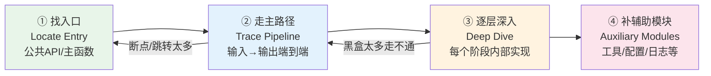

# 源码学习管线穿透法（Pipeline Penetration Method）

## 模式类型
方法论模式（开源项目/复杂系统源码高效学习框架）

## 成熟度
L1 实验性（1次完整验证：WeasyPrint渲染引擎源码分析）

## 问题场景

学习开源项目、编译器、渲染引擎、框架等有明确处理流程的复杂代码库时，常见的低效学习模式：

1. **随机文件浏览**：按目录逐个打开文件看，看了几十个文件还是不知道系统怎么跑起来的
2. **自底向上迷失**：从工具类、数据结构开始看，还没到核心逻辑就已经在细节中精疲力尽
3. **主路径不清**：能说出各个模块是做什么的，但不知道一个请求/输入从进来到出去完整走了哪些步骤
4. **心智模型碎片化**：知道局部细节但无法形成整体架构认知，遇到问题不知道该在哪个模块排查
5. **重复回溯**：看后面模块时忘了前面的上下文，反复来回跳效率低下

这些问题的根源是：**学习顺序违反认知规律——从局部到整体而非从整体到局部，从细节到主路径而非从主路径到细节。**

## 核心定义

管线穿透法是一套面向流程型系统（渲染引擎/编译器/转换器/请求处理框架等）的源码学习方法，核心隐喻是**"顺着数据流走，像水穿过管道一样从入口穿透到出口"**——先建立端到端主路径心智模型，再逐层深入每个阶段内部实现，最后才看辅助工具模块。

| 对比维度 | 传统随机浏览法 | 管线穿透法 |
|---------|--------------|-----------|
| 学习顺序 | 按目录/文件名随机或从工具类开始 | 从公共API入口顺着数据流动方向逐层穿透 |
| 心智模型建立 | 后期拼碎片，容易漏关键路径 | 第一遍就建立端到端主路径，细节挂在主路径骨架上 |
| 上下文支撑 | 看每个模块时不知道它在整体中的位置 | 深入每一层都有上层上下文支撑，理解难度指数级降低 |
| 效率 | 看3天还不知道系统怎么跑 | 1小时内建立六步管线完整认知（WeasyPrint案例） |
| 知识留存 | 碎片化，容易忘 | 骨架清晰，细节可以推导出来 |

## 解决方案

### 四步学习SOP



### 第一步：找入口（Locate Entry）——找到数据进入系统的大门

**目标**：找到系统的公共API入口或主函数，明确输入是什么、输出是什么。

**操作清单**：
1. **看`__init__.py`/主入口文件**：通常公开的API都会在这里导出，找到最顶层的入口类/函数
2. **看README/官方文档的Quick Start**：用户第一行代码写的是什么？那个就是入口（如WeasyPrint的`HTML()`）
3. **明确输入输出契约**：输入是什么类型（文件/字符串/URL/对象）？输出是什么（PDF/HTML/JSON/副作用）？
4. **画出黑盒**：此时系统就是一个黑盒，只关心`[Input] → [BlackBox] → [Output]`，不要打开黑盒

**关键产出**：入口类/函数名、输入类型、输出类型、最小可运行示例。

### 第二步：走主路径（Trace Pipeline）——顺着数据流从入口穿透到出口

**目标**：走通从输入到输出的完整主路径，建立"数据经过哪些阶段、每个阶段做什么转换"的骨架心智模型。这是最关键的一步！

**操作清单**：
1. **从入口函数开始单步跟踪**：入口方法第一行调用了什么？下一个核心方法是什么？
2. **只关心阶段划分不关心细节**：看到一个大的函数调用时，先看函数名和注释理解它"做什么"，**不要点进去看怎么做**
3. **识别管线阶段**：顺着调用链找自然的阶段边界（如解析→计算→布局→绘制），通常每个阶段对应一个核心模块/目录
4. **画出管线图**：用文字或Mermaid画出六步左右的线性流程：
   ```
   Input → Stage1 → Stage2 → Stage3 → ... → Output
   ```
5. **每个阶段标注**：输入是什么、输出是什么（数据结构类型）、核心职责是什么
6. **跳过非主路径分支**：错误处理、缓存、日志、配置加载等都是支线，主路径走通了再看

**关键原则**：这一步**绝对不要深入细节**！遇到看不懂的函数名先根据名字猜它做什么，继续往前走，先把端到端路径走通。就像开车从北京到上海，先知道走哪条高速经过哪几个大城市，不要一出发就钻进某个胡同看人家怎么盖房子。

**关键产出**：完整的管线阶段图（5-9个阶段为宜），每个阶段的输入/输出/核心职责。

### 第三步：逐层深入（Deep Dive）——给骨架填上血肉

**目标**：在管线骨架的基础上，逐个深入每个阶段的内部实现，理解每个阶段怎么做的。

**操作清单**：
1. **按阶段顺序逐个深入**：不要跳着看，从第一个阶段开始，看完一个再看下一个
2. **先看阶段入口函数**：每个阶段的入口函数是什么？它接收上一阶段的输出，做了什么转换，输出什么给下一阶段？
3. **深入核心算法/数据结构**：这一阶段最复杂的逻辑是什么？关键数据结构是什么？
4. **理解阶段间契约**：两个阶段之间传递的数据结构是什么？为什么设计成这样？
5. **识别扩展点/钩子**：这个阶段有没有用户可以自定义的扩展点（如WeasyPrint的url_fetcher、finisher）
6. **关键疑问记录下来**：看到奇怪的设计先记下来，看完后面阶段可能就理解了（或看完整个系统再回头看）

**关键原则**：每个阶段看完后，回到管线图更新你对这个阶段的理解——现在你知道"怎么做"了，但仍然不要钻到太深的工具类里。

### 第四步：补辅助模块（Auxiliary Modules）——最后看周边工具

**目标**：主路径和核心阶段都理解完了，最后再看工具类、配置、日志、异常处理等辅助模块。

**操作清单**：
1. **工具类/通用函数**：被多个阶段调用的工具函数（如单位转换、路径处理、数据结构）
2. **配置系统**：默认值、配置加载、优先级
3. **日志与错误处理**：日志分级、异常类型、错误提示
4. **缓存与优化**：性能优化点、缓存策略
5. **测试用例**：看单元测试可以快速理解模块的边界条件和预期行为

**关键原则**：辅助模块之所以最后看，是因为它们的存在是为了支撑主路径，你理解了主路径，自然就理解为什么需要这些工具——反过来不成立。

### 辅助判断：什么系统适合用管线穿透法？

**✅ 非常适合**：
- 编译器/解释器/转译器（源代码→目标代码）
- 渲染引擎/布局引擎（HTML/CSS→像素/PDF）
- 网络请求处理框架（Request→Response）
- 数据处理ETL管道（输入数据→输出数据）
- 媒体转码器（一种格式→另一种格式）
- 任何有明确输入输出、处理流程可划分为线性阶段的系统

**❌ 不太适合**：
- CRUD管理系统（没有明显的核心管线，主要是业务逻辑CRUD）
- 高度递归/事件驱动的系统（如GUI框架、操作系统内核）
- 算法库（主要是独立算法实现，没有统一流程）

## 本案例验证（WeasyPrint源码分析）

| 阶段 | 传统做法预计耗时 | 管线穿透法实际耗时 | 产出 |
|------|----------------|------------------|------|
| 找入口 | 30分钟随机找 | 5分钟看__init__.py | 找到HTML/CSS/Document三个核心入口类 |
| 走主路径 | 可能2-3小时都走不完 | 15分钟顺着render()调用链 | 画出六步管线：HTML解析→CSS解析→CSS应用→盒树构建→布局→PDF绘制 |
| 逐层深入 | 无上下文看每个模块很痛苦 | 每个阶段10-15分钟，合计1小时 | 理解了多遍分页机制、CSS级联六阶段、z-index叠放顺序 |
| 补辅助模块 | 边看边忘 | 主路径清楚后看工具类一看就懂 | 理解了URL fetcher、字体配置、图片缓存 |
| **总计** | **3-4小时可能还一头雾水** | **1.5小时建立完整架构认知** | 写出了源码模块导览章节，准确画出依赖架构图 |

## 反模式

| 反模式 | 表现 | 后果 | 规避方法 |
|--------|------|------|---------|
| **一开始就钻细节** | 从util.py、helpers.py、数据结构开始看 | 看了2天还不知道系统怎么跑，细节没有地方挂 | 严格执行前两步：先找入口走主路径，哪怕主路径看得一知半解也要走到底 |
| **目录顺序浏览** | 按字母顺序或目录顺序逐个打开文件 | 看到中间模块不知道它在整个流程中的位置 | 按数据流顺序看，不是按文件系统顺序看 |
| **遇到不懂就停下来深挖** | 看到一个不懂的函数就点进去看，一层层下去迷路了 | 花了1小时研究一个边缘工具函数，主路径断了 | 先标记疑问继续往前走，走完主路径回头再看，大部分疑问自然解决 |
| **不画图只靠脑子记** | 看完就忘，阶段关系混乱 | 学到后面忘了前面，反复回溯浪费时间 | 每走完一个阶段就在管线图上加一笔，好记性不如烂笔头 |
| **支线当主线** | 一开始就看日志、配置、错误处理 | 捡了芝麻丢西瓜，核心逻辑没学到 | 主路径走通之前，明确跳过所有非主路径分支 |
| **完美主义理解每一行** | 必须看懂每一行代码才往下走 | 进度极慢，信心受挫 | 第一遍理解80%就够了，用2/8原则——20%核心代码决定80%架构理解 |

## 实施检查清单

### 第一步：找入口
- [ ] 是否查看了顶层`__init__.py`/主入口文件？
- [ ] 是否从Quick Start示例找到了用户使用的入口API？
- [ ] 是否明确了输入类型和输出类型？
- [ ] 是否能运行一个最小的Hello World示例？

### 第二步：走主路径
- [ ] 是否从入口函数开始顺着调用链走？
- [ ] 是否做到了"只看是什么不看怎么做"？（没点进函数内部）
- [ ] 是否识别出了5-9个自然的阶段边界？
- [ ] 是否画出了端到端的管线图？
- [ ] 是否每个阶段标注了输入/输出/核心职责？
- [ ] 是否跳过了错误处理/缓存/日志等支线？

### 第三步：逐层深入
- [ ] 是否按管线顺序逐个阶段深入？
- [ ] 是否理解了每个阶段的入口函数和核心算法？
- [ ] 是否清楚阶段间传递的数据结构？
- [ ] 是否识别了用户可扩展的钩子点？

### 第四步：补辅助模块
- [ ] 主路径和核心阶段是否都理解完了？
- [ ] 是否最后才看工具类/配置/日志？
- [ ] 是否看了测试用例理解边界条件？

## 适用场景

- ✅ **开源渲染引擎/编译器/转译器学习**（如WeasyPrint、Babel、PostCSS、React Fiber等）
- ✅ **框架源码理解**（如Django请求处理、Express中间件管线、React渲染流程）
- ✅ **新公司项目上手**：接手老项目时快速理解核心业务流程
- ✅ **复杂系统源码审计**：需要快速定位某个功能在哪实现
- ✅ **写技术教程/架构分析文章**：需要给别人讲清楚系统怎么工作

- ❌ 业务逻辑分散的CRUD系统（没有核心管线）
- ❌ 高度递归/事件驱动的系统（如GUI消息循环、操作系统调度器）
- ❌ 独立算法库学习（直接看算法实现即可）
- ❌ 非常小的项目（总共<10个文件，直接看就行不需要方法）

## 与其他模式的关系

- [external-article-deep-analysis-methodology.md](external-article-deep-analysis-methodology.md)：同为系统化分析框架，但聚焦外部文章而非源码；其"分层递进"原则与本方法逐层深入一致
- [vendor-product-learning-twelve-step-template.md](vendor-product-learning-twelve-step-template.md)：外部产品学习完整模板；源码分析是其中一个环节，可以用本方法具体执行
- [first-principles-feature-analysis.md](first-principles-feature-analysis.md)：第一性原理分析框架；分析完"是什么"之后，可以用第一性原理分析"为什么这么设计"
- [tutorial-cognitive-ladder.md](../document-architecture/tutorial-cognitive-ladder.md)：教程写作的认知阶梯模型；理解了源码管线后，按认知阶梯组织教程内容
