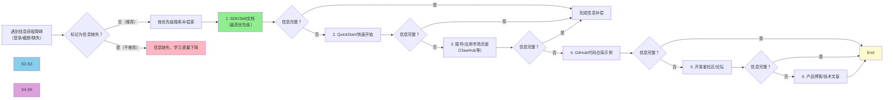

> **来源**：火山引擎MobileUseAgent移动端智能体系统学习复盘（2026-07-07）——ACEP控制台需登录无法访问，ClawHub Skill页面内嵌完整配置Flow，成功补偿缺失信息；API文档截断部分通过Skill文档代码示例补全
> **验证次数**：1次（火山引擎MUA/ACEP）；待在阿里云、AWS、腾讯云等不同云厂商产品学习中验证通用性

# 厂商技术文档信息补偿搜索策略

## 模式类型
方法论模式（外部研究与信息检索策略）

## 成熟度
L1 实验性（1次实战验证，待更多案例验证后升级L2）

## 适用场景

| 场景 | 是否适用 | 说明 |
|------|---------|------|
| 云厂商控制台需登录 | ✅ 核心场景 | 配置页面、操作流程在控制台内需登录 |
| API文档截断/不完整 | ✅ 核心场景 | 文档后半部分或示例代码缺失 |
| SDK/Skill集成学习 | ✅ 核心场景 | 需要完整的端到端配置流程 |
| 产品快速评估 | ✅ 适用 | 评估阶段不需要登录即可了解使用流程 |
| 开源项目文档缺失 | ⚠️ 部分适用 | GitHub Issues/PR/Discussion可作为补偿源，但优先级不同 |
| 非技术类产品研究 | ❌ 不适用 | 本策略针对技术文档生态设计 |

## 问题背景

厂商技术文档学习常见问题：

1. **登录墙阻断**：控制台、管理后台页面需要账号登录，学习评估阶段无法访问
2. **文档截断**：API参考文档篇幅过长，Web提取时后半部分被截断
3. **信息分散**：配置流程散落在多个文档中，单一入口无法获取完整流程
4. **过早放弃**：遇到登录/截断就标记为"信息缺失"，错过其他公开入口的补偿信息
5. **检索无序**：不知道应该优先搜索哪些补偿源，浪费时间在低质量信息源上

**根本原因**：将厂商文档视为单一信息源（官方文档中心），而非多层级、多入口的信息生态系统。

---

## 核心：信息补偿六源搜索策略

当遇到厂商文档信息获取障碍时，按以下优先级顺序搜索补偿信息源：

### 补偿源优先级说明

| 优先级 | 补偿源 | 信息类型 | 为什么优先 |
|--------|--------|---------|-----------|
| 1（最高） | **SDK/Skill文档** | 完整配置流程、API参数、代码示例 | SDK是开发者编码入口，文档必须自包含才能降低集成门槛，最可能内嵌控制台操作步骤 |
| 2 | **QuickStart/快速开始** | 端到端流程、最小可运行示例 | QuickStart设计目标就是让开发者不迷路，通常包含从创建到运行的完整步骤 |
| 3 | **插件/应用市场页面** | 实际集成案例、配置截图、参数说明 | 上架应用市场需要提供完整接入指南，且实际用户案例往往比官方文档更具体 |
| 4 | **GitHub/代码仓库** | 代码实现、Example目录、Issue讨论 | 代码是最诚实的文档，示例代码直接展示实际调用方式 |
| 5 | **开发者社区/论坛** | 常见问题解答、实际踩坑记录 | 社区中其他开发者遇到的问题和解决方案能覆盖文档未提及的边缘情况 |
| 6 | **产品博客/技术文章** | 发布时技术解读、架构说明 | 新品发布时博客文章往往有比文档更详细的设计思路和使用场景 |

---

## 为什么这个策略有效

### 厂商视角：开发者体验（DX）驱动

云厂商和技术平台有强烈的动机让开发者在不登录的情况下就能了解完整使用流程：

1. **降低评估门槛**：开发者在选型评估阶段不愿意注册账号，如果不登录就能了解完整流程，转化率更高
2. **SDK自包含原则**：SDK/Skill是开发者实际编码的入口，文档必须自包含才能让开发者顺利完成集成
3. **文档生态设计**：控制台（操作环境、需登录）、文档中心（参考文档）、SDK文档（开发入口）、社区（问题解决）是互补关系，不是冗余关系
4. **DX竞争力**：开发者体验是B2D/ToB技术产品的核心竞争力，文档断裂直接影响开发者留存

### 信息补偿的可靠性

这种信息补偿机制不是偶然的，而是厂商文档生态设计的必然结果：

- 控制台因安全权限要求必须登录，但学习评估阶段不需要实际操作
- SDK文档为了开发效率必须自包含，不能让开发者频繁切换到控制台查看
- 插件/应用市场上架需要提供完整接入指南，否则无法通过审核
- QuickStart的设计目标就是"一条路走通"，不能有断点

---

## 实施步骤

1. **识别障碍类型**：判断是登录限制、内容截断、还是信息缺失
2. **从最高优先级源开始**：先查SDK/Skill文档（通常能解决80%的问题）
3. **逐级向下搜索**：高优先级源无法满足时，才搜索下一级
4. **交叉验证**：不同来源的信息不一致时，以代码示例和实际集成功例为准
5. **标注信息来源**：学习笔记中明确标注哪些信息来自哪个补偿源
6. **记录缺失项**：如果六源搜索后仍有信息缺失，明确标注"经六源补偿搜索仍未获取"，而非简单标记为缺失

---

## 反模式（不要这样做）

1. ❌ **一遇到登录就放弃**：直接标记"控制台无法访问，信息缺失"
2. ❌ **无序搜索**：随机搜索博客、论坛，浪费时间在低质量信息源
3. ❌ **单源依赖**：只看文档中心，不知道还有其他信息入口
4. ❌ **过度搜索**：在已获取足够信息后仍继续搜索，陷入信息搜集癖
5. ❌ **不标注来源**：学习笔记中不记录信息来自哪个补偿源，后续无法验证

---

## 关联模式

- [vendor-product-learning-twelve-step-template.md](vendor-product-learning-twelve-step-template.md)：十二步学习模板中Step 1（内容提取）可嵌入本策略
- [triangular-source-verification.md](../retrospective-knowledge/triangular-source-verification.md)：三源交叉验证可用于补偿信息的可信度确认
- [external-website-analysis-fallback-strategy.md](external-website-analysis-fallback-strategy.md)：外部网站分析降级策略，本策略是其在厂商文档场景的具体实现
