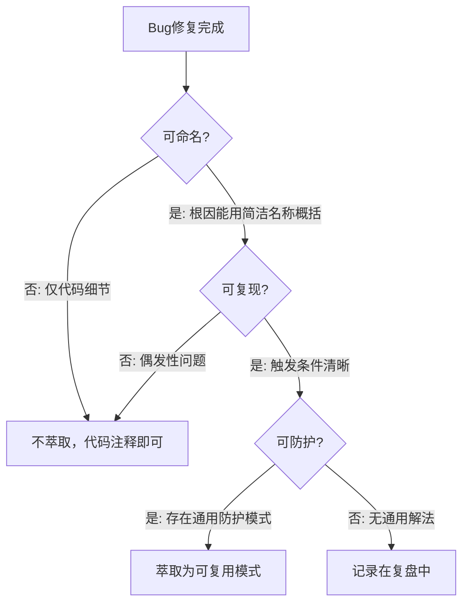

# Bug即资产转化机制（Bug-as-Asset）

## 模式类型
方法论模式

## 成熟度
L2 已验证（在2次独立工作流中验证，1次复用）

## 适用场景
当Bug修复完成后，需要判断是否值得将修复方式萃取为可复用模式时。

## 问题背景
传统Bug管理将Bug视为"需要消灭的问题"，修复即结束。但深层级Bug的修复方式往往隐含通用的防护模式，如果萃取入库，可以预防同类Bug在未来的发生。问题是：并非所有Bug都值得萃取，需要一套判断标准。

## 核心机制

### Bug三条件萃取标准

一个Bug的修复方式值得萃取为可复用模式，当且仅当满足以下三个条件：

### Bug层级与萃取决策

| Bug层级 | 特征 | 萃取决策 | 复用价值 |
|---------|------|---------|---------|
| 代码级 | 语法错误、API误用 | 不萃取，代码注释说明 | 低 |
| 架构级 | 状态管理、监听器泄漏、副作用 | **优先萃取** | 高 |
| 环境级 | 编码问题、路径差异、沙箱限制 | 记录在复盘 | 中 |

## 标准实施步骤

### 步骤1：Bug层级判定
修复Bug后，判断其层级：
- 仅涉及单行/单函数 → 代码级
- 涉及模块间交互、状态流转 → 架构级
- 涉及操作系统、工具链、环境差异 → 环境级

### 步骤2：三条件检验
对架构级Bug，检验三条件：
1. **可命名**：能否用一个简洁名称概括根因？（如"检查函数状态恢复"）
2. **可复现**：能否清晰描述触发条件？（如"检查函数导航到其他页面"）
3. **可防护**：是否存在通用的防护模式？（如"保存状态→检测→恢复"）

### 步骤3：即时萃取
三条件全满足的Bug，立即萃取为模式：
- 不要等综合复盘时批量萃取（上下文会遗忘）
- 5分钟微复盘：记录现象→根因→防护模式→命名
- 入库时标注成熟度L1，待独立验证后升级

## 关键要点

1. **不是所有Bug都值得萃取**——代码级Bug在注释中说明即可
2. **架构级Bug优先萃取**——其防护模式复用范围最广
3. **即时萃取优于批量萃取**——Bug修复时的上下文最完整
4. **三条件是必要条件**——缺一不可，宁可不萃取也不降标准

## 成功案例

| Bug | 层级 | 可命名 | 可复现 | 可防护 | 萃取模式 |
|------|------|--------|--------|--------|---------|
| check_login导航丢失 | 架构级 | ✅ 检查函数状态恢复 | ✅ 检查函数导航 | ✅ 保存→检测→恢复 | check-and-restore.md |
| 监听器漏注册 | 架构级 | ✅ early return泄漏 | ✅ 分支提前返回 | ✅ 提取公共初始化 | (隐含在日志模式) |
| 静态资源刷屏 | 架构级 | ✅ 日志信噪比低 | ✅ 全量监听 | ✅ 扩展名过滤 | dual-channel-tiered-logging.md |
| JS正则警告 | 代码级 | ❌ 仅Python字符串细节 | ✅ | ✅ raw string | 不萃取(代码注释) |
| PowerShell引号失败 | 环境级 | ✅ | ✅ | ✅ -F参数 | 记录在复盘洞察 |

## 适用边界

- **适用于**：架构级Bug的修复后萃取决策
- **不适用于**：代码级Bug（注释即可）；环境级Bug（复盘记录即可）

> **关联模块**：
> - `root-cause-diagnosis.md` — 根因诊断（Bug层级判定的基础）
> - `check-and-restore.md` — 检查函数状态恢复（本机制的成功案例）
