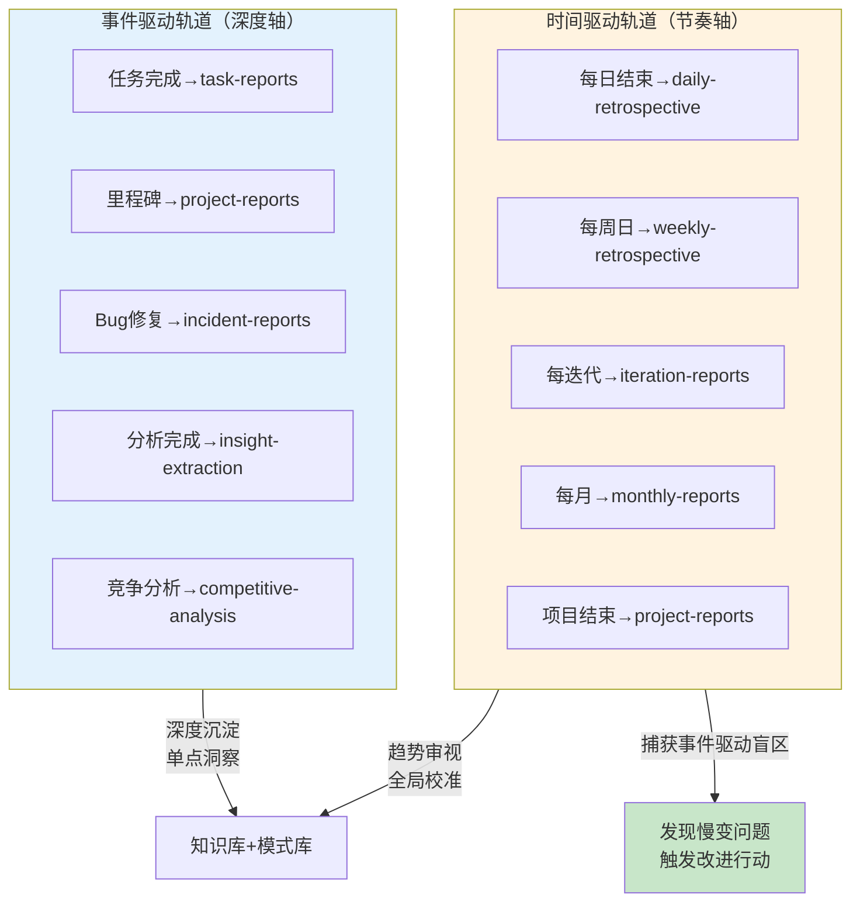

> **来源**：SpecWeave全项目复盘（2026-07-19）——1317篇复盘报告中iteration-reports仅2篇的结构失衡分析
> **验证次数**：1次（SpecWeave项目27天复盘实践验证：任务驱动复盘118篇 vs 时间驱动复盘2篇）

# 双轨复盘节奏：时间驱动与事件驱动互补

## 模式概述

复盘体系必须同时运行两条轨道：**事件驱动复盘**（任务完成后/里程碑到达时触发）和**时间驱动复盘**（每周/每迭代固定时间触发）。事件驱动复盘提供深度和即时性，但天然缺失"中场视角"——跨任务的趋势、节奏性问题、被任务洪流淹没的系统性问题。时间驱动复盘作为兜底机制，确保即使没有重大事件，也能定期拉远视角审视全局，捕获事件驱动复盘的盲区。两条轨道缺一不可：只有事件驱动会"只见树木不见森林"，只有时间驱动会"缺乏深度流于形式"。

## 问题现象：单轨复盘的结构性盲区

SpecWeave项目27天复盘数据揭示了典型的单轨失衡：

| 复盘类型 | 数量 | 触发方式 | 覆盖盲区 |
|---------|------|---------|---------|
| task-reports | 118篇 | 任务完成（事件驱动） | 跨任务趋势、节奏问题 |
| insight-extraction | 406篇 | 每次分析后（事件驱动） | 整体方向校准 |
| competitive-analysis | 319篇 | 竞品分析（事件驱动） | 自身节奏审视 |
| project-governance | 262篇 | 治理事件（事件驱动） | 节奏性活动健康度 |
| **iteration-reports** | **2篇** | **时间驱动** | — |

118篇任务级复盘运转良好，但周/迭代粒度的复盘仅2篇，导致：
1. **趋势不可见**：测试覆盖率低、stats异常等慢变问题在任务视角下被当作"正常波动"
2. **节奏性活动被挤压**：迭代复盘、覆盖率度量等不直接产出功能的活动被任务洪流淹没
3. **中场视角永久缺失**：永远在"做完一件事→复盘这件事"的循环中，没有"拉远看看整体"的时刻
4. **问题潜伏期长**：stats断链3天才被发现的部分原因就是没有周度审视自动统计健康度的机制

## 双轨模型

## 两条轨道的特征对比

| 维度 | 事件驱动复盘 | 时间驱动复盘 |
|------|------------|------------|
| **触发条件** | 任务完成、bug修复、里程碑到达、事故发生 | 固定时间点（每日/每周/每迭代/每月） |
| **核心视角** | "这件事做得怎么样" | "这段时间整体怎么样" |
| **深度优势** | 高——刚做完，上下文新鲜，细节丰富 | 中——需要回忆和聚合，但覆盖面广 |
| **覆盖优势** | 具体事件的深度分析 | 跨事件的趋势、节奏、被忽略的问题 |
| **典型盲区** | 慢变问题、趋势性退化、节奏失衡 | 具体事件的根因深度 |
| **产出物特征** | 具体的bug修复、模式萃取、行动项 | 方向校准、节奏调整、数据趋势审视 |
| **驱动力** | 自然发生（完成任务就复盘） | 需要机制兜底（CI提醒、日历触发） |
| **被挤压风险** | 低——是完成任务的自然收尾 | **高**——不直接关联具体任务，容易被"还有更重要的事"挤掉 |
| **失败模式** | "只见树木不见森林" | "流于形式走过场" |

## 为什么时间驱动复盘容易被挤压

时间驱动复盘是典型的"重要不紧急"活动：
1. **不做不会立刻出事**：跳过一周复盘项目不会立刻崩溃
2. **没有自然触发点**：不像"任务完成"那样有明确的"该复盘了"信号
3. **收益延迟显现**：周复盘的价值在几周后才显现（发现慢变问题）
4. **容易被紧急事务挤占**："这周太忙了下周再做"——然后永远不做
5. **需要机制而非意志力**：靠自觉坚持时间驱动复盘注定失败，必须有自动化调度兜底

## 实现策略

### 时间驱动复盘的机制化（不靠意志力）

| 层次 | 机制 | SpecWeave实现方式 |
|------|------|-----------------|
| **调度层** | CI定时触发 | weekly-iteration-reminder.yml：每周日UTC 00:00自动创建复盘Issue |
| **数据层** | 自动数据快照 | docgen weekly子命令：生成本周提交/测试/模式/文档数快照 |
| **模板层** | 结构化模板降低启动成本 | weekly-retrospective-template.md：6个章节引导复盘思考 |
| **提示层** | 自动提醒包含指引 | Issue模板中包含本周数据快照+填写指引+模板链接 |

### 时间驱动复盘的内容设计

时间驱动复盘不应是事件驱动复盘的简单重复，应聚焦事件驱动的盲区：

| 周复盘应关注的内容 | 为什么事件驱动复盘看不到 |
|-----------------|---------------------|
| 本周关键指标趋势（提交数、测试数、模式数） | 单任务视角不关心全局指标 |
| 慢变问题（技术债务、覆盖率、文档质量趋势） | 慢变问题在单个任务中不可感知 |
| 节奏健康度（是否一直赶工？有没有时间做质量修复？） | 任务视角只关心"完成了没" |
| 被挤压的活动（哪些计划中的节奏性活动没做？） | 不做的活动不会产生事件触发复盘 |
| 跨任务模式（哪类问题反复出现？） | 单任务复盘看不到跨任务模式 |
| 下周风险预判 | 事件驱动是事后复盘，时间驱动可以前瞻 |

### 双轨互补矩阵

| 问题类型 | 哪条轨道发现 | 为什么 |
|---------|------------|--------|
| 具体bug/功能缺陷 | 事件驱动 | 做完就发现 |
| 架构设计问题 | 事件驱动 | 实现时暴露 |
| 测试覆盖率持续下降 | **时间驱动** | 每周降2%，任务中感觉不到 |
| 自动化统计断链 | **时间驱动** | 数据渐变，任务视角看changelog不会质疑数字 |
| 团队节奏失衡（持续加班） | **时间驱动** | 每天都忙，不会在任务复盘中反思节奏 |
| 文档重复度膨胀 | **时间驱动** | 每次只加几篇，不会觉得是问题 |
| 跨任务重复错误 | **时间驱动** | 需要横向比较多次任务复盘中的相似问题 |

## 反模式

| 反模式 | 为什么错误 | 正确做法 |
|--------|----------|---------|
| 只做事件驱动复盘 | 缺失中场视角，慢变问题潜伏期长 | 双轨并行，时间驱动做兜底 |
| 只做时间驱动复盘 | 缺乏深度，流于形式走过场 | 事件驱动提供深度，时间驱动提供广度 |
| 周复盘只是把周内事件复盘汇总 | 失去了"拉远视角"的价值，变成冗余文档 | 周复盘聚焦趋势、节奏、跨任务模式 |
| 靠意志力坚持时间驱动复盘 | 重要不紧急的事永远会被挤掉 | CI调度+自动数据+模板降低执行成本 |
| 时间驱动复盘太频繁（每天长复盘） | 成本太高，且每天没有足够距离看趋势 | 日复盘轻量级（5分钟），周复盘中量级（30分钟），月/项目重量级（2小时） |

## 实施检查清单

- [ ] 事件驱动复盘机制已建立（任务/bug/里程碑都有对应的复盘模板和流程）
- [ ] 时间驱动复盘调度已自动化（CI/cron/日历提醒，不靠意志力）
- [ ] 时间驱动复盘有自动数据快照（不用手动收集数据）
- [ ] 时间驱动复盘模板聚焦趋势和全局视角（不是事件复盘的汇总）
- [ ] 周/迭代复盘能覆盖慢变指标（覆盖率、stats健康度、文档质量趋势）
- [ ] 时间驱动复盘产生的行动项被跟踪（否则流于形式）
- [ ] 两条轨道的产出都流向模式库/知识库（不是各写各的）

## 与其他模式的关系

| 关联模式 | 关系 | 说明 |
|---------|------|------|
| [wave-workday-rhythm.md](wave-workday-rhythm.md) | 尺度互补 | wave-workday-rhythm关注日内能量节奏，本模式关注周/迭代级复盘节奏 |
| [retrospective-four-step-method.md](retrospective-four-step-method.md) | 方法基础 | 四步方法是单次复盘的执行方法，本模式是复盘体系的节奏设计 |
| [three-tier-knowledge-sedimentation.md](three-tier-knowledge-sedimentation.md) | 产出流向 | 双轨复盘的产出共同流向三层知识沉淀体系 |
| [retrospective-acceleration-effect.md](retrospective-acceleration-effect.md) | 效应关系 | 复盘加速效应在双轨并行时最强——时间驱动确保节奏不断，事件驱动确保深度够 |
| [insight-iceberg-model.md](insight-iceberg-model.md) | 洞察分层 | 时间驱动复盘更容易看到冰山下方的系统性问题 |

## Changelog

- 2026-07-19 | create | 初始版本，从SpecWeave全项目复盘提炼，L1成熟度
