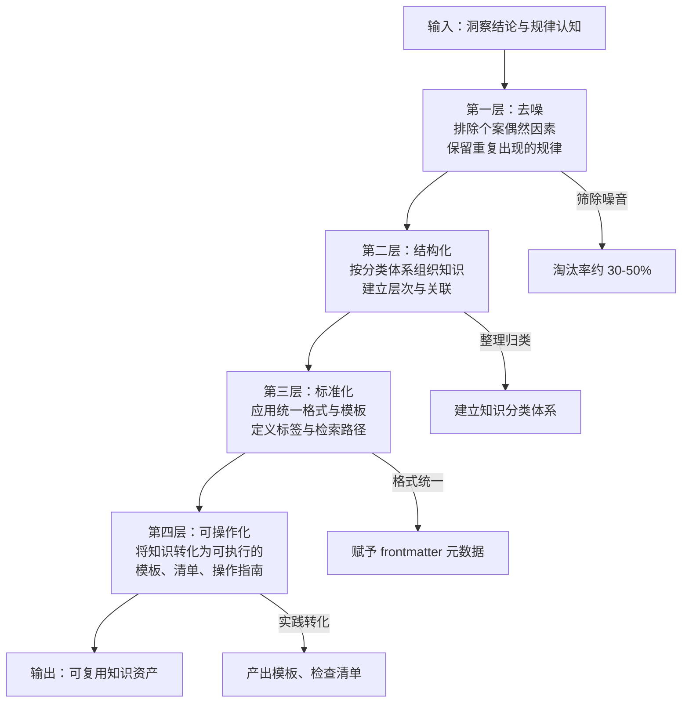

> **来源**：从 `.agents/docs/methodology-analysis-report.md` 第 3.3 节「萃取的漏斗筛滤法」拆分

# 萃取四层漏斗模型（Extraction Four-Layer Funnel）

## 模式类型
方法论模式

## 成熟度
L1 实验性（1 次成功案例：methodology-analysis-report.md 综合方法论分析）

## 适用场景
将洞察结论转化为可复用知识资产的关键加工环节，常见于复盘报告→知识条目的提炼过程。

## 问题背景

洞察环节输出的是"规律认知"，但规律认知与可复用知识之间存在巨大鸿沟。直接搬运洞察到知识库，会导致知识条目"看起来有道理但用不起来"——因为缺少标准化、可检索性、可操作性。

萃取漏斗模型将这一加工过程分解为四个递进的筛滤层，每一层都有明确的筛滤目标和产出标准。

## 核心流程

## 四层详解

### 第一层：去噪

**目标**：排除个案偶然因素，保留具有重复出现概率的规律
**操作**：将洞察中发现的规律放入"可重复性检验"——该规律是否在至少两个独立场景中得到验证？
**判定规则**：
- 在 ≥ 2 个独立场景中得到验证 → 通过
- 仅 1 次出现 → 标记为"待验证假设"
- 孤立的个案发现 → 剔除

**淘汰率参考**：30-50%
**常见误区**：把单次出现的偶然现象当作"普遍规律"。

### 第二层：结构化

**目标**：按分类体系组织知识，建立层次与关联
**操作**：使用预先定义的知识分类体系（如本项目知识库的五分类：操作经验、平台兼容性、故障排查、架构决策、最佳实践），将通过筛选的规律进行归类
**关键操作**：
- 同类规律聚类
- 异类规律建立横向关联
- 同类规律组织为层次结构（如"部署类"下分为"配置管理""环境准备""回滚策略"等子类）

**产出物**：归类完成的规律清单
**常见误区**：分类粒度过粗导致"杂项"类膨胀，或粒度过细导致分类爆炸。

### 第三层：标准化

**目标**：应用统一格式与模板，定义标签与检索路径
**操作**：为每个知识单元套用统一模板，包含：
- 标题
- 分类与标签
- 日期、状态、作者
- 摘要
- 适用范围
- 正反例

**本项目实践**：采用 YAML/TOML frontmatter + Markdown 正文的标准格式，通过自动脚本生成索引
**产出物**：标准化知识条目
**常见误区**：模板字段不统一导致后续自动化索引失效。

### 第四层：可操作化

**目标**：将知识转化为可执行的模板、清单、操作指南
**操作**：把"知道"转化为"做到"。示例：
- - "开发前应确认环境变量" → 5 项环境变量检查清单
- - "大文件应原子化处理" → 原子化处理脚本工具 + 配套使用说明

**产出物**：可执行制品（模板、清单、脚本、流程图）
**常见误区**：可操作化被忽略，知识停留在"原则陈述"层面。

## "四可"质量标准

好的萃取产出应同时满足：

| 标准 | 含义 | 实现方式 |
|------|------|---------|
| **可检索** | 通过标签和索引能找到 | 第三层标准化的元数据 + 自动索引 |
| **可理解** | 独立阅读无需额外背景 | 第二层结构化 + 第四层可操作化的具体示例 |
| **可复用** | 在其他场景中可直接使用或小幅适配 | 第四层可操作化的模板/脚本 |
| **可验证** | 是否有效的判断标准明确 | 正面/反面案例 + 适用/不适用场景 |

## 反模式警示

| 错误做法 | 后果 |
|---------|------|
| 直接把洞察原文搬入知识库 | 缺少去噪和结构化，知识条目包含大量个案噪音 |
| 跳过可操作化层 | 知识停留在"原则陈述"层，使用者无法直接执行 |
| 标准化模板不统一 | 索引生成脚本失效，标签无法对齐 |
| 不进行去噪筛选 | 知识库"熵增"——质量参差不齐，使用成本上升 |

## 与现有模式的关系

- `review-insight-export-loop.md`：本模式是其"萃取"环节的精化——将萃取从抽象描述落实为四层可操作的筛滤流程
- `insight-iceberg-model.md`：本模式的下游消费者——洞察冰山模型的输出进入萃取漏斗
- `fact-statement-consistency-loop.md`：第一层去噪与本模式的"事实一致性"理念一致

> **关联模块**：
> - `review-insight-export-loop.md` — 复盘→洞察→导出知识闭环
> - `export-four-channel-progressive.md` — 导出四渠道递进模型（本模式的下游）
