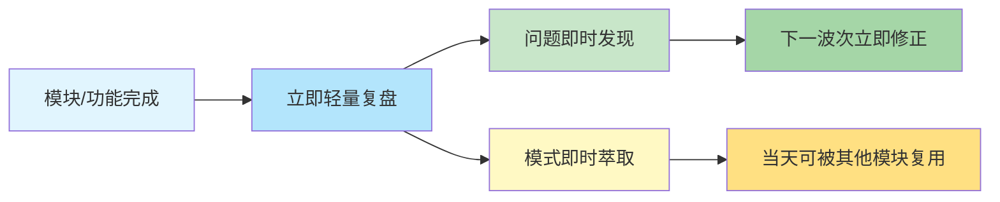

# 即时复盘沉淀模式

## 模式概述

每个独立模块/功能完成后几乎立即产出复盘，而非等到周末/里程碑统一复盘。前提条件是复盘模板和流程必须足够轻量化（四文件标准结构），否则"每次开发后都写复盘"会成为负担而非助力。

## 核心理念

**对比：里程碑统一复盘 vs 即时复盘**

| 维度 | 里程碑统一复盘 | 即时复盘沉淀 |
|------|-------------|------------|
| 上下文新鲜度 | 低——需要回忆几天/几周前的细节 | 高——刚完成的工作记忆清晰，细节不丢失 |
| 反馈即时性 | 低——复盘发现的问题只能下个周期修正 | 高——问题可以在下一波次立即修正 |
| 模式复用时效 | 低——萃取的模式下周/下月才能用 | 高——当天萃取的模式可以当天被其他模块复用 |
| 认知负荷 | 高——需要回忆大量细节，一次复盘很多内容 | 低——每次复盘聚焦单一主题，快速完成 |
| 写作成本 | 高——长篇大论，需要专门时间 | 低——四文件标准结构，填空式写作 |
| 发现问题的价值 | 低——问题已经存在很久，造成了更多损失 | 高——问题刚暴露就被发现，损失最小 |

## 四文件标准结构

每个复盘采用轻量的四文件结构，而非单一大文档：

| 文件 | 用途 | 核心内容 | 行数参考 |
|------|------|---------|---------|
| README.md | 复盘总览 | 背景、核心发现、关键数据、文件索引 | 50-100行 |
| execution-retrospective.md | 执行回顾 | 执行过程、时间线、波次分析、效率数据 | 100-200行 |
| insight-extraction.md | 洞察萃取 | 元洞察、可复用模式、关键数据发现 | 100-200行 |
| export-suggestions.md | 改进建议 | P0/P1/P2行动项、跟进矩阵 | 50-150行 |

**原子化原则**：每个文件聚焦单一职责，通过TOML frontmatter的source字段溯源，通过README.md索引导航。

## Why 有效

1. **上下文新鲜度**：刚完成的工作记忆清晰，细节不丢失。过一周再复盘，很多关键决策点和问题细节已经忘了
2. **反馈即时性**：复盘发现的问题可以在下一波次立即修正（如Mermaid点修复→治理闭环，当天发现当天解决）
3. **模式萃取时效性**：当天萃取的模式可以当天被其他模块复用，形成"做一个模块→沉淀模式→下一个模块复用"的复利效应
4. **降低认知负荷**：不需要事后回忆大量细节，每次复盘聚焦单一主题，10-15分钟就能完成

## 前提条件

即时复盘能够执行的关键是**模板轻量化**：
- ✅ 标准的四文件结构，不需要每次想"复盘应该怎么写"
- ✅ 原子化的文档拆分，每个文件有明确的内容边界
- ✅ 填空式的写作模板，只需要填充具体内容而非构思结构
- ✅ 自动化的索引更新，不需要手动维护多级导航
- ❌ 没有模板的"写个复盘吧"——只会变成负担，最后没人写

## 适用场景与频率

| 场景 | 是否需要即时复盘 | 时机 |
|------|---------------|------|
| 一个独立功能模块完成 | ✅ 必须 | 模块测试通过后立即开始 |
| Bug修复+治理闭环 | ✅ 必须 | 治理闭环完成后立即复盘 |
| 一个完整的工作日结束 | ✅ 建议 | 当日工作结束时做元复盘 |
| 单个小bug修复（5分钟） | ❌ 不需要 | 记录在commit message即可 |
| 大版本/里程碑发布 | ✅ 必须 | 作为多个即时复盘的汇总索引 |

## 反模式

**反模式1：攒到周末/里程碑统一复盘**
- - "这周太忙了，周末一起复盘吧"
- 结果：周末已经忘了周一周二发生了什么，复盘变成"流水账"，关键洞察丢失

**反模式2：复盘写成长篇大论**
- 一个复盘写5000字，面面俱到
- 结果：写作成本太高，下次不想写了；读者也找不到重点

**反模式3：为了复盘而复盘**
- 任务刚做到一半就停下来写复盘
- 结果：打断工作流，上下文被破坏；而且工作还没做完，也没什么好复盘的

**反模式4：复盘完就存档，没人看**
- 复盘写完就扔到docs/目录里，不复用、不行动
- 结果：复盘变成"写了就等于做了"的形式主义，行动项没人跟进

## 验证案例

**案例1：2026-06-29 SpecWeave治理基建日（本次验证）**
- 当日产出11份专项复盘报告
- 覆盖Mermaid、阶段守卫、vendor调整、论坛自动化、数据安全、RACI等所有主要模块
- 萃取5个元洞察，当天B1（规范定义）就复用了治理四层递进模型
- Mermaid问题在波次1点修复→波次2发现二次问题→立即复盘根因→当天完成治理闭环

**案例2：全面复盘+论坛跟帖任务**
- 任务完成后立即产出四文件复盘
- 萃取SPA框架DOM操作、同名按钮消歧等4个可复用模式
- 当天更新forum-automation.md知识库到v2版本

## 实施检查清单

- [ ] 完成一个独立模块/治理闭环后，立即启动复盘，不拖延
- [ ] 使用标准四文件结构（README/execution/insight/suggestions）
- [ ] 控制单份复盘的写作时间在10-15分钟
- [ ] 洞察萃取聚焦"可复用模式"，而非"发生了什么"
- [ ] 改进建议必须有明确的优先级、责任人、验收标准
- [ ] 复盘完成后立即更新索引，确保可被检索
- [ ] 下一波次工作时，先查阅相关复盘的模式和建议
- [ ] 日终做元复盘，整合当日所有专项复盘的发现

> 来源：来自 retrospective-daily-20260629 洞察5
> 关联模式：[retrospective-four-step-method.md](retrospective-four-step-method.md)（复盘四步法）、[meta-retrospective-two-round-method.md](meta-retrospective-two-round-method.md)（元复盘两轮法）、[insight-library-evolution.md](insight-library-evolution.md)（洞察库演进）、[knowledge-compound-interest.md](knowledge-compound-interest.md)（知识复利效应）
