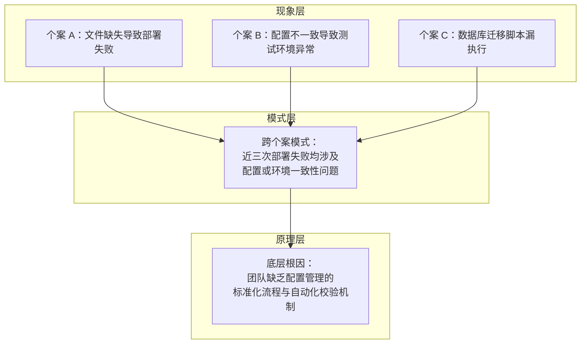

> **来源**：从 `.agents/docs/methodology-analysis-report.md` 第 3.2 节「洞察的三层分析法」拆分

# 洞察冰山模型（Insight Iceberg Model）

## 模式类型
方法论模式

## 成熟度
L1 实验性（1 次成功案例：methodology-analysis-report.md 综合方法论分析）

## 适用场景
从多个项目复盘报告中萃取跨项目的规律认知，识别"为什么这会反复发生"的底层机制。

## 问题背景

复盘往往停留在"现象描述"层面——"这次部署失败是因为配置文件缺失"。但单次现象的解释力有限，无法回答"为什么这种现象反复出现"。洞察环节的核心目标就是穿透现象、识别模式、揭示原理。

冰山模型借鉴了认知科学的层次划分思想，将洞察过程分解为现象层、模式层、原理层三个递进层次，每一层有明确的"完成标准"和"产出物"。

## 三层分析框架

## 三层详解

### 现象层（Phenomenon Layer）

**焦点**：每个具体偏差的事实记录
**操作**：逐一列举复盘中发现的每一个具体偏差，确保每条事实都有对应的数据支撑
**关键问题**："发生了什么"是现象层分析的唯一焦点
**完成标准**：无遗漏地记录了所有关键偏差
**产出物**：现象清单（按时间线或主题归类的偏差条目）

### 模式层（Pattern Layer）

**焦点**：跨案例的共性规律
**操作**：
- **同类归并**：将相似的现象聚合成模式
- **异类对比**：将看似矛盾的现象进行对照分析以发现隐藏的调节变量

**关键问题**：
- 是否有多个偏差指向同一个根因？
- 是否在不同项目中反复出现相似的偏差模式？
- 是否存在看似矛盾的现象（如"有时快有时慢"），这可能揭示了某个隐藏的调节变量？

**完成标准**：每个模式附带支持的案例数量和典型案例引用
**产出物**：模式识别清单（含案例支撑）

### 原理层（Principle Layer）

**焦点**：模式背后的系统性原因
**操作**：追问"为什么这个模式会存在"，直至触及底层机制
**关键问题**：
- 这个模式背后的系统性原因是什么？
- 如果改变某些前提条件，模式是否会消失？
- 这个模式在其他领域是否也存在（跨领域验证）？

**完成标准**：原理可以被验证（证实或证伪），且具有跨情境的解释力
**产出物**：原理陈述（因果逻辑链 + 触发条件 + 适用范围）

## 关键转折点

| 转折 | 触发条件 | 操作含义 |
|------|---------|---------|
| 现象 → 模式 | 样本量积累 | 单个案例只能产生假设，三个以上相似案例才具备形成模式的条件 |
| 模式 → 原理 | 机制揭示 | 不仅知道"什么会发生"，还知道"为什么会发生"以及"在什么条件下不会发生" |

## 高质量洞察的三个特征

| 特征 | 说明 |
|------|------|
| 跨情境性 | 洞察不仅解释当前案例，还能迁移到其他类似情境 |
| 可验证性 | 洞察可以被后续的事实数据证实或证伪 |
| 杠杆效应 | 一个深度的洞察可以引发一系列后续行为的改变 |

## 反模式警示

| 错误做法 | 后果 |
|---------|------|
| 停留在现象层，声称"已经洞察" | 实际上是复盘的简单重述，无跨案例解释力 |
| 模式识别缺少案例支撑 | 模式可能是个案巧合，缺乏普适性 |
| 原理揭示缺少可验证性 | 原理沦为不可证伪的玄学陈述 |
| 跨领域验证缺失 | 原理可能仅适用当前领域，迁移性受限 |

## 与现有模式的关系

- `review-insight-export-loop.md`：本模式是其"洞察"环节的精化——将洞察从抽象描述落实为可操作的三层分析
- `retrospective-four-step-method.md`：本模式的下游消费者——复盘四步法的"提炼经验"步骤的输出进入洞察环节

> **关联模块**：
> - `review-insight-export-loop.md` — 复盘→洞察→导出知识闭环
> - `extraction-four-layer-funnel.md` — 萃取四层漏斗模型（本模式的下游）
