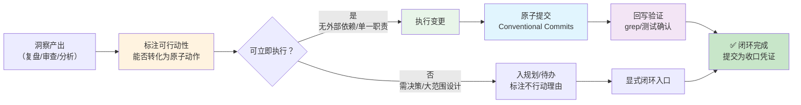

# 洞察到行动的闭环（Insight-to-Action Closed Loop）

## 模式类型
方法论模式（复盘/分析知识落地工作流）

## 成熟度
L1 实验性（1 次成功案例：mystx 品牌重命名清理——洞察发现品牌残留直接转化为清理动作并原子提交）

## 适用场景

| 场景 | 是否适用 | 说明 |
|------|---------|------|
| 复盘发现可执行问题 | ✅ 核心场景 | 品牌污染、断链、配置漂移等可直接修复的问题 |
| 代码审查发现缺陷 | ✅ 核心场景 | 审查意见能落为原子修复提交 |
| 安全审计发现漏洞 | ✅ 核心场景 | 从漏洞发现到修复提交的闭环 |
| 性能 profiling 发现瓶颈 | ✅ 核心场景 | 从瓶颈定位到优化提交的闭环 |
| 需跨团队决策的洞察 | ❌ 不适用 | 应先入规划/待办，不强行立即行动 |
| 大范围设计变更 | ❌ 不适用 | 需要设计与评审，不适合当作原子动作 |

## 问题背景

复盘/分析常陷入一种「假闭环」：产出报告文件后即宣告完成，但报告中的洞察从未转化为任何代码/配置/行为变更。其本质是把「写报告」等同于「完成任务」——洞察停留在文档层，没有改变系统本身。

假闭环的代价是非线性的：

1. **价值归零**：复盘的核心价值是「改进系统」，而非「描述系统」。只描述不改进的复盘，投入了分析成本却未产生改进收益。
2. **信任透支**：多次「分析了但没改」之后，团队对复盘的价值预期下降，后续复盘更难获得执行资源。
3. **债务复利**：已发现的问题若不修复，会持续产生损失；问题被「记录在案」反而给人「已经处理了」的错觉。

**根本原因**：复盘链路在设计上以「导出报告」为终点，缺少「导出变更」的第二出口。洞察与行动之间没有强制衔接机制。

## 核心步骤

1. **洞察阶段标注「可行动性」**：每条洞察显式判断能否转化为原子动作（单一职责、可独立验证），而非默认「先记录再说」。
2. **筛选可立即执行项**：挑出无外部依赖、单一职责、验收标准清晰的洞察；跨团队决策或大范围设计变更从「立即行动」中剔除。
3. **执行变更**：直接修改代码/配置，分析与修复隶属同一里程碑，不额外走规划流程。
4. **原子提交**：遵循 Conventional Commits，一次提交只做一件事，提交信息说明「为什么改」。
5. **回写验证**：用 grep/测试确认问题已消除、闭环已闭合，以「提交成功」作为收口凭证。

## 反模式警示

| 错误做法 | 后果 | 正确做法 |
|---------|------|---------|
| 洞察只产出文档、不落为行动（假闭环） | 分析成本打了水漂，问题持续产生损失，还给团队「已处理」的错觉 | 每条洞察要么转化为可验证动作，要么显式标注「不行动」及理由 |
| 行动项过大、无法独立验证 | 无法判断「做完了」，一个阻塞项拖累整组行动 | 拆分到单一职责、可独立验收的原子粒度 |
| 提交混入多个无关变更 | 难以回溯、难以回滚、审查困难 | 一次提交只做一件事，遵循 Conventional Commits |
| 把「需决策/大范围变更」当作立即行动硬做 | 缺少评审与设计，产出有缺陷的方案 | 显式分流到规划/待办，不强行立即行动 |

## 失败案例（V2 成功偏误防御）

| 案例 | 失败表现 | 根因 | 教训 |
|------|---------|------|------|
| 「报告即完成」假闭环（复盘产出与行动脱节） | 复盘报告清楚列出 N 条修复建议，但每条无 Owner、无验收标准、未关联任何提交；数周后同一类缺陷/事故再次出现，报告仍停留在文档层 | 复盘链路以「导出报告」为唯一终点，缺少「导出变更」第二出口；洞察与修复之间没有原子动作衔接机制 | 每条可行动洞察必须显式分流——要么转化为带 Owner/验收标准的原子提交，要么显式标注「不行动」及理由，杜绝悬空建议 |

## 边界条件

- **不适用**：需跨团队决策的洞察、大范围设计变更、涉及历史版本兼容的变更（需保留别名/迁移策略）。
- **适用前提**：问题具备原子修复条件——单一职责、无外部依赖、验收标准客观可判定。

## 检验标准

- [ ] 每条洞察都有一个明确去向：转化为原子动作，或显式标注「不行动」及理由。
- [ ] 行动项含 Owner 与验收标准，并跟踪到具体提交。
- [ ] 提交后 grep/测试确认问题已消除（如品牌残留扫描返回 0 匹配）。

## 迁移验证

| 来源场景 | 迁移场景 | 映射关系 |
|---------|---------|---------|
| mystx 品牌重命名（复盘发现品牌污染 → 清理 → 提交） | 安全审计发现漏洞 → 修复提交 | 洞察 = 漏洞定位，行动 = 修复，提交 = 收口 |
| 同上 | 性能 profiling 发现瓶颈 → 优化提交 | 洞察 = 瓶颈定位，行动 = 优化，提交 = 收口 |
| 同上 | 代码审查发现缺陷 → 修复提交 | 洞察 = 审查意见，行动 = 修复，提交 = 收口 |

## 验证来源

- **验证1：mystx 品牌重命名清理**（2026-08-20）：分析阶段洞察 I-1 发现品牌污染（16 处 `xyzstyle`/`XYZStyle` 残留，跨 6 文件），在未新增规划的前提下直接转化为清理动作，遵循 Conventional Commits 原子提交 `c5cda53`（`docs: 清理 xyzstyle 旧品牌名残留为 mystx`），提交后 grep 返回 0 匹配，完成「发现问题→解决问题→沉淀提交」闭环。

## 与现有模式的关系

- `review-insight-export-loop.md`：复盘→洞察→导出（知识资产）闭环；本模式是其「导出为代码变更」的第二出口，两者互补构成完整闭环（知识资产 + 代码变更双出口）。
- `actionable-suggestion-five-elements.md`：本模式第 1/2 步（标注可行动性、筛选可执行项）依赖该模式定义的建议可执行性五要素。
- `immediate-retrospective-sedimentation.md`：其反模式 4（复盘完就存档没人看）与本模式「假闭环」反模式同源。
- `closed-loop-pdca-mapping.md`：本模式是闭环映射在「行动落地（Do）」维度的特化。