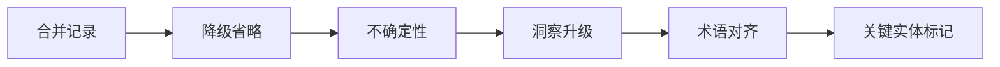

> **来源**：从 `retrospective-minitest-ecosystem-20260707` 复盘报告中提炼

# 整合阶段信息显性化模式（Integration Notes Explicitness Pattern）

## 模式类型
复盘知识模式

## 成熟度
L1 实验性（1 次成功案例：integration-notes-template.md 模板创建）

## 适用场景
所有多子代理整合任务，特别是涉及5个以上子代理的中大规模分析任务。

## 问题背景

多子代理整合任务中，主控代理的信息取舍决策（哪些合并、哪些省略、哪些升级为洞察）是隐性知识：
- 整合过程中的判断标准未记录
- 后续任务无法复用整合经验
- 团队成员无法理解"为什么这么取舍"

## 核心流程

## 六个维度详解

### 1. 合并记录

**操作要点**：记录哪些发现因重叠被合并及合并依据。

**产出物**：合并决策表（来源任务、合并内容、合并依据、合并后位置）

### 2. 降级省略

**操作要点**：记录哪些细节因粒度问题被降级为引用或直接省略及原因。

**产出物**：降级决策表（来源任务、原内容、处理方式、原因说明）

### 3. 不确定性

**操作要点**：记录哪些判断存在不确定性或需要后续验证。

**产出物**：待验证清单（来源任务、不确定内容、当前处理方式、验证方式）

### 4. 洞察升级

**操作要点**：记录哪些发现因符合升级标准被提升为核心洞察。

**产出物**：洞察升级表（升级标准、原始发现、升级后洞察、升级理由）

### 5. 术语对齐

**操作要点**：记录整合阶段统一的术语和命名约定。

**产出物**：术语对照表（原始术语、统一后术语、适用范围）

### 6. 关键实体标记

**操作要点**：记录子代理标记的关键实体（API/配置/事件/模块名）及其交叉引用。

**产出物**：关键实体表（实体类型、实体名称、涉及任务、关联关系）

## 验证案例

| 案例 | 效果 |
|------|------|
| integration-notes-template.md 创建 | 模板已创建，可用于后续多子代理整合任务 |

## 关键启示

整合过程中的隐性知识（"为什么这么取舍"）是团队最宝贵的资产之一，应该通过标准化模板显性化。
