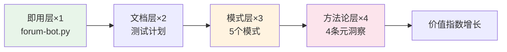

# 知识沉淀复利模型（Knowledge-Compound-Interest）

## 模式类型
方法论模式

## 成熟度
L1 已提炼（首次从综合复盘中萃取，待独立验证）

## 适用场景
当需要评估工程活动的投入产出比，或决定工作流中各阶段的时间分配时。

## 问题背景
传统工程管理将"编码实现"视为核心产出，将"复盘萃取"视为辅助活动。但实际上，编码实现的产出（具体工具）复用范围有限，而复盘萃取的产出（可复用模式）复用范围呈指数级增长。缺乏一个模型来量化这种差异，导致复盘萃取的时间投入不足。

## 核心模型

```
知识资产价值 = 基础产出 × 抽象层级^复用次数
```

| 产出层次 | 抽象层级 | 复用范围 | 价值系数 | 不可替代性 |
|---------|---------|---------|---------|-----------|
| 即用层（具体工具） | 1 | 单场景 | ×1 | 可被替代 |
| 文档层（说明文档） | 2 | 团队参考 | ×2 | 部分可替代 |
| 模式层（可复用模式） | 3 | 跨场景 | ×3 | 难以替代 |
| 方法论层（元洞察） | 4 | 跨领域 | ×4 | 不可替代 |



## 标准实施步骤

### 步骤1：识别产出层次
对工作流中的每个产出，判断其所属层次：
- 可直接运行/使用 → 即用层
- 可供他人阅读参考 → 文档层
- 可跨场景复用 → 模式层
- 可跨领域指导 → 方法论层

### 步骤2：评估时间投入产出比
```
ROI = 产出价值 / 时间投入 = (基础产出 × 抽象层级^复用次数) / 时间
```

### 步骤3：优化时间分配
- 即用层产出：保持必要投入，但不过度优化
- 模式层产出：主动投入15-20%时间（复盘萃取）
- 方法论层产出：在综合复盘时投入，提炼元洞察

## 关键要点

1. **工具是消耗品，模式是资产，方法论是杠杆**
2. **复盘萃取是唯一能将低层级产出"升级"为高层级产出的活动**
3. **每个工作流应预留15-20%时间用于复盘萃取**——这是ROI最高的工程活动
4. **抽象层级的提升需要刻意练习**——从"做了什么"到"为什么这样做"到"如何指导别人做"

## 成功案例

| 工作流 | 即用层 | 模式层 | 方法论层 | 复盘时间占比 | 最高ROI活动 |
|--------|--------|--------|---------|-------------|------------|
| 论坛自动化 | forum-bot.py | 5个模式 | 4条元洞察 | 15% | 复盘萃取 |

## 适用边界

- **适用于**：需要评估工程活动ROI、优化时间分配的场景
- **不适用于**：紧急修复（无时间复盘）；纯探索性任务（无明确产出）

> **关联模块**：
> - `three-tier-knowledge-sedimentation.md` — 三层知识沉淀（本模型的分层基础）
> - `methodology-five-level-maturity.md` — 方法论五级成熟度（模式层的成熟度评估）
