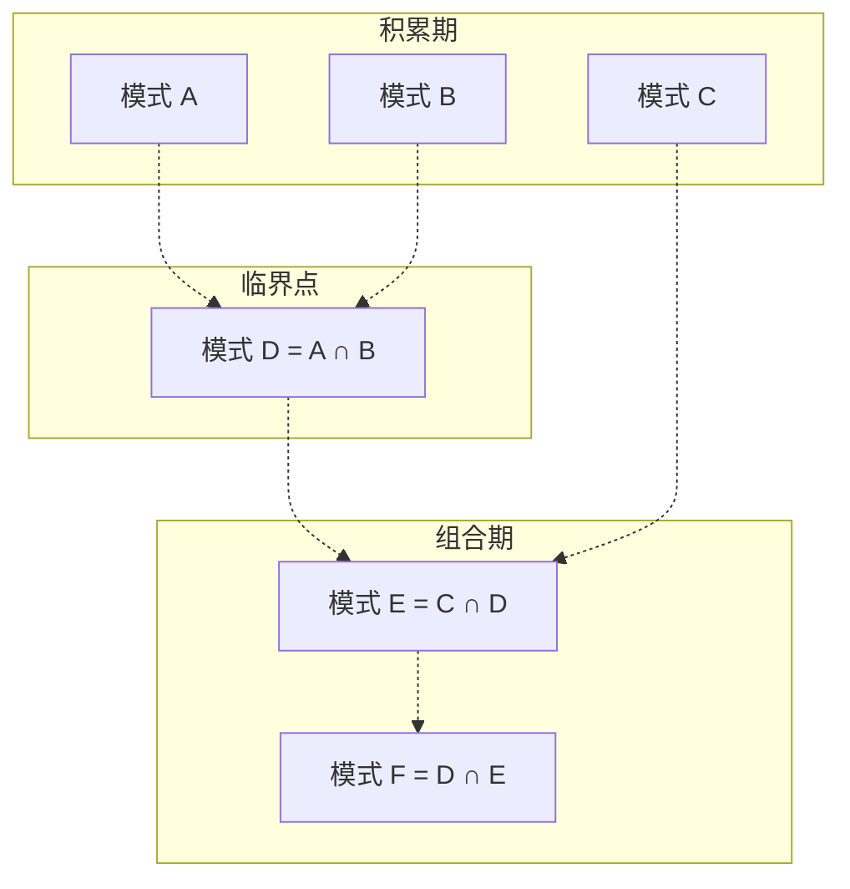

> **来源**：从 `docs/retrospective/reports/retrospective-comprehensive-20260623/insight-extraction.md` 三、3.1 发现二 + 3.2 规律三 合并拆分

# 方法论临界质量效应（Methodology Critical Mass Effect）

## 模式类型
方法论模式

## 成熟度
L1 实验性（1 次成功案例：本项目方法论模式从 0→6→22→29 的演进）

## 适用场景
构建方法论模式库或知识体系时，用于评估当前所处的知识生产阶段，预判未来的模式增长速度。

## 问题背景

方法论模式的积累并非线性过程。在模式数量较少时（< 6），新模式的产生依赖外部输入（每次复盘产生 1-2 个新洞察）；当模式突破某个阈值后，新模式开始通过现有模式的交叉组合自发生成——知识生产从"线性累积"跃迁至"组合爆炸"阶段。

识别这个临界点有助于合理分配资源：在临界质量前，重点在大量复盘和外部输入；在临界质量后，重点在模式组合和体系收敛。

## 核心机制

### 临界质量阈值

| 阶段 | 模式数量 | 知识生产方式 | 新模式来源 |
|------|---------|-------------|-----------|
| **积累期** | 0-5 | 线性累积 | 每次复盘产生 1-2 个新模式 |
| **临界点** | 6 | 首次交叉组合出现 | 单个新模式来自 2+ 个已有模式的交叉 |
| **组合期** | 7-20 | 组合爆炸 | 50%+ 的新模式来自已有模式交叉 |
| **收敛期** | 20+ | 模式覆盖饱和 | 新增模式以补充边界为主，已有覆盖率达 30%+ |

### 交叉组合机制



## 本案例验证

**临界质量触发**：本项目方法论模式达到 6 个后（spec-driven-development / review-insight-export-loop / document-system-refactoring / three-tier-governance / tool-automation-decision-model），出现了第一个交叉模式——`fact-statement-consistency-loop`（review-insight-export-loop + three-tier-governance 的结合体）。

后续交叉模式的持续涌现验证了此效应：
- `convention-driven-creation` = spec-driven-development + document-system-refactoring
- `structure-first-extension` = convention-driven-creation 在代码级的实例化
- `diff-driven-refactoring` = structure-first-extension + 差异分析方法论
- `progressive-templating` = convention-driven-creation 在模板化场景的特化

### 知识复利曲线

```
阶段一（0-6 个模式）：每个新模式需要 1-2 份独立复盘驱动
阶段二（6-20 个模式）：每个新模式需要 0.5-0.8 份复盘驱动（交叉组合）
阶段三（20+ 个模式）：模式自发生成（现有模式交叉），外部复盘需求递减
```

**本项目当前状态**：29 个方法论模式，处于阶段三初期——已有覆盖率达 25%，新增模式中有约 50% 仍来自复盘报告的洞察提取。

## 判断你的项目所处阶段

- [ ] 模式数量 < 6 → 积累期：重点在高质量复盘，每个复盘后强制萃取
- [ ] 模式数量 6-20 → 组合期：关注模式之间的关联，主动寻找交叉机会
- [ ] 模式数量 > 20 → 收敛期：建立"已有覆盖"检查机制，避免冗余模式

## 与已有覆盖率的联合信号

| 模式数 | 已有覆盖率 | 信号 | 行动 |
|--------|----------|------|------|
| < 6 | < 20% | 积累期正常 | 继续高质量复盘萃取 |
| 6-20 | 20-40% | 组合期加速 | 关注交叉组合机会 |
| > 20 | 25-50% | 收敛期 | 审视是否需要补充边界 |
| > 30 | > 50% | 体系接近饱和 | 以补充边界为主，减少新建 |

## 与现有模式的关系

- `retrospective-acceleration-effect.md`：描述单会话内的知识密度加速，本模式描述跨会话跨时间的知识生产加速——两者构成时间维度的"微观/宏观"互补
- `atomization-three-tier-classification.md`：临界质量后"已有覆盖"率提升，三级分类中"已有覆盖"分支的使用频率上升

> **关联模块**：
> - `retrospective-acceleration-effect.md`
> - `atomization-three-tier-classification.md`
> - `fact-statement-consistency-loop.md`
