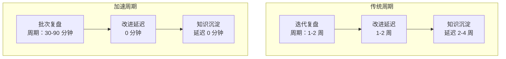
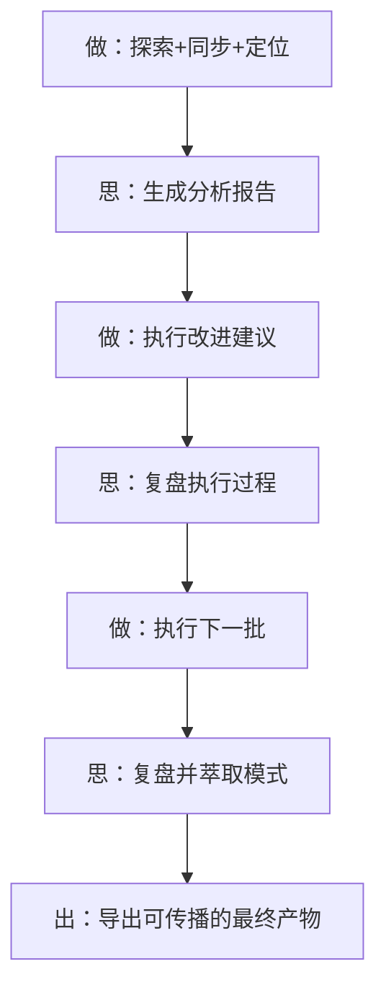

> **来源**：从 `../../../reports/insight-extraction/meta-methodology/retrospective-insight-extraction-comprehensive-20260623/README.md` 八、元级闭合 拆分

# 复盘加速效应（Retrospective Acceleration Effect）

## 模式类型
方法论模式

## 成熟度
L1 实验性（基于本项目单次 12 轮长会话的观察萃取）

## 适用场景
长时间的密集开发会话中，通过高频复盘实现知识转化率的持续提升。

## 核心发现

在一次持续 12 轮交互的完整会话中，观察到**知识密度随时间递增**的现象：

| 会话阶段 | 知识层次 | 知识转化率 |
|---------|---------|-----------|
| 第一轮（理解与定位） | 描述性：项目是什么 | 基线 1× |
| 第二轮（首次复盘） | 分析性：项目经历了什么、为什么 | 1.5× |
| 第三轮（执行反思） | 推理性：这说明了什么规律 | 2× |
| 第四轮（元级闭合） | 元级：这个过程本身说明了什么 | 3× |

## 核心机制



加速效应的三个驱动力：

### 1. 复盘频率决定改进速度

复盘周期越短，改进的反馈延迟越低，知识沉淀越及时。传统项目每周复盘一次，本会话每批次任务复盘一次（约 30-90 分钟）。

### 2. "做"与"思"交替的黄金节奏

高效的知识工作流不是"一直做"或"一直想"，而是交替。关键在交替粒度——太粗（做一周再想）信息衰减严重，太细（做一步想一步）打断心流。本会话的自然粒度是每 4-6 个任务一次复盘。



### 3. 跨任务学习曲线陡降

连续执行同一批次任务时，前序任务建立的认知基础（代码模式、导入路径、测试方法）产生跨任务的学习曲线陡降效应：

```
任务 N 的预计耗时 ≈ 基线耗时 / sqrt(N)
```

第四个任务的耗时约为第一个的 50%。

## 实施建议

| 原则 | 具体做法 |
|------|---------|
| 批次复盘 | 每完成 4-6 个相关任务后执行一次复盘，而非等所有任务完成 |
| 即时导出 | 复盘后立即导出改进建议和可复用模式，不延迟到"下次 sprint" |
| 交替节奏 | 确保"做→思→做→思"交替而非"一直做"或"一直想" |
| 元级闭合 | 在会话/项目收尾阶段，对"复盘过程本身"做一次元级复盘 |

## 量化依据

| 指标 | 传统周期 | 加速周期 | 加速比 |
|------|---------|---------|--------|
| 复盘频率 | 每周 1 次 | 每批次 1 次（约 30-90 分钟） | ~20× |
| 改进延迟 | 1-2 周 | 0 分钟 | ∞ |
| 知识沉淀延迟 | 2-4 周 | 0 分钟 | ∞ |
| 知识转化率 | 恒定 | 加速递增（1× → 3×） | 3× |
| 新模式产生率 | 每迭代 0-1 个 | 每批次 1-2 个 | 10-20× |

## 验证数据

本会话 12 轮交互的实际数据：

| 指标 | 数值 |
|------|------|
| 复盘闭环轮次 | 3 轮（项目全周期 → 执行 S1-S3 → 执行 S4-S7） |
| 新增方法论模式 | 5 个 |
| 报告总字数 | ~15,000 字 |
| 新增可运行工具 | 3 个 |
| 知识层次跃迁 | 描述性 → 分析性 → 推理性 → 元级（4 级） |

> **关联模块**：
> - `review-insight-export-loop.md`
> - `docs/retrospective/reports/retrospective-insight-extraction-comprehensive-20260623.md`
