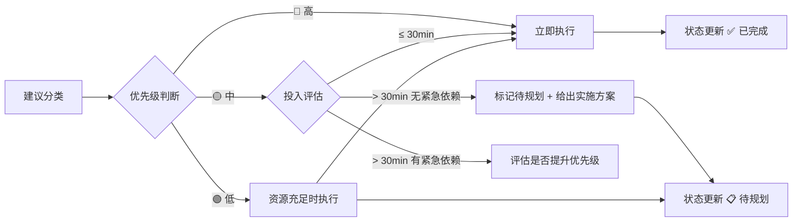

# 建议执行优先级驱动模型（suggestion-priority-driven-execution）

## 模式类型
方法论模式

## 成熟度
L2 已验证（本次任务 4 个建议 100% 按优先级执行）

## 适用场景
复盘报告中的改进建议执行，或其他需要按优先级驱动行动的场景。

## 问题背景
复盘报告通常产出多条改进建议，若无明确的优先级驱动机制，容易导致：
- 高优先级建议被低优先级建议阻塞
- 大投入建议强行执行导致资源错配
- 建议执行状态无追踪，后续无法复盘

## 操作流程

### 步骤 1：建议分类

| 优先级 | 符号 | 判断标准 |
|--------|------|---------|
| 高 | 🔴 | 影响核心规则、安全、系统稳定性 |
| 中 | 🟡 | 影响效率、可维护性、用户体验 |
| 低 | 🟢 | 影响文档化、美观性、非核心功能 |

### 步骤 2：执行决策

| 投入估算 | 决策 | 状态标记 |
|---------|------|---------|
| ≤ 30min | 立即执行 | ✅ 已完成 |
| > 30min 且无紧急依赖 | 延期执行，给出实施方案 | 📋 待规划 |
| > 30min 且有紧急依赖 | 评估是否提升优先级 | 🔄 进行中 |

### 步骤 3：状态更新

每执行一个建议后立即更新报告中的状态：

| 状态 | 符号 | 含义 |
|------|------|------|
| 已完成 | ✅ | 建议已执行，记录执行结果 |
| 待规划 | 📋 | 建议有实施方案但暂不投入 |
| 已关闭 | ❌ | 建议不再执行，记录关闭原因 |
| 进行中 | 🔄 | 建议正在执行 |

## 关键要点

1. **延期 ≠ 放弃**：待规划状态表示建议有实施方案但暂不投入，而非放弃执行
2. **投入估算先于执行**：避免大投入建议强行执行导致资源错配
3. **状态追踪闭环**：每执行一个建议后立即更新报告状态，形成追踪闭环

## 成功案例

| 任务 | 建议数 | 高优先级执行 | 中优先级执行 | 低优先级执行 | 待规划 |
|------|--------|-------------|-------------|-------------|--------|
| 改进建议执行 | 4 | 1/1 ✅ | 1/2 ✅ + 1 📋 | 1/1 ✅ | 1 |

## 反例警示

| 错误操作 | 后果 |
|---------|------|
| 不区分优先级，按顺序执行 | 高优先级建议可能被低优先级阻塞 |
| 大投入建议强行执行 | 资源错配，可能阻塞其他紧急任务 |
| 建议执行后不更新状态 | 后续无法追踪，报告失去行动价值 |

> **关联模块**：
> - `report-as-tracking.md` — 报告即追踪载体（状态追踪层互补）