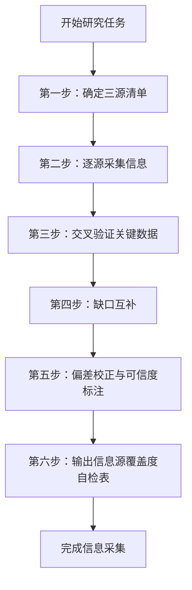
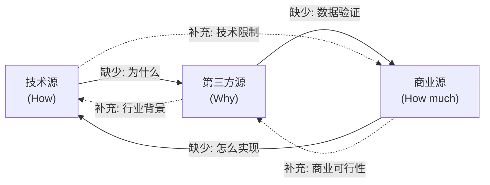

> **来源**：Firecrawl 系统学习复盘（洞察8）+ 架构优先级评估复盘（洞察E）双重实践验证
> **验证次数**：2次（Firecrawl学习、架构优先级评估均实践此方法）

# 三源信息三角验证法 SOP

## 模式类型
方法论模式（研究方法论）

## 成熟度
L2 已验证（2次成功实践，形成标准化操作流程）

## 适用场景

| 场景 | 是否适用 | 说明 |
|------|---------|------|
| 外部开源产品/技术学习 | ✅ 核心场景 | 本次 Firecrawl/DeerFlow 学习均适用 |
| 竞品分析/竞品研究 | ✅ 核心场景 | 多源交叉验证竞品数据 |
| 架构评估/技术选型调研 | ✅ 核心场景 | 架构决策三角验证（本方法的扩展版） |
| 技术方案调研 | ✅ 适用 | 需验证技术可行性+商业可行性+社区反馈 |
| Bug排查/问题诊断 | ⚠️ 部分适用 | 可借鉴"交叉验证"思路，但信息源不同 |
| 内部代码重构 | ❌ 不适用 | 代码是事实本身，无需多源验证 |

## 问题背景

单一信息源存在系统性偏差：
- **只读官方文档/GitHub**：了解技术实现（How），但不知道商业模式（How much）和战略意图（Why）；且官方文档可能夸大优势
- **只读定价页/商业材料**：知道价格和客户案例，但不知道技术限制和真实能力边界
- **只读第三方评论/公众号**：理解行业判断和趋势分析，但缺少技术细节和一手数据验证

三角验证法通过强制覆盖三类互补信息源，消除单一来源的系统性偏差，形成完整认知三角。

## 核心流程



---

## 六步详解

### 第一步：确定三源清单

**操作要点**：在开始采集前，明确列出本次研究的三类信息源。

**三源分类标准**：

| 源类型 | 回答问题 | 典型来源 | 在外部产品研究中 | 在架构评估中（扩展版） |
|--------|---------|---------|----------------|---------------------|
| **技术源（T）** | How？怎么做的？ | GitHub、官方文档、API Reference、源码、技术博客 | GitHub仓库、README、SELF_HOST.md、SDK文档 | 代码实际状态（读源码、看文件结构） |
| **商业源（B）** | How much/Who？多少钱/谁在用？ | 定价页、产品主页、Case Study、FAQ、更新日志 | 定价页面、产品功能介绍 | 使用痛点（实际执行中的摩擦和问题） |
| **第三方源（S）** | Why/So what？为什么/什么趋势？ | 行业评论、独立评测、社区讨论、公众号、Hacker News | 微信公众号深度解读、社区评测 | 外部标杆（竞品/优秀实践参照） |

**产出物**：三源清单（每个源至少1个具体URL/文档路径）
**强制要求**：三类源必须各至少有1个来源，缺一类则不得进入下一步。
**常见误区**：用搜索引擎结果页面代替具体源——必须落实到具体文档/页面。

---

### 第二步：逐源采集信息

**操作要点**：分别从每个信息源采集信息，做好来源标注。

**采集规则**：
1. **每个关键事实必须标注来源**：在笔记中用 `[T]`/`[B]`/`[S]` 标记信息来源类型
2. **逐源采集而非逐主题采集**：先完整读完一个源，再读下一个，避免来回切换导致信息污染
3. **记录原始表述**：对于关键数据点（如Star数、定价、API端点），记录原文而非自己的转述
4. **遇到矛盾先记录不评判**：如果不同源对同一事实的描述有矛盾，先记录下来，留到第三步处理

**推荐采集顺序**：技术源 → 商业源 → 第三方源
（技术源建立事实基础，商业源补充商业化维度，第三方源提供分析视角）

**产出物**：按来源分类的原始信息笔记
**常见误区**：边采集边分析——采集阶段只记录事实，分析在后续步骤进行。

---

### 第三步：交叉验证关键数据

**操作要点**：识别关键数据点，检查是否在多个源中得到确认。

**关键数据点定义**：
- 量化指标（Star数、用户数、定价金额、API限制数）
- 核心能力声明（"支持XXX"、"96%覆盖率"）
- 战略方向判断（"面向AI Agent"、"Keyless模式"）

**验证规则**：

| 验证情况 | 可信度 | 处理方式 |
|---------|--------|---------|
| 三源均确认 | 🟢 高 | 直接采用，作为核心论据 |
| 两源确认 | 🟡 中 | 可以采用，但在报告中标注"经两个源确认" |
| 仅单源提及 | 🔴 低 | 必须明确标注"仅来自单一来源"，不作为核心论据 |
| 源间矛盾 | ⚠️ 需判定 | 分析矛盾原因（时间差？立场不同？），取更新/更权威的源 |

**Firecrawl实践案例**："1000次免费额度"这一数据在GitHub FAQ、定价页、公众号三个源中都有提及，可信度高。

**产出物**：关键数据点验证清单（含可信度标注）
**常见误区**：将单源信息当作已验证事实使用。

---

### 第四步：缺口互补

**操作要点**：识别每个源未覆盖的信息维度，由其他源补充。

**互补关系**：



**操作检查清单**：
- [ ] 技术源是否说明了"为什么这么设计"？如果没有，第三方源是否有解释？
- [ ] 商业源是否说明了"技术上怎么实现"？如果没有，技术源是否有细节？
- [ ] 第三方源的判断是否有技术/商业数据支撑？如果没有，是否找到了支撑数据？
- [ ] 三个源合起来是否覆盖了 How / How much / Why 三个维度？

**产出物**：缺口互补记录（标注哪些信息由哪个源补充）
**常见误区**：认为"信息越多越好"——关键是维度互补而非数量堆砌。

---

### 第五步：偏差校正与可信度标注

**操作要点**：识别各源的立场偏差，在最终输出中校正并标注可信度。

**各源典型偏差**：

| 源类型 | 典型偏差 | 校正方法 |
|--------|---------|---------|
| 技术源（官方） | 夸大优势、弱化缺陷、宣传未来功能 | 用第三方源的独立评测校验；对"即将支持"类描述打折扣 |
| 商业源（官网） | 选择性展示、美化数据、隐藏限制 | 用技术源的实际文档（如SELF_HOST.md）校验能力边界 |
| 第三方源（评论） | 可能过度解读、信息过时、夹带私货 | 用技术/商业源的一手数据验证事实判断 |

**可信度标注规范**：
- 🟢 高可信度：三源/两源确认的事实
- 🟡 中可信度：单源但来源权威（如官方文档明确说明）
- 🔴 低可信度：单源且来源非权威、或源间矛盾无法判定
- ⚪ 待验证：重要但当前无法验证的数据点，标记后待补充

**产出物**：可信度标注完整的认知笔记
**常见误区**：追求"所有信息都高可信度"——承认不确定性比假装确定更有价值。

---

### 第六步：输出信息源覆盖度自检表

**操作要点**：在研究报告末尾附上信息源覆盖度自检表，确保方法执行到位。

**自检表模板**：

```markdown
## 信息源覆盖度自检

| 检查项 | 状态 |
|--------|------|
| 技术源是否已覆盖？（GitHub/文档/源码） | ✅/❌ |
| 商业源是否已覆盖？（定价/官网/案例） | ✅/❌ |
| 第三方源是否已覆盖？（评论/评测/社区） | ✅/❌ |
| 关键数据点是否≥2源确认？ | ✅/❌ |
| 单源信息是否已标注可信度？ | ✅/❌ |
| 三源互补是否覆盖How/How much/Why？ | ✅/❌ |
| 源间矛盾是否已处理并说明？ | ✅/❌/N/A |
```

**产出物**：附在报告末尾的自检表
**强制要求**：自检表中如有❌项，必须说明原因（如"无第三方源，因产品刚发布尚无评测"）。

---

## 扩展版：架构决策三角验证

当三角验证法应用于架构评估/技术选型（而非外部产品研究）时，三源替换为：

| 源类型 | 对应 | 说明 |
|--------|------|------|
| 代码视角（What is） | 技术源 | 读源码/文件结构，了解当前实际状态 |
| 使用视角（What hurts） | 商业源 | 实际执行中的痛点、摩擦点、问题 |
| 标杆视角（What good looks like） | 第三方源 | 外部优秀实践、竞品、开源标杆 |

**扩展版验证案例**：本次架构优先级评估同时使用了三重视角——
- 代码视角：逐文件读取 `.agents/` 下的规范、指令、脚本
- 使用视角：实际执行中体验到PDR强制读取的摩擦
- 标杆视角：Firecrawl 8洞察作为参照系

---

## 产出物对照

| 步骤 | 产出物 |
|------|--------|
| 第一步 | 三源清单（具体URL/路径） |
| 第二步 | 按源分类的原始信息笔记（带来源标注） |
| 第三步 | 关键数据点验证清单（可信度标注） |
| 第四步 | 缺口互补记录 |
| 第五步 | 偏差校正后的完整认知笔记（含可信度标记） |
| 第六步 | 信息源覆盖度自检表 |

## 反模式（请勿这样做）

1. **"搜索引擎即信息源"**：搜索结果列表不是信息源，必须点进具体页面阅读
2. **"一个源走天下"**：只读GitHub就写竞品分析，严重偏科
3. **"先入为主找证据"**：先有结论再找支持证据，而非从证据推导结论
4. **"不标注来源"**：笔记中不区分哪些信息来自哪个源，导致交叉验证无法进行
5. **"数量代替质量"**：找了10个同类型源（如10篇技术博客）但缺商业/第三方维度，不是三角验证

## 实践案例

1. **Firecrawl 系统学习**（2026-06-29）：GitHub + 定价页 + 微信公众号三源，成功识别Keyless模式的战略意图
2. **架构优先级评估**（2026-06-29）：代码视角 + 使用视角 + 标杆视角，精准定位"能力发现层L0缺失"的瓶颈

## 关联模式

- `multi-source-intelligence-iteration.md`：多源情报迭代（本SOP的上游方法论）
- `information-source-tiered-collection.md`：信息源分层采集（本SOP的基础）
- `insight-iceberg-model.md`：洞察冰山模型（本SOP输出的下游处理）
- `root-cause-diagnosis.md`：根因诊断（第五步偏差校正可结合使用）
