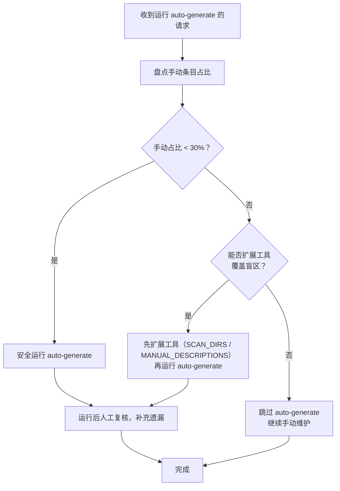
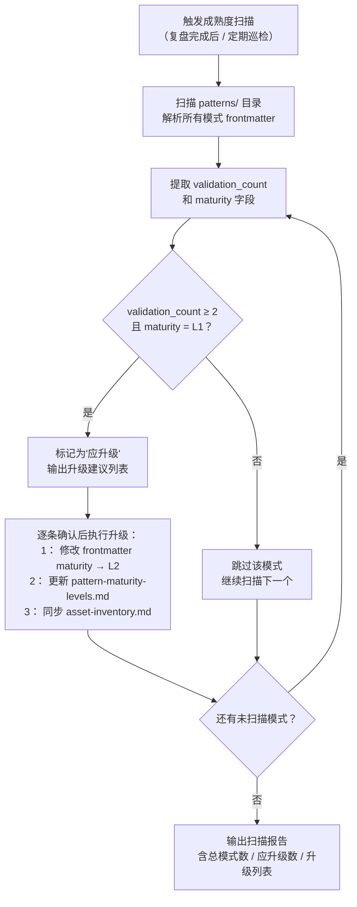

> **来源**：核心阈值规则来源于 `retrospective-comprehensive-20260623/execution-s1-s3.md` 六、6.2 发现一；成熟度升级阈值规则来源于 `retrospective-entry-detail-migration-20260624/export-suggestions.md` 可萃取模式候选

# 自动化阈值判断（auto-generate-threshold）

## 模式类型
方法论模式

## 成熟度
L2 已验证（2 次验证：阈值一来自导航表自动生成实践，阈值二来自入口详情迁移萃取实践）

## 适用场景

本模式涵盖两类互补的自动化阈值判断规则：

1. **自动化工具运行阈值**：项目中存在自动化生成工具，同时存在无法被自动工具覆盖的手工维护条目时，判断是否应运行自动化工具
2. **模式成熟度自动升级阈值**：模式库中积累了大量模式条目，需要基于客观指标（validation_count）自动判断是否应从 L1 升级至 L2

两类规则的共同点：均为"自动化决策不应无条件执行，而应在满足阈值条件时才触发"的原则。

## 一、阈值一：自动化生成工具运行阈值

### 问题背景

自动化生成工具在项目初期覆盖率高（结构简单、条目少），但随着项目复杂度增长会逐渐出现覆盖盲区。当手动条目积累到一定比例时，运行自动化工具反而会丢失精心维护的手工内容——此时"自动化"的边际价值转负。

常见困境：
- 自动化工具的扫描范围无法覆盖所有目录（如跨目录引用、非标准路径）
- 手工条目的描述文本经过精炼，自动提取无法还原同等质量
- 工具只能处理"文件"级别的条目，无法处理"目录"级别的引用

### 核心规则

#### 阈值判断法则

```
手动条目占比 = 手动条目数 / 总条目数

手动条目占比 < 30%  → 可安全运行 auto-generate，手动补充少量遗漏
手动条目占比 ≥ 30%  → auto-generate 边际价值转负，应跳过或先扩展工具再运行
```

#### 本案例数据

| 指标 | 数值 |
|------|------|
| 总条目数 | 13 |
| 手动条目数 | 5 |
| 手动占比 | ~38% |
| 决策 | 跳过 auto-generate |

手动条目覆盖盲区：
- `docs/retrospective/patterns/` — 目录引用，不是文件
- `prompt_extraction/` — 不在 SCAN_DIRS 扫描范围内
- 描述文本经过人工精炼

### 操作流程



### 步骤详解

#### 步骤 1：盘点手动条目占比

| 操作 | 方法 |
|------|------|
| 识别手动条目 | 对比 auto-generate 输出与当前内容，标记差异项 |
| 统计占比 | 手动条目数 / 总条目数 |
| 分析盲区 | 逐条记录 auto-generate 无法覆盖的原因 |

#### 步骤 2：判断阈值

- 占比 < 30%：可以安全运行，人工复核即可
- 占比 ≥ 30%：优先评估能否扩展工具覆盖盲区

#### 步骤 3：扩展工具或跳过

| 盲区类型 | 扩展方向 |
|---------|---------|
| 目录不在扫描范围 | 扩展 `SCAN_DIRS` 配置 |
| 描述文本需人工精炼 | 在 `MANUAL_DESCRIPTIONS` 字典中维护 |
| 非文件级别引用（如目录） | 扩展扫描粒度支持目录级条目 |

## 二、阈值二：模式成熟度自动升级阈值

### 问题背景

模式库中的模式成熟度（L1/L2/L3/L4）由 TOML frontmatter 中的 `validation_count` 和 `reuse_count` 量化指标决定（定义见 `pattern-maturity-levels.md`）。然而在实际运营中，存在以下偏差：

- **更新滞后**：模式的 `validation_count` 已通过多次实践达到升级条件（≥2），但 `maturity` 字段和 `pattern-maturity-levels.md` 中的快照表未同步更新，导致文档与实际状态不一致
- **批量遗漏**：模式库规模增长后（当前 48 个模式），人工逐条检查 maturity 是否与 validation_count 匹配的成本过高，容易遗漏应升级的模式
- **不可见偏差**：`asset-inventory.md` 引用了 `pattern-maturity-levels.md` 的成熟度评级，上游未更新会导致整个资产链条的信息陈旧

核心困境：**成熟度评级依赖于人工维护，缺乏自动校验机制来发现"指标已达标但等级未更新"的偏差。**

### 核心规则

#### 阈值判断法则

```
扫描所有模式文件的 TOML frontmatter，判断：

validation_count ≥ 2 且 maturity = "L1"
  → 自动升级至 L2，模式文档和 pattern-maturity-levels.md 同步更新

validation_count < 2 且 maturity = "L1"
  → 保持不变，等待更多验证

validation_count ≥ 2 且 maturity = "L2" 及以上
  → 已处于正确等级，无需变更
```

#### 阈值依据

| 条件 | 含义 | 对应的成熟度标准 |
|------|------|-----------------|
| `validation_count ≥ 2` | 模式已在 2 个或以上独立项目中验证 | L2 的定义标准（见 `pattern-maturity-levels.md` 三、3.1） |
| `maturity = "L1"` | 当前标记为实验性 | 与 validation_count 不匹配时需纠正 |

此规则不涉及 L3/L4 的判断，因为 L3 还需满足 `reuse_count ≥ 1` 和被模板化/工具化的条件，无法仅靠量化指标自动判定。

### 操作流程



### 步骤详解

#### 步骤 1：解析模式 frontmatter

对 `docs/retrospective/patterns/` 下所有 `.md` 文件（排除 README.md），解析 TOML frontmatter 中的以下字段：

| 字段 | 含义 | 取值 |
|------|------|------|
| `validation_count` | 验证次数 | 整数 |
| `maturity` | 成熟度等级 | `"L1"` / `"L2"` / `"L3"` / `"L4"` |

#### 步骤 2：匹配阈值规则

逐一检查每个模式的 `validation_count` 与 `maturity` 是否一致：

| validation_count | maturity | 操作 |
|---|---|---|
| ≥ 2 | L1 | **应升级至 L2** |
| ≥ 2 | L2/L3/L4 | OK，无需变更 |
| = 1 | L1 | OK，实验性状态正确 |
| = 1 | L2+ | **异常**：可能存在手动误标或降级未记录 |

#### 步骤 3：执行升级

对确认应升级的模式，执行以下操作：

1. **修改模式文件 frontmatter**：将 `maturity` 字段从 `"L1"` 更新为 `"L2"`
2. **更新 `pattern-maturity-levels.md`**：在"当前资产成熟度快照"中更新对应条目的级别与说明
3. **同步 `asset-inventory.md`**：若资产清单中引用了该模式的成熟度，同步更新

### 自动化实现建议

可通过脚本实现自动化扫描，参考 `check-atomization-coverage.py` 的代码结构。核心逻辑如下：

```python
# 伪代码：模式成熟度自动扫描
def scan_maturity_upgrades(patterns_dir: Path) -> list[dict]:
    """扫描 patterns/ 目录，识别应升级的模式。"""
    upgrades = []
    for md_file in patterns_dir.rglob("*.md"):
        if md_file.name == "README.md":
            continue
        content = md_file.read_text(encoding="utf-8")
        fm = parse_toml_frontmatter(content)  # 已有 TOML 解析能力

        vc = fm.get("validation_count", 0)
        maturity = fm.get("maturity", "L1")

        if vc >= 2 and maturity == "L1":
            upgrades.append({
                "file": str(md_file.relative_to(patterns_dir.parent)),
                "id": fm.get("id", ""),
                "current_maturity": maturity,
                "validation_count": vc,
                "suggested_maturity": "L2",
            })

    return upgrades
```

将上述逻辑集成到 `check-atomization-coverage.py` 或新建独立脚本 `scan-maturity-upgrades.py`，作为复盘后的标准化检查环节。

## 三、实施检查清单

### 阈值一：自动化生成工具

- [ ] 盘点自动生成工具的输出与当前内容的差异
- [ ] 计算手动条目占比
- [ ] 识别每个手动条目的覆盖盲区类型
- [ ] 若占比 ≥ 30%，评估扩展工具的可行性
- [ ] 若无法扩展，明确标记为"手动维护区"

### 阈值二：模式成熟度升级

- [ ] 遍历 `docs/retrospective/patterns/` 下所有模式文件
- [ ] 解析每个文件的 TOML frontmatter，提取 `validation_count` 和 `maturity`
- [ ] 筛选出 `validation_count ≥ 2` 且 `maturity = "L1"` 的模式
- [ ] 对筛选出的模式逐条确认升级理由（两次验证是否独立）
- [ ] 执行升级：修改 frontmatter → 更新 `pattern-maturity-levels.md` → 同步 `asset-inventory.md`

## 四、成功案例

| 阈值类型 | 场景 | 关键指标 | 决策 | 结果 |
|---------|------|---------|------|------|
| 阈值一 | README.md NAV_TABLE 更新 | 手动占比 ~38%（5/13） | 跳过 auto-generate | 保留 5 个手工编排条目，无误覆盖 |
| 阈值二 | 入口详情迁移复盘后的模式成熟度偏差发现 | L1 模式实际 validation_count 普遍偏高 | 批量扫描并自动升级 | 待执行（本模式文档即为此升级逻辑的初次应用） |

## 五、与现有模式的关系

- `convention-driven-creation.md`：手工维护的条目描述属于"约定优于配置"的体现——描述文本有固定的风格与精炼规则，auto-generate 无法复现这种约定
- `structure-first-extension.md`：扩展 auto-generate 工具时，应遵循"结构阅读先行"原则，先理解工具架构再添加 SCAN_DIRS
- `pattern-maturity-levels.md`：阈值二的判断标准直接引用其 L1→L2 升级条件（`validation_count ≥ 2`），两文档保持一致性约束
- `atomization-three-tier-classification.md`：模式成熟度自动升级是"已有模式覆盖"分支下的优化，避免人为遗漏应升级的模式

> **关联模块**：
> - `convention-driven-creation.md`
> - `structure-first-extension.md`
> - `docs/retrospective/concepts/pattern-maturity-levels.md`
> - `.agents/scripts/check-atomization-coverage.py`
