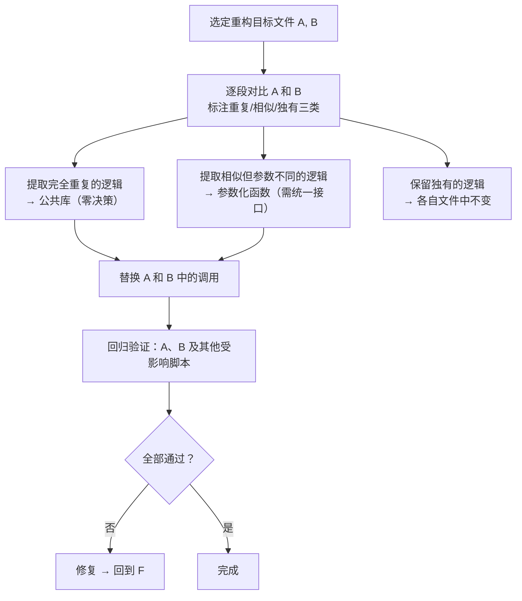

> **来源**：从 `../../../reports/insight-extraction/meta-methodology/retrospective-insight-extraction-comprehensive-20260623/README.md` 七、中优先级改进建议执行 — S4 执行萃取 拆分

# 差异驱动重构（Diff-Driven Refactoring）

## 模式类型
方法论模式

## 成熟度
L2 已验证（2 次独立验证：S4 验证脚本合并 + 24 脚本大规模共享库提取）

## 适用场景
需要对两个及以上功能重叠的代码文件进行合并重构，提取公共逻辑。

## 问题背景

传统的重构方法通常从"阅读所有代码"开始，逐行理解每个文件后再决定提取什么。这种方法的缺点是：

- **认知负载过高**：同时阅读多个 200+ 行的文件，难以精确识别重复
- **提取决策主观**：凭印象决定提取内容，可能遗漏或过度提取
- **回归验证范围不明确**：不确定哪些文件受重构影响

## 操作流程



## 步骤详解

### 步骤 1：逐段对比

将两个文件并列对比，按逻辑块标注三类标记：

| 标记 | 定义 | 示例 |
|------|------|------|
| 完全重复 | 代码逐字相同或仅变量名不同（值相同） | ANSI 颜色代码、分割线打印 |
| 相似但参数不同 | 逻辑结构相同但参数值/正则表达式不同 | `FRONTMATTER_RE` 提取逻辑 |
| 独有 | 仅出现在一个文件中 | `[permissions]` 表的特殊正则逻辑 |

### 步骤 2：分类提取

| 标记类型 | 处理方式 | 决策成本 |
|---------|---------|---------|
| 完全重复 | 直接提取到公共库，无需决策 | 零 |
| 相似但参数不同 | 参数化为统一接口后提取 | 低（需统一接口设计） |
| 独有 | 保留在各自文件中 | 零 |

### 步骤 3：回归验证

替换目标文件中的调用后，对所有可能受影响的文件执行回归验证，确保无功能退化。

## 关键原则

1. **不完全阅读，精确对比**：通过结构对比精确定位差异，而非全文精读
2. **零决策优先**：完全重复的逻辑直接提取，不花费决策带宽
3. **独有逻辑零触碰**：仅出现在一个文件中的逻辑不强制提取
4. **回归验证覆盖所有受影响的文件**：不止验证重构目标文件（A 和 B），还包括共享同一组调用方的其他文件

## 实施检查清单

- [ ] 目标文件是否 ≥ 2 个且存在可观察的重复？
- [ ] 是否完成逐段对比并标注了三类标记？
- [ ] 完全重复的逻辑是否零决策提取？
- [ ] 参数化接口是否足够通用（不过度参数化）？
- [ ] 回归验证是否覆盖了所有受影响文件？
- [ ] 提取后的公共库是否按概念域分离（见 `structure-first-extension`）？

## 成功案例

| 任务 | 目标文件 | 标记统计 | 产出 |
|------|---------|---------|------|
| S4 验证脚本合并 | check-role-permissions.py + check-spec-consistency.py | 完全重复 ~100 行 + 相似 30 行 + 独有若干 | lib/ 公共库（project/frontmatter/cli 三模块） |
| 24 脚本大规模共享库提取 | `.agents/scripts/` 下 24 个 Python 脚本 | 12 类重复模式 ~280 行 | lib/markdown.py + 6 函数 + 发现 1 个路径解析 bug（check-spec-consistency 通过数 19→25） |

## 重构价值公式

```
重构价值 = 消除的重复代码量 + 发现的隐藏问题 + 建立的结构基础
```

仅聚焦"消除重复"会低估真实回报。本案例中发现 1 个隐藏 bug（`resolve_project_root` OR 逻辑缺陷），使实际 ROI 约为表面 ROI 的 2 倍。

**建议**：在重构任务规划中，预留 20% 的时间缓冲用于"重构中可能发现的问题修复"。

> **关联模块**：
> - `structure-first-extension.md`
> - `three-tier-governance.md`
