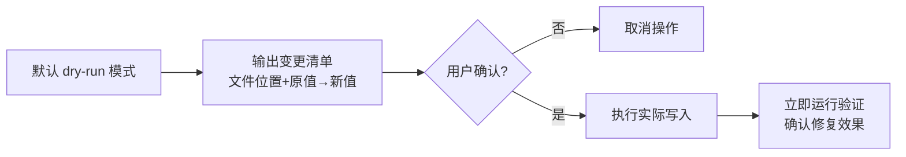

# dry-run 优先的安全修改模式（dry-run-first）

## 模式类型
方法论模式

## 成熟度
L3 标准化（多次验证，多个工具复用此模式，实证规律确认）

## 适用场景
任何批量修改文件的自动化工具（链接修复、代码重构、批量重命名、配置更新、数据库迁移等），以及**所有新建/生成文件的脚本工具**（frontmatter生成器、文档模板工具、代码脚手架等）。

## 问题背景
自动化批量修改工具若直接执行写入操作，一旦算法有误可能导致大规模文件损坏，且难以回滚。用户对"黑盒修改"天然不信任。

**实证规律（首测必出bug）**：任何涉及路径计算、条件分支、字符串拼接的nontrivial脚本（200行以上），首次dry-run几乎必然暴露2-4个机械性错误（跨平台路径、命名约定遗漏、typo等）。跳过dry-run直接执行等于拿真实文件做测试。

## 标准实现步骤

### 步骤 1：默认 dry-run
- 默认运行在 dry-run 模式（或需要明确 flag 如 `--apply`/`--fix` 才执行写入）
- 不提供"直接修改"作为默认行为

### 步骤 2：清晰输出变更清单
dry-run 输出必须包含：
- 将要修改的文件路径
- 原值（before）
- 新值（after）
- 修改原因/使用的策略
- 统计汇总（修改文件数、跳过文件数、无法处理数）

### 步骤 3：用户确认
- 用户看到预览后，通过 flag 或交互确认执行实际写入
- 非交互环境下要求明确 flag，禁止隐式确认

### 步骤 4：写入后立即验证
- 实际写入后立即运行验证逻辑
- 确认修复达到预期效果
- 报告验证结果

## 关键要点

1. **预览即文档**：dry-run 输出本身就是最好的用户文档，用户通过预览理解工具行为
2. **零副作用**：dry-run 模式绝不能修改任何文件
3. **信任建立**：用户通过多次 dry-run→确认→验证的循环建立对工具的信任
4. **开发者自测**：dry-run 也是开发者验证算法正确性的重要手段
5. **首次使用强制dry-run**：文件生成类脚本在help信息中必须注明"首次使用请先--dry-run预览"，首次dry-run发现的bug数量预期为2-4个（路径分隔符、命名约定、typo等机械性错误）
6. **文件存在防御**：文件生成类脚本在非dry-run模式下，目标文件已存在时必须拒绝覆盖，输出警告

## 成功案例

| 工具 | dry-run 实现 | 验证结果 |
|------|-------------|---------|
| check-links.py --fix | `--fix --dry-run` 输出修复计划 | ✅ 全量链接正确状态下输出"未发现需要修复的断链" |
| finalize-atomization.py | 默认dry-run，需 `--apply` 执行 | ✅ 原子化后处理验证通过 |
| new-kb-doc.py | `--dry-run` 预览frontmatter+骨架 | ✅ 首次dry-run发现3个bug（Windows反斜杠路径、README ID推导、引号typo），全部修复后才正式使用 |
| 数据库迁移工具 | 标准迁移模式：plan → apply → verify | 行业最佳实践 |

## 强制规范

所有创建/修改文件系统的脚本**必须**：
1. 支持 `--dry-run` 参数（没有例外）
2. help信息中包含"首次使用请先--dry-run预览"的提示
3. 目标文件已存在时默认拒绝覆盖（除非显式指定 `--force`/`--overwrite`）
4. dry-run输出必须包含将要创建/修改的文件完整路径

> **关联模块**：
> - `fix-priority-chain.md` — 修复优先级链（精确优先策略配合dry-run）
> - `relative-depth-adjustment.md` — 相对路径深度校正算法
