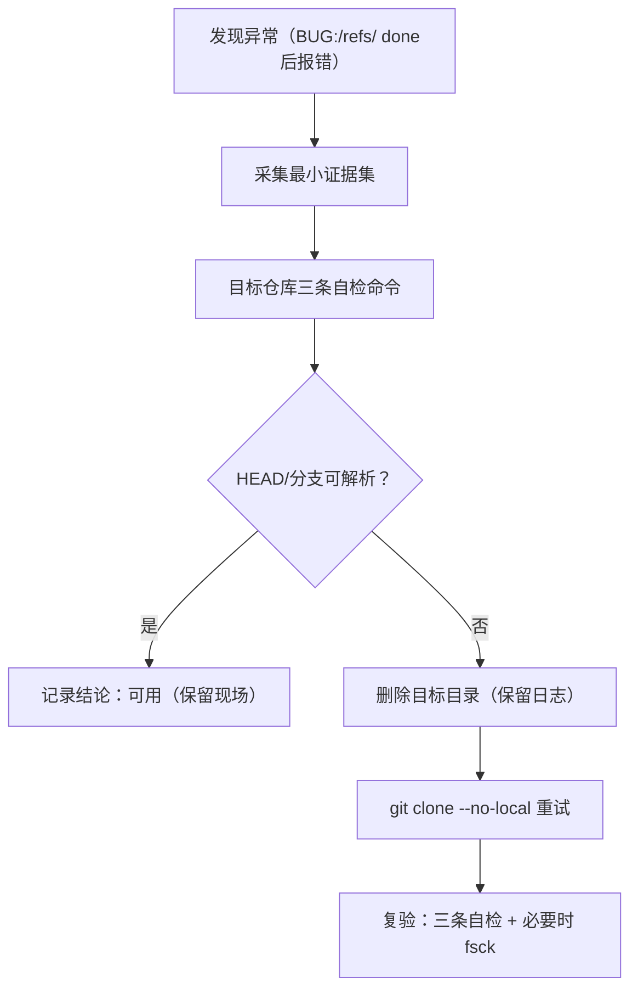

# 本地路径 Git 克隆异常的最小破坏处置协议

## 模式类型
方法论模式

## 适用场景

- Windows 环境中执行 `git clone <local-path>`（例如 `git clone D:\Repo`）
- 终端输出包含 `BUG:`、refs 相关异常、或出现“done 后报错”的灰色失败
- 不确定目标仓库是否可用，但希望降低误删与证据丢失风险

## 核心原则

1. **`BUG:` 属于处理策略切换信号**：优先按“工具链内部异常”处理。
2. **最小破坏优先**：先检查、再清理；先留痕、再重试。
3. **稳定性优先于优化**：重试时优先关闭本地优化路径（`--no-local`）。

## 操作流程



## 最小证据集（必须）

```powershell
git --version
```

保留完整终端输出（建议包含 cwd、执行命令、完整报错行）。

## 目标仓库自检三件套（必须）

```powershell
cd <target-repo>
git status
git branch -a
git rev-parse HEAD
```

判定逻辑：

- 三条均正常 → 目标仓库大概率可用
- 任一失败（特别是 HEAD 不可解析）→ 目标仓库不可用或半完成，进入重试流程

## 稳妥重试（建议默认）

```powershell
git clone --no-local <local-path>
```

> 说明：`--no-local` 用于关闭本地路径克隆的优化路径，避免复用/硬链接等带来的边界问题。

## 可选完整性验证（按需）

```powershell
git fsck --full
```

## 实施检查清单

- [ ] 已记录 `git --version`
- [ ] 已保留完整终端输出（至少包含报错行）
- [ ] 已完成三条自检并据此判定“可用/不可用”
- [ ] 若不可用：重试使用 `--no-local`
- [ ] 重试后再次执行三条自检

