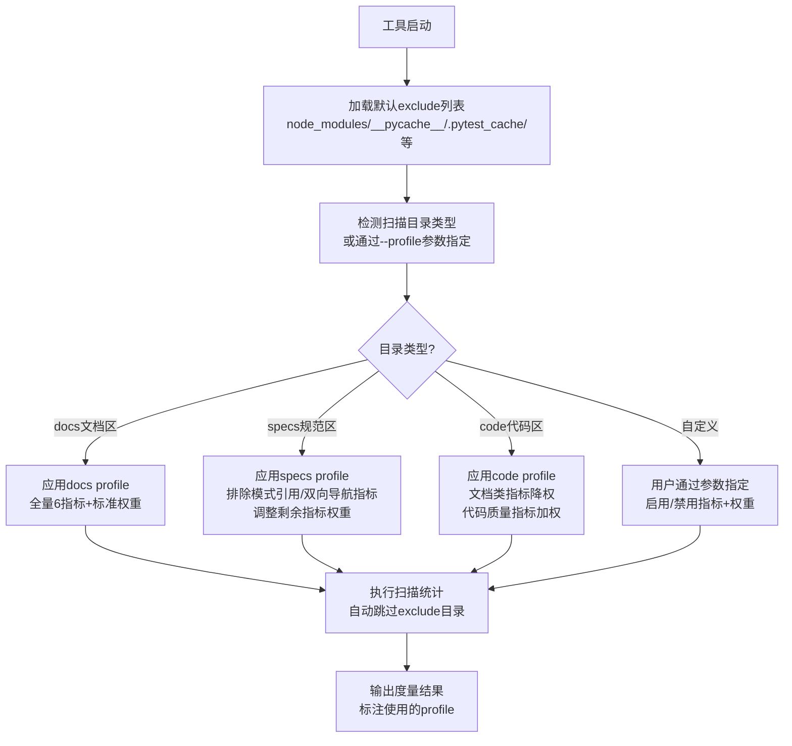

# 度量工具排除机制与配置画像（metric-tool-exclusion-profiling）

## 模式类型
方法论模式

## 成熟度
L1 实验性（1次成功验证，待更多场景复用）

## 适用场景
任何递归扫描文件系统进行度量/检查/统计的自动化工具（规范合规度检查、代码质量扫描、文档覆盖率统计、测试覆盖率分析等）

## 问题背景
递归扫描类度量工具的初始设计往往假设"目标目录下所有同扩展名文件都是需要统计的目标"，但实际项目中存在：
1. **非目标格式文件**：如SKILL.md、ONBOARDING.md等专用schema文件，其frontmatter/格式与标准文档不同
2. **目录类型差异**：规范定义区（.agents/）不需要双向导航、模式引用等适用于文档区的指标
3. **工具产出物**：.pytest_cache/、__pycache__/、htmlcov/等缓存/产出目录不应被扫描

缺少排除机制和配置画像会导致度量结果严重失真（如本项目中合规率从68.5%误判→修复后98.5%，偏差30个百分点）。

## 解决方案
采用**内置默认排除 + 目录类型配置画像（profile）**双层机制：



### 核心实现要点

#### 1. 默认排除列表（内置，无需用户配置）
```python
DEFAULT_EXCLUDE_DIRS = {
    'node_modules', '__pycache__', '.pytest_cache',
    '.git', '.svn', '.hg', 'htmlcov', '.coverage',
    'dist', 'build', '*.egg-info'
}
DEFAULT_EXCLUDE_FILES = {
    '.DS_Store', 'Thumbs.db'
}
```

> **为什么？** 用户不会也不应该记住所有需要排除的系统目录/工具产出物。内置默认列表是"零配置可用"原则的体现——用户第一次运行工具就能得到合理结果，而不是被一堆缓存目录的噪声干扰。

#### 2. 目录类型配置画像（profile）
预定义常见目录类型的适用指标集和权重：

| Profile | 适用目录 | 启用指标 | 权重配置 |
|---------|---------|---------|---------|
| docs（默认） | docs/ 文档区 | frontmatter合规、链接有效、溯源覆盖、模式引用、双向导航 | 标准权重（25/25/20/15/15） |
| specs | .trae/specs/ 规范区 | frontmatter合规、链接有效、溯源覆盖 | 重加权（35/35/30） |
| agents | .agents/ 规范定义区 | frontmatter合规、链接有效 | 重加权（50/50） |
| code | 代码目录 | 按需配置代码质量相关指标 | 自定义 |

> **为什么？** 不同目录的"质量"定义完全不同——规范定义区本身就是模式的来源，不应该反过来要求它"引用模式"；双向导航是面向读者的设计，规范定义区面向AI智能体不需要这个。用同一套指标衡量所有目录就像用同一套试卷考不同专业的学生，结果必然失真。

#### 3. Profile自动检测与手动指定
- 优先使用用户通过 `--profile` 参数明确指定的配置
- 未指定时根据扫描路径自动检测（路径包含`.agents/`→agents profile；路径包含`specs/`→specs profile；默认docs）
- 输出结果中标注当前使用的profile，便于审计

> **为什么？** 可追溯性是度量工具的基本要求。如果度量结果异常，首先要确认的就是"用了什么规则在什么范围上统计的"。黑盒输出的度量数字没有任何决策价值。

## 关键要点

1. **排除是刚需而非可选功能**：任何递归扫描工具v1版本就必须内置exclude机制，而非事后补丁
2. **"一刀切"指标假设必然错误**：不同目录类型的质量标准不同，固定权重会导致严重误判
3. **默认配置优先**：内置合理的默认exclude列表和profile，用户无需配置即可获得准确结果
4. **可追溯性**：输出必须标注使用的profile和exclude规则，便于排查度量异常
5. **渐进式增强**：v1实现默认exclude + 手动--exclude-dirs；v2添加--profile预设；v3添加自动检测

## 实施检查清单

开发递归扫描类度量工具时，逐项确认：

- [ ] v1版本已内置DEFAULT_EXCLUDE_DIRS，覆盖node_modules/__pycache__/.pytest_cache/.git等常见目录
- [ ] 提供--exclude-dirs/--exclude-files参数支持用户扩展排除列表
- [ ] 已识别至少2种以上目录类型的质量标准差异
- [ ] 为每种目录类型预设了profile，定义适用指标集和权重
- [ ] 支持--profile参数手动指定，未指定时根据路径自动检测
- [ ] 输出结果中明确标注当前使用的profile和统计范围
- [ ] 度量异常时可通过DEBUG模式输出完整的exclude规则和命中详情

## 正例

| 工具 | 应用方式 | 效果 |
|------|---------|------|
| check-spec-adoption.py | 添加--exclude-dirs参数排除skills/等专用目录；规划--profile参数支持docs/specs/agents | 排除前合规率68.5% → 排除后98.5%，消除30个百分点的误判；后续添加profile将解决.agents/区18分的评分偏差 |

## 反例警示

1. **"所有.md都是文档"假设**：递归扫描所有.md文件不做区分，导致SKILL.md等配置文件拉低合规率
2. **一套权重打天下**：不区分目录类型使用固定指标权重，规范定义区因不适用指标得0分
3. **exclude由用户手动配置**：没有默认排除列表，用户必须自己记住排除__pycache__/等常见目录
4. **度量结果黑盒**：输出不标注使用了什么排除规则和profile，出现偏差无法排查

## 与现有模式的关系

- **前置依赖**：[precision-over-recall.md](precision-over-recall.md) — 度量工具同样遵循"精度优先于召回"，误判比漏判危害更大
- **互补模式**：[dry-run-first.md](dry-run-first.md) — 度量工具调整权重/排除规则前先dry-run预览结果变化
- **相关模式**：[legacy-exposure-effect.md](legacy-exposure-effect.md) — 添加新的检查指标/规则前先扫描存量问题
- **被引用**：[spec-as-code-automated-gates.md](spec-as-code-automated-gates.md) — 规范即代码门禁需要准确的度量作为基础

## 边界与选型

- **适用边界**：适用于需要对不同类型目录/文件应用不同度量标准的扫描工具
- **不适用场景**：单一类型目录的简单统计（如仅统计docs/下的文档数量）不需要profile机制，简单exclude即可
- **vs 配置文件**：profile是预设的最佳实践配置，用户仍可通过命令行参数覆盖；复杂自定义场景才需要独立配置文件
