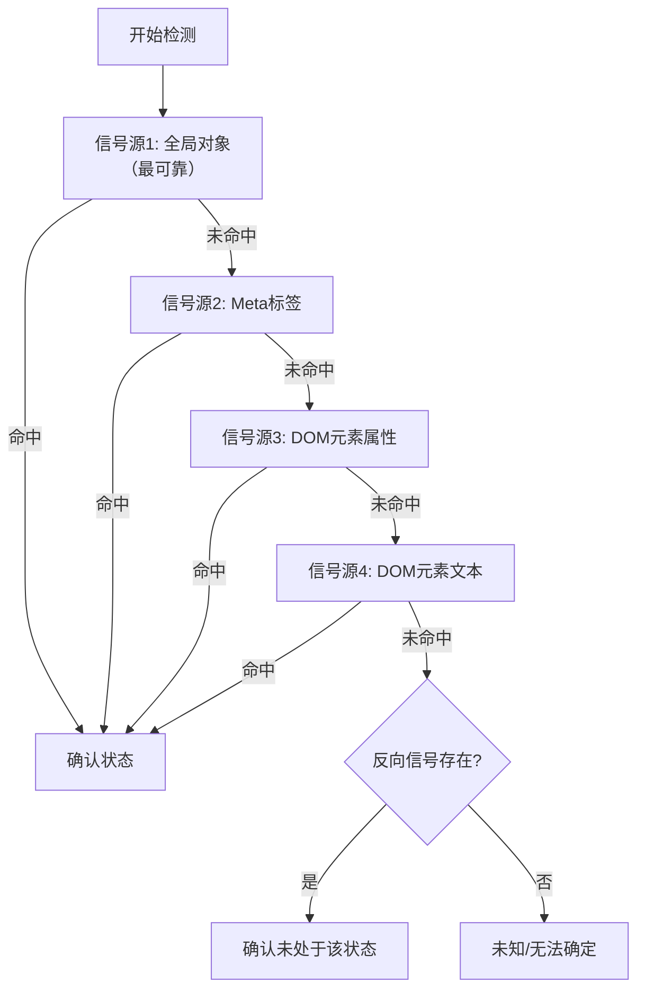

# 多信号组合检测模式

## 问题

在浏览器自动化中，任何单一DOM选择器都可能因页面改版、A/B测试、用户状态、语言设置等原因失效。依赖单一信号源判断状态（如"是否登录"、"是否加载完成"）会导致脚本脆弱：一旦该信号源不可用，整个检测就失败。

## 解决方案

使用多个独立信号源进行或逻辑组合检测，任一信号命中即可确认状态。信号按可靠性排序，最可靠的优先检查。同时加入反向信号辅助判断。DEBUG模式下输出完整检测JSON用于诊断。

## 核心要素



## 代码示例

```python
def detect_state(page) -> str | None:
    """多信号组合检测。返回检测到的值，None表示未检测到。"""
    results = page.evaluate("""() => {
        const results = {};
        // 信号1: JavaScript全局对象（最可靠）
        try {
            if (window.App && window.App.currentUser) {
                results.global_obj = window.App.currentUser.username;
            }
        } catch(e) { results.global_err = e.message; }

        // 信号2: Meta标签
        const meta = document.querySelector('meta[name="current-username"]');
        if (meta && meta.content) results.meta_tag = meta.content;

        // 信号3: 特定属性DOM元素
        const el = document.querySelector('[data-user]');
        if (el) results.data_attr = el.getAttribute('data-user');

        // 信号4: 通用DOM结构
        const link = document.querySelector('a[href^="/u/"]');
        if (link) {
            const m = (link.getAttribute('href')||'').match(/\/u\/([^\/]+)/);
            if (m) results.link_href = m[1];
        }

        // 反向信号
        results.has_negation = !!Array.from(document.querySelectorAll('a,button'))
            .find(el => (el.textContent||'').includes('登录'));
        return results;
    }""")

    logger.debug("检测结果: %s", json.dumps(results, ensure_ascii=False))

    # 按可靠性顺序检查
    for key in ("global_obj", "meta_tag", "data_attr", "link_href"):
        if key in results and results[key]:
            logger.debug("✅ 通过 %s 检测到: %s", key, results[key])
            return results[key]

    if results.get("has_negation"):
        logger.warning("❌ 反向信号存在，确认未检测到")
    return None
```

## 信号源排序原则

| 优先级 | 信号类型 | 可靠性 | 原因 |
|--------|---------|--------|------|
| 1（最高） | JS全局对象/状态 | ⭐⭐⭐⭐⭐ | 框架内部状态，不依赖DOM渲染 |
| 2 | Meta标签/JSON-LD | ⭐⭐⭐⭐ | 语义化标记，改版概率低 |
| 3 | data-*属性 | ⭐⭐⭐ | 面向开发者的钩子，相对稳定 |
| 4 | 语义化CSS类名 | ⭐⭐ | 主题切换可能改变 |
| 5（最低） | 元素文本内容 | ⭐ | i18n、A/B测试、文案调整都会失效 |

## 诊断可观测性

关键设计：**检测函数返回完整的results字典**，DEBUG模式输出JSON，使得：
- 检测成功时：知道是哪个信号命中的
- 检测失败时：知道哪些信号尝试过、返回了什么、反向信号是否存在
- 页面改版时：对比新旧JSON快速定位哪个信号失效了

## 适用场景

- 浏览器自动化中的状态检测（登录、权限、加载完成）
- Web爬虫中的内容识别
- API响应中的状态判断（多字段或逻辑）
- 测试自动化中的断言（多条件验证）
- 任何单一信号源不可靠的判断场景

## 来源

[forum-bot.py](../../../../../scripts/forum-bot.py) — `_get_current_username()` 4信号源组合检测

> **关联模式**：
> - [dual-channel-tiered-logging](../../code-patterns/dual-channel-tiered-logging.md)
