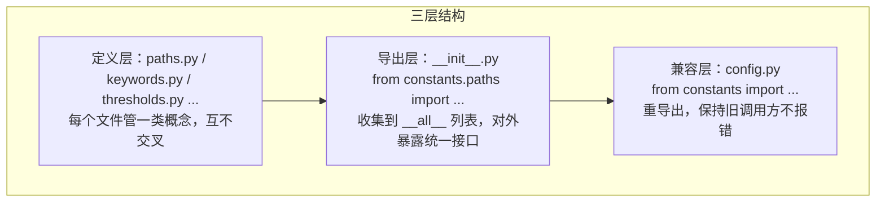
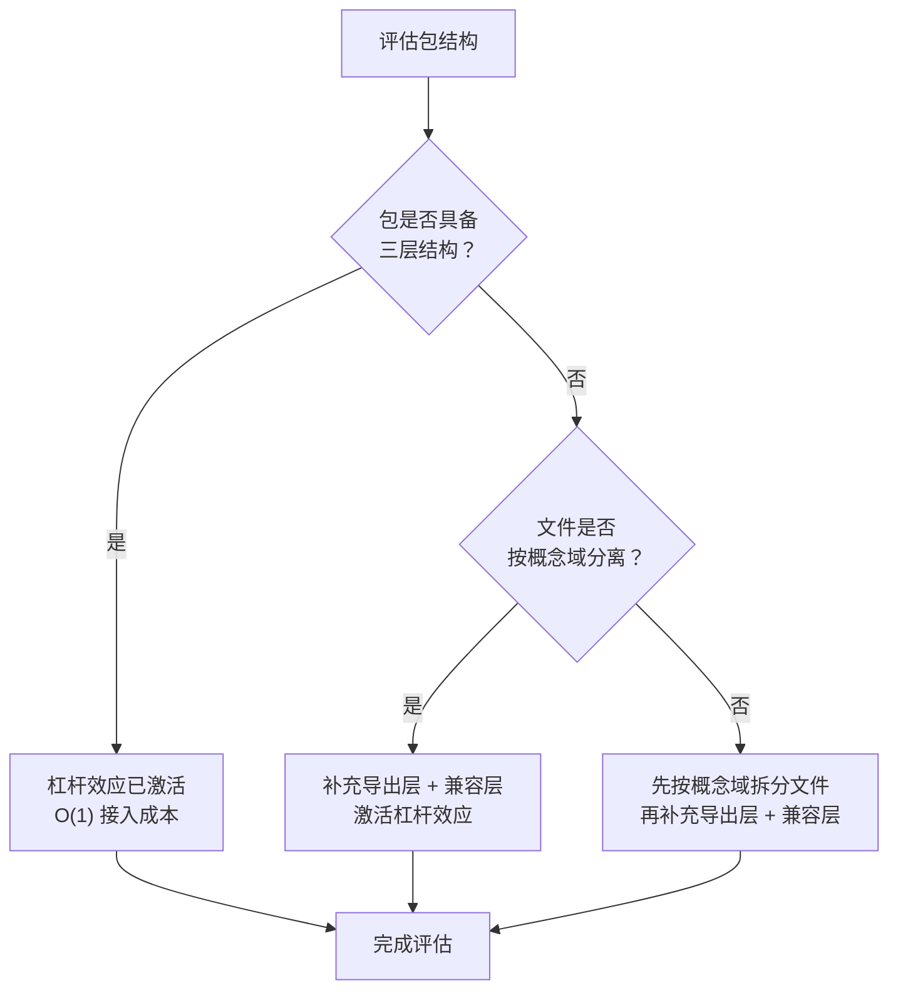

> **来源**：从 `docs/retrospective/reports/retrospective-comprehensive-20260623/execution-s1-s3.md` 六、6.2 发现三 拆分

# 包结构杠杆效应（package-structure-leverage）

## 模式类型
方法论模式

## 成熟度
L1 实验性（1 次成功案例：prompt_extraction/constants/ 三层结构）

## 适用场景
设计或评估代码包/模块的组织结构时，需要量化"新增功能"的边际成本，以判断当前包结构是否具有可持续的扩展能力。

## 问题背景

在成熟的代码库中进行功能扩展时，不同包结构设计会导致截然不同的接入成本：
- **好的包结构**：新增一个功能只需在对应文件中追加几行，调用方自动可用
- **差的包结构**：每新增一个功能都需要新建文件、调整导入链、回归所有调用方

如何量化这种差异？如何判断当前包结构是否"够好"？

## 核心概念：杠杆效应

**定义**：一个好的包结构设计能让"新增功能"的边际成本从 O(n) 降到 O(1)——投入一份力（修改一个文件），撬动多份产出（全项目立即可用 + 零破坏 + 零决策成本）。

## 三层结构模型



### 三层各自撬动的力

| 层次 | 撬动的力 | 具体效果 |
|------|---------|---------|
| **定义层**（按概念域分离文件） | 消除"这个常量属于哪个文件"的决策成本 | 新常量的归属由概念域自动决定 |
| **导出层**（`__init__.py` 统一收集） | 消除"调用方该从哪个文件导入"的不确定性 | 所有调用方只需 `from constants import ...` |
| **兼容层**（`config.py` 重导出） | 消除"改变导入路径会破坏旧代码"的恐惧 | 旧调用方不受影响，零破坏性变更 |

三者叠加：一次"追加 4 个常量"的动作自动触发"所有调用方立即可用 + 零破坏性 + 零决策成本"。

## 量化对比：分层包 vs 扁平包

### 成本公式

```
分层包：新功能接入成本 = C（常数，约 26 行）
       总成本（N 个功能）= C × N（线性，斜率低）

扁平包：新功能接入成本 = C + D（D = 决策成本 + 定位成本 + 冲突概率）
       总成本（N 个功能）= (C + D) × N + (阅读时间 × 文件膨胀系数 × N)（斜率陡）
```

### 维度对比

| 维度 | 分层包（三层结构） | 扁平包（单文件） |
|------|-----------------|----------------|
| 新增常量耗时 | 26 行追加 + 零决策 | 需在 1000 行中定位插入点 + 判断 section 注释归属 |
| 调用方导入 | `from constants import AGENTS_DIR`（清晰） | 同上（但无法区分概念域） |
| 合并冲突概率 | 低（每个文件只被同一概念域的变更触及） | 高（所有变更触及同一文件） |
| 变更影响面 | 可缩小到子集（改 paths.py 不影响只用到 keywords.py 的脚本） | 全量（改一处需回归全部调用方） |

### 本案例数据

| 指标 | 数值 |
|------|------|
| 新增常量数 | 4 个路径常量 |
| 修改文件 | 3 个（paths.py + `__init__.py` + config.py） |
| 新增代码 | 26 行 |
| 新建文件 | 0 |
| 导入链调整 | 0 |
| 破坏性变更 | 0 |

## 操作流程



## 推广验证：lib/ 公共库案例

S4 创建的 `lib/` 公共库同样体现了三层杠杆效应：

```python
# 分层导入 — 概念域清晰，变更影响面可控
from lib.project import resolve_project_root
from lib.cli import print_pass, print_warn

# 反模式 — 概念域丢失，变更影响面不可控
from lib.utils import resolve_project_root, print_pass, parse_toml_frontmatter, add_common_args
```

| 维度 | lib/ 分层设计 | lib/utils.py 扁平设计 |
|------|-------------|---------------------|
| 概念域区分 | project / cli / frontmatter 各自独立 | 全部混在 utils |
| 新增功能 | 判断概念域→追加到对应文件 | 追加到 500+ 行 utils |
| 变更影响面 | 仅影响同概念域调用方 | 影响所有 import utils 的模块 |

## 实施检查清单

- [ ] 包中的文件是否按概念域分离（非按文件大小或字母顺序）？
- [ ] 是否存在统一的 `__init__.py` 收集所有导出？
- [ ] 是否存在兼容层（如 `config.py` 重导出）保护旧调用方？
- [ ] 新增一个功能是否需要新建文件或调整导入链？
- [ ] 若不满足三层结构，评估改造的成本与收益

## 一句话总结

> 包结构杠杆效应 = 当包按概念域分离定义、通过统一导出层收敛接口、以兼容层保护旧调用方时，每新增一个功能只需常数行数的追加，且这些追加能通过导出层自动传导到所有调用方，同时变更影响面被限制在概念域子集内——相当于"花 26 行的力，撬动了全项目可用 + 零破坏 + 零决策"的效果。

## 与现有模式的关系

- `structure-first-extension.md`：本模式解释了三层结构"为什么有效"的量化原理，`structure-first-extension` 是操作层面"怎么做"的执行指南——两者是"原因"与"方法"的互补
- `convention-driven-creation.md`：三层结构是"约定驱动"在包级别的物理承载——先读范例（现有文件），再按概念域归类扩展

> **关联模块**：
> - `structure-first-extension.md`
> - `convention-driven-creation.md`
