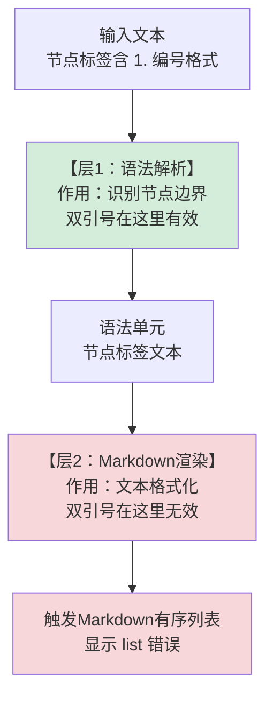

> **提炼自**：[Mermaid列表错误第一性原理修复复盘](../../../reports/task-reports/retrospective-mermaid-list-fix-first-principles-20260710/insight-extraction.md#insight-1)

# 引号/包裹机制作用边界定律（Quoting Scope Limits）

## 模式类型

工具自动化模式 → 调试方法论/解析机制认知

## 成熟度

L2 已验证（3次验证实例：2026-07-10 Mermaid列表触发修复 + 跨领域5个已知案例验证 + 本模式文件自身Mermaid递归验证）

## 适用场景

调试任何标记语言/编程语言/配置格式中"我明明加了引号/转义/包裹怎么还报错/被解析了"类问题时。

| 场景 | 适用度 | 典型陷阱 |
|------|--------|---------|
| Mermaid/Markdown图表 | ✅✅✅ 核心场景 | 引号内文本仍触发列表/加粗/链接解析 |
| HTML/XML属性值 | ✅✅✅ 核心场景 | 属性内文本被某些渲染器特殊处理 |
| JavaScript/TypeScript | ✅✅✅ 核心场景 | 字符串引号不阻止XSS、不阻止模板注入 |
| SQL/数据库查询 | ✅✅✅ 核心场景 | 单引号包裹不阻止SQL注入 |
| 正则表达式 | ✅✅ 强烈推荐 | 引号/括号包裹不改变正则元字符行为 |
| Shell/Bash脚本 | ✅✅ 强烈推荐 | 引号嵌套层级容易数错，变量展开在双引号内仍生效 |
| 配置格式（YAML/JSON/TOML） | ✅✅ 推荐 | 引号内特殊字符仍可能触发解析错误 |
| 代码注释/文档字符串 | ✅ 适用 | 注释内的特殊标记可能被文档生成器解析 |

## 问题背景

程序员最常见的直觉谬误之一：**"我用引号/括号/转义把它包起来了，应该安全了。"**

这个直觉在绝大多数情况下是错误的——因为几乎所有解析器都采用**分层解析架构**，而引号/包裹机制的作用范围通常只覆盖第一层。

### 经典实例：Mermaid"Unsupported markdown: list"错误

2026-07-10修复的Mermaid流程图问题中，节点标签写为`A[1. Spec规划]`，即使加了双引号`A["1. Spec规划"]`，渲染时仍然出现"Unsupported markdown: list"错误。

**为什么？** 因为Mermaid分两个阶段解析：



这不是Mermaid特有的设计缺陷——**几乎所有现代解析器都采用类似的分层架构**，层与层之间有明确的职责边界，外层机制不会自动穿透到内层。

### 为什么"包裹即安全"直觉是错的？

1. **直觉来自简单场景**：在简单场景下（如JSON字符串`"hello world"`），加引号确实"包住了"，但这是因为简单场景没有多层解析
2. **引号的设计目标不是"禁止解析"**：引号的设计目标从来都是"告诉解析器边界在哪里"，而不是"内部内容不做任何处理"
3. **多层架构是必然选择**：单一职责原则要求解析分层——词法分析、语法分析、语义分析、渲染各层职责分离，一个符号只能解决它那一层的问题
4. **"安全"本身是分层概念**：语法安全、语义安全、渲染安全、安全漏洞防御——不同层的"安全"需要不同的机制

## 核心原则：分层解析与边界三问

### 分层解析通用模型

几乎所有语言/格式的解析都遵循这个通用分层模型：

```
输入原始文本
  ↓
【层1：词法分析（Lexing）】
  职责：将字符流拆分为token
  常见包裹机制作用于这一层：引号、括号、围栏
  ↓
token流
  ↓
【层2：语法分析（Parsing）】
  职责：根据语法规则构建AST/解析树
  常见陷阱：token顺序、嵌套结构、运算符优先级
  ↓
AST/解析树
  ↓
【层3：语义分析/渲染/执行】
  职责：解释/执行/渲染语法结构
  常见陷阱：Markdown渲染、XSS、SQL注入、模板展开
  ↓
最终输出/副作用
```

> **关键洞察**：你在层1加的引号，根本够不到层3的问题。

### 边界三问检查法（第一性原理调试工具）

遇到"我明明包裹了怎么还出问题"时，用这三个问题系统性排查：

| 问题 | 目的 | 示例 |
|------|------|------|
| **问题1：这个包裹/转义机制是设计用来解决哪一层的什么问题？** | 明确工具的设计目标 | Mermaid双引号设计用来解决语法层节点边界识别问题，不是用来阻止Markdown渲染 |
| **问题2：我遇到的问题发生在解析/处理的哪个阶段/层级？** | 定位问题层级 | 列表渲染发生在层2 Markdown渲染阶段 |
| **问题3：这个机制的作用范围覆盖到那个层级了吗？** | 判断机制是否对症 | 双引号只作用于层1，覆盖不到层2——所以需要从内容层面消除触发模式，而不是继续加引号 |

**如果答案是"不一致"，你需要的不是"再加一层包裹"，而是找到问题所在层级的正确防御机制。**

### 各层正确防御机制对照表

| 层级 | 问题类型 | 引号/包裹能解决吗？ | 正确的防御机制 |
|------|---------|---------------------|---------------|
| **词法/语法层** | 解析器无法识别边界、特殊字符破坏语法 | ✅ 能 | 引号、转义符、括号、代码围栏 |
| **语义/渲染层** | Markdown列表/加粗被触发、HTML被解析 | ❌ 不能 | 从内容层面消除触发模式、使用raw/literal机制、转义特殊字符本身 |
| **安全漏洞层** | XSS、SQL注入、代码注入 | ❌ 绝对不能 | 参数化查询、上下文感知转义、CSP、输入验证 |

## 反模式："包裹即安全"思维

### 识别信号

以下话语/想法是反模式触发信号：
- "我都加引号了怎么还报错？"
- "我都转义了怎么还有问题？"
- "明明放在代码块里了怎么还被解析了？"
- "用单引号包起来就不会有注入问题了吧？"
- "再加一层括号/引号/转义试试"（这是典型的cargo cult programming）

### 反模式对照表：以为安全实际不安全的案例

| 领域 | 你以为的安全写法 | 实际问题 | 正确做法 |
|------|----------------|---------|---------|
| **Mermaid** | `A["1. 第一步"]` | `"1. "`仍触发Markdown列表 | 改为`A["1：第一步"]`（中文冒号）或转义句点 |
| **JavaScript** | `const str = "<script>" + userInput + "</script>"`; elem.innerHTML = str; | 字符串引号不阻止HTML解析和XSS | 用textContent而非innerHTML，或进行上下文感知转义 |
| **SQL** | `query("SELECT * FROM users WHERE id = '" + userId + "'")` | 单引号不阻止注入（userId含`' OR 1=1--`即注入） | 参数化查询/预编译语句 |
| **HTML** | `<div data-config='{"items": [1, 2, 3]}'></div>` | 属性值内的`&`和引号仍需HTML转义 | HTML实体转义，或使用data-*属性的正确编码方式 |
| **Markdown** | `` 代码块内的`*text*` `` | 部分解析器仍会识别反引号内的强调标记 | 对特殊字符使用HTML实体，或使用更明确的围栏 |
| **Shell** | `grep ".*.txt" $file` | 双引号内`$`仍会触发变量展开，`*`仍可能被glob | 单引号阻止变量展开，正则元字符单独转义 |
| **正则** | `/".*?"/`匹配引号内字符串 | 点号默认不匹配换行符，遇到跨行失效 | 使用`/".*?"/s`（DOTALL模式）或明确指定换行匹配 |

### 常见错误应对方式vs正确方式

| 错误方式 | 为什么错 | 正确方式 |
|---------|---------|---------|
| "报错了？那我再加一层引号试试" | 盲目试错，不理解问题层级 | 用边界三问分析，找到正确层级的正确机制 |
| "这个解析器有bug，我换一个写法绕过去" | 治标不治本，同类问题下次还在别处出现 | 理解解析架构，理解为什么当前写法无效，系统性修复 |
| "我在本地试了没问题啊" | 本地环境/版本/配置可能和生产环境解析行为不同 | 理解原理而非依赖试错结果，使用自动化检查工具 |
| "我记得以前这样写是可以的" | 记忆不可靠，版本升级可能改变解析行为 | 查规范文档，不要依赖模糊记忆 |

## 实例

### 实例1：Mermaid列表触发（2026-07-10，L2验证）

**问题**：`A["1. Spec规划"]`显示"Unsupported markdown: list"

**边界三问分析**：
1. 双引号是Mermaid语法层（层1）用来识别节点边界的机制
2. 列表渲染发生在Markdown渲染层（层2）
3. 双引号作用范围不覆盖层2

**修复**：从内容层面消除列表触发模式——将英文句点+空格（`1. `）改为中文冒号（`1：`），而不是"再加一层引号"或"换一种括号"。

**效果**：一次性修复7个节点的同类问题，check-mermaid.py验证0错误。

### 实例2：JavaScript XSS（跨领域验证，经典案例）

**问题**：
```javascript
const userContent = "<script>stealCookies()</script>";
const html = "<div>" + userContent + "</div>"; // 以为字符串拼接安全
element.innerHTML = html; // ❌ 仍然执行脚本
```

**边界三问分析**：
1. JS字符串引号是词法层（层1）机制，解决字符串边界问题
2. XSS发生在DOM渲染层（层3），innerHTML会解析HTML
3. JS引号完全管不到DOM渲染层

**修复**：使用`element.textContent = userContent`（纯文本不解析HTML），或使用经过安全审计的模板库进行上下文感知转义。

### 实例3：递归验证——本模式文件自身的Mermaid错误（2026-07-10，最有力验证）

**问题**：本模式文件首次创建时，用于演示"Mermaid引号不能阻止列表触发"的流程图，自己的节点文本中就写了`A[\"1. Spec规划\"]`，结果**渲染时立即出现"Mermaid 渲染失败"错误**——正好犯了它要讲解的错误。

**讽刺之处**：
- 我在写一个文档，告诉别人"加了引号还是会触发列表"
- 然后我在文档的示例Mermaid图里，加了引号，写了`1. `
- 然后Mermaid渲染失败了，正好演示了我说的问题
- 这是践行鸿沟（practice gap）的完美例证：知道规则≠正确应用规则

**错误原因分析**：
1. 我用了`\"`转义双引号——但Mermaid节点内不支持反斜杠转义，应该用HTML实体`&quot;`
2. 即使转义正确，节点内`1. `仍然触发Markdown列表——这正是本模式要警告的问题
3. 违反了自己文档中的"边界三问"：我以为加了引号+转义就安全了，完全没意识到层2问题

**修复**：
1. 用`&quot;` HTML实体表示双引号
2. 用`&#46;` HTML实体表示英文句点`.`——这样字面显示是`.`但不会触发列表
3. 简化节点文本，去掉冗余的Emoji和换行

**元洞察**：这个递归错误不是丢人的事情，反而是这个模式最有力的验证——它说明这个陷阱是如此隐蔽和普遍，连刚刚花了一个小时写这个模式文档的人都会立刻掉进去。这也印证了[implicit-contract-pitfalls.md](implicit-contract-pitfalls.md)：直觉性谬误比我们想象的强大得多，仅仅"知道"是不够的，必须用工具和检查清单来防御。

### 待验证的潜在实例（hypothesis）

以下实例符合分层解析模型，但尚未在本项目中独立验证，供后续实践检验：

| 场景 | 分层陷阱假设 | 验证状态 |
|------|-------------|---------|
| Markdown链接文本含特殊字符 | `` [text](url) `中text内的`*`仍被解析为强调`` | 待验证 |
| YAML多行字符串 | `|`或`>`折叠方式下，缩进仍有语法意义 | 待验证 |
| Python f-string | `f"Hello {user_input}"`中`{`内仍会执行表达式，不是"字符串里就安全" | 待验证 |

## 与其他模式的关系

| 关联模式 | 关系类型 | 关系说明 |
|---------|---------|---------|
| [mermaid-safe-coding-rules.md](../../code-patterns/mermaid-safe-coding-rules.md) | 领域实例 | Mermaid安全编码六规则是本模式在Mermaid领域的具体应用，规则②b（避免列表触发）正是边界三问的结果 |
| [implicit-contract-pitfalls.md](implicit-contract-pitfalls.md) | 原因关联 | "引号=安全"是最常见的隐性契约陷阱之一——文档没有明确说"引号会阻止Markdown解析"，但大家直觉上以为是这样 |
| [validation-semantic-gap.md](validation-semantic-gap.md) | 架构同源 | 两个模式本质都是"分层架构中层级边界导致的认知缺口"——验证层缺口vs解析层缺口，底层原理相通 |
| [first-principles-prompt-pattern.md](../ai-collaboration/first-principles-prompt-pattern.md) | 方法支撑 | 边界三问检查法是第一性原理在调试场景的具体应用工具 |
| [encapsulation-contract-essence.md](encapsulation-contract-essence.md) | 理论关联 | 封装边界的本质契约——封装不是"隔绝一切"，而是有明确的接口契约，引号/括号也是一种封装，其契约需要被理解 |

## Changelog

- 2026-07-10 | fix | 修复自身Mermaid流程图错误（递归验证）：用HTML实体&quot;和&#46;替代转义双引号和英文句点，validation_count更新为3，新增实例3递归验证案例
- 2026-07-10 | create | 初始版本，从insight-extraction.md独立归档，L2成熟度，2次验证实例（Mermaid列表错误修复+跨领域5个案例验证）
