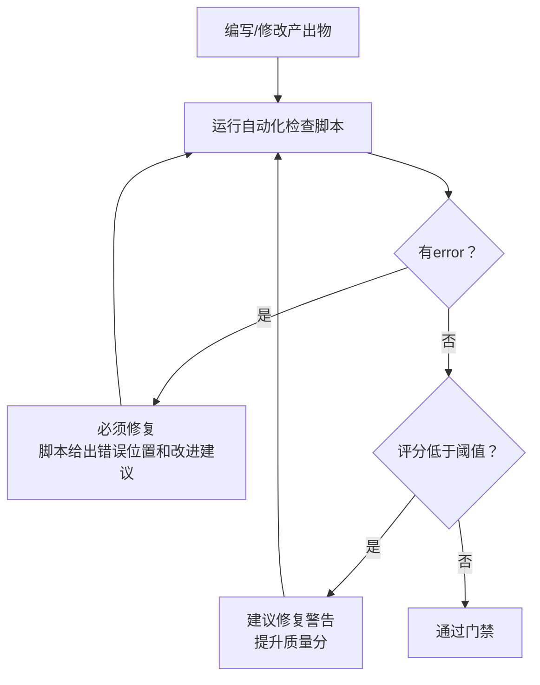

> **提炼自**：[export-suggestions.md 经验教训13](../../../reports/project-governance/tools-and-automation/retrospective-forum-posting-skill-optimization-20260629/export-suggestions.md) + check-skill-quality.py 实践 —— forum-posting Skill 优化复盘

# 规范即代码自动化门禁模式（Spec-as-Code Automated Gates）

## 模式类型

方法论模式（质量保证/工具自动化）

## 成熟度

L1 首次提炼（check-skill-quality.py 实践验证）

## 适用场景

当某类规范已经明确、稳定，且可以程序化验证时，不要把规范只写在文档里靠人自觉遵守，要把规范写成自动化检查脚本，作为提交/合并前的强制门禁。

常见适用场景：
- 文档格式规范（frontmatter完整性、章节结构、链接有效性）
- 代码质量检查（重复代码、命名规范、安全问题）
- 流程合规检查（是否包含必填要素、是否遵循约定结构）
- 路径/链接规范（无绝对路径、无断链）
- 长度/复杂度阈值（单文件行数、函数长度、圈复杂度）

## 问题背景

规范落地的传统方式是：
1. 写一篇文档，说明"应该怎么做"
2. 开会/发通知要求大家遵守
3. 靠reviewer人工检查
4. 发现问题打回修改

这种方式的问题：
1. **执行不一致**：不同reviewer标准不同，有的人严有的人松
2. **遗忘率高**："我知道这个规范但这次忘了"是常态
3. **成本高昂**：人工检查重复、机械的条目浪费认知资源
4. **没有强制力**："建议"可以被忽略，没有阻断机制
5. **反馈滞后**：写完才发现问题，返工成本高

典型表现：
- 文档写了"Description必须包含触发词"，但还是有Skill忘了加
- 规范说"禁止file:///绝对路径"，但还是有人写
- review中反复提同样的问题，像打地鼠

## 核心规则

### 规则 1：凡是能程序化检查的，都应该写成脚本

判断一个规范是否应该自动化：

| 规范特征 | 是否应该自动化 |
|---------|--------------|
| 判断标准是明确的二元（有/没有、是/否） | ✅ 必须自动化 |
| 判断标准是量化阈值（≤500行、≥150字符） | ✅ 必须自动化 |
| 需要主观审美判断（写得好不好、优不优雅） | ❌ 不适合，留作人工review |
| 需要理解业务上下文判断（逻辑对不对） | ❌ 不适合，留作人工review |
| 每次review都要检查的机械条目 | ✅ 必须自动化 |

> **为什么？** 机器不会忘、不会累、不会有认知偏差、不会手下留情，检查速度比人快100倍。把人从机械检查中解放出来，专注在真正需要判断的地方。

### 规则 2：自动化检查四要素

一个好用的自动化检查脚本必须包含：

1. **量化评分**（0-100分）：不是简单的"过/不过"，而是给出质量分，让人知道距离合格有多远
2. **分级反馈**：error（必须修）/ warn（建议修）/ info（提示），不是所有问题都同等严重
3. **改进指引**：不仅说"这里错了"，还要说"怎么改"——最好能直接给出正确示例的参考位置
4. **多种输出格式**：默认人类可读格式，支持JSON便于CI集成，支持仅输出分数便于阈值判断

### 规则 3：模板+脚本 双重防护

模板是事前预防，脚本是事后门禁，两者互补：
- **模板**：在你写的时候就引导你写对，降低第一次就写错的概率
- **脚本**：即使你漏了模板里的内容，脚本也会在提交前拦下来
- 没有模板，脚本会一直报错，使用者体验差
- 没有脚本，模板慢慢就会被架空，大家不按模板填

### 规则 4：门禁阈值策略

不是所有检查项都应该是"不通过就不能提交"：
| 严重级别 | 阈值策略 |
|---------|---------|
| error（违反强制规范） | 必须修复，否则退出码非0，CI失败 |
| warn（建议优化项） | 不阻断，但要显示出来；可以设置评分阈值（如低于70分阻断） |
| info（信息项） | 仅显示，不影响评分 |

合理的默认阈值：
- 质量分≥80分：优秀，直接通过
- 70-79分：合格，可以通过但建议优化
- <70分：不合格，必须修改

### 规则 5：脚本也是需要维护的资产

自动化检查脚本不是写一次就完了：
- 当规范更新时，脚本也要同步更新
- 当出现新的常见错误模式时，把它加到检查项里
- 当某个检查项误报太多时，调整规则
- 定期review检查项，移除过时的规则

> **为什么？** 如果脚本和规范不一致，脚本本身就会变成噪音——人们会开始忽略脚本输出，整个门禁机制就失效了。

## 实施检查清单

开发自动化检查脚本时自问：
- [ ] 这个规范是可以程序化判断的吗？还是需要主观判断？
- [ ] 有0-100分量化评分吗？
- [ ] 有error/warn/info分级吗？
- [ ] 有具体的改进指引，而不只是报错吗？
- [ ] 有配套模板吗？
- [ ] 有合理的阈值策略吗？
- [ ] 支持JSON输出以便CI集成吗？
- [ ] 脚本本身在项目的共享库目录下吗？有没有重复造轮子？
- [ ] 误报率高吗？需要调整规则吗？

## ROI 计算

投入产出比分析（以check-skill-quality.py为例）：
- **开发投入**：约2小时（写脚本+调试+修复问题）
- **单次节省**：每个Skill review节省约10分钟（不需要人工检查8个机械条目）
- **回本点**：12个Skill之后就回本
- **长期收益**：
  - 质量一致性100%——不会因为reviewer状态好坏波动
  - 新人上手快——不需要记住所有规范，跑脚本就知道哪里错了
  - 规范落地有强制力——不是"建议"，是"必须"
  - 可以集成到CI，在提交时自动检查，不依赖人工

## 反例警示

| 错误做法 | 后果 |
|---------|------|
| 规范写在文档里，不写检查脚本 | 规范沦为"建议"，遵守率随时间下降 |
| 检查脚本只输出"失败"，不说哪里错、怎么改 | 使用者不知道怎么修，脚本变成阻碍 |
| 所有问题都当error，不分级 | 大量警告淹没真正重要的错误，产生"报警疲劳" |
| 检查阈值设得100分才能过 | 门槛太高，大家想办法绕过门禁而不是提升质量 |
| 写完脚本就不管了，规范更新脚本不更新 | 脚本和规范脱节，输出过时的错误信息，失去信任 |
| 没有配套模板，只靠脚本卡人 | 使用者反复改反复报错，体验差，怨恨门禁 |

## 正例

本次开发的check-skill-quality.py：
- 8个检查项，覆盖五要素模型
- 0-100分评分，forum-posting得分95
- error/warn/info三级输出
- 每个失败项都有具体改进指引
- 支持--score/--json/--verbose/--threshold多种参数
- 配套SKILL-TEMPLATE.md事前引导
- 默认阈值70分，低于则退出码1
- 复用lib/下的共享库（cli/frontmatter/project/rules），不重复造轮子

## 与现有模式的关系

- `template-variance-control.md`：本模式与模板模式是互补的双重防护——模板是事前预防，脚本是事后门禁
- `availability-heuristic-structural-guard.md`：本模式是结构性防范的第三道防线——预检清单（入口）+ 路由表（导航）+ 自动化脚本（出口），三层共同对抗认知偏差
- `three-layer-rule-enforcement.md`：本模式是三层规则执行中"自动化执行层"的具体实现
- `dry-run-first.md`：检查脚本本身就是一种"dry-run"——在实际提交/合并前先验证质量
