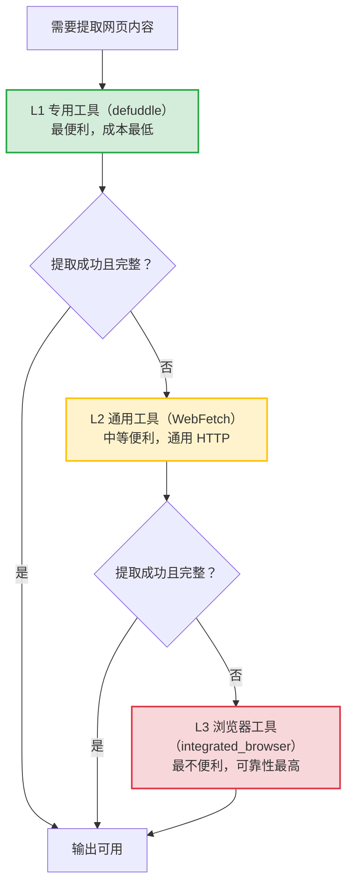

> **提炼自**：[insight-extraction.md#洞察4](../../../reports/competitive-analysis/retrospective-eve-framework-learning-20260704/insight-extraction.md#洞察4) —— Vercel Eve 前端 Agent 框架学习复盘（网页内容提取三级回退链）

# 网页内容提取三级回退链（Three-Tier Web Content Extraction Fallback Chain）

## 模式类型

方法论模式（工具工程与自动化/网页内容提取/工具可靠性分层）

## 成熟度

L1 实验性（微信公众号文章提取单案例验证，待更多场景验证）

## 适用场景

需要从网页提取内容（尤其是微信公众号文章、动态渲染页面、反爬保护的页面）时，做工具选择与回退决策。典型场景：
- 微信公众号文章内容提取（动态渲染 + 反爬机制，静态 HTTP 工具无法获取）
- 技术博客、新闻、动态渲染的单页应用（SPA）页面提取
- 需要登录、人机验证、JS 渲染才能访问的页面
- 任何"单一工具可能失败"的网页内容获取场景

## 问题背景

网页内容提取时，单一工具无法覆盖所有场景：

1. **便利性与可靠性不可兼得**：便利（成本低、易用）的工具往往可靠性低（对动态页面、反爬支持有限）；可靠（模拟真实环境）的工具往往不便利（需要真实浏览器交互、成本高）。
2. **忽略"工具会失败"的假设**：默认第一个工具能搞定一切，失败后无计划，临时乱试，浪费时间。
3. **静态 HTTP 工具的局限**：defuddle/WebFetch 无法执行 JavaScript，对微信公众号这类动态渲染 + 反爬的页面无法获取完整内容。

Vercel Eve 框架学习任务中，网页内容提取经历了三级回退：defuddle → WebFetch → integrated_browser，验证了三层工具在"便利性-可靠性"光谱上的分布。

## 核心思想

**工具选择不应追求"一个工具搞定一切"，而应建立"便利性优先 + 逐层回退"的分层策略**：先尝试最便利、成本最低的工具，如果失败再回退到下一级更可靠但成本更高的工具。这是"效率与可靠性权衡"在工具使用上的具象化。

### 三级工具在"便利性-可靠性"光谱上的分布

| 层级 | 工具 | 便利性 | 可靠性 | 适用场景 |
|------|------|--------|--------|---------|
| L1 专用 | defuddle | ★★★★★ | ★★ | 静态文章/博客正文提取 |
| L2 通用 | WebFetch | ★★★ | ★★★ | 通用 HTTP 获取，静态页面 |
| L3 浏览器 | integrated_browser | ★ | ★★★★★ | 动态渲染/反爬/需交互页面 |

## 核心规则

1. **便利性优先**：先尝试最便利、成本最低的工具（defuddle），成功则结束。
2. **逐层回退**：上一层失败或结果不完整时，回退到下一级更可靠的工具，不重复尝试失败的工具。
3. **识别动态渲染/反爬信号**：微信公众号文章、SPA 页面、需登录页面，应预判静态工具可能失败，提前准备浏览器工具。
4. **完整性检查**：回退过程中要判断"成功但内容不完整"的情况，而非仅看是否返回错误。

## 实施检查清单

提取网页内容时对照检查：

- [ ] 是否预判了页面类型（静态/动态渲染/反爬）？
- [ ] 是否先尝试了最便利的 L1 专用工具（defuddle）？
- [ ] L1 失败或内容不完整时，是否回退到 L2 通用工具（WebFetch）？
- [ ] L2 仍失败时，是否回退到 L3 浏览器工具（integrated_browser）？
- [ ] 是否对"成功但内容不完整"做了完整性检查，而非仅看是否报错？

## 反模式（不要这么做）

- ❌ **反模式1：追求一个工具搞定一切**：只用 defuddle 或 WebFetch，遇到动态渲染/反爬页面就失败，没有回退方案。
- ❌ **反模式2：失败后反复重试同一工具**：defuddle 失败后反复重试，忽略了回退到 WebFetch/浏览器。
- ❌ **反模式3：不预判直接上最重工具**：对静态文章也直接启用浏览器工具，成本高、效率低，违背"便利性优先"。

## 检验标准

做完之后怎么知道做对了？

- 标准1：对静态页面用 L1 工具成功提取（效率优先）
- 标准2：对动态渲染/反爬页面，能通过逐层回退最终用 L3 工具提取完整内容
- 标准3：回退过程中没有重复尝试失败的工具，回退路径清晰

## 迁移示例

这个模式还能用在什么其他场景？

- **场景1（通用工具选择）**：任何"专用工具 → 通用工具 → 万能方案"的选型，如文件解析（专用解析器 → 通用解析 → 浏览器渲染）
- **场景2（错误处理与回退机制设计）**：软件系统中"主方案优先 + 逐层降级"的错误处理设计，如 API 调用的多级缓存/降级
- **场景3（跨领域类比）**：故障排查从"最快定位"到"最彻底定位"——先走快路径（日志/常见排查），不行再上慢而全面的手段（全链路追踪/抓包）

## 与现有模式的关系

| 相关模式 | 关系 | 说明 |
|---------|------|------|
| [defuddle-web-extraction-preferred.md](defuddle-web-extraction-preferred.md) | 特化 | 该模式聚焦"首选 defuddle + WebFetch 兜底"的双工具机制，本模式将其扩展为"三级回退链"并明确"便利性-可靠性"分层原则 |
| [tool-failure-three-tier-degradation.md](tool-failure-three-tier-degradation.md) | 互补 | 该模式聚焦"工具故障时的三级降级策略"（sub-agent→附带信息→已有知识），本模式聚焦"网页内容提取的选择回退链"，两者分别解决"工具坏了怎么办"与"选哪个工具"两个问题 |