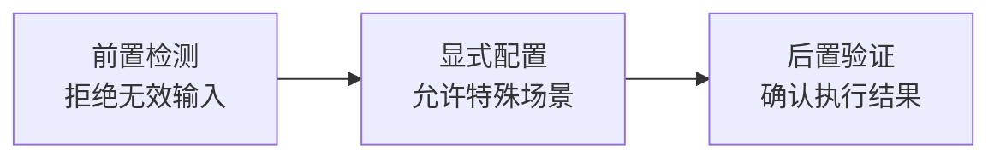

> **来源**：从 `retrospective-minitest-ecosystem-20260707` 复盘报告中提炼

# 工具修复三重防护模式（Tool Fix Triple Protection Pattern）

## 模式类型
工具自动化模式

## 成熟度
L1 实验性（1 次成功案例：git-commit-utf8.py 空提交bug修复）

## 适用场景
所有脚本工具缺陷修复，特别是涉及用户输入验证和状态变更的工具。

## 问题背景

工具缺陷修复后容易复发，单一检测无法覆盖所有边界情况：
- 显式允许空提交的场景（如 `--allow-empty` 参数）
- 初始提交无 `HEAD~1` 的情况
- 脚本内部副作用导致的意外行为

## 核心流程

## 三重防护详解

### 第一重：前置检测

**操作要点**：在执行核心操作前，检测输入是否有效、状态是否符合预期。

**示例**：git-commit-utf8.py 在 commit 前检测暂存区是否为空，为空则拒绝提交并给出明确错误提示。

**产出物**：输入/状态验证通过或明确的错误提示

**常见误区**：假设输入一定有效，忽略边界条件。

### 第二重：显式配置

**操作要点**：为特殊场景提供显式的配置开关，而非隐式处理。

**示例**：git-commit-utf8.py 提供 `--allow-empty` 参数，用户必须显式指定才能创建空提交。

**产出物**：灵活的配置选项，覆盖正常和特殊场景

**常见误区**：硬编码特殊处理逻辑，用户无法覆盖默认行为。

### 第三重：后置验证

**操作要点**：执行完成后，验证结果是否符合预期。

**示例**：git-commit-utf8.py 提交后使用 `git show --name-only` 验证变更文件数，发现空提交时发出警告。

**产出物**：执行结果验证报告

**常见误区**：假设执行一定成功，不验证实际效果。

## 验证案例

| 案例 | 防护措施 | 效果 |
|------|---------|------|
| git-commit-utf8.py 空提交修复 | ①检测空暂存区拒绝提交 ②`--allow-empty`显式允许 ③提交后验证变更文件数 | 修复后未再出现空提交 |

## 关键启示

工具修复的标准流程应该是"堵入口（检测）+留出口（配置）+验结果（验证）"，三者协同才能确保问题不再复发。
