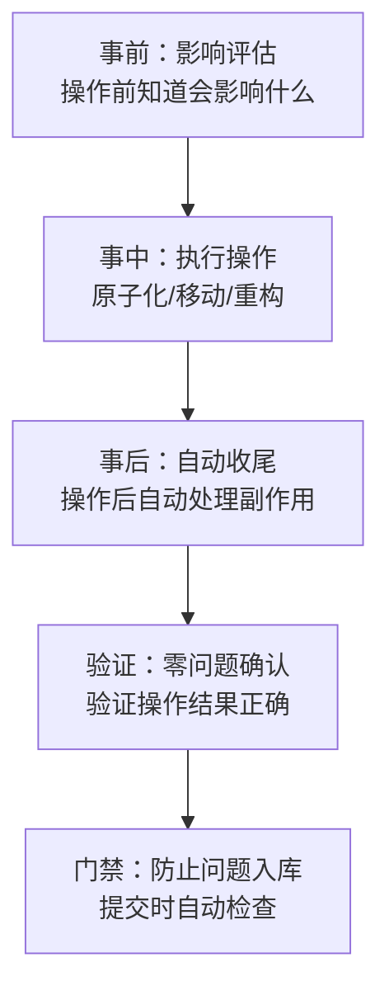

# 工具工作流组合效应（Tool Workflow Composition）

## 模式类型
方法论模式

## 成熟度
L1 实验性（1次案例：断链修复4个工具形成协作链闭环）

## 适用场景
设计内部工具链、开发平台、质量保障体系、CI/CD流水线时，规划工具间的协作关系。

## 问题背景

工具开发容易陷入"单点优化"陷阱——每个工具单独看都不错，但组合起来使用时，操作步骤割裂，中间需要人工衔接，整体效率不高。用户需要记住"操作前先跑A，操作后要跑B和C，最后用D验证"，认知负担重，容易遗漏步骤。

## 核心洞察

> **单个工具解决单点问题，工具组合形成工作流闭环，其价值大于单个工具之和。设计工具时应考虑它在工作流中的位置，以及与上下游工具的协作关系。**

## 工作流组合的三层结构

## 断链修复案例的工具协作链

| 阶段 | 工具 | 职责 | 与上下游关系 |
|------|------|------|------------|
| 事前 | build-ref-index | 查询文件引用，评估影响面 | 操作前运行，输出影响范围 |
| 事中 | （人工操作） | 执行文件移动/重构 | — |
| 事后 | finalize-atomization | 一键收尾：修链接+更新导航+刷新看板 | 操作后自动完成所有后处理 |
| 验证 | check-links | 验证零断链 | 收尾后做最终确认 |
| 门禁 | CI集成（ci-check.ps1） | 提交时守门检查 | 防止问题流入仓库 |

## 组合效应的来源

1. **接口标准化**：工具间通过文件系统/标准输出交互，不需要复杂的API集成
2. **副作用自动处理**：finalize-atomization吸收了原子化的"链接税"（参见best-practice-hidden-cost）
3. **零摩擦衔接**：前一个工具的输出是后一个工具的输入，无需人工转换
4. **失败快速暴露**：每一步都有验证，问题在最早阶段被发现
5. **认知负担降低**：用户不需要记住完整流程，每个工具只负责自己的环节

## 工具设计原则

设计工具时，除了考虑工具本身的功能，还要思考：

1. **操作前（Before）**：是否需要一个工具让用户评估操作影响面？
2. **操作后（After）**：操作会产生什么副作用？能否自动处理？
3. **验证（Verify）**：如何快速验证操作结果正确？
4. **门禁（Gate）**：能否把验证集成到CI/提交流程中防止问题流入？

## 与工具链成熟度的关系

本模式是 `toolchain-maturity.md` L4-L5阶段的实现路径：
- L4操作联动 = 事前+事后工具形成闭环
- L5影响面可视化 = 事前评估工具

没有组合思维，工具链容易停在L2（自动修复）或L3（CI门禁），无法达到L4-L5。

## 检查清单

- [ ] 设计工具时是否考虑了它在工作流中的位置？
- [ ] 操作前是否有影响评估工具？
- [ ] 操作后的副作用是否能自动处理？
- [ ] 操作完成后是否有快速验证手段？
- [ ] 是否有门禁机制防止问题入库？
- [ ] 工具间的衔接是否零摩擦（无需人工中间步骤）？
- [ ] 用户是否需要记住多步操作流程？能否简化？

## 反例警示

| 陷阱 | 后果 |
|------|------|
| 只做单点工具不考虑工作流 | 用户需要人工衔接多步，容易遗漏 |
| 工具间接口不标准 | 需要胶水脚本人工转换 |
| 副作用需要人工处理 | 忘记处理导致问题累积（如原子化后忘记修链接） |
| 验证步骤缺失 | 问题直到下游才被发现，修复成本倍增 |
| 门禁不自动 | 靠人记得跑检查，必然有遗漏 |
