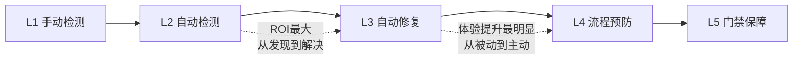

# 工具链演进的五阶段成熟度模型（toolchain-maturity）

## 模式类型
方法论模式

## 成熟度
L1 实验性（从本次实践中归纳，待更多项目验证）

## 适用场景
评估和规划项目工具链（检查脚本、CI/CD、自动化工具、质量保障体系）的演进方向

## 问题背景
工具链建设往往缺乏清晰的演进路线图，容易陷入"头疼医头、脚疼医脚"的被动状态。需要一个成熟度模型来指导工具链建设的优先级和方向。

## 五阶段模型

| 阶段 | 名称 | 特征 | 本次实践对应 |
|------|------|------|-------------|
| L1 | 手动检测 | 人工发现问题，手动修复 | （初始状态：手动发现看板漂移） |
| L2 | 自动检测 | 工具扫描发现问题，报告清单 | check-links.py 初始版 |
| L3 | 自动修复 | 工具发现并自动修复可修复问题 | check-links.py --fix |
| L4 | 流程预防 | 操作流程中集成自动修复，预防问题产生 | finalize-atomization |
| L5 | 门禁保障 | CI/版本控制门禁阻止问题入库 | ci-check.ps1 集成 |

## 跃迁规律

1. **ROI 差异**：每个阶段的投入产出比不同，L2→L3 收益最大（从发现问题到解决问题），L3→L4 体验提升最明显（从被动修复到主动预防）
2. **可跳跃性**：不必按顺序演进，可以跳跃式发展（如直接从 L2 跳到 L4，流程中直接集成预防能力）
3. **加速效应**：工具链成熟后，新问题的"发现→修复→预防"闭环速度会显著加快
4. **完备性**：五个阶段全部达成后形成治理闭环——事前评估→事中操作→事后收尾→提交门禁→定期巡检

## 维度评估表

使用以下维度评估工具链当前成熟度：

| 治理维度 | L1 | L2 | L3 | L4 | L5 |
|---------|----|----|----|----|-----|
| 问题发现时机 | 事后用户反馈 | 人工运行工具 | 工具自动修复 | 操作流程联动 | CI门禁阻止 |
| 修复成本 | 极高（小时级） | 中（分钟级） | 低（秒级） | 零（自动完成） | 零（问题不入库） |
| 误操作防护 | 无 | 无 | dry-run预览 | 流程内嵌 | 强制门禁 |
| 影响面评估 | 不可知 | 不可知 | 无 | 部分支持 | 完整支持 |
| 反馈周期 | 天/周 | 小时 | 分钟 | 秒 | 实时 |

## 规划建议

1. **先达到 L2**：任何问题类型，首先要有自动检测能力，能快速发现问题
2. **优先 L2→L3**：检测到的高频问题优先实现自动修复，这是ROI最高的投入
3. **向 L4 整合**：将自动修复能力整合到操作流程中（如原子化操作的收尾步骤）
4. **最后 L5 门禁**：建立CI门禁，确保问题不会流入主干
5. **不必追求L5全覆盖**：根据问题严重程度选择门禁级别，低风险问题停留在L3/L4即可

## 成功案例

| 工具链 | 起点 | 跃迁 | 时间 |
|--------|------|------|------|
| 文档链接治理 | L1/L2 | L2→L5（部分跳跃） | 1个会话完成核心跃迁 |

> **关联模块**：
> - `methodology-five-level-maturity.md` — 通用五级成熟度模型
> - `three-tier-governance.md` — 三层治理模型
