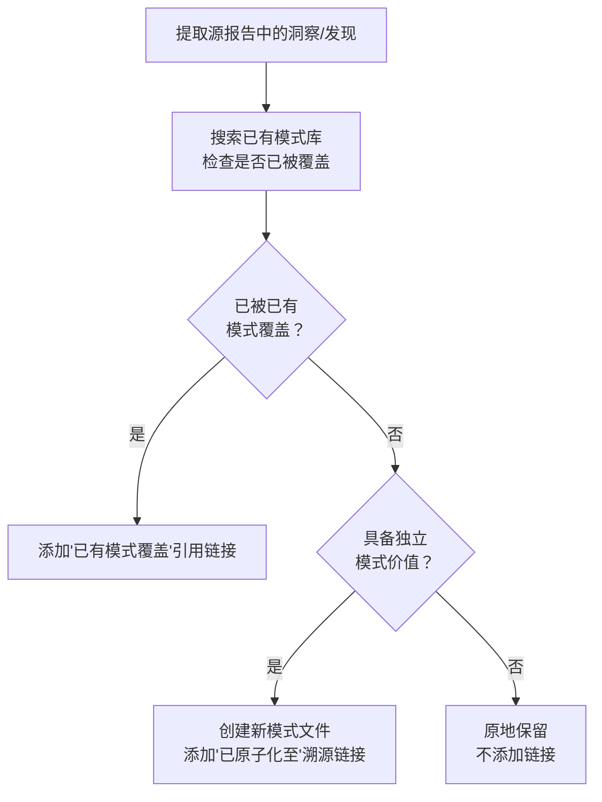

# 三、洞察

## 3.1 发现一："已有模式覆盖"是模式体系成熟的标志

**事实**：在 S4-S7 的 4 个发现中，发现二（跨任务隐性加速）和发现三（数据-代码分离抽象）被判定为"已有模式覆盖"——`retrospective-acceleration-effect.md` 已包含 sqrt(N) 学习曲线公式，`progressive-templating.md` 已在阶段三中系统化了数据-代码分离策略。

**规律**：原子化工作并非"每个发现都必须新建模式"。当模式库积累到一定规模（约 20+ 方法论模式）后，新洞察被已有模式覆盖的概率显著上升。这本身是模式体系成熟的积极信号——意味着项目的认知产出开始收敛，而非无限发散。

**量化**：本批次的"已有覆盖"率为 2/8 = 25%。若该比例在未来原子化任务中持续上升至 50%+，则表明模式体系已接近饱和。

## 3.2 发现二：原子化后的重复内容必须回源合并

**事实**：execution-s1-s3.md 发现三的"深度解析：包结构杠杆效应"子章节（含 mermaid 图、三层本质表格、反例对比、数学公式、lib/ 案例、一句话总结，共 63 行）与 `package-structure-leverage.md` 模式文件高度重复。

**处理**：将 63 行内容精简为 5 行——保留事实和规律陈述，用引用链接指向模式文件以获取完整分析，同时标明模式文件中包含的内容索引。

**规律**：原子化产生了一个"内容所有权"问题——完整的深度分析应该归属于模式文件（唯一权威来源），源报告应降级为概要 + 引用。不合并的代价是未来任何修正都需要在两个地方同步，违反 DRY 原则。

## 3.3 发现三：原子化边际成本递减

**事实**：阶段二（S4-S7）的执行速度明显快于阶段一（S1-S3），尽管两个文件体量相当：
- 阶段一：3 个新模式 + 1 处内容合并 ≈ 15 分钟
- 阶段二：2 个新模式 + 2 处已有覆盖 ≈ 15 分钟（但含 2 处"非创建"类操作）

**规律**：同一会话内连续执行同类原子化任务时，模式文件格式（TOML frontmatter + 标准章节）、索引更新方式（表格追加 + mermaid 节点）和溯源链接格式均已内化，后续文件的处理不再产生格式决策成本。

---

# 四、萃取

## 4.1 新发现模式：原子化三级分类策略

**定义**：对源报告中的洞察/发现进行原子化时，采用三级分类而非简单的"提取/不提取"二分法：
1. **新建模式**：洞察独立于已有模式，且具备跨任务复用价值
2. **已有覆盖**：洞察已被已有模式充分覆盖，添加引用链接即可
3. **原地保留**：洞察不具备独立模式价值（如一次性经验、过于具体的实施细节）

**本案例验证**：

| 分类 | 本批次数量 | 示例 |
|------|----------|------|
| 新建模式 | 5 | auto-generate-threshold、i18n-anchor-page-strategy 等 |
| 已有覆盖 | 2 | 发现二→retrospective-acceleration-effect、发现三→progressive-templating |
| 原地保留 | 0 | — |

**操作流程**：

**适用场景**：任何对复盘报告进行原子化的任务，尤其是模式库已有一定积累（20+ 模式）之后。

> **已原子化至**：[atomization-three-tier-classification.md](../../../patterns/methodology-patterns/document-architecture/atomization-three-tier-classification.md)

## 4.2 新发现模式：原子化后内容回源合并

**定义**：当源报告中的深度分析被提取为独立模式后，源报告中的对应内容应降级为概要 + 引用链接，而非保留全文。降级时需在引用中标注模式文件中包含的内容清单，方便读者按需跳转。

**原则**：
- 模式文件 = 完整分析的唯一权威来源
- 源报告 = 事实陈述 + 规律概要 + 跳转指引
- 引用链接需给出"内容索引"（如"含 mermaid 图解、维度对比表、数学公式推导"）

**反例警示**：不合并的后果是内容双写（源报告一份、模式文件一份），任何修正需双向同步。

> **已原子化至**：[post-atomization-content-merge-back.md](../../../patterns/methodology-patterns/document-architecture/post-atomization-content-merge-back.md)

## 4.3 可复用资产登记

| 资产 | 位置 | 复用等级 | 说明 |
|------|------|---------|------|
| auto-generate-threshold 模式 | patterns/methodology-patterns/ | 直接复用 | 30% 阈值判断法则 + 操作流程 |
| scripted-batch-correction 模式 | patterns/methodology-patterns/ | 直接复用 | 安全决策矩阵 + 脚本模板 |
| package-structure-leverage 模式 | patterns/methodology-patterns/ | 直接复用 | 三层结构杠杆效应量化分析 |
| refactoring-hidden-bug-discovery 模式 | patterns/methodology-patterns/ | 直接复用 | 重构 ROI 公式 + 20% 缓冲原则 |
| i18n-anchor-page-strategy 模式 | patterns/methodology-patterns/ | 按场景适配 | 锚定页内容结构 + 检查清单 |
| 原子化三级分类策略 | 本报告 4.1 | 直接复用 | 新建/已有覆盖/原地保留 三级判断 |

---