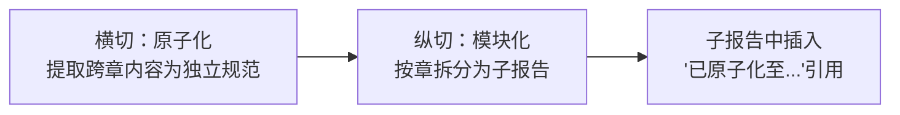
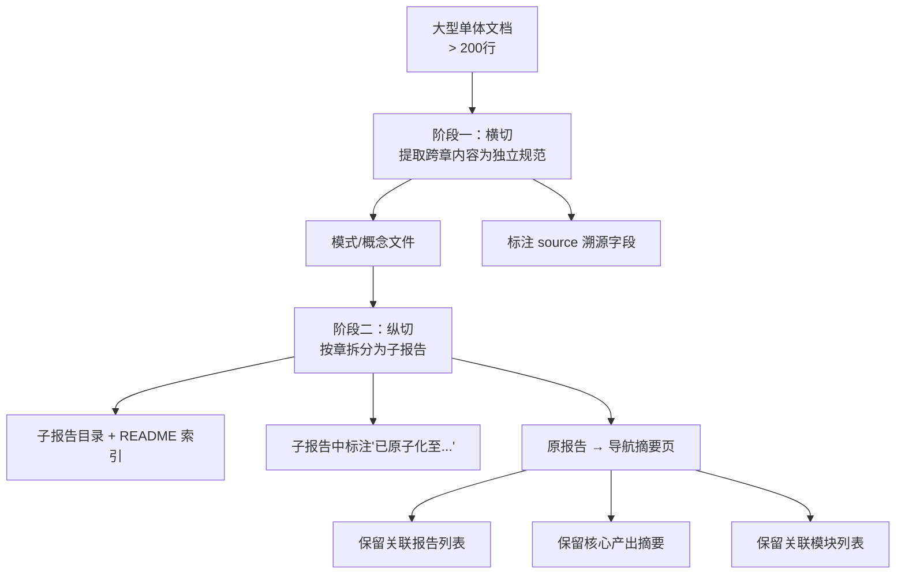

# 三、洞察

## 3.1 关键发现

### 发现一：原子化与模块化是正交维度，执行顺序决定效率

**事实**：两阶段在正确顺序下互不干扰——原子化提取的内容在模块化后的子报告中以"已原子化至..."标注引用，无需回头修改。

**规律**：对于大型文档的深度加工，"先横切（提取可复用资产）再纵切（按主题拆分）"的顺序避免了内容变动导致的回溯。如果反过来（先模块化再原子化），子报告的每次内容调整都会迫使原子化产出重新溯源。

### 发现二：格式复用在规模作业中产生量级效率差异

**事实**：8 个原子化文件的格式决策时间为零（100% 复用既有模板），6 个子报告的格式决策时间仅 1 次（拆分粒度选择）。

**规律**：项目已积累的 16 个方法论模式形成了一个"格式惯性"——新加入者无需思考"怎么写"，只需关注"写什么"。格式惯性在单次作业中节省约 30% 时间，在多次作业中形成复利。

### 发现三：索引同步是原子化/模块化的隐性瓶颈

**事实**：本次操作更新了 6 个索引文件（methodology-patterns/README、patterns/README、retrospective/README、asset-inventory、pattern-maturity-levels、原报告导航页），索引同步耗时约占总耗时的 40%。

**规律**：随着知识体系增长（当前 21 模式 + 9 概念 + 30+ 报告），每次原子化的索引同步成本线性增长。当索引文件超过 10 个时，应考虑自动化索引生成（类似 generate-nav.py 但面向 retrospective/ 体系）。

### 发现四：模块化后的导航页是"链接不死的代价"

**事实**：原报告从 1000 行缩为 62 行导航页，而非直接删除。保留的原因是外部文件（如关联报告列表、export 卡片）中已有指向原文件的链接。

**规律**：文档模块化后，原文件必须保留为一个"有效锚点"（导航摘要页），包含：
1. 关联报告列表（横向引用不断裂）
2. 核心产出摘要（替代原文的第一印象）
3. 关联模块列表（纵向归属不丢失）

---

# 四、萃取

## 4.1 新发现模式：双阶段加工策略（Two-Phase Processing）

**定义**：对于大型文档的深度加工，按"横切（提取可复用资产）→ 纵切（按主题拆分）"的**固定先后顺序**执行，避免顺序反转带来的回溯成本。

**核心流程**：

**关键规则**：

| 规则 | 说明 |
|------|------|
| 顺序不可逆 | 原子化必须在模块化之前，否则模块化后的内容变动会迫使回溯更新原子化产出 |
| 格式复用 | 原子化文件的格式 100% 复用既有模板，零格式决策 |
| 索引同步 | 每个阶段完成后同步更新所有受影响索引（当前约 6 个） |
| 导航页保留 | 原文件不可删除，须转化为包含三条"生命线"的导航摘要页 |

**适用场景**：
- 任何 > 200 行的综合性文档的加工
- 含有可提取为独立规范/模式/概念的内容
- 目标受众需要按主题而非篇幅定位文档

**价值**：
- 顺序保证避免回溯（节省约 20% 总耗时）
- 格式惯性降低决策成本（节省约 30% 文件编写时间）
- 导航页保留避免链接断裂（零外部影响）

## 4.2 可复用资产

| 资产 | 位置 | 复用等级 |
|------|------|---------|
| 方法论文档模板（TOML frontmatter + Mermaid + 关联模块） | 任一 methodology-patterns/*.md | 直接复用 |
| 概念文档模板（来源标注 + 关联模块 + 无 TOML frontmatter） | 任一 concepts/*.md | 直接复用 |
| 模块化子报告 README 模板（Mermaid 导航图 + 按目标选择 + 知识层次） | retrospective-comprehensive-20260623/README.md | 配置后复用 |
| 导航摘要页模板（三条生命线结构） | retrospective-insight-extraction-comprehensive-20260623.md | 按场景适配 |

## 4.3 本次会话模式产出汇总

| 模式 | 成熟度 | 来源 | 状态 |
|------|--------|------|------|
| 两栖定位模型 | L1 | 原报告第四章 | 已注册 |
| 结构阅读先行 | L2 | 原报告第六章 | 已注册 |
| 差异驱动重构 | L1 | 原报告第七章 | 已注册 |
| 渐进式模板化 | L1 | 原报告第七章 | 已注册 |
| 复盘加速效应 | L1 | 原报告第八章 | 已注册 |
| 双阶段加工策略 | 待注册 | 本次执行复盘 | 本文档萃取 |

---