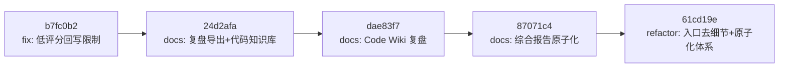

# 入口文件去技术细节与体系深化 — 复盘报告

> **复盘范围**：`d1c0e0b..61cd19e` 共 5 个提交，跨 2 个自然日（2026-06-23 ~ 2026-06-24）
> **复盘日期**：2026-06-24
> **执行模式**：单智能体全程，多轮会话连续执行
> **报告类型**：阶段复盘 + 方法论萃取（已原子化）

## 项目概览

### 提交全景

### 各提交变更量

| 提交 | 类型 | 文件数 | +行 | -行 | 核心内容 |
|------|------|--------|-----|-----|---------|
| `b7fc0b2` | fix | 3 | +4 | -3 | 限制低评分提示词优化结果回写 |
| `24d2afa` | docs | 6 | +759 | -9 | 补充复盘导出索引 + Code Wiki 知识库 |
| `dae83f7` | docs | 1 | +204 | -0 | Code Wiki 生成任务复盘报告 |
| `87071c4` | docs | 9 | +610 | -678 | 综合报告原子化为 6 子模块 |
| `61cd19e` | refactor | 26 | +2668 | -382 | 入口文件去技术细节 + 原子化体系深化 |
| **合计** | | **45** | **+4245** | **-1072** | |

### 交付物清单

| 类别 | 数量 | 说明 |
|------|------|------|
| 入口文件精简 | 2 个 | README.md（-319 行）、AGENTS.md（去技术注释 + 新增路由条目） |
| 新增 .agents/ 子目录 | 2 个 | systems/（系统架构）、cases/（复用案例） |
| 新增方法论模式 | 14 个 | 含本复盘萃取的 entry-container-separation、source-document-downgrade |
| 新增检查脚本 | 3 个 | check-atomization-coverage.py、check-atomization-duplication.py、check-retrospective-index.py |
| 新增复盘报告 | 7 个 | 综合报告 6 子模块 + 2 原子化复盘 + 1 Code Wiki 复盘 + 本报告及子模块 |
| 新增 Code Wiki | 3 个 | dependencies.md、key-apis.md、runtime.md |
| 新增知识概念 | 4 个 | critical-mass-of-methods、meta-document-leverage、pattern-maturity-levels（更新）、self-referentiality |
| 提示词萃取修复 | 3 个 | config.py、pipeline.py、test_pipeline.py |
| **新增方法论模式总数** | **44 个** | L1: 21 / L2: 17 / L3: 1 / L4: 0（当前快照） |

## 子模块导航

| 章节 | 权威来源 | 说明 |
|------|---------|------|
| 执行复盘 | [execution-retrospective.md](execution-retrospective.md) | 实施过程回顾、关键节点分析、量化数据、成功经验与问题 |
| 洞察萃取 | [insight-extraction.md](insight-extraction.md) | 3 个关键发现、2 条规律认知、5 个潜在机会 |
| 导出建议 | [export-suggestions.md](export-suggestions.md) | 改进建议、行动计划、模式候选、后续优化方向 |
