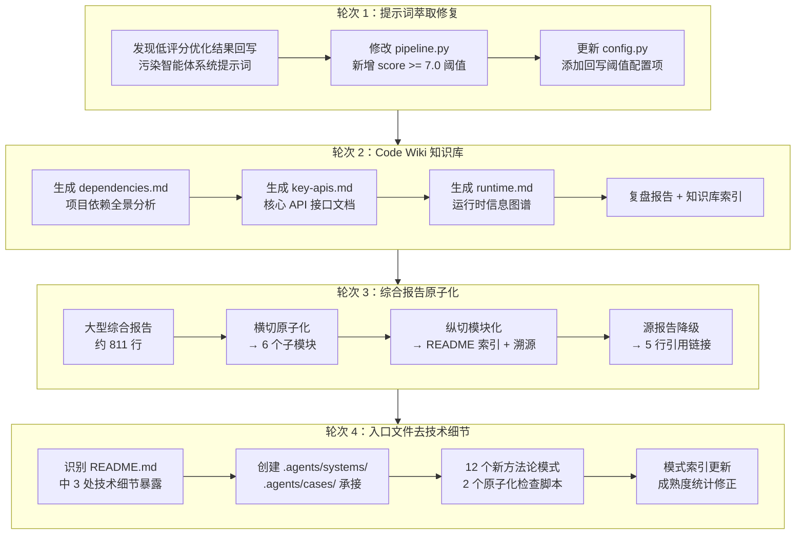

# 执行复盘

## 实施过程回顾

## 关键节点分析

### 节点 1：提示词萃取回写阈值（b7fc0b2）

| 维度 | 内容 |
|------|------|
| **触发** | 低评分优化结果被回写到 `.agents/prompts/` 目录，噪音污染智能体提示词 |
| **决策** | 在 `pipeline.py` 中新增阈值判断，仅评分 ≥ 7.0 的结果允许回写 |
| **效果** | 一次性修复，防止了劣质优化结果的自动回写 |
| **遗留** | 阈值 7.0 为经验值，尚未经足够验证 |

### 节点 2：Code Wiki 知识库生成（24d2afa + dae83f7）

| 维度 | 内容 |
|------|------|
| **触发** | 用户指令：生成项目代码知识库 |
| **决策** | 按 dependencies/key-apis/runtime 三维度组织，生成 Markdown 文档 |
| **效果** | 3 个知识库文件（共 759 行），补充了知识库体系的技术维度 |
| **特点** | 全自动生成 + 人工索引，属于"先产再治"模式 |

### 节点 3：综合报告原子化（87071c4）

| 维度 | 内容 |
|------|------|
| **触发** | 综合性复盘报告 811 行，包含大量可独立复用的洞察 |
| **决策** | 应用双阶段加工：先横切为 6 个子模块（项目概述/执行复盘/洞察萃取/改进建议/元闭环/导出），再纵切各模块内部结构 |
| **效果** | 6 个子文档 + README 索引 + 溯源链接，源报告降级为引用导航 |
| **模式复用** | two-phase-processing、progressive-templating、content-migration-workflow |

### 节点 4：入口文件去技术细节（61cd19e）

| 维度 | 内容 |
|------|------|
| **触发** | 用户指令：README.md 与 AGENTS.md 不要暴露技术细节 |
| **决策** | 将 3 处技术细节（提示词萃取架构表、AgentForge 复用对照表、具体脚本命令）迁移至 `.agents/systems/` 和 `.agents/cases/` 新目录 |
| **效果** | README.md 从约 327 行精简至约 206 行（-37%），AGENTS.md 去括号技术注释 |
| **新增** | 同期完成 12 个方法论模式萃取、2 个原子化检查脚本 |

## 执行情况量化

| 指标 | 数值 | 说明 |
|------|------|------|
| 总提交数 | 5 | b7fc0b2 → 61cd19e |
| 总变更文件 | 52 | 含新增与修改 |
| 净增代码行 | +3173 | 4245 新增 - 1072 删除 |
| README 精简率 | 37% | 327 行 → 206 行 |
| 新增模式 | 14 个 | 方法论模式总数达 44 |
| 新增检查脚本 | 3 个 | coverage + duplication + retrospective-index |
| 新增 .agents/ 子目录 | 2 个 | systems/ + cases/ |
| 新增知识概念 | 4 个 | 含 2 个全新 + 2 个更新 |
| 方法论模式成熟度分布 | L1:21 / L2:17 / L3:1 | 当前快照 |

## 成功经验

1. **入口-容器分离原则有效**：将技术细节从面向人类的 README.md 和面向智能体的 AGENTS.md 中剥离，归入 `.agents/` 容器子目录，既保护了入口文件的简洁性，又保持了技术细节的可检索性。两文件分别被人类读者和 AI 智能体读取，技术细节对两者均非必需。

2. **双阶段加工策略再次验证**：综合报告 811 行 → 6 子模块的原子化过程，严格遵循"先横切（原子化）再纵切（模块化）"的先后顺序，避免了试图一步到位的混乱。这是 `two-phase-processing` 模式的第三次成功应用。

3. **文档降级模式成熟**：综合报告原子化后将源文档降级为 5 行引用链接（而非删除），确保了引用不失效，同时维护了单一的权威来源（单一真相源 = 子模块文件）。

4. **新目录创建遵循约定驱动**：`.agents/systems/` 和 `.agents/cases/` 的创建遵循了现有的 `.agents/` 子目录命名和结构约定（README + 内容文件），零额外决策成本。

## 存在问题

| 问题 | 根因 | 影响 |
|------|------|------|
| 方法论模式数量快速增长（34→44），L1:21 占比达 48% | 原子化过程中"新建模式"为默认策略 | 大量 L1 模式待验证，成熟度统计的参考价值被稀释 |
| 部分模式存在概念重叠 | 萃取时以"源头文件"为边界而非"概念域"为边界 | `self-referential-spec-system` 与 `self-referentiality`（概念）可能重叠 |
| 成熟度更新滞后 | 部分 L1 模式已被多次验证但未更新成熟度 | 成熟度分布数据可能低估了实际验证状态 |
| 入口文件精简可能过度 | README.md 的"提示词萃取系统"章节仅剩 5 行 | 新读者可能无法从 README 获得足够的系统概览 |
