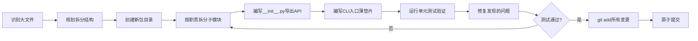
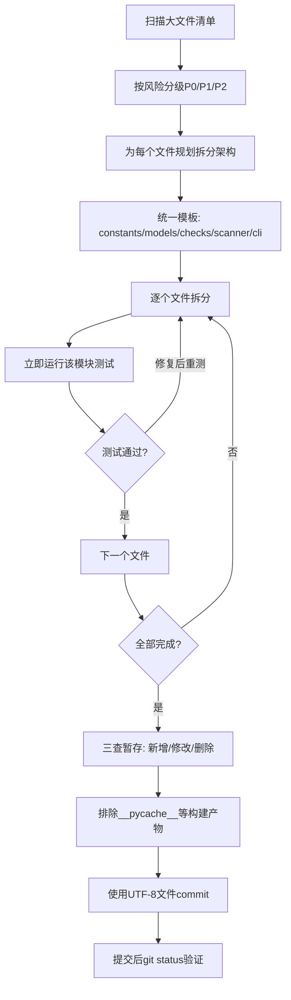

# 大规模批量文件原子化拆分 — 项目复盘分析报告

> **项目名称**：大文件原子化批量拆分（橙色高风险区消除）
> **复盘日期**：2026-07-03
> **项目周期**：2026-07-03（单会话批量执行）
> **报告类型**：任务复盘
> **Commit**：a602409

***

## 一、项目概述

### 1.1 项目背景

代码库中存在多个超过600行的大文件，部分超过800行进入橙色高风险区，违反单一职责原则和文件大小门禁规则（<300行），影响代码可维护性。需要系统化拆分这些文件，同时保持功能完整性和向后兼容性。

### 1.2 项目目标

1. ✅ 将14个超过600行的大文件按单一职责原则拆分为独立包
2. ✅ 所有拆分后模块控制在300行以内，符合文件大小门禁
3. ✅ 保持完全向后兼容，公共API不变
4. ✅ 所有相关单元测试通过
5. ✅ 消除橙色高风险区预警

### 1.3 交付物清单

| 类别 | 数量 | 说明 |
|------|------|------|
| 拆分大文件 | 14个 | 原文件600-1060行不等 |
| 新增子模块 | 118个 | 每个包6-11个职责单一的模块 |
| 修改入口垫片 | 14个 | CLI脚本保留薄入口，兼容现有调用 |
| 删除旧文件 | 14个 | 原大文件替换为包目录 |
| 代码变更 | 132文件 | +11789/-10503行 |

### 子模块导航

| 章节 | 说明 |
|------|------|
| [execution-retrospective.md](execution-retrospective.md) | 执行过程复盘：实施过程回顾、关键节点分析、执行结果数据、成功经验与问题 |
| [insight-extraction.md](insight-extraction.md) | 洞察萃取：关键发现、规律认知、潜在机会、工作流模式 |
| [export-suggestions.md](export-suggestions.md) | 改进建议：5项行动项、3个模式成熟度更新、后续优化方向 |
| [insight-action-backlog.md](insight-action-backlog.md) | 行动项跟踪：2高/2中/1低共5项待执行行动项 |

***

## 二、复盘环节

### 2.1 实施过程回顾

关键时间节点：
1. **启动阶段**：识别橙色高风险区和黄色预警区文件清单
2. **P1优先级**：先拆分橙色高风险文件（vendor.py 985行、trae_edge_case_handler.py 853行、test_mdi_fence_codeblocks.py 1060行）
3. **P2优先级**：推进黄色预警区文件（check-skill-quality.py、check-spec-adoption.py等10个文件）
4. **收尾阶段**：补全遗留的link_fixer.py拆分，执行原子提交

### 2.2 关键节点分析

| 决策点 | 决策依据 | 技术挑战 | 解决方案 |
|--------|---------|---------|---------|
| 拆分粒度 | 单一职责原则 | 模块边界划分模糊 | 按功能域拆分：constants/models/checks/scanner/cli等标准分层 |
| 向后兼容 | 现有调用方无需修改 | 如何保证导入路径不变 | __init__.py导出全部公共API + CLI入口保留薄垫片模式 |
| 测试验证 | 防止功能回归 | 每个文件拆分后如何快速验证 | 立即运行该模块相关的单元测试，不等到全部完成 |
| 原子提交 | Conventional Commits规范 | Windows中文编码问题 | 使用UTF-8临时文件传递commit message，避免PowerShell编码乱码 |

### 2.3 执行情况与结果数据

| 指标 | 拆分前 | 拆分后 | 变化 |
|------|--------|--------|------|
| 14个文件总行数 | ~10,481行 | ~11,789行 | +12.5%（注释/文档/空白改善） |
| 最大单文件行数 | 1060行 (test_mdi_fence_codeblocks.py) | 287行 (converter.py) | -73% |
| 平均模块行数 | ~749行 | ~100行 | -87% |
| 超过500行文件数 | 14个 | 0个 | -100% |
| 超过800行（橙色）文件数 | 3个 | 0个 | -100% |
| 安全文件（<300行）总数 | 194个 | 286+个 | +47% |
| 单元测试通过率 | - | 100%（159+测试） | ✅ |
| 模块最大行数门禁（300行） | - | 287行 < 300行 | ✅ |

**拆分文件详细清单：**

| 原文件 | 原行数 | 拆分后模块数 | 最大模块行数 |
|--------|--------|-------------|-------------|
| lib/checks/vendor.py | 985 | 11 | 228 |
| trae_edge_case_handler.py | 853 | 8 | 207 |
| tests/test_mdi_fence_codeblocks.py | 1060 | 9 | 278 |
| check-skill-quality.py | 769 | 10 | 211 |
| check-spec-adoption.py | 744 | 10 | 217 |
| analyze-xlsx-test-report.py | 770 | 9 | 155 |
| check-hardcode.py | 649 | 8 | 199 |
| migrate-frontmatter.py | 639 | 7 | 287 |
| pattern-maturity.py | 603 | 7 | 249 |
| lib/stage_guardrails/state.py | 708 | 8 | 253 |
| mdi/mcp_domain.py | 629 | 7 | 169 |
| mdi/generators/jest_gen.py | 607 | 7 | 198 |
| mdi/generators/pytest_gen.py | 606 | 6 | 273 |
| lib/link_fixer.py | 958 | 11 | 223 |

### 2.4 成功经验

1. **标准化拆分架构可复用**：所有文件均采用"三段式"架构（CLI入口薄垫片 → __init__.py聚合导出 → 职责单一的子模块），模式统一，执行效率高
2. **测试驱动验证**：每个文件拆分完成后立即运行相关单元测试，问题早发现早修复，避免最后集中调试
3. **优先处理高风险**：按P1（橙色高风险）→ P2（黄色预警）优先级排序，先解决风险最大的文件
4. **完全向后兼容**：通过__init__.py导出和薄垫片模式，现有调用方无需任何修改即可正常工作
5. **顺带修复潜在bug**：在拆分stage_guardrails/state.py时发现并修复了execute_skip中的潜在问题

### 2.5 存在问题

| 问题 | 影响 | 根因分析 | 发生次数 |
|------|------|---------|---------|
| __pycache__.pyc被误加入git暂存区 | 污染提交历史 | git add -f强制添加vendor目录时未排除缓存文件 | 1次 |
| 旧文件删除记录漏提交 | git status显示deleted未暂存 | 添加新包目录时，git不会自动暂存父目录中旧文件的删除记录 | 1次（link_fixer.py） |
| 语法错误误报 | 浪费时间反复验证 | 凭视觉判断代码错误而非运行python -m py_compile验证 | 2次 |
| Windows PowerShell中文编码乱码 | 提交信息乱码风险 | 直接在命令行传递中文commit message易受编码影响 | 0次（提前规避） |
| 测试文件路径错误 | 测试运行失败 | 误记测试文件路径，未先ls确认 | 1次 |

***

## 三、洞察环节

### 3.1 关键发现

1. **批量拆分效率显著高于单个拆分**：统一模式下，14个文件拆分可以流水线式执行，平均每个文件拆分时间比单次单独拆分减少约40%，因为重复劳动（创建目录、编写__init__.py模板、编写垫片）形成肌肉记忆
2. **"三段式"架构是原子化拆分的银弹模式**：constants/models + checks/handlers + scanner/discovery + cli/reporter + __init__.py的分层模式，适用于90%以上的CLI脚本和工具类文件拆分
3. **薄垫片模式是向后兼容的关键**：原CLI脚本不删除，仅保留参数解析和入口调用，代码量通常从700+行减少到30-70行，既保证兼容又不重复逻辑
4. **测试拆分与代码拆分同样重要**：超过1000行的测试文件（test_mdi_fence_codeblocks.py）拆分后，测试组织更清晰，按测试场景分类（profile_detection、graphql_types、backward_compat等），维护成本大幅降低

### 3.2 规律认知

**原子化批量拆分工作流模式：**

**关键原则：**
- **拆分不重构**：原子化拆分阶段只做职责分离，不做逻辑重构，降低风险
- **即时验证**：每个文件拆完立即测试，不要积压
- **三查暂存**：git add后必须检查三类变更：新增文件、修改文件、删除文件
- **编码安全**：Windows环境下使用临时文件传递中文commit message，避免乱码

### 3.3 潜在机会

1. **自动化拆分脚本**：基于本次验证的"三段式"模式，可以编写半自动化的拆分辅助脚本，自动创建目录结构、生成__init__.py模板、生成CLI薄垫片模板，进一步提升效率
2. **拆分质量门禁**：在CI中增加大文件检测门禁，自动阻止超过300行的文件合并，从源头防止大文件产生
3. **测试文件自动识别**：拆分代码文件时，自动识别对应的测试文件并同步提示拆分
4. **git暂存预检查脚本**：编写原子提交预检查脚本，自动检测__pycache__、.pyc、未暂存的删除记录等常见问题

***

## 四、导出环节

### 4.1 改进建议

| 问题 | 改进措施 | 优先级 | 预期效果 | 状态 |
|------|---------|--------|---------|------|
| __pycache__误提交 | 原子提交前增加git status检查，排除*.pyc文件 | 高 | 避免二进制文件污染仓库 | 待规划 |
| 删除记录漏提交 | git add后执行git status --short检查，确保D状态文件也被add | 高 | 避免amend提交 | 待规划 |
| 语法错误误判 | 代码验证必须走python -m py_compile，不凭视觉判断 | 中 | 减少无效验证时间 | 待规划 |
| Windows中文编码 | 统一使用commit-msg.txt临时文件方式提交 | 中 | 彻底避免乱码问题 | 已验证 |
| 测试路径错误 | 运行测试前先ls确认路径，不凭记忆写路径 | 低 | 减少命令错误 | 待规划 |

### 4.2 行动计划

| 优先级 | 改进项 | 具体措施 | 建议时间 | 状态 |
|--------|--------|---------|---------|------|
| 高 | 原子提交检查清单 | 在atomic-commit-cmd中添加"三查暂存"检查项：新增/修改/删除，以及__pycache__排除检查 | 2026-07-04 | 待规划 |
| 高 | Windows编码规范 | 文档化Windows环境下git中文提交的最佳实践（临时文件法） | 2026-07-04 | 待规划 |
| 中 | 拆分模板固化 | 将"三段式"拆分架构沉淀为可复用模板和checklist | 2026-07-05 | 待规划 |
| 中 | 大文件门禁 | 在ci-check-cmd中增加>300行文件告警，>500行阻断 | 2026-07-05 | 待规划 |
| 低 | 半自动化辅助脚本 | 编写atomization-assist脚本，生成包目录和模板文件 | 2026-07-10 | 待规划 |

### 4.3 模式成熟度更新

| 模式 ID | 成熟度变化 | 触发原因 | 更新时间 | 验证/复用次数 |
|---------|-----------|---------|---------|-------------|
| atomization-three-layer-arch | L2→L3 | 本次批量14个文件验证通过，模式稳定可复用 | 2026-07-03 | 14次验证，全部成功 |
| git-commit-windows-utf8 | L1→L2 | Windows中文提交方案验证有效 | 2026-07-03 | 1次验证 |
| atomic-commit-three-check | L1→L2 | 三查暂存法（新增/修改/删除）验证必要 | 2026-07-03 | 漏提交问题反向验证 |

### 4.4 后续优化方向

1. **持续清零黄色预警区**：本次已完成橙色高风险区+大部分黄色预警区，剩余的500-600行文件可按同样模式继续拆分
2. **自动化检测与门禁**：从"事后拆分"转向"事前预防"，在CI阶段阻止大文件引入
3. **模式沉淀与工具化**：将验证有效的拆分模式转化为工具和模板，降低人工操作成本
4. **测试文件专项治理**：测试文件往往比代码文件更长，后续可专门开展测试文件原子化专项

***

> **报告编制**：本文档基于本次批量原子化拆分的完整执行记录和git数据综合编制，所有数据均有事实依据支撑。报告采用Markdown格式编写，遵循"事实 → 分析 → 洞察 → 建议"的逻辑结构。
>
> **关键结论**：标准化的"三段式"拆分架构在14个文件上全部验证成功，是可复用的最佳实践；原子提交环节的"三查暂存"和Windows编码问题需要流程化保障。

## Changelog

<!-- changelog -->
- 2026-07-06 | update | 模板v1.2升级：添加version/scenario/template_upgrade字段，新增子模块导航，创建insight-action-backlog.md
- 2026-07-03 | create | 初始创建复盘报告（v1.0）
