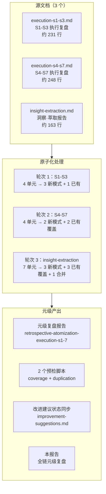

# AI 智能体开发规范体系 — 全链原子化 复盘报告

> **项目名称**：全链原子化（Meta-Atomization Full Chain）
> **复盘日期**：2026-06-24
> **项目周期**：六轮执行（跨多轮会话连续执行）
> **报告类型**：元级复盘（对原子化工作的复盘）

## 项目概览

### 1.1 任务全景

### 1.2 全链交付物

| 类别 | 数量 | 说明 |
|------|------|------|
| 新增方法论模式 | **10 个** | 3（S1-S3）+ 2（S4-S7）+ 2（A4 执行）+ 3（insight-extraction） |
| 已有模式覆盖引用 | **7 处** | 识别出 7 个洞察已被已有模式覆盖，添加引用链接 |
| 重复内容合并 | **1 处** | 63 行深度解析从源文档降级为引用链接 |
| 溯源/覆盖链接 | **20 处** | 3 个源文档中新增的"已原子化至"/"已有模式覆盖"标注 |
| 自动化脚本 | **2 个** | check-atomization-coverage.py + check-atomization-duplication.py |
| 元级复盘报告 | **2 个** | retrospective-atomization-execution-s1-7 + 本报告 |
| 状态同步 | **1 个** | improvement-suggestions.md 全面刷新 |
| 索引更新 | **6 轮** | methodology-patterns/README.md × 3 + patterns/README.md × 3 |
| 成熟度统计修正 | **1 次** | 发现 L1/L2 分布偏差并修正 |

## 子模块导航

| 章节 | 权威来源 | 说明 |
|------|---------|------|
| 执行复盘 | [execution-retrospective.md](execution-retrospective.md) | 六轮执行全景、量化数据、各源文档处理结果、遇到的问题 |
| 洞察萃取 | [insight-extraction.md](insight-extraction.md) | 四个关键发现、新发现的元级模式、可复用资产汇总 |
| 导出建议 | [export-suggestions.md](export-suggestions.md) | 改进建议、模式体系状态、全链演进轨迹、后续方向 |

## 关联报告

[retrospective-comprehensive-20260623/](../../project-governance/comprehensive-reviews/retrospective-comprehensive-20260623/README.md)、[retrospective-atomization-execution-s1-7-20260624.md](../retrospective-atomization-execution-s1-7-20260624/README.md)、[review-insight-export-loop.md](../../../patterns/methodology-patterns/retrospective-knowledge/review-insight-export-loop.md)
