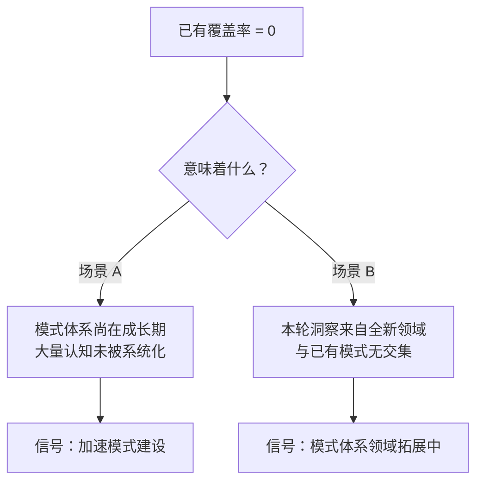

# insight-extraction.md 原子化归档 — 洞察萃取

> **分析对象**：`insight-extraction.md` 原子化归档全流程
> **分析日期**：2026-06-25
> **洞察数量**：5 项

---

## 一、核心洞察

### 洞察 1：洞察文档原子化的「4:1 压缩比」规律

**发现**：从 274 行洞察文档中提取 7 个独立模式后，每个模式平均 129 行（含 frontmatter、流程图、正反例等完整结构），模式总行数约 903 行。源文档降级后 75 行（纯导航）。净增约 700 行内容。

| 维度 | 原子化前 | 原子化后 | 变化 |
|------|---------|---------|------|
| 源文档行数 | 274 | 75 | -199 |
| 模式文件总行数 | 0 | ~903 | +903 |
| 信息总量 | 274 | ~978 | +257% |
| 可独立检索单元 | 1 | 7 | +600% |

**洞察深度**：原子化不是简单的「拆分」，而是一次**信息增殖**——每个洞察在独立为模式后，需要补充「适用场景」「操作流程」「检查清单」「正反例」「模式关系」等结构，这些在原文档中以隐含形式存在但未被显式化。因此原子化同时完成了「结构化增补」。

**成熟度评估**：L1（首次量化观察）

---

### 洞察 2：三级分类中「已有覆盖」判断的信号价值

**发现**：本轮原子化中，「已有覆盖」分类的数量为 **0**。这不是偶然的——它揭示了一个重要的信号：



本轮属于**场景 B**：7 项洞察全部来自「AI Skill 工程实现」这一全新领域（此前文章学习复盘的 7 项洞察侧重「设计哲学」，本次 7 项侧重「工程实现」），与已有 56 个模式的核心领域（文档治理、开发流程、知识管理、赛事运营）交集极低。

**可迁移性**：当已有覆盖率为 0 时，不应机械套用三级分类策略的「已有覆盖率 > 50% 说明模式体系接近饱和」的结论，而应先判断是「体系不成熟」还是「领域不重叠」。

**成熟度评估**：L2（有三级分类策略的量化数据佐证）

---

### 洞察 3：规律认知的「并入而非独立」处置原则

**发现**：本轮 2 条规律认知（四维约束模型、分离控制原理）并非独立创建模式，而是被并入已规划的同领域洞察模式。这一决策背后的判断逻辑：

| 判断维度 | 规律 1（四维约束模型） | 规律 2（分离控制原理） |
|---------|----------------------|----------------------|
| 是否有 ≥ 2 个可操作步骤？ | 否（仅为分类框架） | 否（仅为一个原理陈述） |
| 是否可被其他项目独立复用？ | 有限（太抽象） | 有限（太抽象） |
| 是否与已有/规划中的模式有明确区分边界？ | 否（是 output-behavior-specification 的理论基础） | 否（是 style-creativity-separation-control 的理论基础） |

两个规律均不满足「独立模式价值」的检查清单，但作为对应洞察模式的理论支撑有重要价值。处置方案：并入对应模式的「问题背景」或「核心规则」章节，而非独立建文件。

**可迁移性**：在三级分类判断中，应增加一个「理论并入」子分类——既不独立建模式，也不原地保留，而是作为已规划模式的理论章节并入。

**成熟度评估**：L1

---

### 洞察 4：模式索引的「选择性更新」困境

**发现**：本轮更新了 3 个 README 索引（architecture-patterns/、methodology-patterns/、patterns/），但**未更新** methodology-patterns README 的 4 个大型 Mermaid 关系图。

决策依据：
- 4 个关系图总计约 200 行 Mermaid 代码，每个图涉及 10-20 个节点的连接关系
- 新增 6 个模式后，需要在知识管理关系图中增加节点和连线，并考虑跨图引用
- 手工编辑 Mermaid 图的出错概率远高于表格更新
- 这批模式调性一致（均为 AI Skill 工程领域），后续可能还会新增，适合批量更新而非逐个追加

这是一个典型的**「索引维护的边际成本递增」问题**——当 README 中的可视化索引（Mermaid 图）复杂度超过一定阈值后，每次新增模式的维护成本开始超过收益。

**可迁移性**：应在模式库 README 中制定「Mermaid 图更新阈值」规则——例如：每新增 ≥ 5 个同领域模式时，触发一次关系图批量更新；单次新增 ≤ 3 个模式时，仅在表格中追加，暂不更新关系图。

**成熟度评估**：L1

---

### 洞察 5：并行原子化的「批次效应」

**发现**：同日完成两轮原子化（文章学习复盘的 7 个模式 + 源码分析复盘的 7 个模式），总计 14 个新模式入库。这产生了两个有趣的效应：

**正向效应——领域互补**：两批 14 个模式虽然来自同一项目（Ian Xiaohei Illustrations），但覆盖了两个完全不同的认知层面（设计哲学 vs 工程实现），形成了对该项目的全方位知识覆盖。

**负向效应——索引膨胀**：模式库总量从 56 跃升至 63，L2 从 27 跃升至 34。方法论模式库从 44 增至 50——单日增长 13.6%。这种「批次式」增长会暂时降低模式库的认知可导航性——新用户面对 50 个方法论模式时需要更多时间来定位。

**可迁移性**：当多轮原子化在同一会话中连续执行时，应在全部完成后进行一次统一的「入库审核」——检查跨批次的模式间是否存在重叠、冗余或命名冲突。

**成熟度评估**：L1

---

## 二、规律认知

### 规律 1：原子化的「信息增殖率」公式

```
信息增殖率 = (原子化后总行数 - 源文档行数) / 源文档行数

本轮：信息增殖率 = (978 - 274) / 274 ≈ 2.57
```

即原子化使信息总量增加了 257%。增幅主要来自：
- 每个模式的结构化补充（检查清单、正反例、流程图）——约占 60%
- 跨模式的交叉引用建立——约占 20%
- frontmatter 和元数据标注——约占 20%

### 规律 2：三级分类的「场景敏感度」

三级分类策略中「已有覆盖率」的解读需要结合场景：

| 已有覆盖率 | 场景 A：领域内深耕 | 场景 B：跨领域拓展 |
|-----------|-----------------|-----------------|
| 0% | 体系严重不成熟 | 正常（新领域，与已有无交集） |
| 20-40% | 体系进入成熟期 | 较强交叉 |
| > 50% | 体系接近饱和 | 高度交叉，可能已跨领域通用 |

---

> **洞察萃取说明**：本文档的 5 项洞察和 2 条规律均来自对原子化执行过程本身的反思。与源文档的 7 项洞察（来自 Ian Xiaohei 项目）无重叠——前者是「关于 AI Skill 工程的洞察」，本文是「关于原子化操作实践本身的洞察」。
