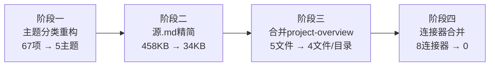

# 二、执行复盘

## 2.1 四阶段执行全景

## 2.2 各阶段详情

### 阶段一：主题分类重构

**输入**：`reports/` 下 34 个原子化子目录 + 32 个源 .md 文件，全部平铺在单层目录中。

**操作**：
- 按内容主题识别 5 个分类：atomization（9）、insight-extraction（8）、spec-system（7）、roles-teams（3）、project-governance（7+1）
- 使用 `git mv` 将文件迁移到对应子文件夹
- 批量修正 34 个 README.md 的 TOML `source` 字段路径
- 修正跨主题相对链接（`../` vs `../../`）
- 新增 `reports/README.md` 分类索引文件
- 同步更新 `docs/retrospective/README.md`

**输出**：5 个主题子文件夹，带完整分类索引。

### 阶段二：源 .md 文件精简为连接器

**问题**：31 份源 .md 文件（~458KB）与其原子化子目录内容 **100% 重复**。

**操作**：
- 将每份源 .md 从完整报告精简为"连接器"：TOML frontmatter + 标题 + 子模块导航表
- 7 个有 TOML frontmatter 的文件保留其元数据，25 个无 TOML 的文件仅保留标题 + 导航表

**效果**：458 KB → 34 KB，**消除 92.8% 重复**（~425 KB）。

### 阶段三：合并 project-overview → README.md

**问题**：每个目录中 `project-overview.md`（均 46 行）与 `README.md`（均 28 行）的元信息栏高度重叠。

**操作**：
- 将 project-overview 的"任务输入"和"交付物清单"嵌入 README 的 `## 项目概览` 章节
- 每个目录从 5 文件缩减到 4 文件
- 同步更新 8 个连接器的导航表（5 行 → 4 行）

**效果**：9 个 `project-overview.md` 删除，atomization 从 53 文件 → 44 文件。

### 阶段四：合并连接器 .md → README.md

**问题**：连接器的唯一价值（TOML `source` + 导航表）与目录 README 的功能完全重叠。

**操作**：
- 将有 TOML 的连接器的 `source` 和 `tags` 字段植入对应 README.md
- 删除全部 8 个连接器 .md 文件
- README 的 `source` 从"指向连接器"改为"指向原始报告"
- reports/README.md 移除 atomization 表格的"源文件"列

**效果**：atomization 从 44 文件 → 36 文件，溯源链从 3 层缩短到 2 层。

## 2.3 量化汇总

| 指标 | 会话开始 | 会话结束 | 变化 |
|------|---------|---------|------|
| atomization 文件数 | 53 | 36 | **-32%** |
| 每目录文件数 | 5 | 4 | -1 |
| 连接器 .md | 8 | 0 | -8 |
| project-overview.md | 9 | 0 | -9 |
| 内容重复 | ~425 KB | 0 | 完全消除 |
| 溯源链层级 | 3 | 2 | -1 |
| Git 提交 | — | 2 次 | 原子化提交 |

## 2.4 关键决策

| 节点 | 决策 | 依据 |
|------|------|------|
| 阶段一结束时 | 不立即合并连接器 | 先完成主题分类，暴露更清晰的冗余模式 |
| 阶段三结束时 | project-overview 合并到 README 而非独立章节 | README 已有元信息栏，合并最自然 |
| 阶段四 | 无 TOML 的连接器删除后移除 README 的 source | 无更深源头可追溯，保留空 source 是虚假溯源 |
