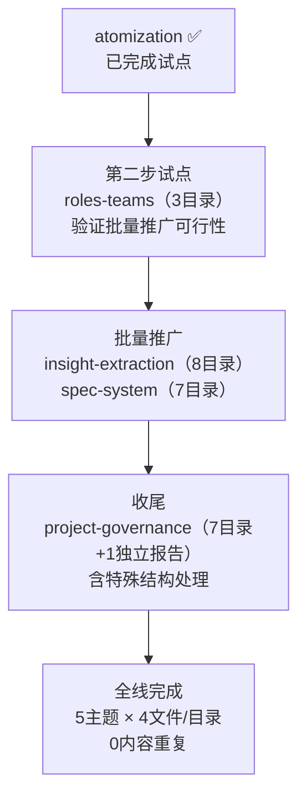

# 四~五、导出建议

## 4.1 改进建议

| # | 优先级 | 建议 | 依据 |
|---|--------|------|------|
| A1 | 🔴 高 | 将四阶段方案推广至其余 4 个主题目录（25 个目录 + 24 个连接器 + 25 个 project-overview） | 洞察三：atomization 已验证可行性，其余主题结构完全一致 |
| A2 | 🟡 中 | 建立"原子化目录标准化检查清单"：4 文件结构 + source 字段直指原始报告 + 0 中间层 | 当前无自动化手段验证目录结构合规性 |
| A3 | 🟡 中 | 为其余 4 个主题的推广建立分步计划：先 roles-teams（最小）→ 批量 insight-extraction + spec-system → project-governance（含特殊结构） | 渐进式推广降低风险 |
| A4 | 🟢 低 | 编写"报告目录重构指南"文档，记录四阶段流程、TOML source 锚定策略、常见陷阱 | 供未来类似重构参考 |

## 4.2 推广执行计划

## 4.3 当前结构状态

| 主题 | 文件数 | 冗余度 | 状态 |
|------|--------|--------|------|
| atomization | 36（9×4） | 0 | ✅ 最优 |
| insight-extraction | 48（8×5）+ 8 连接器 + ~200KB 重复 | 高 | 待优化 |
| spec-system | 42（7×5）+ 7 连接器 + ~175KB 重复 | 高 | 待优化 |
| roles-teams | 18（3×5）+ 3 连接器 + ~45KB 重复 | 中 | 待优化 |
| project-governance | 42（7×5+1独立）+ 6 连接器 + ~175KB 重复 | 高 | 待优化 |

## 4.4 后续方向

- **短期**：推广至 roles-teams（A4 建议 + 第二步试点）
- **中期**：完成全部 5 个主题的标准化
- **长期**：建立目录结构自动化验证脚本，CI 中检查 (1) 每目录恰好 4 个文件、(2) README source 直指原始报告、(3) 无中间连接器层
