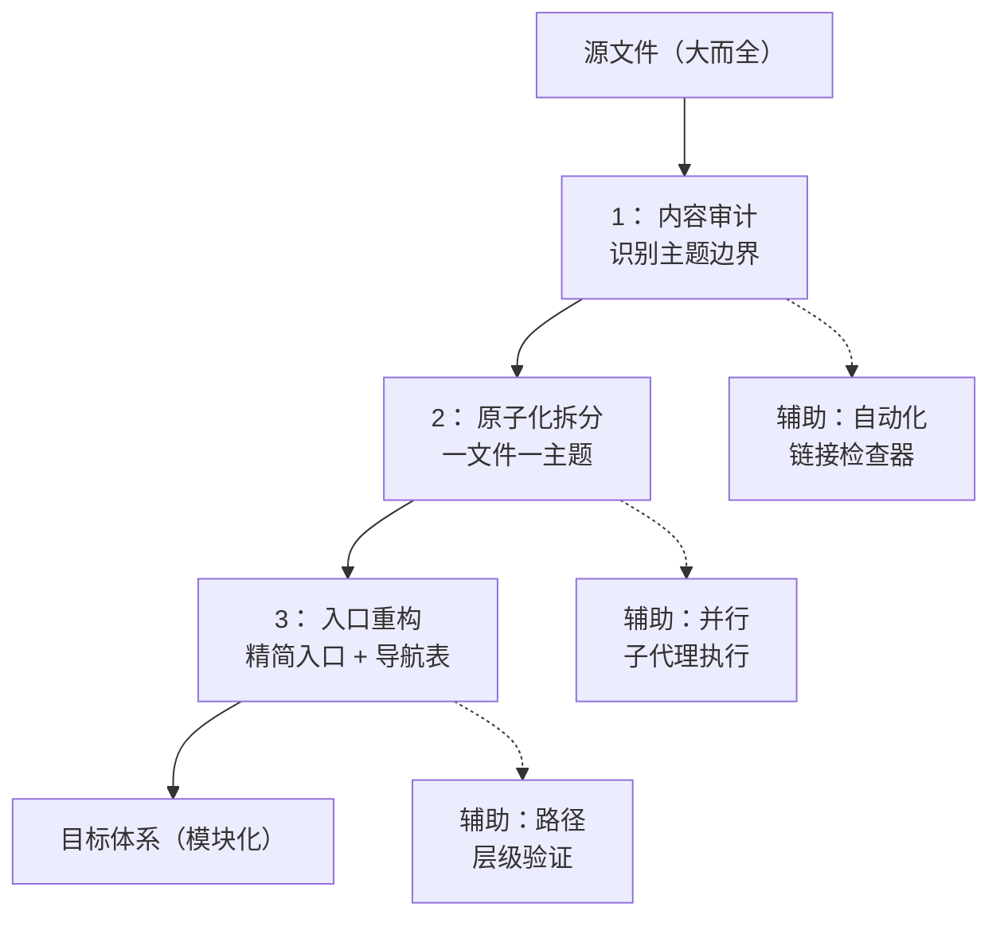

# 洞察萃取

## 3.1 关键发现

### 发现 1：方法论的复用是"零决策成本"的关键

**支撑事实**：本次拆分从决策到执行仅用了一次内容审计，直接复用了既有方法论的全部六步流程。对比"复盘文档体系重构"项目（首次建立方法论时需要探索和试错），本次复用的决策成本接近于零。

**深层含义**：知识资产的真正价值不在于"创建"，而在于"复用"。当方法论被充分文档化和模块化后，后续类似任务可以跳过探索阶段，直接进入执行阶段。这是知识库建设的核心 ROI 所在。

### 发现 2：链接检查器是文档拆分的必备质量工具

**支撑事实**：拆分后运行链接检查器，发现 6 个实际断链。若没有自动化检查，这些断链可能长期存在，直到某个用户点击链接时才发现。

**深层含义**：文档拆分的最大风险不是"内容遗漏"，而是"引用断裂"。手动检查 106 个文件、153 个本地引用是不现实的，自动化链接检查是确保文档体系完整性的必要基础设施。

### 发现 3：拆分的价值不在于"减小文件"，而在于"建立模块边界"

**支撑事实**：README.md 从 434 行精简到 90 行，但这个数字变化不是核心价值。核心价值在于：每个主题现在有了明确的文件边界，可以独立引用、独立更新、独立维护。例如，`CONTRIBUTING.md` 可以被 GitHub 自动识别，`.agents/docs/agent-roles.md` 可以被角色文档引用而不需要加载整个 README.md。

**深层含义**：文档拆分的根本目的是"降低耦合、提高内聚"——这是软件工程中模块化设计原则在文档领域的直接映射。行数减少只是表象，模块边界才是本质。

## 3.2 规律认知

### 规律 1：文档拆分的"三要素"模型

从本次拆分和之前的"复盘文档体系重构"中提炼出文档拆分的三个核心要素：

**三要素**：
1. **内容审计**：识别主题边界，确定拆分粒度
2. **原子化拆分**：每个文件聚焦一个独立主题
3. **入口重构**：精简入口文件，建立导航表

**三个辅助工具**：
1. 链接检查器（自动化质量门禁）
2. 并行子代理（提升执行效率）
3. 路径层级验证（防止引用断裂）

### 规律 2：文档拆分的"收益递减"曲线

| 拆分粒度 | 文件数 | 单文件行数 | 导航复杂度 | 独立引用性 | 推荐度 |
|---------|--------|-----------|-----------|-----------|--------|
| 不拆分 | 1 | 400+ | 无 | 无 | 不推荐 |
| 粗粒度 | 3-5 | 100-200 | 低 | 低 | 可接受 |
| **均衡** | **8-12** | **30-60** | **中** | **高** | **推荐** |
| 细粒度 | 15-20 | 10-30 | 高 | 高 | 谨慎 |
| 过度 | 30+ | <10 | 非常高 | 碎片化 | 不推荐 |

**规律**：当文件数超过 15 个时，导航复杂度开始超过独立引用带来的收益。本次拆分选择 10 个文件，处于"均衡"区间的中心位置。

## 3.3 潜在机会

### 3.3.1 识别出的改进空间

1. **链接检查器增强**：添加模板占位符识别规则（`{ }` 模式），消除模板文件的误报。
2. **导航表自动生成**：当 `docs/` 下文件超过一定数量时，可开发脚本自动生成导航表。
3. **路径迁移工具**：开发一个"内容迁移时的路径自动更新"工具，在文件移动时自动调整内部链接的 `../` 层级。

### 3.3.2 可复用资产

本次拆分产出的资产及其复用价值：

| 资产 | 复用场景 | 复用方式 |
|------|---------|---------|
| 10 个原子化文档 | 其他需要模块化 README 的项目 | 参考结构设计，按需裁剪 |
| 拆分决策矩阵（3.2 规律 2） | 任何文档拆分的粒度决策 | 直接参考收益递减曲线 |
| 三要素模型（3.2 规律 1） | 文档拆分的方法论指导 | 直接套用流程 |
| 并行子代理模式（第 2 次验证） | 文档批量创建 | 参考决策矩阵分配子代理 |

### 3.3.3 未来可扩展的方向

1. **.agents/docs/README.md 索引**：为 `docs/` 目录创建一个 README.md 索引文件，统一管理所有文档的导航。
2. **自动化导航表**：当 `docs/` 下文件变更时，自动更新 README.md 中的文档导航表。
3. **模板文件标记**：在模板文件中添加 frontmatter 标记（如 `is_template: true`），让链接检查器自动跳过。