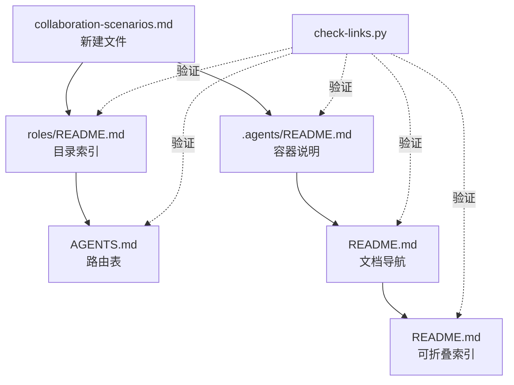

# 导出建议

## 改进建议

### 🔴 高优先级

**建议 1：在 AGENTS.md 全局核心规则中补充表格修改约束** ✅ 已完成

- 问题：AGENTS 路由表修改时出现列分隔符漂移，当前无防护规则
- 建议：在 AGENTS.md「开发规范」章节新增一条：**Markdown 表格修改须整体替换，禁止局部插入行**
- 预期收益：从规则层面杜绝表格格式错误
- 执行结果：已在 AGENTS.md 新增「Markdown 表格修改」子章节，含三条规则（整表替换优先、局部替换仅限文本修改、分隔符同步原则）

### 🟡 中优先级

**建议 2：细化「按需读取」策略为「结构对比优先、全文精读兜底」** ✅ 已完成

- 问题：上下文加载阶段读取 20+ 文件做全文对比，效率偏低
- 建议：在 AGENTS.md「上下文节省」规则中补充：**多文件差异分析时优先用 Grep 做标题/签名结构对比，确定差异集后再精读**
- 预期收益：差异分析场景减少 50% 上下文加载量
- 执行结果：已在 AGENTS.md「上下文节省」规则中补充「结构对比优先、全文精读兜底」策略说明

**建议 3：建立 README 与 .agents/ 边界收敛的定期扫描机制** 📋 待规划

- 问题：角色协作场景在 README 中存在较长时间未被迁移，说明缺乏主动扫描机制
- 建议：在 check-spec-consistency.py 或新脚本中增加规则——检测 README 中是否存在应属于 .agents/ 的结构化内容（含 Mermaid 图、表格型定义、枚举列表等）
- 预期收益：自动化识别文档边界偏移，防止类似遗漏
- 实施方案：
  1. 新建 `check-doc-boundary.py` 脚本，扫描 README.md 中的结构化内容特征（Mermaid 代码块、含 ID 列的表格、角色/模块定义章节）
  2. 对每个特征检测是否已在 `.agents/` 对应目录下有独立文件
  3. 输出「待迁移候选」清单，供人工确认
  4. 集成到 CI 流程（ci-check.ps1/sh）

### 🟢 低优先级

**建议 4：将本次萃取的 3 个模式入库至 pattern 体系** ✅ 已完成

- 问题：safe-table-edit、content-migration-workflow、cascade-update-topology 三个模式尚未正式入库
- 建议：分别整理入 `docs/retrospective/patterns/code-patterns/`、`methodology-patterns/`、`architecture-patterns/`
- 预期收益：充实模式库，使后续类似任务可直接复用
- 执行结果：
  - 已创建 [content-migration-workflow.md](../../../patterns/methodology-patterns/document-architecture/content-migration-workflow.md)（方法论模式，L2 已验证）
  - 已创建 [safe-table-edit.md](../../../patterns/code-patterns/safe-table-edit.md)（代码模式，L1 实验性）
  - 已创建 [cascade-update-topology.md](../../../patterns/architecture-patterns/cascade-update-topology.md)（架构模式，L2 已验证）
  - 已更新 methodology-patterns/README.md 索引表

## 附录

### 附录 A：产出文件清单

| 文件路径 | 操作 | 用途 |
|---------|------|------|
| .agents/roles/collaboration-scenarios.md | 创建 | 角色协作场景完整定义 |
| README.md | 修改 | 角色协作场景章节缩减为概要+引用 |
| README.md | 修改 | 系统规划章节添加模块文件引用说明 |
| README.md | 修改 | 文档导航表新增协作场景条目 |
| README.md | 修改 | 底部可折叠索引新增协作场景条目 |
| AGENTS.md | 修改 | 上下文路由表新增协作场景条目 |
| .agents/roles/README.md | 修改 | 职责矩阵下方新增协作场景索引表 |
| .agents/roles/README.md | 修改 | 文件结构树新增协作场景文件 |
| .agents/README.md | 修改 | roles/ 目录说明更新 |

### 附录 B：引用覆盖拓扑图

### 附录 C：验证结果

| 验证项 | 脚本 | 结果 | 详情 |
|--------|------|------|------|
| 链接有效性 | check-links.py | 通过 | 310 内联链接、267 本地引用全有效 |
| 溯源一致性 | check-source-traceability.py | 通过 | 9 个派生产物（含新增）均正确标注 source |

### 附录 D：与前次 README 子智能体提取任务的差异

| 维度 | 前次（modules 提取） | 本次（角色协作场景迁移） |
|------|---------------------|------------------------|
| 提取对象 | 8 个自我演进模块 | 1 个角色协作场景（跨角色） |
| 目标目录 | .agents/modules/（新建） | .agents/roles/（已有） |
| 信息处理 | 信息富化（补充交互/能力/约束） | 信息搬运（原文结构已完备） |
| 新增模式 | 3 个方法论 | 3 个模式（各类型 1 个） |
| 摩擦点 | 0 个 | 1 个（表格分隔符漂移） |
| 共同点 | 均为「存量盘点→缺口计算→精准操作」三段式 | |