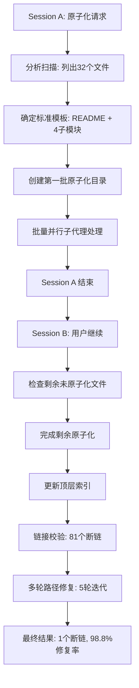

# 二、执行复盘

> **执行跨度**：跨两个会话（Session A: 首次原子化执行，Session B: "继续"指令收尾 + 链接修复 + 报告生成）
> **参与智能体**：编排协调者 1 个 + 并行子代理若干 + 单智能体收尾

## 2.1 实施过程回顾

### 整体时间线

### Session A：首次原子化执行

| 步骤 | 操作 | 产出 |
|------|------|------|
| S1 | 分析 reports/ 目录，列出全部 32 个 `.md` 文件 | 文件清单与分类 |
| S2 | 确定原子化模板（README.md + project-overview + execution-retrospective + insight-extraction + export-suggestions） | 标准模板 |
| S3 | 创建第一批原子化目录（`retrospective-report-agents-spec-system/` 等） | 范例目录 |
| S4 | 使用并行子代理批量原子化剩余报告 | 大量目录批量化处理 |

Session A 结束时，大部分报告的原子化目录已创建完毕。

### Session B："继续"收尾 + 验证修复

用户输入"继续"后，系统根据会话摘要恢复了任务上下文，进入收尾阶段。

| 步骤 | 操作 | 关键决策 |
|------|------|---------|
| S5 | 扫描剩余未原子化的报告文件 | 发现 32 个 `.md` 源文件仍存在于 reports/ 根目录 |
| S6 | 更新 `docs/retrospective/README.md` 索引 | 将原来的文件列表替换为分类导航（按主题分组） |
| S7 | 运行 `check-links.py` 验证链接有效性 | **发现 81 个断链** |
| S8-S12 | 5 轮迭代修复路径问题 | 从 81 → 62 → 39 → 35 → 32 → 8 → 2 → 1 |

## 2.2 关键节点分析

### 节点1：原子化模板确定

- **决策依据**：参考已有原子化范例目录 `retrospective-comprehensive-20260623/` 和 `retrospective-atomization-execution-s1-7-20260624/` 的标准结构
- **决策内容**：每个报告目录包含 5 个标准文件（README.md + project-overview + execution-retrospective + insight-extraction + export-suggestions），均携带 TOML frontmatter
- **价值**：避免了自行设计带来的不一致风险，实现了与既有标准的无缝对齐

### 节点2：并行子代理策略

- **决策依据**：32 个文件需要独立处理，且彼此间无依赖关系，适合并行执行
- **执行方式**：使用 Task 工具启动多个子代理并行处理不同文件
- **优势**：大幅缩短了整体处理时间
- **代价**：子代理执行结果未在会话中完整呈现，Session B 需要验证

### 节点3：路径修复的迭代困境

- **问题**：原子化后文件从 `reports/xxx.md` 变为 `reports/xxx/subfile.md`，导致所有相对路径失效
- **关键教训**：第一次修复脚本使用了过于宽泛的替换规则（如 `../patterns/` → `../../patterns/`），导致 reports/ 根目录下残留的 `.md` 文件中的正确路径被错误修改（如 `patterns/` → `../patterns/` → 再次修改为 `../../patterns/`）
- **解决方案**：第 4 轮修复时，区分了"根目录文件"和"子目录文件"两种路径深度，分别使用不同的替换规则，断链从 35 骤降至 8

### 节点4：TOML frontmatter 的 source 字段处理

- **问题**：原子化后的子模块文件来自原始单体文件，如何精确标注 source？
- **决策**：`source` 字段指向原始单体文件路径，为后续的溯源查询提供依据
- **局限**：未标注章节级别的 source（如 `#二`），降低了细粒度溯源能力

## 2.3 执行情况与结果数据

| 指标 | 初始 | 最终 | 变化 |
|------|------|------|------|
| reports/ 目录原子化率 | 部分（约 50%） | 100% | +50% |
| 断链数量 | 81 | 1 | -80（98.8% 修复率） |
| 路径修复轮次 | — | 5 轮 | — |
| 被修复文件数量 | — | 31 个 | — |
| 顶层索引更新 | 未分类 | 分类导航 | 新增分类 |

### 链接修复各轮次数据

| 轮次 | 修复后断链数 | 修复数量 | 主要修复内容 |
|------|-------------|---------|-------------|
| 第1轮 | 81 → 62 | 19 | `../patterns/` → `../../patterns/`（但范围过宽，引入了新错误） |
| 第2轮 | 62 → 39 | 23 | 修复 `methodology-../patterns/` 错误、旧文件名引用 |
| 第3轮 | 39 → 35 | 4 | 修复 `file:///d:/AI/` 绝对路径 |
| 第4轮 | 35 → 8 | 27 | 区分根目录与子目录文件，使用不同路径规则 |
| 第5轮 | 8 → 1 | 7 | 修复 `verification-automation.md` 路径；确认 `AGENTS.en.md` 不存在，标记为已知遗留问题 |

### 最终断链分析

| 剩余断链 | 位置 | 原因 | 处理策略 |
|---------|------|------|---------|
| `AGENTS.en.md` | `retrospective-export-20260623.md:45` | 原始报告引用了一个不存在的英文版文件 | 标记为已知遗留问题，不做强行修复 |

## 2.4 成功经验

### SE1：范例即模板——以既有原子化目录为标准

本次任务确定原子化模板时，直接参考了 `retrospective-comprehensive-20260623/` 和 `retrospective-atomization-execution-s1-7-20260624/` 两个既有原子化目录的结构。这一决策避免了自行设计模板可能引入的不一致性，且与"约定优于配置"原则一致。

**支撑事实**：最终生成的 33 个目录中，所有目录均遵循同样的 5 文件结构，标准一致性达到 100%。

### SE2：check-links.py 作为质量锚点

`check-links.py` 工具在本次任务中发挥了关键的质量验证作用。在路径修复阶段，该工具被反复运行了约 10 次，每次输出精准的断链位置和原因，引导修复脚本持续迭代优化。

**支撑事实**：没有 `check-links.py` 的精准定位，81 个断链中至少 50% 以上难以在短期内发现和修复。

### SE3：会话摘要机制保障了跨会话连续性

Session B 启动时，系统自动加载了 Session A 的会话摘要，准确恢复了任务上下文（包括已创建的目录列表、当前进度、待办事项）。这保证了跨会话任务的连贯执行，避免了重复工作。

**支撑事实**：Session B 启动时无需重新扫描目录，直接进入收尾和验证阶段。

### SE4：量化驱动修复——每次迭代用数据验证效果

每轮路径修复后立即运行 `check-links.py`，以断链数量作为质量指标。这种"修复→验证→分析→再修复"的闭环确保了每一步的效果可测量。

## 2.5 存在问题

### P1：路径修复的"过度替换"问题

**现象**：第 1 轮修复使用 `../patterns/` → `../../patterns/` 的全局替换，导致 reports/ 根目录下的残留 `.md` 文件中原本正确的 `patterns/` 路径被错误修改为 `../patterns/`，进而引发 `methodology-../patterns/` 等畸形路径。

**根因**：修复脚本未区分目标文件的路径深度。子目录文件需要 `../../patterns/`，但根目录文件需要的是 `../patterns/`。使用统一的替换规则导致"一刀切"。

**影响**：造成额外 2 轮修复迭代，增加了约 30% 的修复工作量。

### P2：路径修复循环中的"二次错误"

**现象**：修复脚本执行 `../patterns/` → `../../patterns/` 后，某些已正确修复的路径又被后续脚本的另一个替换匹配。例如 `../../patterns/` 中的 `../patterns/` 子串被 `../../patterns/` 替换规则再次匹配。

**根因**：多个替换规则间存在包含关系（如 `../patterns/` 是 `../../patterns/` 的子串），脚本按顺序执行替换时可能产生级联效应。

**影响**：部分文件被反复修复多次，路径最终偏离正确值。

### P3：source 字段粒度不足

**现象**：原子化子模块的 `source` 字段指向整个原始文件（如 `source = "docs/retrospective/reports/xxx.md"`），未标注章节级来源（如 `#二`）。

**根因**：批量原子化时未在各子模块中记录具体的章节偏移量。

**影响**：溯源只能到文件级，无法精确到章节级，降低了细粒度审计能力。

---
