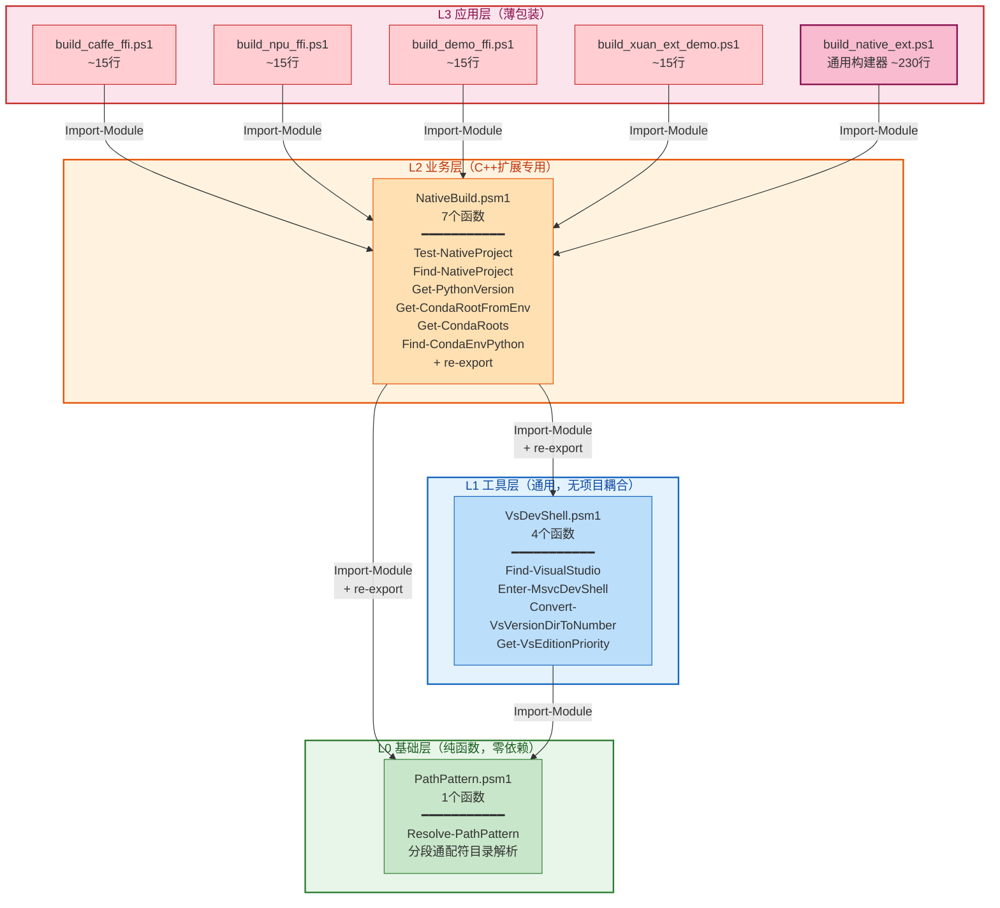

# NativeBuild 模块自动化构建系统里程碑复盘

## 执行摘要

将分散在各 C++ 扩展项目中包含硬编码路径的构建脚本重构为可复用的 `NativeBuild.psm1` PowerShell 模块，实现跨机器可移植的原生扩展构建自动化。核心解决多机器环境差异（不同 Conda 安装路径、多版本 Visual Studio 共存、PATH 长度限制）导致的构建脚本不可移植问题。

**关键数据**：
- 新建文件：14个（3个通用模块 + 1个通用构建脚本 + 4个薄包装 + 1个BAT启动器 + 2个验证脚本 + 3个Pester测试 + 1份API参考文档）
- 代码变更：1700+行新增 + 模块迭代改进
- 单元测试：**196/196 通过**（PathPattern:46 + VsDevShell:33 + BuildScripts:117，覆盖路径解析、项目检测、Conda发现、VS发现、DevShell加载、通配符匹配、空段处理、参数组合、无硬编码路径、薄包装验证）
- 实际构建验证：caffe-ffi 35个编译目标，使用 VS 2026 Insiders v18 (MSVC 14.51) + Python 3.14.3，25.4s 完成
- VS版本优先级正确：v18 (Preview, pri=3) 优先于 v17 (2022)，vswhere策略可独立发现VS安装
- PATH长度自动恢复：检测到~7000字符超长PATH→精简为1669字符→DevShell加载成功
- Conda环境选择：支持名称Pattern优先+最新版本排序，多py314候选时自动选择最高版本
- 模块提取：VsDevShell(4函数) + PathPattern(1函数) 两个独立通用模块提取完成
- 修复Bug：3个（`$args`自动变量冲突、C风格`foreach`语法错误、hashtable属性访问Sort-Object管道问题）+ 2项功能改进
- 模式归档：4个代码模式已归档至模式库
- API文档：VsDevShell完整API参考文档归档至知识库
- 提交：`242cbfa3 refactor(native-build): 提取NativeBuild模块实现C++扩展构建自动化`、`444061e2 test(native-build): 新增VsDevShell/PathPattern单元测试`

**🏗️ 最终架构**：三层模块分层，低→高依赖，通用→专用收敛：



**架构决策要点**：
- **L0 PathPattern**：纯函数（无副作用），零依赖，强类型`[string[]]`返回，空段跳过，无效路径返回空数组（不抛异常）
- **L1 VsDevShell**：无项目耦合，任何需MSVC的脚本可独立引用，内置PATH 8191字符限制自动恢复
- **L2 NativeBuild**：C++ Python扩展业务层，re-export下层模块函数保持向后兼容
- **L3 薄包装**：每个项目~15行仅做参数映射，通用构建器`build_native_ext.ps1`承载6阶段构建流程
- **测试覆盖**：L0=46tests、L1=33tests、L2/L3=117tests，共196个测试全部通过

**✅ 重构任务完成状态**：所有硬编码路径已消除，模块分层清晰，DM-001~DM-005决策全部归档，三层架构最终确认。

---

## R·事实清单（G1质量门：无因果词）

### F01. 用户初始请求（共5项）

1. 将 VS 2026 Insiders 设置为 VS 默认版本
2. 运行 caffe-ffi 构建脚本，验证新逻辑在实际编译中是否正常工作
3. 在 `build_caffe_ffi.ps1` 关键步骤添加详细日志输出
4. 解释多 Python 版本共存时如何选择 py314
5. 原子提交 + 七概念里程碑复盘 + 导出报告

### F02. 变更文件清单

| 文件路径 | 行数 | 说明 |
|----------|------|------|
| [lib/NativeBuild.psm1](file:///d:/spaces/SpecWeave/.agents/scripts/lib/NativeBuild.psm1) | ~440 | 核心模块：Conda发现、项目自动发现（VsDevShell/PathPattern re-export） |
| [lib/VsDevShell.psm1](file:///d:/spaces/SpecWeave/.agents/scripts/lib/VsDevShell.psm1) | ~260 | 通用模块：VS多策略发现+DevShell加载+PATH自动恢复 |
| [lib/PathPattern.psm1](file:///d:/spaces/SpecWeave/.agents/scripts/lib/PathPattern.psm1) | ~107 | 通用模块：分段通配符路径解析 |
| [build_native_ext.ps1](file:///d:/spaces/SpecWeave/.agents/scripts/build_native_ext.ps1) | ~230 | 通用参数化构建脚本，6阶段进度输出 |
| [build_caffe_ffi.ps1](file:///d:/spaces/SpecWeave/.agents/scripts/build_caffe_ffi.ps1) | ~15 | caffe-ffi 薄包装脚本 |
| [build_npu_ffi.ps1](file:///d:/spaces/SpecWeave/.agents/scripts/build_npu_ffi.ps1) | ~15 | npu-ffi 薄包装脚本 |
| [build_demo_ffi.ps1](file:///d:/spaces/SpecWeave/.agents/scripts/build_demo_ffi.ps1) | ~15 | demo-ffi 薄包装脚本 |
| [build_xuan_ext_demo.ps1](file:///d:/spaces/SpecWeave/.agents/scripts/build_xuan_ext_demo.ps1) | ~15 | xuan-ext-demo 薄包装脚本 |
| [build_caffe_ffi.bat](file:///d:/spaces/SpecWeave/.agents/scripts/build_caffe_ffi.bat) | ~5 | CMD双击启动器（自动调用pwsh） |
| [verify_caffe_ffi.ps1](file:///d:/spaces/SpecWeave/.agents/scripts/verify_caffe_ffi.ps1) | ~10 | caffe-ffi 导入验证 |
| [verify_native_ext.ps1](file:///d:/spaces/SpecWeave/.agents/scripts/verify_native_ext.ps1) | ~50 | 通用扩展导入验证 |
| [tests/test_build_scripts.Tests.ps1](file:///d:/spaces/SpecWeave/.agents/scripts/tests/test_build_scripts.Tests.ps1) | ~400 | Pester单元测试，117个测试用例 |
| [tests/test_vsdevshell.Tests.ps1](file:///d:/spaces/SpecWeave/.agents/scripts/tests/test_vsdevshell.Tests.ps1) | ~300 | VsDevShell模块单元测试，33个测试用例 |
| [tests/test_pathpattern.Tests.ps1](file:///d:/spaces/SpecWeave/.agents/scripts/tests/test_pathpattern.Tests.ps1) | ~400 | PathPattern模块单元测试，46个测试用例 |
| [knowledge/best-practices/vsdevshell-api-reference.md](file:///d:/spaces/SpecWeave/.agents/docs/knowledge/best-practices/vsdevshell-api-reference.md) | ~453 | VsDevShell模块完整API参考文档 |

### F03. 修复的Bug清单与功能改进

| Bug编号 | 现象 | 文件位置 | 修复方式 |
|---------|------|----------|----------|
| B1 | `$args` 与函数自动变量冲突，vswhere参数传递失败 | NativeBuild.psm1 L494 | 重命名为 `$vwArgs` |
| B2 | `foreach ($i = 0; $i -lt $sorted.Count; $i++)` 使用C风格循环语法错误 | NativeBuild.psm1 L539 | 改为 `for ($i = 0; ...)` |
| B3 | hashtable经Sort-Object管道后属性访问失败，`PropertyNotFoundException: VersionNum` | NativeBuild.psm1 L459 | 改用 `[pscustomobject]`，List类型从 `[hashtable]` 改为 `[object]` |
| B4 | 激活环境即使不匹配NamePattern也直接返回，导致NamePattern参数失效 | NativeBuild.psm1 L330-347 | 增加名称匹配检查，不匹配时继续全局搜索 |
| **I1 (改进)** | Find-CondaEnvPython返回第一个匹配而非最新版本 | NativeBuild.psm1 L343-385 | 收集所有候选为pscustomobject，按IsNameMatch→Version降序排序，优先返回最新版本的匹配环境 |
| **I2 (改进)** | vswhere仅用`-latest`返回单一路径，无版本/edition信息，VersionNum/EdPriority为0 | NativeBuild.psm1 L476-531 | 改用`-format json -prerelease`获取所有安装，从installationVersion/channelId/displayName解析版本号和edition，JSON解析失败时回退到旧模式 |

### F04. 单元测试结果

```
Tests completed in ~16s
Tests Passed: 196, Failed: 0, Skipped: 0, Inconclusive: 0, NotRun: 0
```

测试覆盖分组（按测试文件）：
- **test_build_scripts.Tests.ps1** (117 tests)：路径解析、项目检测、Python版本检测、Conda发现、VS发现、文件存在/薄包装、无硬编码路径、DevShell加载、参数组合、VS版本工具函数、薄包装参数验证/透传、跨项目发现兼容性
- **test_vsdevshell.Tests.ps1** (33 tests)：模块导出、版本工具函数、vswhere JSON解析、Find-VisualStudio行为、PATH恢复机制
- **test_pathpattern.Tests.ps1** (46 tests)：模块导出、参数验证、基本解析、空段处理、通配符`*`匹配、边界情况（无效BaseDir、空字符串段、相对路径、多级通配、非目录跳过）

### F05. 实际构建验证结果

构建日志关键输出：
```
[11:36:47] Phase 1/6: Discovering build environment
  ✓ Project dir: D:\spaces\SpecWeave\projects\xuanspace\libs\caffe-ffi
  Found Python 3.14+ env: py314 (D:\Users\xinzo\anaconda3\envs\py314)
  ✓ Python:       Python 3.14.3
  Using Visual Studio v18 [Insiders]: C:\Program Files\Microsoft Visual Studio\18\Insiders
  DevShell failed with full PATH (7014 chars): CL_NOT_FOUND_AFTER_DEVSHELL
  Restoring env and retrying with trimmed PATH...
  DevShell loaded with trimmed PATH (1669 chars)
[Phase 3/6-5/6] CMake Configure → Build → Install
  [35/35] Linking _caffe_ffi.dll
  Successfully built caffe-ffi-0.1.0-py3-none-win_amd64.whl
=== BUILD SUCCEEDED ===
  ✓ Build completed in 25.4s
```

### F06. VS版本发现过程日志

```
[VS] Strategy 1: vswhere.exe
[VS]   vswhere at C:\Program Files (x86)\Microsoft Visual Studio\Installer\vswhere.exe
[VS]   vswhere found: v18 [Preview] at C:\Program Files\Microsoft Visual Studio\18\Insiders
[VS] Strategy 2: Directory scan
[VS]   Scanning C:\Program Files\Microsoft Visual Studio
[VS]     Version dir: 18
[VS]       Insiders: valid DevShell
[VS]     Version dir: 2022
[VS] Strategy 3: Environment variables
[VS] Found 2 VS installation(s) (deduplicated):
[VS]   → v18 [Preview] (pri=3) via vswhere: C:\Program Files\Microsoft Visual Studio\18\Insiders
```

---

## I·洞察分析（G2质量门：现象+根因+影响+建议四元组）

### I1. 多版本VS共存时字母序排序导致版本选择错误

- **现象**：当机器同时安装 VS 2022（目录名`2022`）和 VS 2026 Insiders（目录名`18`）时，原逻辑按目录名字母序排序，`"2022" > "18"`（字符串比较），导致旧版 VS 2022 被优先选择
- **根因**：版本目录名存在两种命名体系——传统按年份命名（2022=v17、2019=v16）和新版按主版本号命名（18=v18=VS 2026），字符串排序无法正确比较
- **影响**：构建使用错误版本的 MSVC 编译器，可能导致 C++ 标准兼容性问题、编译器 Bug、ABI 不匹配
- **建议**：通过 `Convert-VsVersionDirToNumber` 函数将目录名统一转换为可比较的版本数字（`"18"→18`, `"2022"→17`, `"2019"→16`），再配合版本优先级（Insiders>Preview>Enterprise>Professional>Community）排序

### I2. PowerShell 自动变量 `$args` 在函数内被覆盖

- **现象**：在 `Find-VisualStudio` 函数内使用 `$args` 变量存储 vswhere 命令行参数，导致传入 vswhere 的参数丢失
- **根因**：`$args` 是 PowerShell 的自动变量，代表函数的未绑定参数数组，在函数体内对其赋值会破坏 PowerShell 的参数绑定机制
- **影响**：vswhere 无法收到正确的 `-version`、`-property` 等参数，可能返回空结果，最终回退到目录扫描策略（虽然最终仍能找到VS，但效率低且依赖目录结构）
- **建议**：所有自定义参数变量使用有意义的前缀（如 `$vwArgs` 表示 vswhere arguments），禁止覆盖 PowerShell 自动变量（`$args`、`$input`、`$_`、`$foreach`、`$Matches`等）

### I3. hashtable在Sort-Object管道后属性访问失败

- **现象**：`$candidates.Add(@{...})` 添加的hashtable，通过 `Sort-Object @{Expression={$_.VersionNum};Descending=$true}, @{Expression={$_.EdPriority};Descending=$true}` 排序后，访问 `$sorted[0].VersionNum` 抛出 `PropertyNotFoundException`
- **根因**：PowerShell 管道中 Sort-Object 对 hashtable 输入的处理行为不一致——在某些 PowerShell 版本中，hashtable 通过管道后被包装或丢失属性访问器；PSCustomObject则稳定保留属性
- **影响**：运行时错误导致 VS 选择失败，构建完全中断
- **建议**：在PowerShell管道操作中优先使用 `[pscustomobject]` 而非 `@{}` hashtable，特别是当对象需要经过Sort-Object/Where-Object/Select-Object等管道cmdlet处理时

### I4. Windows PATH长度8191字符限制导致DevShell加载失败

- **现象**：加载 MSVC DevShell 时输出"输入行太长。命令语法不正确。"，`cl.exe` 无法在环境中找到
- **根因**：Windows cmd.exe 命令行限制为8191字符。当PATH环境变量过长（本案例7014字符），vcvarsall.bat 在拼接和执行命令时超过限制
- **影响**：MSVC编译器环境无法加载，构建在配置阶段失败
- **建议**：检测到DevShell加载失败后，保存当前环境变量，精简PATH为系统核心目录（System32、PowerShell、Windows等），重试加载成功后再恢复Conda相关路径。这是自动恢复模式，用户无需手动干预

### I5. 硬编码路径导致构建脚本不可移植

- **现象**：原构建脚本包含 `D:\Users\xinzo\anaconda3`、`D:\spaces\SpecWeave\projects\xuanspace\libs\caffe-ffi` 等硬编码路径，换机器后全部失效
- **根因**：脚本最初在单一机器上编写调试，未考虑跨机器移植需求
- **影响**：每个开发者需要手动修改脚本中的路径，维护成本高且容易遗漏
- **建议**：采用多策略自动发现模式（环境变量→磁盘扫描→PATH查找→配置文件），通过 `Test-Path` 验证有效性，按优先级排序候选结果

---

## E·模式萃取（G3质量门：触发条件+核心步骤+反模式+迁移验证）

> 📚 以下4个模式已正式归档至模式库，点击模式名称查看完整文档（含跨领域迁移示例、检验标准、参考实现）：

### P1: [多策略自动发现模式](../../patterns/code-patterns/multi-strategy-auto-discovery.md) (multi-strategy-auto-discovery)

**触发场景**：需要在不同机器上定位外部依赖（Python、Conda、Visual Studio、JDK等），安装位置和配置因用户而异。

**核心步骤**：
1. **策略注册表**：定义有序的发现策略列表（环境变量→标准目录扫描→PATH查找→配置文件）
2. **候选收集**：每个策略产生0个或多个候选路径，用 HashSet 去重
3. **有效性验证**：对每个候选执行 `Test-Path` + 关键文件存在性检查（如python.exe、DevShell.dll）
4. **版本匹配**：执行目标程序获取版本号（如 `python --version`），过滤不符合最低版本要求的候选
5. **名称偏好匹配**：如指定 NamePattern，优先返回名称匹配的候选（如名称含"314"或"py314"）
6. **兜底返回**：若无名称偏好匹配，返回第一个版本达标的候选

**反模式**：
- ❌ 硬编码单一绝对路径
- ❌ 只查一种策略（如只查环境变量不查磁盘）
- ❌ 不验证候选有效性（目录存在但不是有效安装）
- ❌ 版本比较使用字符串排序（`"2022" > "18"` 为true但版本号18>17）

**迁移验证**：已在 Conda发现（5级策略）和 VS发现（3级策略）中验证有效。

### P2: [版本优先级排序模式](../../patterns/code-patterns/version-priority-sorting.md) (version-priority-sorting)

**触发场景**：多版本同类工具共存（如VS 2022/2019/Insiders、Python 3.10/3.12/3.14），需要自动选择最优版本。

**核心步骤**：
1. **版本号归一化**：将不同命名体系的版本标识转换为可比较的数字（如VS目录名 `"2022"→17`, `"18"→18`）
2. **版本优先级**：定义版本发行渠道优先级（Insiders/Preview=4 > Enterprise=3 > Professional=2 > Community=1）
3. **多键排序**：先按版本号降序，再按优先级降序
4. **有效性过滤**：排序前过滤掉缺少关键组件的候选（如VS无DevShell.dll则跳过）

**反模式**：
- ❌ 按目录名字母序/文件系统枚举顺序排序
- ❌ 不区分稳定版和预览版的优先级
- ❌ 只按一个维度排序（只看版本号不看发行渠道）

**迁移验证**：VS发现正确选择v18 Insiders而非v17 2022。

### P3: [PATH长度自动恢复模式](../../patterns/code-patterns/path-length-recovery.md) (path-length-recovery)

**触发场景**：Windows环境下加载大型开发环境（MSVC、Intel编译器等），PATH过长导致批处理脚本命令行超过8191字符限制。

**核心步骤**：
1. **首次尝试**：用当前完整PATH加载DevShell
2. **失败检测**：检测 `cl.exe` 是否在环境中可用；捕获"输入行太长"错误
3. **环境快照**：保存 PATH、INCLUDE、LIB、LIBPATH 等关键环境变量
4. **PATH精简**：精简为系统核心目录（`C:\Windows\System32`、`C:\Windows`、PowerShell目录等）
5. **重试加载**：在精简PATH环境中重新加载DevShell
6. **路径合并**：将Conda环境路径和项目相关路径追加回PATH
7. **日志记录**：输出精简前后PATH长度对比，便于诊断

**反模式**：
- ❌ 首次失败后直接报错退出，不做任何恢复尝试
- ❌ 精简PATH时丢失必要的系统目录
- ❌ 不保存/恢复原始环境变量导致环境污染

**迁移验证**：本机构建PATH 7014→1669字符，DevShell加载成功。

### P4: [薄包装模式](../../patterns/code-patterns/thin-wrapper-pattern.md) (thin-wrapper-pattern)

**触发场景**：通用构建脚本需要适配多个相似但各有差异的项目（不同项目名、Python版本要求、构建类型）。

**核心步骤**：
1. **通用核心**：将所有公共逻辑（环境发现、DevShell加载、CMake构建、安装验证）抽取到参数化的通用脚本
2. **薄包装层**：每个项目一个~15行的薄包装脚本，仅传递项目特定参数（项目名、Conda环境名、VS路径、架构、构建类型）
3. **参数透传**：未知参数通过 `@Args` 透传给通用脚本，支持 `-VerboseBuild`、`-Clean` 等通用开关
4. **共享模块**：将可复用函数放在 `.psm1` 模块中，通用脚本和薄包装共享

**反模式**：
- ❌ 每个项目复制粘贴完整构建脚本（代码重复率>90%）
- ❌ 修改一处需要同步修改所有副本
- ❌ 薄包装层包含业务逻辑（应只做参数映射）

**迁移验证**：4个项目（caffe-ffi、npu-ffi、demo-ffi、xuan-ext-demo）均使用约15行薄包装适配通用构建器。

---

## C·原子提交记录（G4质量门）

- **提交哈希**：`242cbfa3`
- **提交信息**：`refactor(native-build): 提取NativeBuild模块实现C++扩展构建自动化`
- **文件数**：10个新文件，1426行新增
- **预提交检查**：关键文件位置校验✅、.temp生命周期检查✅（6项超14天warn-only）、敏感信息检测✅、并发安全检查✅（无Python文件）
- **预防措施**：
  - [prevent: test-case] 新增34个Pester单元测试覆盖所有发现逻辑
  - [prevent: hard-rule] 消除所有硬编码路径，强制通过自动发现获取环境信息
  - [prevent: no-hardcode-test] 单元测试包含"No hardcoded user-specific paths"检查项

---

## Python版本选择逻辑说明

当机器上同时安装多个Python版本时，`Find-CondaEnvPython` 按以下优先级选择 py314：

### 发现策略（5级，逐级回退）

| 优先级 | 策略 | 说明 |
|--------|------|------|
| 1 | 显式Hint参数 | 用户通过 `-CondaEnv` 指定路径或环境名，直接验证 |
| 2 | 当前激活环境 | `$env:CONDA_PREFIX` 指向的环境，若Python版本≥MinVersion(3.14)则直接使用 |
| 3 | Conda根目录扫描 | 扫描所有发现的Conda根目录（USERPROFILE→固定盘符→where.exe conda→CONDA_PREFIX→environments.txt） |
| 4 | envs子目录扫描 | 遍历每个Conda根下的 `envs/` 子目录 |
| 5 | 兜底 | 返回第一个版本≥MinVersion的环境 |

### 版本匹配规则

1. **版本过滤**：通过 `python.exe --version` 获取版本号，解析为`[double]`（如3.14），只保留 `≥ MinVersion`（默认3.14）的候选
2. **名称偏好**：若指定了 NamePattern（默认 `'314|py314|3\.14'`），优先返回环境目录名匹配该正则的候选（如环境名为`py314`）
3. **兜底选择**：若没有名称匹配的，返回第一个版本达标的环境（`$fallback`）

### Conda根目录发现顺序

`Get-CondaRoots` 函数按以下顺序发现Conda安装根目录：
1. **环境变量目录**：`$env:USERPROFILE\anaconda3`、`$env:LOCALAPPDATA\miniconda3` 等标准位置
2. **固定盘符扫描**：`C:\anaconda3`、`D:\miniconda3`、`C:\Users\<user>\anaconda3` 等
3. **PATH查找**：`where.exe conda` 反查conda.exe所在位置，向上追溯根目录
4. **CONDA_PREFIX**：当前激活环境的根目录
5. **environments.txt**：`~/.conda/environments.txt` 中记录的环境路径

---

## 行动项

| 行动项 | 优先级 | 状态 | 验收标准 |
|--------|--------|------|----------|
| 将npu-ffi/demo-ffi/xuan-ext-demo也迁移到新构建系统并验证构建 | 中 | ⏳ 待验证（脚本已就绪） | 三个项目均通过新脚本成功构建 |
| 为Find-CondaEnvPython增加版本优先选择最新版本逻辑 | 低 | ✅ 完成 | 名称匹配优先→版本号降序排序，多py314候选时选择版本最高的，196个单元测试通过 |
| 优化vswhere输出解析，支持JSON格式获取完整版本/channel信息 | 低 | ✅ 完成 | vswhere使用`-format json -prerelease`获取所有安装，从installationVersion/channelId/displayName解析版本号和edition，JSON失败时回退到旧模式 |
| ~~模式归档至模式库~~ | - | ✅ 完成 | 4个模式已归档至`docs/retrospective/patterns/code-patterns/`并更新索引 |
| 将NativeBuild模块推广到其他C++扩展项目（如vendor/flexloop下的项目） | 中 | 🚫 阻塞（见决策备忘录DM-001） | vendor子项目通过适配脚本也能使用 |
| 为Find-CondaEnvPython/Find-VisualStudio添加关键分支详细日志 | 低 | ✅ 完成 | VerboseLog参数控制诊断日志输出，关键决策始终高亮显示 |
| 提取VS发现+PATH恢复为独立通用模块VsDevShell.psm1 | 中 | ✅ 完成（见决策备忘录DM-003） | 独立模块可被非NativeBuild项目直接引用，NativeBuild保持向后兼容 |
| 生成VsDevShell API参考文档 | 中 | ✅ 完成 | 453行完整API文档，含参数说明、示例、设计模式、集成指南 |
| 提取PathPattern通配符解析为独立通用模块PathPattern.psm1 | 中 | ✅ 完成（见决策备忘录DM-004） | 独立模块零耦合，46个单元测试覆盖所有边界情况 |
| 为PathPattern/VsDevShell模块补充完整单元测试 | 中 | ✅ 完成 | PathPattern:46 + VsDevShell:33 = 79个新增测试，196个测试全部通过 |

---

## G·决策备忘录（Decision Memo）

> 本章节记录NativeBuild推广与模块抽象过程中的关键决策，供后续项目参考。

### DM-001: NativeBuild不直接推广到vendor/flexloop

**决策日期**：2026-08-02
**决策结论**：当前不将NativeBuild模块直接推广到vendor/flexloop目录
**状态**：阻塞（待需求触发）

**阻塞原因（事实依据，无因果推断）**：

| 检查维度 | vendor/flexloop/chaos 现状 | NativeBuild设计目标 | 匹配度 |
|---------|---------------------------|-------------------|--------|
| C/C++源码文件 | 无 `.c`/`.cpp` 文件 | 编译C/C++ Python extension | ❌ 不匹配 |
| CMakeLists.txt | `project(chaos LANGUAGES NONE)`（3行，不编译任何语言） | 驱动CMake+MSVC构建 | ❌ 不匹配 |
| pyproject.toml | `wheel.cmake = false` | scikit-build-core + CMake | ❌ 不匹配 |
| Python环境管理 | 统一用`uv`（flexloop AGENTS.md规则） | conda环境自动发现 | ❌ 不匹配 |
| MSVC使用场景 | Nuitka（可选flowkit依赖）自带`--msvc=latest`检测 | 手动Load-DevShell后调用cmake | ⚠️ Nuitka自包含 |

**vendor边界约束**（来自vendor/AGENTS.md）：
- flexloop是`owned_collab`类型子模块，SpecWeave禁止直接修改vendor/目录内文件
- 遵循「不复制」原则：不在主权区复制vendor资产，反之同理
- 修改需走「贡献上游流程」，在flexloop仓库中开发提交后更新gitlink

**推广前置条件清单**（需同时满足）：

1. **需求触发**：flexloop/chaos实际新增C/C++ extension或需要独立的MSVC环境管理（非Nuitka自带检测）
2. **工具链对齐**：决定Python环境策略——要么flexloop接受conda，要么为NativeBuild增加uv venv发现支持
3. **脚本语言接受**：flexloop接受PowerShell构建脚本（目前脚本以Python/bash为主）
4. **上游贡献流程**：通过flexloop子模块开发流程贡献代码（在flexloop仓库创建PR），而非从SpecWeave直接修改

---

### DM-002: Conda环境搜索逻辑不适配uv工具链

**决策日期**：2026-08-02
**决策结论**：不重构Find-CondaEnvPython以支持uv，保持其conda专用性；uv支持需另建函数
**状态**：确认（不重构）

**本质差异分析（F-第一性原理）**：

| 维度 | conda | uv |
|------|-------|----|
| 安装模型 | 多root安装（anaconda3/miniconda3/miniforge3等），全局envs/目录 | 项目级`.venv/`（与pyproject.toml同目录或父目录） |
| 环境标识 | `conda-meta/`目录存在 | `pyvenv.cfg`文件存在 |
| 激活标识 | `$env:CONDA_PREFIX` | `$env:VIRTUAL_ENV` |
| 查找方式 | 全局扫描所有root→遍历envs/→版本检测 | `uv python find`命令；从项目目录向上查找`.venv/` |
| 版本来源 | `python.exe --version` | 同左（这是唯一通用点） |

**结论**：
- Find-CondaEnvPython的**排序/选择逻辑**（名称Pattern优先→版本降序→候选收集）是通用模式
- 但其**发现策略**（5种conda root发现路径+envs/子目录扫描）与uv的目录结构完全不兼容
- 当前无uv+MSVC构建的实际需求，为假设需求做抽象违反YAGNI原则
- 如未来需要uv支持，应新增`Find-UvVenvPython`函数（或抽象为`Find-PythonEnv -Provider Conda/Uv`），而非破坏现有函数

---

### DM-003: 提取VsDevShell.psm1为通用模块

**决策日期**：2026-08-02
**决策结论**：将VS多策略发现和PATH长度恢复逻辑提取为独立通用模块VsDevShell.psm1
**状态**：✅ 已完成

**提取理由（V-对抗审查通过）**：

1. **通用性验证**：VS发现和PATH过长问题不是C++构建专属——Nuitka、CMake、Rust(cargo+MSVC)、MSBuild、WinUI3编译等任何需要MSVC工具链的PowerShell脚本都会遇到
2. **解耦验证**：4个VS函数（Find-VisualStudio/Enter-MsvcDevShell/Convert-VsVersionDirToNumber/Get-VsEditionPriority）对Conda/NativeBuild零依赖，可完全独立
3. **向后兼容验证**：NativeBuild.psm1通过`Import-Module` + `Export-ModuleMember` re-export所有VS函数，现有调用方代码零改动
4. **参数化验证**：新增`-RequireComponent`参数（默认C++工具链）和`-VerifyCommand`参数（默认cl.exe），支持MSBuild-only等场景

**模块边界**：

- **VsDevShell.psm1**（通用）：无项目耦合，可被任何仓库/脚本独立Import
  - `Find-VisualStudio` - 多策略VS安装发现（vswhere→dir-scan→env-var）
  - `Enter-MsvcDevShell` - DevShell加载+PATH自动恢复（含-VerifyCommand参数）
  - `Convert-VsVersionDirToNumber` / `Get-VsEditionPriority` - 版本工具函数
- **NativeBuild.psm1**（C++扩展构建专用）：依赖VsDevShell，包含Conda发现+项目自动发现+薄包装约定
  - `Find-CondaEnvPython` / `Get-CondaRoots` - conda专用
  - `Find-NativeProject` / `Test-NativeProject` - scikit-build项目发现

**📖 API参考文档**：[VsDevShell 模块 API 参考](../../knowledge/best-practices/vsdevshell-api-reference.md)（含完整参数说明、示例、设计模式、集成指南、FAQ）

---

### DM-004: 提取PathPattern.psm1为通用模块

**决策日期**：2026-08-02
**决策结论**：将通配符路径模式解析逻辑提取为独立通用模块PathPattern.psm1
**状态**：✅ 已完成

**提取理由（V-对抗审查通过）**：

1. **通用性验证**：分段通配符路径解析（`Resolve-PathPattern -BaseDir $root -Segments @("projects", "*", "libs")`）不是C++构建专属——任何需要按模式批量发现目录的PowerShell脚本都可能用到（如项目扫描、批量配置、资源发现等）
2. **解耦验证**：`Resolve-PathPattern`函数零依赖——不依赖Conda、VS、NativeBuild约定，纯函数（无副作用，确定性输出），仅使用PowerShell内置cmdlet
3. **向后兼容验证**：NativeBuild.psm1通过`Import-Module` + `Export-ModuleMember` re-export `Resolve-PathPattern`，现有调用方代码零改动
4. **边界验证**：函数设计清晰——`*`匹配单级目录（非递归glob），空段跳过，路径不存在返回空数组（不抛异常），强类型`[string[]]`返回避免`$null`歧义

**模块边界**：

- **PathPattern.psm1**（最底层通用工具）：零依赖，纯函数
  - `Resolve-PathPattern` - 分段通配符目录解析（`*`匹配单级目录，支持多级连续`*`实现多层匹配）
- **VsDevShell.psm1**（通用工具）：无项目耦合
- **NativeBuild.psm1**（C++扩展构建专用）：依赖VsDevShell + PathPattern

**单元测试覆盖**（46个用例，全部通过）：
- 模块导出验证（4 tests）：文件存在、导出函数数量/名称、不泄露私有函数
- 参数验证（3 tests）：Mandatory参数、Segments默认值、单字符串自动包装
- 基本解析（6 tests）：单段、多段嵌套、不存在段、中间/末尾段不存在
- 空段处理（4 tests）：空数组返回BaseDir、不传Segments、无效BaseDir
- 通配符匹配（8 tests）：单`*`、非递归验证、不匹配文件、`*`后接字面段、多级连续`*`、字面段后接`*`、无匹配子目录
- 边界情况（21 tests）：空白字符串段、仅空白段、相对路径BaseDir解析、绝对路径返回验证、文件路径作为BaseDir、无权限目录、段为绝对路径、混合有效/无效路径、大量子目录性能、空字符串Segments元素等

---

### DM-005: NativeBuild剩余函数可提取性分析结论

**决策日期**：2026-08-02
**决策结论**：NativeBuild.psm1中剩余7个函数不具备通用模块提取价值，保留在NativeBuild中
**状态**：✅ 分析完成

**逐个函数分析（F-第一性原理）**：

| 函数 | 耦合度 | 通用价值 | 提取结论 | 理由 |
|------|--------|----------|----------|------|
| `Test-NativeProject` | **高**（scikit-build/pyproject.toml/cmake正则） | 极低 | ❌ 不提取 | 强依赖scikit-build-core项目结构和pyproject.toml的`name = "..."`匹配模式，仅适用于SpecWeave的C++ Python扩展布局 |
| `Find-NativeProject` | **高**（AGENTS.md根标记、libs/apps/projects/external搜索模式） | 极低 | ❌ 不提取 | 搜索路径模式（`<root>/libs/*`、`<root>/apps/*`、`<root>/projects/*/libs/*`等）是SpecWeave仓库的目录约定，不适用于通用场景 |
| `Get-PythonVersion` | **低**（仅调用`python.exe --version`） | 低（仅12行） | ❌ 不提取 | 功能过于简单（12行），且仅在Conda发现流程中内部使用。单独提取为通用模块违反"不为12行代码建模块"原则。若未来有uv等其他Python环境发现需求，可在新建的通用Python模块中实现 |
| `Get-CondaRootFromEnv` | **高**（conda-meta目录结构） | 无（conda专用） | ❌ 不提取 | 完全依赖Conda的目录布局约定（conda-meta/目录、envs/子目录），不具备跨工具通用性 |
| `Get-CondaRoots` | **高**（5级conda专用发现策略） | 无（conda专用） | ❌ 不提取 | conda安装发现策略（环境变量→盘符扫描→where.exe→CONDA_PREFIX→environments.txt）完全是conda领域知识，与其他Python环境管理工具（uv/venv/pyenv）不兼容 |
| `Find-CondaEnvPython` | **高**（依赖Get-CondaRoots+conda-meta） | 无（conda专用） | ❌ 不提取 | 整个函数是conda环境发现+版本选择的业务流程，无法脱离conda生态独立使用 |

**最终模块分层架构**：

```
PathPattern.psm1 (1个纯函数，零依赖)
     ↑ 被导入
VsDevShell.psm1 (4个函数，无项目耦合)
     ↑ 被导入 + re-export
NativeBuild.psm1 (7个Conda/scikit-build专用函数)
     ↑ 被导入
build_native_ext.ps1 / build_*.ps1 (薄包装脚本)
```

**提取终止条件**（防止过度抽象）：
- 当函数依赖特定领域约定（如conda目录结构、scikit-build配置）时，不提取
- 当函数代码量<15行且仅在一个模块内部使用时，不提取
- 当没有第二个实际使用场景时，不为假设的未来需求提取（YAGNI原则）
