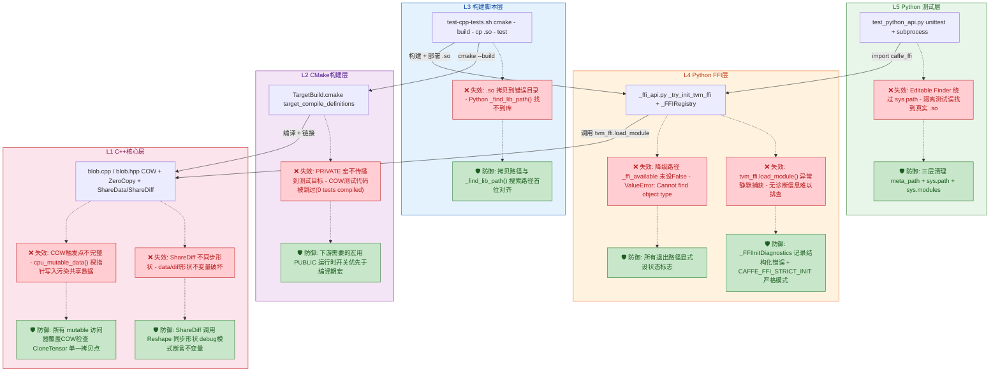
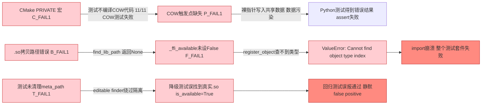
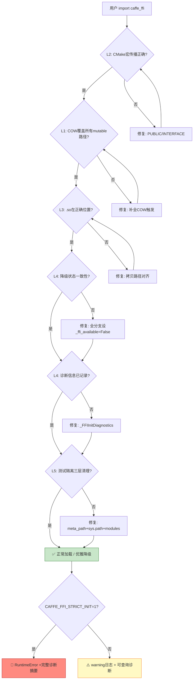

# C++/Python 交互边界失效模式流程图

> 本图可视化 caffe-ffi 项目中 C++/Python 跨语言交互栈的5层边界，以及每层对应的典型失效模式和防御措施。

## 边界层次与失效模式总览

```mermaid
flowchart TD
    subgraph L5["L5 Python 测试层"]
        T1["test_python_api.py unittest + subprocess"]
        T_FAIL1["❌ 失效: Editable Finder 绕过 sys.path - 隔离测试误找到真实 .so"]
        T_GUARD1["🛡️ 防御: 三层清理 meta_path + sys.path + sys.modules"]
    end
    subgraph L4["L4 Python FFI层"]
        F1["_ffi_api.py _try_init_tvm_ffi + _FFIRegistry"]
        F_FAIL1["❌ 失效: 降级路径 _ffi_available 未设False - ValueError: Cannot find object type"]
        F_FAIL2["❌ 失效: tvm_ffi.load_module() 异常静默捕获 - 无诊断信息难以排查"]
        F_GUARD1["🛡️ 防御: 所有退出路径显式设状态标志"]
        F_GUARD2["🛡️ 防御: _FFIInitDiagnostics 记录结构化错误 + CAFFE_FFI_STRICT_INIT 严格模式"]
    end
    subgraph L3["L3 构建脚本层"]
        B1["test-cpp-tests.sh cmake - build - cp .so - test"]
        B_FAIL1["❌ 失效: .so 拷贝到错误目录 - Python _find_lib_path() 找不到库"]
        B_GUARD1["🛡️ 防御: 拷贝路径与 _find_lib_path() 搜索路径首位对齐"]
    end
    subgraph L2["L2 CMake构建层"]
        C1["TargetBuild.cmake target_compile_definitions"]
        C_FAIL1["❌ 失效: PRIVATE 宏不传播到测试目标 - COW测试代码被跳过(0 tests compiled)"]
        C_GUARD1["🛡️ 防御: 下游需要的宏用 PUBLIC 运行时开关优先于编译期宏"]
    end
    subgraph L1["L1 C++核心层"]
        P1["blob.cpp / blob.hpp COW + ZeroCopy + ShareData/ShareDiff"]
        P_FAIL1["❌ 失效: COW触发点不完整 - cpu_mutable_data() 裸指针写入污染共享数据"]
        P_FAIL2["❌ 失效: ShareDiff 不同步形状 - data/diff形状不变量破坏"]
        P_GUARD1["🛡️ 防御: 所有 mutable 访问器覆盖COW检查 CloneTensor 单一拷贝点"]
        P_GUARD2["🛡️ 防御: ShareDiff 调用 Reshape 同步形状 debug模式断言不变量"]
    end
    T1 -->|"import caffe_ffi"| F1
    F1 -->|"调用 tvm_ffi.load_module"| P1
    B1 -->|"构建 + 部署 .so"| F1
    B1 -->|"cmake --build"| C1
    C1 -->|"编译 + 链接"| P1
    T1 -.-> T_FAIL1
    T_FAIL1 -.-> T_GUARD1
    F1 -.-> F_FAIL1
    F1 -.-> F_FAIL2
    F_FAIL1 -.-> F_GUARD1
    F_FAIL2 -.-> F_GUARD2
    B1 -.-> B_FAIL1
    B_FAIL1 -.-> B_GUARD1
    C1 -.-> C_FAIL1
    C_FAIL1 -.-> C_GUARD1
    P1 -.-> P_FAIL1
    P1 -.-> P_FAIL2
    P_FAIL1 -.-> P_GUARD1
    P_FAIL2 -.-> P_GUARD2
    style L5 fill:#e8f5e9,stroke:#2e7d32,color:#1b5e20
    style L4 fill:#fff3e0,stroke:#e65100,color:#bf360c
    style L3 fill:#e3f2fd,stroke:#1565c0,color:#0d47a1
    style L2 fill:#f3e5f5,stroke:#7b1fa2,color:#4a148c
    style L1 fill:#fce4ec,stroke:#c62828,color:#880e4f
    style T_FAIL1 fill:#ffcdd2,stroke:#c62828,color:#b71c1c
    style F_FAIL1 fill:#ffcdd2,stroke:#c62828,color:#b71c1c
    style F_FAIL2 fill:#ffcdd2,stroke:#c62828,color:#b71c1c
    style B_FAIL1 fill:#ffcdd2,stroke:#c62828,color:#b71c1c
    style C_FAIL1 fill:#ffcdd2,stroke:#c62828,color:#b71c1c
    style P_FAIL1 fill:#ffcdd2,stroke:#c62828,color:#b71c1c
    style P_FAIL2 fill:#ffcdd2,stroke:#c62828,color:#b71c1c
    style T_GUARD1 fill:#c8e6c9,stroke:#2e7d32,color:#1b5e20
    style F_GUARD1 fill:#c8e6c9,stroke:#2e7d32,color:#1b5e20
    style F_GUARD2 fill:#c8e6c9,stroke:#2e7d32,color:#1b5e20
    style B_GUARD1 fill:#c8e6c9,stroke:#2e7d32,color:#1b5e20
    style C_GUARD1 fill:#c8e6c9,stroke:#2e7d32,color:#1b5e20
    style P_GUARD1 fill:#c8e6c9,stroke:#2e7d32,color:#1b5e20
    style P_GUARD2 fill:#c8e6c9,stroke:#2e7d32,color:#1b5e20
```

## 失效模式传播链

```mermaid
flowchart LR
    A["CMake PRIVATE 宏 C_FAIL1"] -->|"测试不编译COW代码 11/11 COW测试失败"| B["COW触发点缺失 P_FAIL1"]
    B -->|"裸指针写入共享数据 数据污染"| C["Python测试得到错误结果 assert失败"]
    D[".so拷贝路径错误 B_FAIL1"] -->|"find_lib_path 返回None"| E["_ffi_available未设False F_FAIL1"]
    E -->|"register_object查不到类型"| F["ValueError: Cannot find object type index"]
    G["测试未清理meta_path T_FAIL1"] -->|"editable finder绕过隔离"| H["降级测试误找到真实.so is_available=True"]
    F --> I["import崩溃 整个测试套件失败"]
    H --> J["回归测试误报通过 静默false positive"]
    style A fill:#ffcdd2,stroke:#c62828
    style B fill:#ffcdd2,stroke:#c62828
    style D fill:#ffcdd2,stroke:#c62828
    style E fill:#ffcdd2,stroke:#c62828
    style F fill:#ffcdd2,stroke:#c62828
    style G fill:#ffcdd2,stroke:#c62828
    style H fill:#ffcdd2,stroke:#c62828
    style I fill:#ff8a80,stroke:#b71c1c
    style J fill:#ff8a80,stroke:#b71c1c
```

## 防御纵深（Defense in Depth）

```mermaid
flowchart TD
    START["用户 import caffe_ffi"]
    CHECK1{"L2: CMake宏传播正确?"}
    CHECK2{"L1: COW覆盖所有mutable路径?"}
    CHECK3{"L3: .so在正确位置?"}
    CHECK4{"L4: 降级状态一致性?"}
    CHECK5{"L4: 诊断信息已记录?"}
    CHECK6{"L5: 测试隔离三层清理?"}
    OK["✅ 正常加载 / 优雅降级"]
    STRICT{"CAFFE_FFI_STRICT_INIT=1?"}
    HARD_FAIL["🔴 RuntimeError +完整诊断摘要"]
    START --> CHECK1
    CHECK1 -->|"否"| FIX1["修复: PUBLIC/INTERFACE"]
    CHECK1 -->|"是"| CHECK2
    CHECK2 -->|"否"| FIX2["修复: 补全COW触发"]
    CHECK2 -->|"是"| CHECK3
    CHECK3 -->|"否"| FIX3["修复: 拷贝路径对齐"]
    CHECK3 -->|"是"| CHECK4
    CHECK4 -->|"否"| FIX4["修复: 全分支设_ffi_available=False"]
    CHECK4 -->|"是"| CHECK5
    CHECK5 -->|"否"| FIX5["修复: _FFIInitDiagnostics"]
    CHECK5 -->|"是"| CHECK6
    CHECK6 -->|"否"| FIX6["修复: meta_path+sys.path+modules"]
    CHECK6 -->|"是"| OK
    FIX1 --> CHECK1
    FIX2 --> CHECK2
    FIX3 --> CHECK3
    FIX4 --> CHECK5
    FIX5 --> CHECK6
    FIX6 --> OK
    OK --> STRICT
    STRICT -->|"是"| HARD_FAIL
    STRICT -->|"否"| WARN["⚠️ warning日志 + 可查询诊断"]
    style OK fill:#c8e6c9,stroke:#2e7d32
    style HARD_FAIL fill:#ff8a80,stroke:#b71c1c
    style WARN fill:#fff9c4,stroke:#f57f17
```
