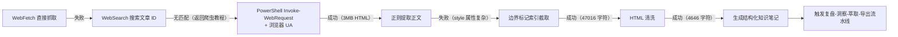
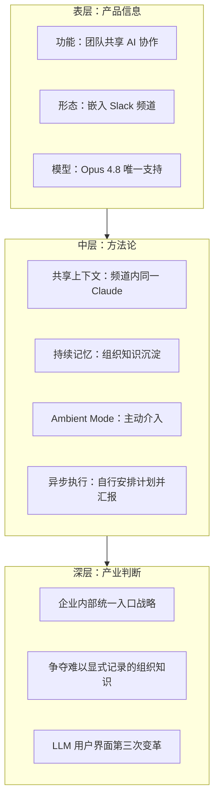

# 执行过程复盘

## 一、任务背景

用户提供了一篇微信公众号文章链接（`https://mp.weixin.qq.com/s/ornmjhjRvi7K5TluCDfrsA`），要求学习理解文章内容。文章为量子位（QbitAI）于 2026-06-24 发布的报道《刚刚，Claude Code大升级！卡帕西：LLM第三次变革》，介绍 Anthropic 发布的企业协作工具 Claude Tag。任务目标是将文章核心内容结构化为可复用的知识条目，归档至 `docs/knowledge/learning/`，并触发复盘-洞察-萃取-导出流水线生成四段式报告。

## 二、内容获取路径分析

### 2.1 获取策略演进

此次内容获取经历了一个"试错-切换-成功"的路径，关键差异在于从 WebFetch 切换为 PowerShell `Invoke-WebRequest` + 浏览器 UA，而非 ian-xiaohei 先例中切换为 defuddle CLI：

### 2.2 获取策略对比表

| 方法 | 结果 | 原因分析 |
|------|------|---------|
| WebFetch | 失败 | 微信公众号页面有反爬机制，WebFetch 无法解析（与 ian-xiaohei 先例一致） |
| WebSearch（文章 ID 搜索） | 无匹配 | 返回的是无关的公众号爬虫教程文章，原文未被搜索引擎索引 |
| PowerShell `Invoke-WebRequest -UseBasicParsing -UserAgent <Chrome UA>` | 成功 | 模拟浏览器 UA 绕过反爬，状态码 200，返回 3075942 字节 HTML |
| 正则提取 `id=js_content` 的 div | 失败 | div 节点的 style 属性含大量引号与分号，正则贪婪匹配失效 |
| 边界标记索引截取（IndexOf + Substring） | 成功 | 通过定位 `id=js_content` 起始与下一闭合 `
` 边界，截取 47016 字符正文 |
| HTML 清洗（正则替换 + HtmlDecode） | 成功 | 转换段落标题、剥离标签，得 4646 字符纯文本 |

**关键经验**：微信公众号文章是 WebFetch 的已知盲区。本次任务验证了**两条可突破路径**：(1) `defuddle` CLI（ian-xiaohei 先例）；(2) PowerShell `Invoke-WebRequest` + 浏览器 UA（本次新增）。两者可互为兜底。`Invoke-WebRequest` 方案的优势是无需 Node.js 依赖、可在 Windows 原生环境运行，劣势是仅返回原始 HTML 需自行处理正文提取与清洗；`defuddle` 优势是直接输出 Markdown、自动剥离噪声，劣势是依赖 npx 环境。

### 2.3 与 ian-xiaohei 先例的关键差异

| 维度 | ian-xiaohei（2026-06-25） | claude-tag（2026-06-29） |
|------|--------------------------|--------------------------|
| 获取方案 | `defuddle` CLI 直接成功 | `Invoke-WebRequest` + 索引截取法 |
| 产出形式 | 2200+ 字 Markdown | 4646 字符纯文本（后转为 Markdown 知识条目） |
| 后续处理 | 直接结构化 | 需 HTML 清洗 + 正文提取 |
| 适用环境 | 需 Node.js / npx | Windows 原生 PowerShell 即可 |
| 互补价值 | 复杂页面自动解析 | 简单直接、依赖最少 |

## 三、HTML 提取技术分析

### 3.1 正则失败原因

首次尝试用正则 `<div[^>]*id="js_content"[^>]*>([\s\S]*?)
` 提取正文失败。根本原因在于微信公众号正文容器的 `style` 属性极其复杂——包含数十条 CSS 规则、大量引号（嵌套引号）、分号、url() 函数等，导致正则的 `[^>]*` 部分意外提前闭合，无法正确匹配到容器结束位置。

### 3.2 边界标记索引截取方案

放弃正则，改用基于字符串索引的精确截取法：

1. **起始边界定位**：用 `IndexOf('id="js_content"')` 找到容器起始位置
2. **结束边界定位**：从起始位置向后扫描，找到下一个独立的 `
` 闭合标签
3. **字符截取**：`Substring(start, end - start)` 提取 47016 字符正文 HTML

此方案的优势是对 HTML 结构复杂性完全免疫，仅依赖两个稳定的边界标记（属性名 `id="js_content"` 与闭合标签 `
`），适用于任何 style 属性异常的容器节点。

### 3.3 HTML 清洗流程

| 步骤 | 操作 | 输入 | 输出 |
|------|------|------|------|
| 1 | 段落转换 | `
` 标签 | `\n` |
| 2 | 标题转换 | `<h1>` ~ `<h6>` 标签 | `## ` 加标题文本 |
| 3 | 图片占位 | `` 标签 | `[图片]` |
| 4 | 标签剥离 | 所有剩余 HTML 标签 | 纯文本 |
| 5 | 实体解码 | `&nbsp;` 等 HTML 实体 | Unicode 字符 |
| 6 | 空白规整 | 连续换行 | 单一换行 |

最终输出 4646 字符纯文本，包含标题、作者（量子位/henry 发自 凹非寺）、发布时间（2026-06-24 08:28）、正文全部 4 节内容。

## 四、文章结构分析

### 4.1 章节概要

文章共包含以下四个核心章节，外加引言与社区反响：

| 章节 | 核心内容 | 信息价值 |
|------|---------|---------|
| 升级概览 | 发布 Claude Tag，定位为 Claude Code 的进化；Anthropic 自身 65% 代码由其参与完成；卡帕西站台提出 LLM 第三次变革论断 | 产品定位与外部背书 |
| 先进团队，先用 Claude | 嵌入 Slack 工作流；@Claude 拆分任务、调用工具、结果回频道；四大能力（共享上下文/持续记忆/Ambient Mode/异步执行） | 核心方法论 |
| 实际部署 | 率先登陆 Slack；Claude 身份权限隔离；组织级与频道级 Token 预算；Beta 开放给 Enterprise 与 Team | 部署细节与治理设计 |
| 社区反响 | Reddit 与推特网友主要呼吁 Fable 回归；Fable 5 仍无消息 | 用户接受度信号 |

### 4.2 信息分层

## 五、执行流程回顾

| 步骤 | 操作 | 关键产出 |
|------|------|---------|
| T0 | 读取 AGENTS.md 启动协议；检查 `.trae/specs` 是否有匹配 change-id | 启动协议确认；无匹配 spec（新建） |
| T0+30s | WebFetch 尝试失败；WebSearch 搜索文章 ID 返回无关结果 | 内容获取策略切换 |
| T0+1min | PowerShell `Invoke-WebRequest -UseBasicParsing -UserAgent <Chrome UA>` 成功 | 3075942 字节原始 HTML，状态码 200 |
| T0+2min | 正则提取失败；改用 `IndexOf` + 边界标记截取；HTML 清洗 | 47016 字符正文 → 4646 字符纯文本 |
| T0+3min | 读取 `.trae/specs/README.md` 归类决策树 | 确定归 `migration-archival` 主题 |
| T0+4min | 编写 spec.md / tasks.md / checklist.md 三文件 | 任务 spec 与验收清单 |
| T0+5min | `NotifyUser` 通知用户审阅 | 用户批准执行 |
| T0+6min | 委派子智能体编写知识条目 `claude-tag-article.md` | 122 行结构化知识条目 |
| T0+7min | 运行 `scripts/generate_index.py` | 发现 frontmatter 缺失：归 unknown 分类、无标签、无最近更新记录 |
| T0+8min | 补充 YAML frontmatter（title/category/tags/date/status/author/summary）；重新运行索引 | 6 分类、65 标签全部达标；新条目进入 learning 分类、12 个标签索引项、最近更新表 |
| T0+9min | 勾选 checklist 全部通过 | 任务完成验收 |

## 六、完成情况评估

| 评估项 | 结果 |
|--------|------|
| 文章完整阅读 | ✅ 全部 4 节内容覆盖（升级概览/先进团队/实际部署/社区反响） |
| 结构化笔记生成 | ✅ 七大章节 + frontmatter 元数据 + 12 标签索引 |
| 四阶段报告生成 | ✅ README + 执行复盘 + 洞察萃取 + 导出建议 |
| 可复用模式萃取 | ✅ 3 个模式候选（团队共享 AI 同事 / Ambient 主动介入 / 微信公众号获取策略增强版） |
| 知识库归档 | ✅ 知识条目归 `docs/knowledge/learning/`；复盘报告归 `docs/retrospective/reports/competitive-analysis/` 双归档 |
| 索引脚本验证 | ✅ 6 分类 65 标签全部达标，新条目正确归入 learning 分类 |

## 七、执行闭环（2026-07-03 更新）

> ✅ **export-suggestions.md 中的 5 项行动计划已全部执行完成**，形成"复盘→洞察→萃取→导出→执行→提交"完整闭环。

### 行动计划执行结果

| 行动计划 | 关联章节 | 产出物 | 状态 |
|---------|---------|--------|------|
| IMP-001 双路径决策模型 | [§二](#二内容获取路径分析) | [wechat-mp-content-extraction.md](../../../../knowledge/operations/wechat-mp-content-extraction.md) 重写为双路径（defuddle + Invoke-WebRequest + 索引截取法兜底） | ✅ 已完成 |
| IMP-002 HTML 正文提取入库 | [§三](#三html-提取技术分析) | [html-body-extraction.md](../../../../knowledge/operations/html-body-extraction.md) 新增（边界标记索引截取法 + 清洗六步流程） | ✅ 已完成 |
| IMP-003 frontmatter 规范 | [§五](#五执行流程回顾) T0+8min | [generate_index.py](../../../../knowledge/scripts/generate_index.py) 告警增强 + [template.md](../../../../knowledge/template.md) 必填字段说明 | ✅ 已完成 |
| IMP-004 团队共享 AI 同事模式 | [§四](#四文章结构分析) 中层方法论 | [team-shared-ai-colleague.md](../../../patterns/methodology-patterns/ai-collaboration/team-shared-ai-colleague.md) 入库（L1） | ✅ 已完成 |
| 模式候选2 Ambient 主动介入 | [§四](#四文章结构分析) 中层方法论 | [ambient-proactive-agent.md](../../../patterns/methodology-patterns/ai-collaboration/ambient-proactive-agent.md) 入库（L1） | ✅ 已完成 |

### 技术经验沉淀去向

本执行复盘中记录的两项关键技术经验已分别入库：

1. **内容获取路径决策模型**（§二）→ [wechat-mp-content-extraction.md](../../../../knowledge/operations/wechat-mp-content-extraction.md)（IMP-001 产出物，双路径互补 + 降级可追溯）
2. **边界标记索引截取法 + HTML 清洗六步流程**（§三）→ [html-body-extraction.md](../../../../knowledge/operations/html-body-extraction.md)（IMP-002 产出物，正则失败时的兜底方案）

### 提交记录

- **commit 6ecb8df** (2026-07-03): `docs(retrospective): 落地Claude Tag复盘5项行动计划形成闭环`

## Changelog

<!-- changelog -->
- 2026-07-03 | update | 添加第七章执行闭环反映 5 项行动计划全部完成；补充技术经验沉淀去向与提交记录；版本升至 1.1
- 2026-06-29 | create | 初始创建执行过程复盘（v1.0）
